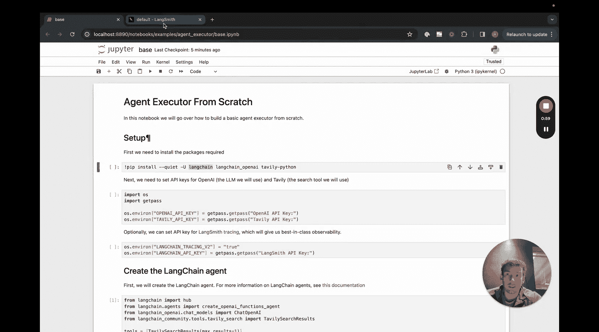
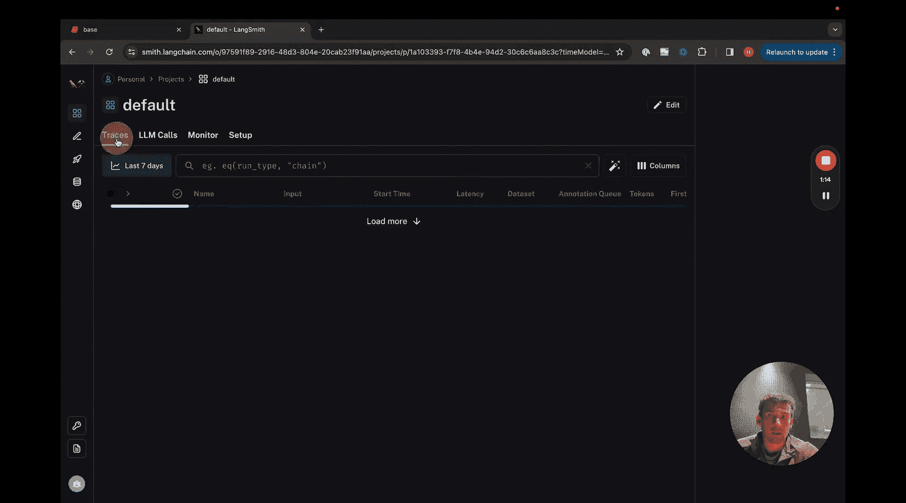
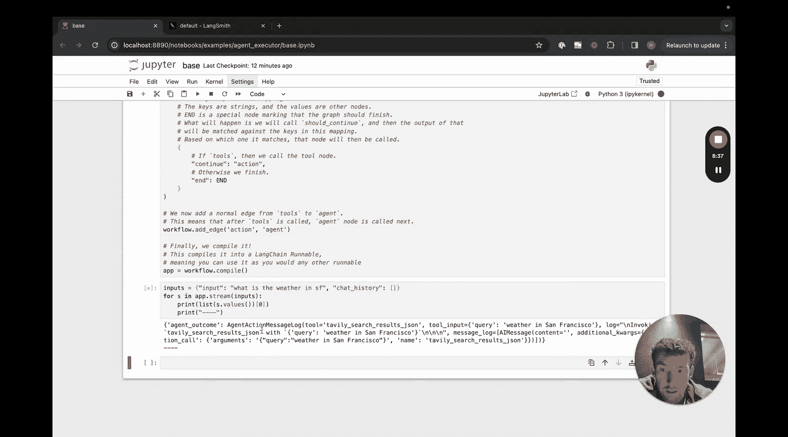
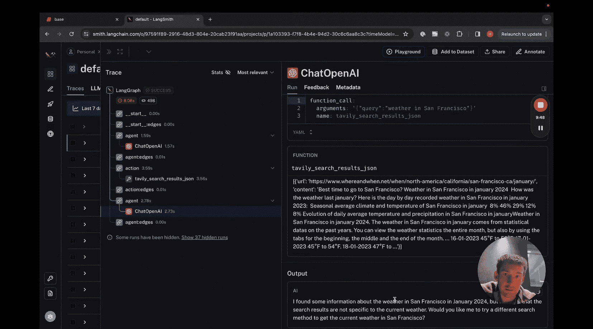
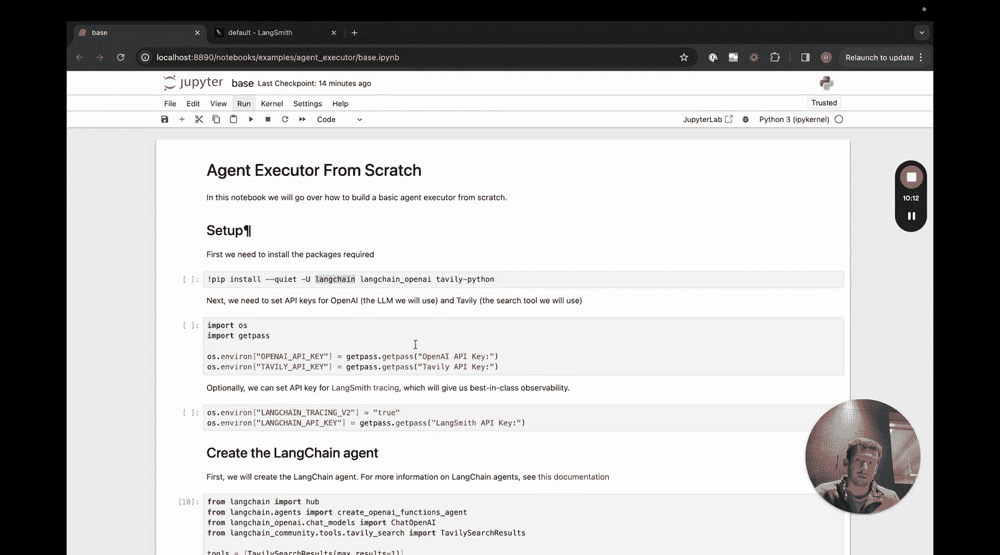

#  002：LangGraph Agent Executor构建指南 🚀

## 概述
在本节课中，我们将学习如何使用LangGraph从零开始构建一个与当前LangChain Agent Executor功能等效的智能体执行器。我们将看到这个过程是多么简单。

---

## 环境设置与安装 🔧

首先，我们需要安装必要的软件包。

以下是需要安装的包：
*   **langchain**：我们将使用它来调用LangChain中现有的智能体类。在LangGraph中，我们仍然可以轻松地使用这些智能体类。
*   **langchain-openai**：我们将使用它来接入OpenAI的包，并用它来驱动我们的智能体。
*   **tavily-python**：这将为我们将要使用的搜索工具提供支持，该工具将作为智能体的工具之一。

安装完成后，我们需要设置API密钥。
*   设置OpenAI API密钥。
*   设置Tavily API密钥。
*   设置LangSmith API密钥。

`LANGSMITH_TRACING_V2`和`LANGCHAIN_API_KEY`这两个变量如果被设置，将会把运行日志记录到LangSmith（我们的可观测性平台）。你可以在这里查看说明。如果你还没有LangSmith的访问权限，它目前处于内测阶段，可以通过Twitter或LinkedIn联系我获取API密钥。

---

## 创建LangChain智能体 🤖

我们要做的第一件事是创建LangChain智能体。

这段代码与我们在LangChain中使用的代码完全相同。如果你需要更多详细信息，请查阅LangChain文档。简单来说，我们将：
1.  创建一个工具，即Tavily搜索工具。
2.  获取我们的提示词模板，这里我们从Hub拉取。
3.  选择我们想要使用的大语言模型（LLM），这里使用的是OpenAI的LLM。
4.  创建一个OpenAI函数智能体，这是一种特定类型的智能体。

---

## 定义图状态 📊

接下来，我们需要定义图状态。这是在图运行过程中将被追踪的状态。

定义状态之所以重要，是因为一旦我们建立了这个状态，每个节点都可以向该状态推送更新。这样，我们就不必在节点之间频繁地传递整个状态。相反，我们可以只传递对该状态的更新。

在定义状态时，我们需要指定我们向该状态推送的更新类型。默认情况下，更新会覆盖该状态的现有属性。这在某些情况下很有用，但在其他情况下，你可能希望实际添加到现有的状态中。我们在这里会看到一个例子。重申一下，默认行为是覆盖，但通常你希望添加到该状态的属性中。

让我们看看现有的智能体状态定义。前两个基本上是输入：对话的输入消息和聊天历史记录（如果有的话）。这些是我们稍后会传入的内容。

接下来的两个是图随着时间推移将添加的内容。`agent_outcome`将由一个特定的节点在智能体被调用后设置，它基本上代表智能体应该调用的工具或应该传递的最终结果。因此，我们使用`AgentAction`和`AgentFinish`来分别表示工具调用和最终结果。我们还定义了`None`，因为这是初始时的默认值。

最后，我们有一个列表，记录了智能体到目前为止所采取的步骤。这是我们不希望被覆盖的属性之一，相反，我们希望随着时间的推移不断追加并增长这个列表。因此，我们在这里用`add`操作符来注解它。这意味着任何时候一个节点写入这个属性，它都会添加到现有值中，而不是覆盖它。我们将其类型定义为`List[Tuple[AgentAction, str]]`，这是当前LangChain智能体中表示中间步骤的方式。

---

## 定义节点与边 🔗

现在我们需要定义节点和边。

首先，我们实际上需要两个节点：
1.  **智能体节点**：使用智能体来决定采取什么行动。
2.  **工具调用节点**：接收智能体的决策，调用相应的工具，然后处理结果。

除了这些节点，我们还需要添加一些边。主要有两种类型的边：
*   **条件边**：一个节点会导致一个“岔路口”，根据前一个节点的结果，可能有两条、三条或更多不同的路径。我们将看到一个添加条件边的例子。我们将添加的条件边是基于`agent_outcome`的：我们要么想调用一个工具，要么想返回结果给用户。这将是我们必须做出的分支决策。
*   **普通边**：总是发生的事件。例如，在调用工具之后，我们总是希望返回到智能体，让它决定下一步做什么。

让我们看看这里定义的节点。
*   `run_agent`节点：调用智能体，接收数据，执行`agent_runnable.invoke`，然后将结果赋值给`agent_outcome`。这将覆盖`agent_outcome`的现有值。
*   `execute_tools`函数：接收数据，获取当前的`agent_outcome`，使用`tool_executor`（我们创建的一个辅助函数，用于方便地运行工具）执行它，然后返回中间步骤。记住，`intermediate_steps`是我们正在追加的属性。这里我们定义了一个包含`AgentAction`和输出（转换为字符串）的列表，这个列表将被追加到现有的列表中。
*   `should_continue`函数：这基本上将用于创建条件边。我们查看`agent_outcome`，如果是`AgentFinish`，则返回`"end"`，否则返回`"continue"`。我们稍后在构建图时会看到如何使用这些返回值。

---

## 构建与编译图 🏗️

现在我们来构建图。

首先，我们从`langgraph`导入`StateGraph`并创建一个新图，传入我们上面定义的`AgentState`。然后我们添加两个节点，通过指定节点名称（字符串）和函数（可以是函数或Runnable）来添加。这样我们就可以在下面引用这个节点。

我们将入口点设置为`"agent"`（使用我们在这里设置的相同字符串），这基本上是说当有输入时，这将是第一个被调用的节点。

然后我们添加一个条件边。我们定义起点，表示在`agent`节点运行完毕后，我们将调用`should_continue`函数。这个函数接收`agent`节点调用后的任何输出，然后查看数据并返回`"end"`或`"continue"`。我们传入这个函数的最后一个参数是一个字符串到字符串的映射。这个映射的键应该与`should_continue`的输出匹配。因此，如果`should_continue`返回`"continue"`，那么我们调用上面定义的`"action"`节点；如果返回`"end"`，那么我们调用这个特殊的`"__end__"`节点，这是一个内置节点，表示我们应该结束并返回给用户。

接着，我们添加一个从`"action"`回到`"agent"`的普通边。这是在工具被调用之后，我们返回到智能体。

最后，我们编译这个图。这基本上将这个图结构转换成一个LangChain Runnable，然后我们就可以使用它了：我们可以使用`invoke`、`stream`等方法。

---

## 运行与观察结果 👀

现在我们可以调用并运行它了。

记住，我们需要`input`键和`chat_history`作为两个输入。我们在此之后使用`stream`方法，这将打印出每个节点的结果。

我们可以看到，我们首先得到了`agent_outcome`（这是智能体节点的输出），返回的内容指示使用Tavily搜索工具并带有查询输入。然后我们得到`intermediate_steps`（中间步骤是工具调用及其结果的元组）。接着我们得到一个新的`agent_outcome`，这次是`AgentFinish`，表示智能体执行完毕，并返回最终结果，也就是整个状态，包括输入、聊天历史、当前的`agent_outcome`以及任何中间步骤。

我们可以在LangSmith中查看一个更好的示例。点击进入LangGraph追踪，我们可以看到它开始运行，然后在底层调用智能体（智能体调用OpenAI），我们可以看到输入的确切提示词。我们看到返回了一个函数调用，然后在`action`中看到这个函数调用及其返回结果。之后，它再次回到`agent`节点，再次调用OpenAI，现在提示词中包含了之前的结果，并得到了新的响应。

---

## 总结 🎯

本节课中，我们一起学习了如何使用LangGraph从零开始构建一个智能体执行器，其功能与现有的LangChain Agent Executor非常相似。

在未来的视频中，我们将深入探讨更多内容，例如：
1.  深入探讨`StateGraph`暴露的接口。
2.  更详细地介绍`stream`方法以及以不同方式流式返回结果的其他途径。