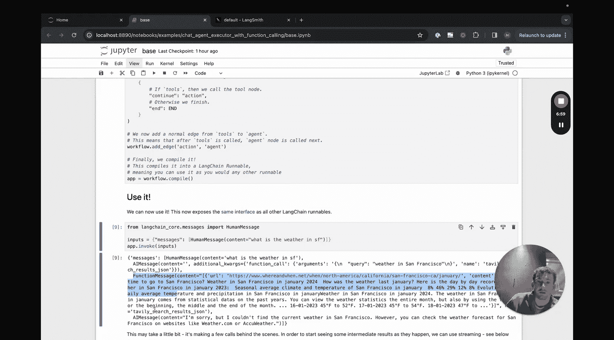
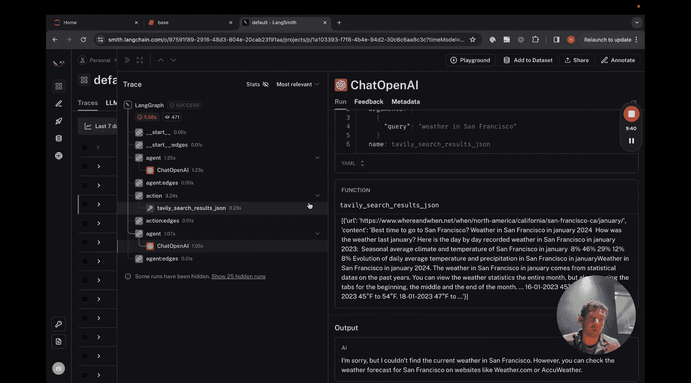

#  003：聊天代理执行器

在本节课中，我们将学习 LangGraph 中的聊天代理执行器。这是一个专门处理消息列表的代理执行器，它通过向列表中添加消息来跟踪代理随时间变化的状态。这对于基于聊天的模型尤其有用，因为这些模型通常将函数调用和函数响应表示为消息。

## 概述

我们将构建一个基于消息列表的聊天代理。与传统的 LangChain 代理相比，本教程将使用更少的 LangChain 抽象概念，更接近底层实现。我们将使用支持函数调用的 OpenAI 模型，并结合 LangChain 的工具，但不会使用 LangChain 的高级代理抽象。

## 环境设置

首先，我们需要安装必要的包并设置环境。

```python
# 安装所需包
# pip install langchain langchain-openai tavily-python

import os
from langchain_openai import ChatOpenAI
from langchain_community.tools.tavily_search import TavilySearchResults
from langgraph.graph import StateGraph, END
from typing import TypedDict, Annotated, List
from langchain_core.messages import HumanMessage, AIMessage, FunctionMessage
import operator
```

接下来，设置 API 密钥和 LangSmith 追踪（可选，但有助于观察代理内部运行情况）。

```python
# 设置 API 密钥
os.environ["OPENAI_API_KEY"] = "your-openai-api-key"
os.environ["TAVILY_API_KEY"] = "your-tavily-api-key"
os.environ["LANGCHAIN_TRACING_V2"] = "true"
os.environ["LANGCHAIN_API_KEY"] = "your-langsmith-api-key" # 可选
```

## 定义工具与模型

上一节我们设置了环境，本节中我们来看看如何定义代理将使用的工具和语言模型。

以下是需要定义的核心组件：

1.  **工具**：代理可以调用的外部函数，例如网络搜索。
2.  **工具执行器**：一个帮助调用这些工具的辅助方法。
3.  **模型**：支持函数调用的语言模型。

```python
# 1. 设置工具
tool = TavilySearchResults(max_results=2)
tools = [tool]

# 2. 设置工具执行器
from langchain.tools.render import format_tool_to_openai_function
from langchain.agents import ToolExecutor
tool_executor = ToolExecutor(tools)

# 3. 设置模型
model = ChatOpenAI(model="gpt-3.5-turbo", temperature=0, streaming=True)
# 将 LangChain 工具转换为 OpenAI 函数调用格式
functions = [format_tool_to_openai_function(t) for t in tools]
model = model.bind(functions=functions)
```

## 定义代理状态

代理状态是在图的所有节点之间传递并随时间更新的数据结构。对于聊天代理，状态的核心就是一个消息列表。

我们使用 `TypedDict` 和 `Annotated` 来定义状态。`Annotated[..., operator.add]` 表示对该字段的更新是追加（add）操作，而非覆盖。

```python
# 定义代理状态
class AgentState(TypedDict):
    messages: Annotated[List, operator.add] # 消息列表，更新操作为追加
```

## 构建图节点与边

现在，我们来定义构成代理工作流的节点和边。节点执行具体工作，边则定义节点间的流转逻辑。

我们需要三个主要部分：

1.  **代理节点**：调用语言模型并获取响应。
2.  **动作节点**：检查响应中是否需要调用工具，如果需要则调用工具并将结果追加到消息列表。
3.  **条件判断函数**：决定在代理节点之后，是进入动作节点还是结束流程。

首先，定义条件判断函数 `should_continue`。

```python
def should_continue(state: AgentState) -> str:
    """根据最后一条消息判断是否继续调用工具。"""
    messages = state['messages']
    last_message = messages[-1]
    # 如果最后一条消息包含函数调用，则继续执行动作节点
    if hasattr(last_message, 'tool_calls') and last_message.tool_calls:
        return "continue"
    # 否则，结束流程
    return "end"
```

接着，定义调用模型的 `call_model` 函数。

```python
def call_model(state: AgentState):
    """调用语言模型并返回其响应消息。"""
    messages = state['messages']
    response = model.invoke(messages)
    # 将响应作为列表返回，以便追加到状态中的消息列表
    return {"messages": [response]}
```

然后，定义执行工具的 `call_tool` 函数。

```python
def call_tool(state: AgentState):
    """执行模型请求的工具调用，并将结果作为消息返回。"""
    messages = state['messages']
    last_message = messages[-1] # 获取最新的 AI 消息，其中包含工具调用请求
    
    # 根据 OpenAI 函数调用格式构建工具调用请求
    tool_call = last_message.tool_calls[0]
    tool_name = tool_call['name']
    tool_input = tool_call['args']
    
    # 执行工具
    output = tool_executor.invoke({tool_name: tool_input})
    
    # 将工具执行结果封装为 FunctionMessage
    function_message = FunctionMessage(
        content=str(output),
        name=tool_name,
        tool_call_id=tool_call['id']
    )
    # 返回结果消息，以便追加到状态
    return {"messages": [function_message]}
```

## 组装与编译图

定义了所有组件后，现在可以将它们组装成一个可执行的工作流图。

```python
# 创建图，并指定状态模式
workflow = StateGraph(AgentState)

# 添加节点
workflow.add_node("agent", call_model)
workflow.add_node("action", call_tool)

# 设置入口点：从 agent 节点开始
workflow.set_entry_point("agent")

# 添加条件边：在 agent 节点后，根据 should_continue 决定下一步
workflow.add_conditional_edges(
    "agent",
    should_continue,
    {
        "continue": "action", # 继续则跳转到 action 节点
        "end": END # 结束则到达终点
    }
)

# 添加固定边：在 action 节点后，总是返回 agent 节点进行下一轮思考
workflow.add_edge("action", "agent")

# 编译图，生成一个可运行的对象
app = workflow.compile()
```

## 运行代理

图编译完成后，我们就可以通过输入消息列表来运行代理了。

```python
# 准备输入：一个包含消息列表的字典
inputs = {
    "messages": [
        HumanMessage(content="今天旧金山的天气怎么样？")
    ]
}

# 运行代理
for output in app.stream(inputs):
    for node_name, node_output in output.items():
        print(f"--- 节点 '{node_name}' 的输出 ---")
        print(node_output)
        print("\n")
```

运行后，`state['messages']` 将包含完整的对话历史：你输入的人类消息、模型首次响应的 AI 消息（可能包含函数调用）、工具返回的 FunctionMessage 以及模型最终回答的 AI 消息。

## 使用 LangSmith 进行追踪

如果你想深入了解代理的每一步执行过程，可以使用 LangSmith。运行上述代码后，你可以在 LangSmith 控制台中看到类似下图的追踪信息：




追踪图会显示详细的调用链：
1.  首次调用 OpenAI 模型，输入是人类消息，返回一个函数调用请求。
2.  进入 `action` 节点，执行 Tavily 搜索工具。
3.  再次调用 `agent` 节点，此时输入包含了历史消息和工具结果，模型生成最终回答。

## 总结

本节课中我们一起学习了如何使用 LangGraph 构建一个聊天代理执行器。我们完成了以下步骤：

1.  **设置环境与工具**：引入了必要的库，并配置了搜索工具和 OpenAI 模型。
2.  **定义状态**：使用 `TypedDict` 创建了以消息列表为核心的可追加状态。
3.  **构建工作流节点**：实现了负责调用模型的 `agent` 节点和执行工具的 `action` 节点。
4.  **设计控制流**：通过条件边和固定边，将节点连接成 `模型 -> 判断 -> (工具 -> 模型...) -> 结束` 的循环工作流。
5.  **运行与追踪**：输入消息来运行代理，并利用 LangSmith 观察其内部执行步骤。



这个代理的核心优势在于它直接操作消息列表，与基于聊天的模型原生兼容，并且通过 LangGraph 获得了清晰、可调试的工作流定义。在下一节课中，我们将探索 LangGraph 的流式输出能力。