#  004：LangGraph中实现人机交互循环

在本节课中，我们将学习如何修改聊天智能体执行器，为其添加一个“人在回路”组件。该组件的作用是，在智能体执行任何工具操作之前，会先请求用户确认。我们将基于基础教程进行构建，因此如果你尚未学习之前的课程，强烈建议你先完成，因为本节视频将主要聚焦于对原有代码的修改部分。

## 概述与准备工作

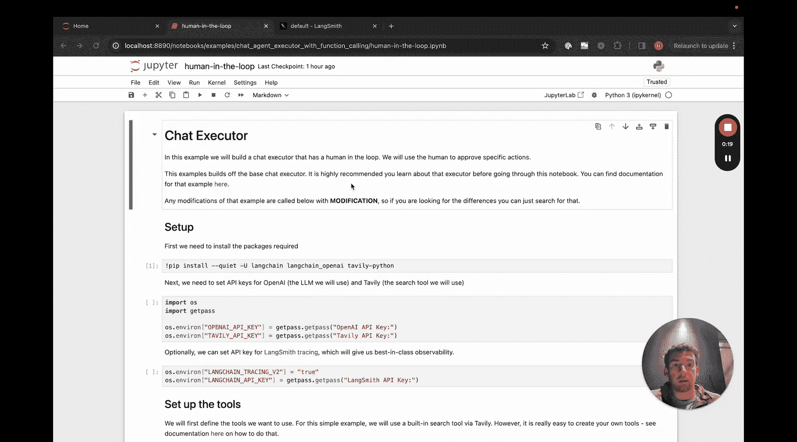

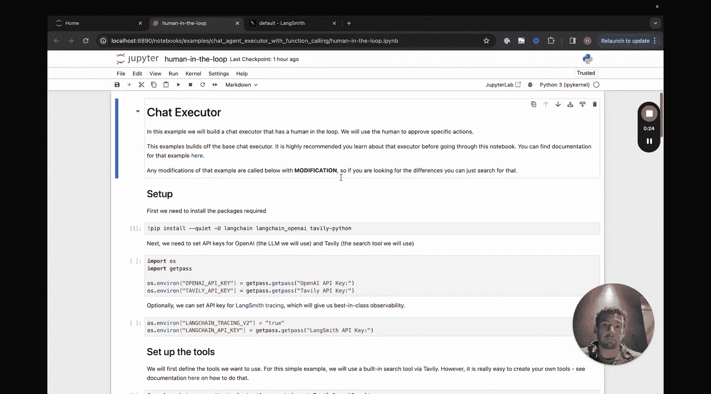

我们将按照之前的步骤进行设置，无需安装额外的包。首先，我们需要创建工具、工具执行器，然后设置模型并将工具绑定到该模型。

接下来，我们将定义智能体状态。到目前为止，所有步骤都与之前相同。

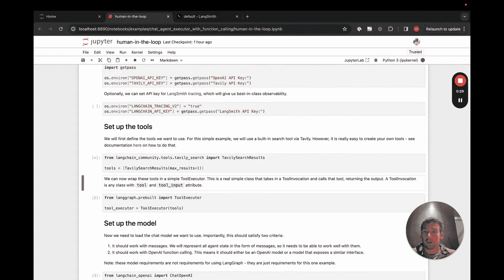

## 定义节点：关键修改点

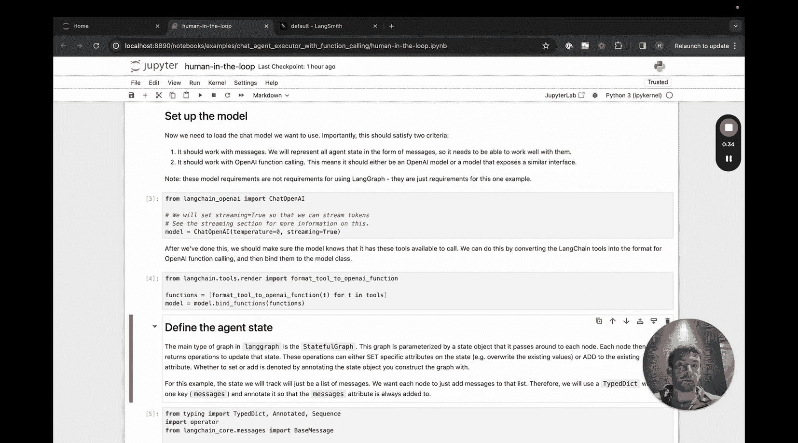

第一个不同之处出现在我们开始定义节点时。其中，判断是否继续的逻辑（`should_continue`）和调用模型的逻辑（`call_model`）保持不变。

真正需要修改的是 `call_tool` 函数。

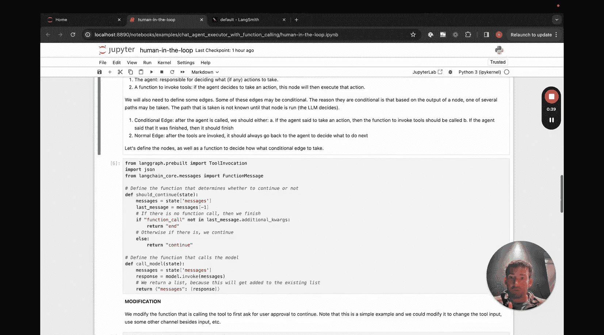

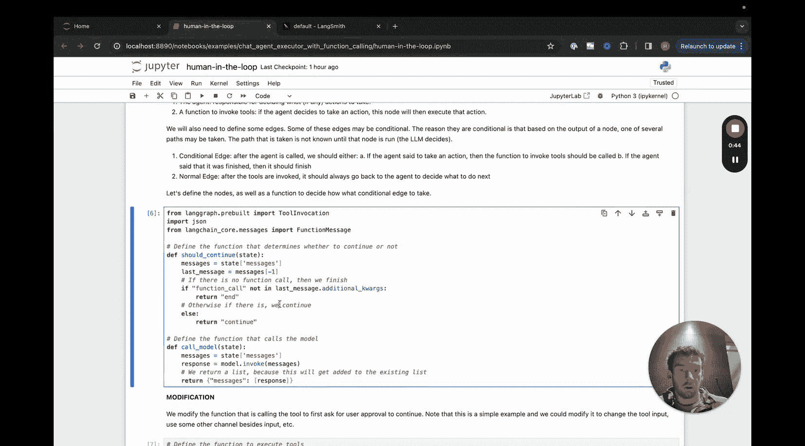

## 修改 `call_tool` 函数

以下是修改的核心逻辑。我们在此处添加了代码，用于在交互式IDE中提示用户，询问是否继续执行该操作。如果用户的回答是“否”，我们将抛出一个错误并终止流程。

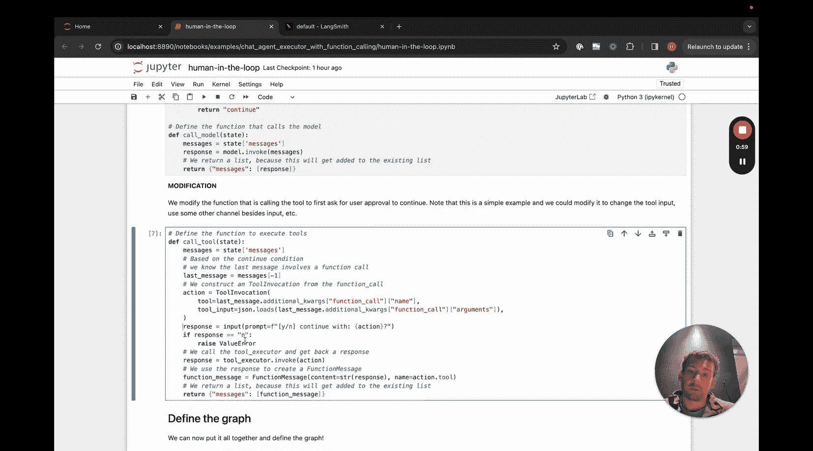

```python
# 伪代码示例：在调用工具前添加确认步骤
def call_tool(state):
    # ... 获取工具调用信息 ...
    user_input = input(f"是否要执行操作 '{tool_name}'？ (yes/no): ")
    if user_input.lower() != 'yes':
        raise ValueError("用户取消了操作。")
    # 如果用户同意，则继续执行工具调用
    result = tool_executor.invoke(tool_call)
    return {"messages": [ToolMessage(content=str(result), tool_call_id=tool_call['id'])]}
```

这是我们对基础教程所做的唯一修改。图的定义将完全保持不变，之后我们就可以使用它了。

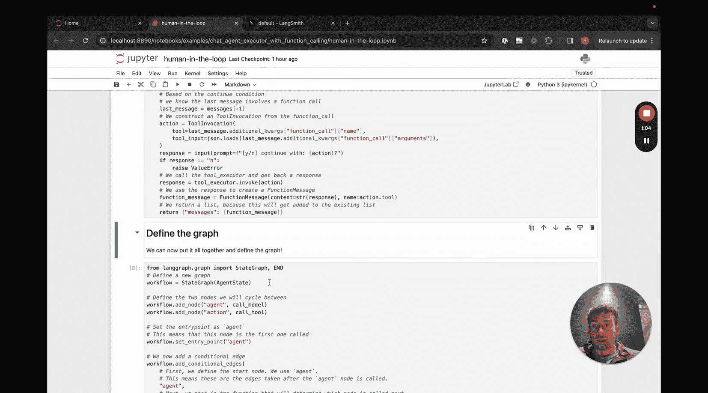

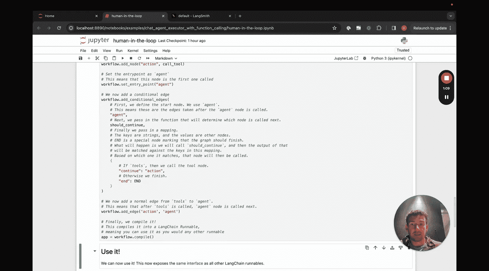

## 运行与测试

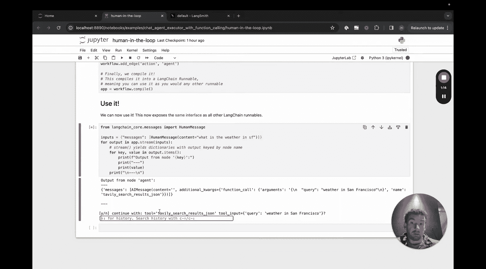

当我们调用这个修改后的图时，可以看到在调用工具之前，系统会给出提示。如果我们回答“是”，流程将继续，正常调用工具并返回响应。

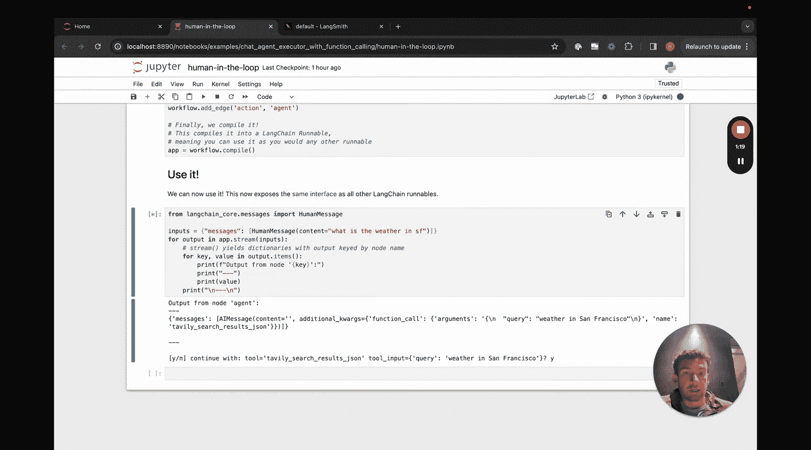

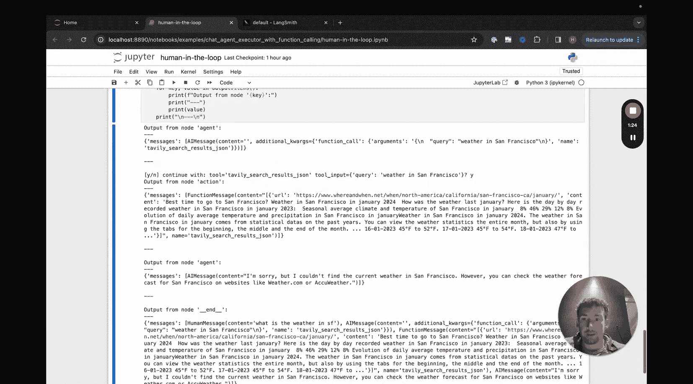

如果我们回答“否”，则会引发一个 `ValueError` 错误，流程将停止。

## 总结与扩展

这是一个非常简单的示例。在实际应用中，你可能希望进行比抛出 `ValueError` 更复杂的错误处理，并且很可能不希望这个交互发生在Jupyter Notebook中，而是集成到其他用户界面里。但本示例清晰地展示了如何在LangGraph智能体中添加一个简单而有效的“人在回路”组件，让你能够控制关键操作的执行。

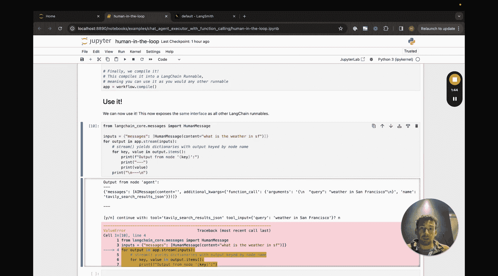

本节课中，我们一起学习了如何通过修改 `call_tool` 节点，在LangGraph工作流中引入人工确认步骤，从而实现对智能体行为的实时监督和控制。