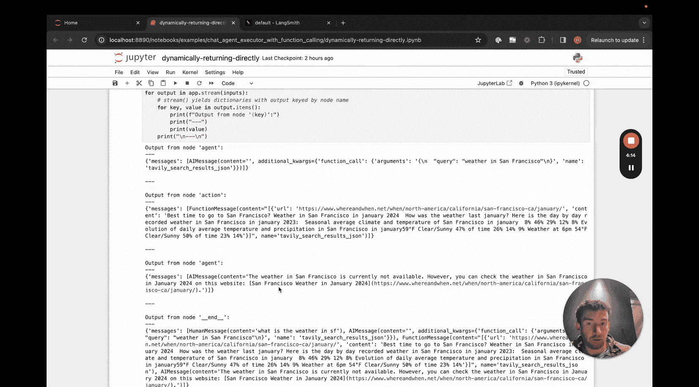
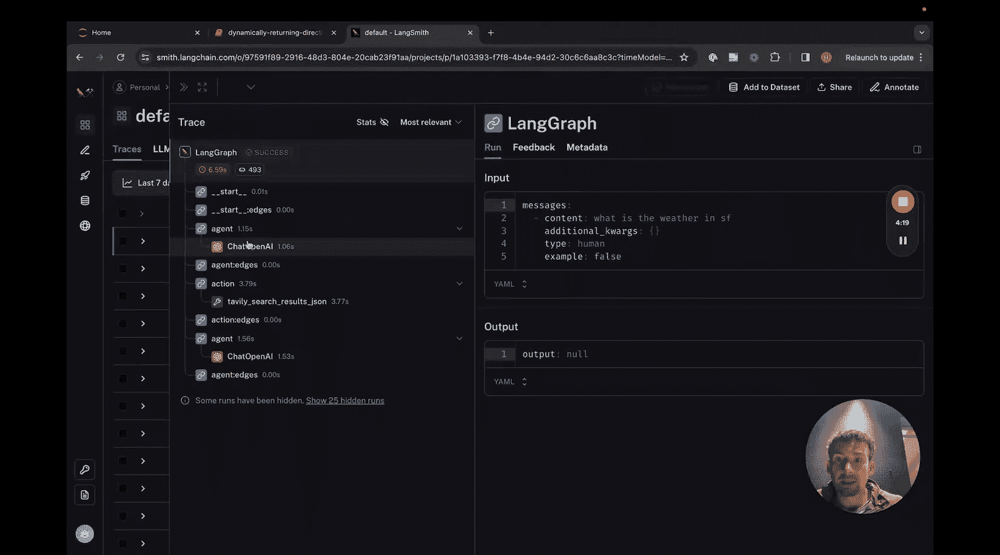
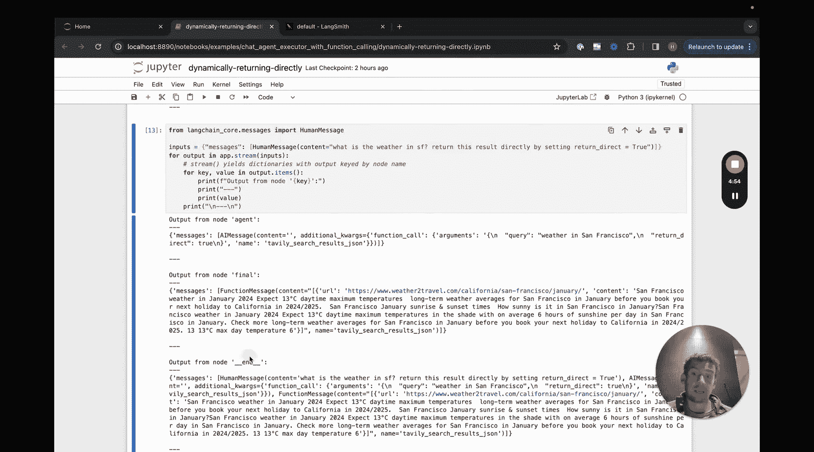
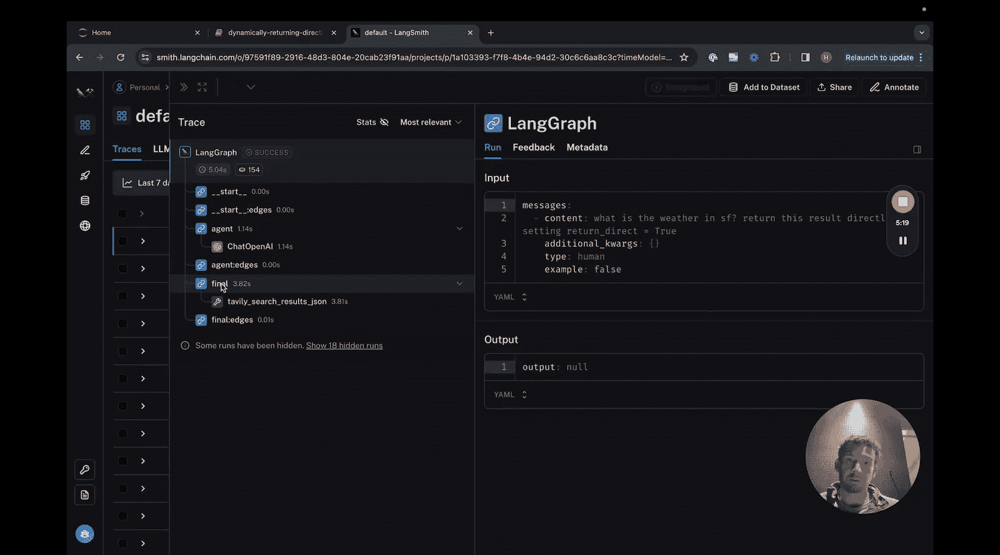

#  005：动态直接返回工具输出

在本节课中，我们将学习如何修改基础的聊天代理执行器，使其能够动态决定是否将工具调用的结果直接返回给用户，而无需经过语言模型的进一步处理或总结。这对于那些有时能直接提供有效答案的工具非常有用。

## 概述

上一节我们介绍了基础的聊天代理执行器循环。本节中，我们来看看如何对其进行修改，赋予代理动态决定是否将工具输出直接返回给用户的能力。核心在于为工具模式添加一个 `return_direct` 参数，并调整图的工作流程来处理这个新逻辑。

## 修改工具模式

首先，我们需要修改工具的定义。我们将为工具的模式添加一个名为 `return_direct` 的布尔型参数，默认值为 `False`。这个参数本身不会被工具使用，而是告知代理它可以选择将此工具的结果直接返回。

以下是定义工具模式的代码示例：
```python
# 假设使用 Pydantic 定义工具参数模式
from pydantic import BaseModel, Field

class ToolArguments(BaseModel):
    query: str = Field(..., description="查询内容")
    return_direct: bool = Field(False, description="是否直接返回结果")
```

## 构建图节点与边

接下来，我们需要调整代理图的结构。关键的修改在于 `should_continue` 函数和工具调用节点。

**1. 修改 `should_continue` 逻辑**
之前的逻辑是：如果没有函数调用，则结束。现在，我们增加一个判断：如果函数调用参数中设置了 `return_direct=True`，则转向一个最终节点；否则，继续循环。

**2. 处理工具调用**
在调用工具时，我们需要从参数中剔除 `return_direct` 字段，因为它仅用于控制流程，并非工具本身的输入参数。

**3. 创建两个工具调用节点**
为了实现不同的流程走向，我们创建两个节点：
*   **`action` 节点**：处理 `return_direct=False` 的情况，调用工具后返回结果给代理（语言模型）进行下一步处理。
*   **`final` 节点**：处理 `return_direct=True` 的情况，调用工具后直接将结果返回给用户，结束流程。

以下是定义节点和边的核心逻辑：
```python
# 伪代码示意
def should_continue(state):
    if no function call:
        return “end”
    elif function call has “return_direct” == True:
        return “final_node”  # 转向最终节点
    else:
        return “continue”

def call_tool(state):
    tool_name = state[‘tool_to_call’]
    tool_args = state[‘tool_args’]
    # 如果参数中包含 return_direct，则删除它
    if ‘return_direct’ in tool_args:
        del tool_args[‘return_direct’]
    result = tool_executor.invoke({‘name’: tool_name, ‘args’: tool_args})
    return {‘result’: result}

# 定义图
graph = StateGraph(AgentState)
graph.add_node(“agent”, call_model) # 调用模型的节点
graph.add_node(“action”, call_tool) # 普通工具调用节点
graph.add_node(“final”, call_tool)  # 直接返回的工具调用节点

# 设置边
graph.add_conditional_edges(“agent”, should_continue) # 代理节点根据条件决定下一步
graph.add_edge(“action”, “agent”) # 普通工具调用后返回代理
graph.add_edge(“final”, END)      # 最终节点调用后直接结束
graph.set_entry_point(“agent”)
```

## 运行与演示





完成图构建后，我们可以运行代理。

*   **默认情况**：当代理决定不直接返回时（`return_direct=False` 或未指定），流程为：语言模型 -> 工具调用 -> 语言模型 -> 结束。
*   **直接返回情况**：当代理决定直接返回时（通过提示工程或手动指定 `return_direct=True`），流程简化为：语言模型 -> 工具调用 -> 结束。结果直接从工具返回给用户。

通过 LangSmith 等追踪工具，可以清晰地看到两种情况下不同的执行路径和节点调用顺序。



## 总结



本节课中我们一起学习了如何利用 LangGraph 创建能够动态决定是否将工具输出直接返回给用户的智能代理。我们通过修改工具模式、调整条件逻辑以及创建分支节点来实现这一功能。记住，如果某个工具需要**始终**直接返回结果，更简单的方法是在工具定义时直接设置 `return_direct=True` 属性。而本教程的方法适用于需要由代理**动态决策**的场景。