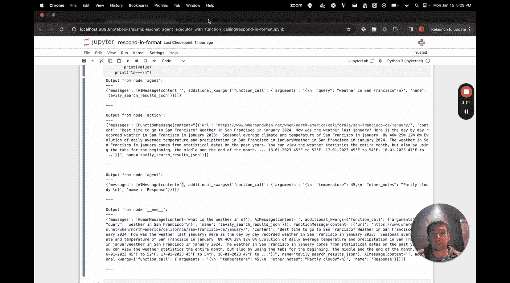
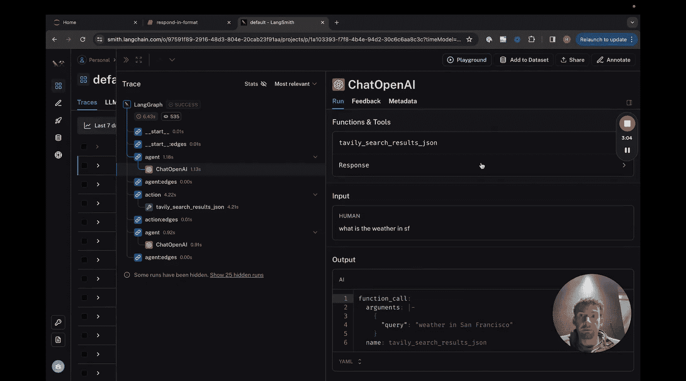

#  006：让智能体以特定格式响应

在本节课中，我们将学习如何让一个聊天智能体执行器以特定的结构化格式进行响应。这在您希望智能体的输出遵循特定格式，并希望通过函数调用来强制执行时非常有用。本教程基于基础的聊天智能体执行器示例，因此建议您先熟悉那个示例。

## 概述

我们将创建一个智能体，它不仅能调用工具完成任务，还能确保其最终响应符合我们预定义的结构。核心在于，除了绑定工具函数外，我们还将一个“响应模式”函数绑定到模型上，引导智能体在需要输出最终答案时调用这个特定函数。

## 创建工具与模型

首先，我们像往常一样创建工具和工具执行器。这部分与基础示例相同。

接下来是创建模型，但这里有一个关键修改。之前，我们只将工具作为可调用函数绑定到模型。现在，我们还需要绑定一个额外的函数定义，即我们希望智能体遵循的响应模式。

例如，我们定义一个响应模式，要求输出包含 `temperature`（温度）和 `other_notes`（其他备注）两个字段。我们将这个模式转换为 OpenAI 函数调用的格式。

以下是核心代码修改：

```python
# 将工具转换为 OpenAI 函数格式
tool_functions = [convert_to_openai_function(t) for t in tools]
# 定义并转换响应模式函数
response_schema = convert_to_openai_function(response_format_function)
# 将工具函数和响应函数一同绑定到模型
model_with_functions = model.bind(functions=tool_functions + [response_schema])
```

通过这一步，模型在生成回复时，不仅知道可以调用哪些工具，还知道有一个名为 `response` 的特定函数用于格式化最终答案。

## 定义智能体状态与节点

智能体状态的定义与之前保持一致。

在定义节点时，`should_continue` 判断逻辑需要调整，以适应新的响应函数。以下是判断逻辑：

1.  如果上一条消息中没有函数调用，则流程结束。
2.  如果上一条消息中有函数调用，且调用的函数名是 `response`，则流程也结束。
3.  如果上一条消息中有函数调用，且调用的函数名不是 `response`，则流程继续。

其他两个节点（`call_model` 和 `call_tool`）的定义与基础示例相同。

## 构建与运行图

定义好节点后，我们像之前一样构建图并运行它。

当我们向智能体提问时，例如“What‘s the weather in SF?”，流程如下：
1.  模型返回一条 AI 消息，调用天气搜索工具。
2.  工具执行器返回包含结果的函数消息。
3.  模型再次返回一条 AI 消息，但这次它调用的是 `response` 函数，并按照我们定义的结构（包含 `temperature` 和 `other_notes`）来组织答案。
4.  由于函数名是 `response`，根据 `should_continue` 的逻辑，流程结束。

与之前智能体将答案直接放在消息的 `content` 字段中不同，现在我们获得了一个结构化的响应对象。

## 底层机制

如果我们查看 LangSmith 的追踪记录，可以看到模型与 OpenAI 的交互详情。在调用记录中，`tools` 列表里现在包含两个函数：一个是工具函数（如 `tavily_search_results_json`），另一个就是我们定义的 `response` 函数。智能体在最后一步正是通过调用这个 `response` 函数来生成格式化的最终答案。

## 总结



本节课我们一起学习了如何利用 LangGraph 让智能体以特定格式进行响应。关键步骤是：
1.  定义一个期望的响应模式（如包含特定字段的 JSON）。
2.  将该模式转换为一个函数，并与工具函数一同绑定到语言模型。
3.  在智能体的状态判断逻辑中，将调用此特定响应函数作为流程结束的条件之一。



这种方法使得智能体的输出不再是自由文本，而是可控、结构化的数据，便于后续的系统处理或展示。