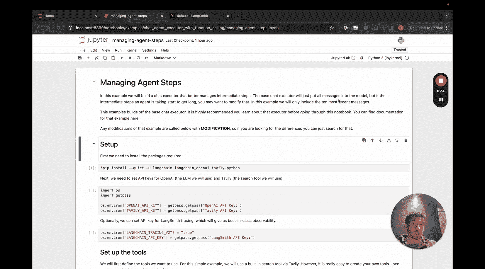
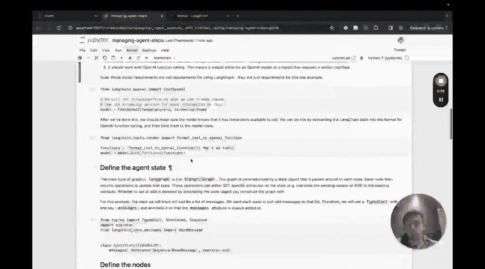
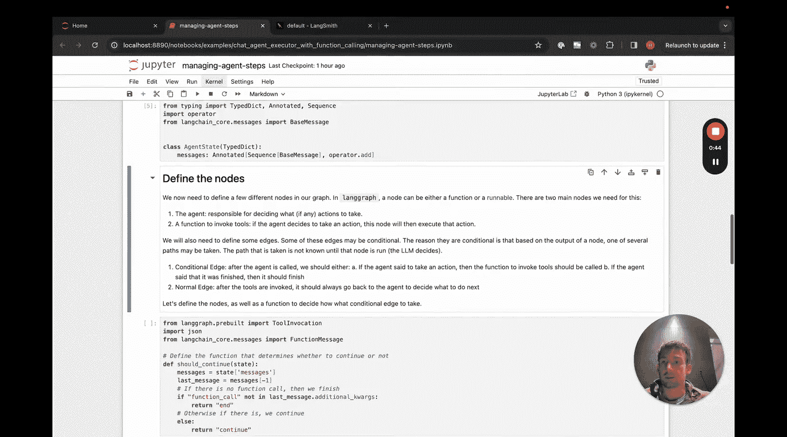
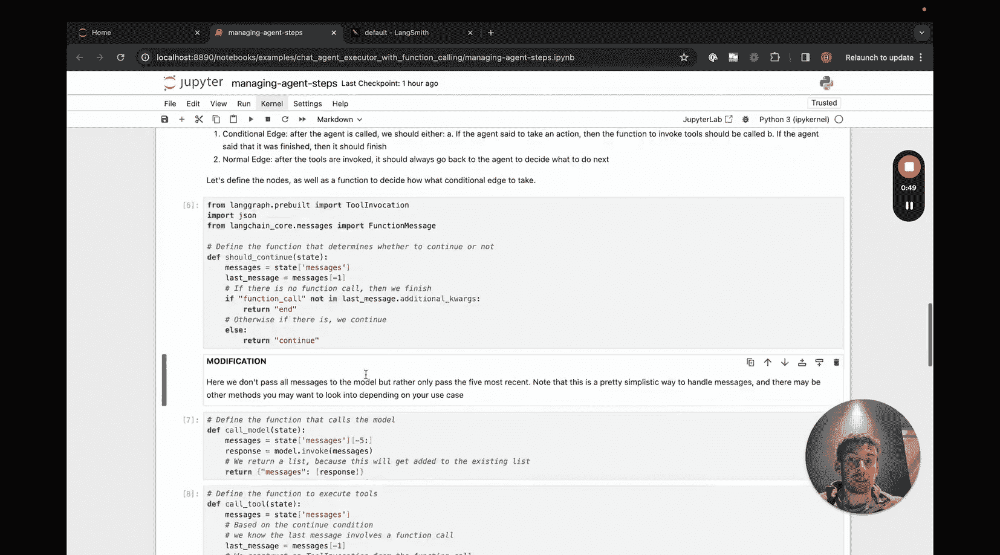
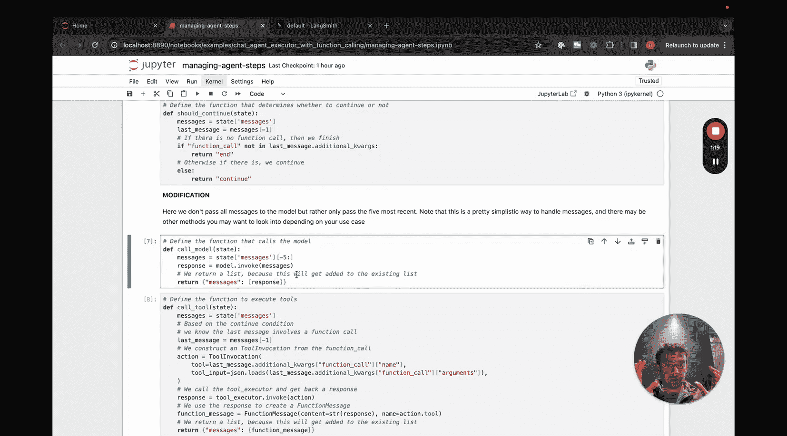
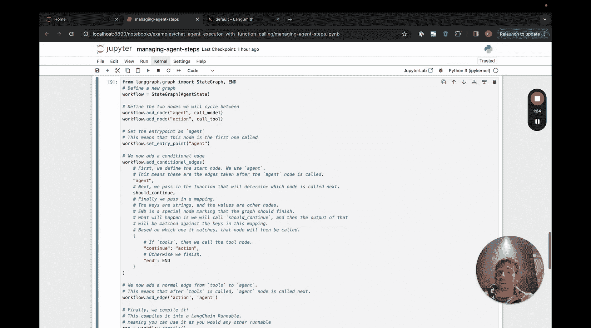
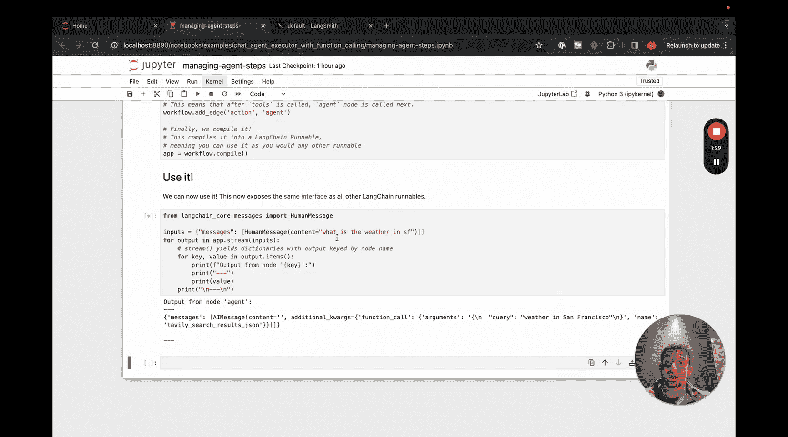
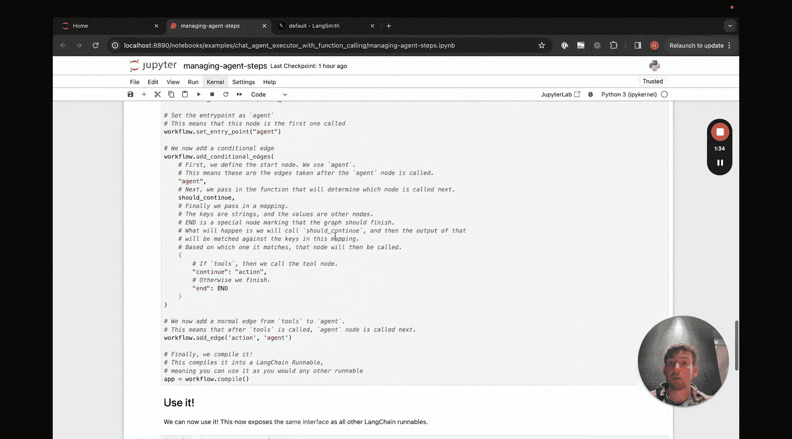
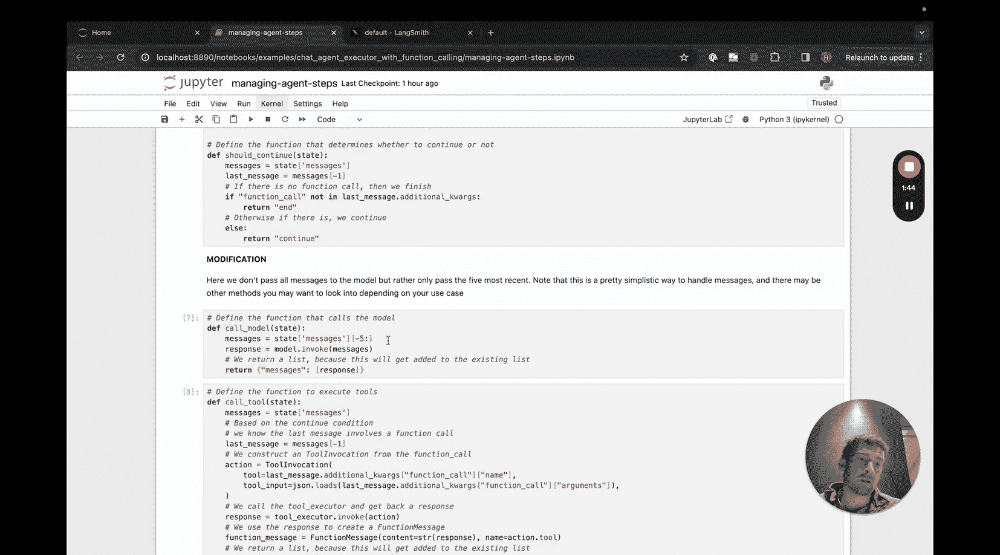

#  007：管理智能体步骤 🛠️

在本节课中，我们将学习如何利用 LangGraph 来管理和修改智能体在执行过程中的内部状态与步骤。与之前封闭的 `LangChainAgentExecutor` 类不同，LangGraph 将所有流程暴露出来，使得我们可以轻松地定制智能体的行为。

## 概述

我们经常遇到一个问题：如何修改现有智能体执行器，以对其内部状态进行不同的处理。过去这并不容易实现，因为逻辑被封装在 `LangChainAgentExecutor` 类中。但借助 LangGraph，所有流程都是透明的，你可以轻松修改智能体在执行过程中的任何步骤。

本教程基于基础的聊天智能体执行器笔记本构建。如果你尚未完成该笔记本，请先完成它。这里我们只介绍需要进行的修改，这些修改非常小。

## 设置环境与工具



首先，我们进行与之前相同的设置：配置工具和模型。这部分代码与基础教程完全一致。

```python
# 设置工具（示例）
tools = [tool1, tool2, ...]
# 设置模型（示例）
llm = ChatOpenAI(temperature=0)
```

## 定义智能体状态

接下来，我们定义智能体的状态。这部分也与之前相同，用于跟踪对话和中间步骤。

```python
from typing import TypedDict, List, Annotated
import operator







class AgentState(TypedDict):
    messages: Annotated[List[BaseMessage], operator.add]
    intermediate_steps: Annotated[List[tuple[AgentAction, str]], operator.add]
```

## 修改节点逻辑：过滤消息

现在进入核心修改部分。我们将定义节点和边逻辑，这与之前类似。但关键的修改在于，我们在其中添加了一些逻辑，用于过滤最终传递给模型的消息。

例如，如果我们只想传递最近的五条消息，可以将逻辑放在这里。如果我们想采用不同的逻辑，比如取系统消息加上最近五条消息，也可以在这里实现。如果我们想对超过五条的历史消息进行总结，同样可以在这里添加逻辑。

这里是你可以插入自定义逻辑的地方，用于处理智能体的中间步骤。我们将在此处实现它，而其他所有部分保持不变。这是一个非常微小的修改，但功能强大。

以下是修改后的节点函数示例：

```python
def agent_node(state: AgentState):
    # 从状态中提取消息
    messages = state['messages']
    # 自定义逻辑：例如，只取最近5条消息
    filtered_messages = messages[-5:] if len(messages) > 5 else messages
    # 将过滤后的消息传递给模型进行处理
    response = llm.invoke(filtered_messages)
    # 返回更新后的状态
    return {"messages": [response]}
```

由于我目前只传入了一条消息，且中间步骤长度最多为2，所以这里看不出明显差异。但重要的是，任何我们想要修改智能体步骤表示方式的逻辑，都可以放在这里。



## 应用于其他执行器







本节介绍的方法虽然以修改聊天智能体执行器为例，但完全相同的思路也适用于普通的智能体执行器。你可以根据需要在相应的节点函数中插入自定义的状态处理逻辑。

## 总结



本节课我们一起学习了如何使用 LangGraph 来管理智能体的步骤。关键点在于，通过暴露的执行流程，我们可以在智能体的节点函数中轻松插入自定义逻辑，例如过滤消息、总结历史或改变状态表示方式。这为定制智能体行为提供了极大的灵活性。记住，无论处理聊天智能体还是普通智能体，此方法都同样适用。