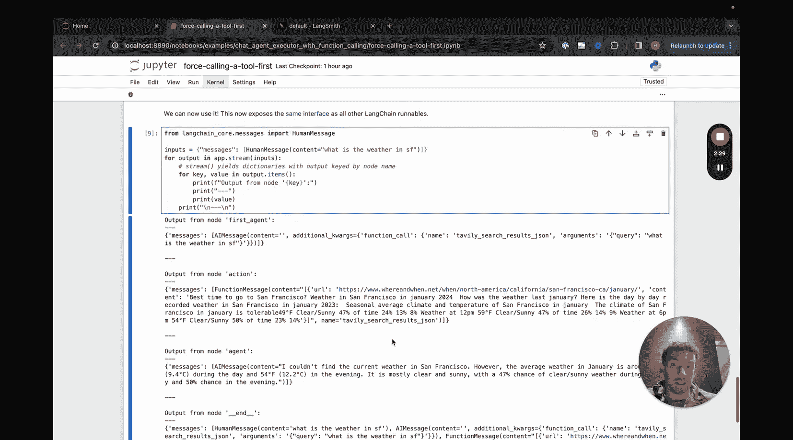
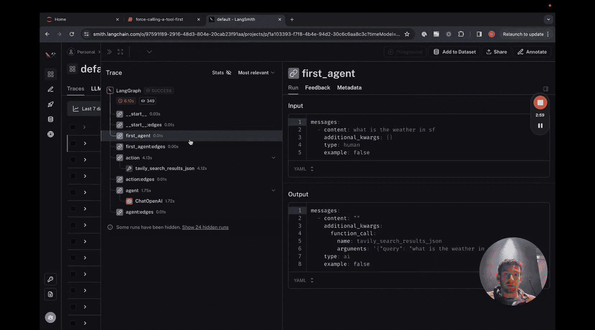

#  008：强制调用工具 ⚙️

在本节课中，我们将学习如何对聊天代理执行器进行一个简单的修改，以实现**强制首先调用一个特定工具**的功能。如果你还没有观看关于聊天代理执行器的视频，建议你先观看以获取完整的背景知识。我们将基于那个视频中的笔记本来进行修改，并且本节课只专注于讲解这些修改部分。

## 概述

我们将创建一个名为 `first_agent` 的新节点，它会强制系统在流程开始时，不经过语言模型推理，直接调用一个预设的工具。这可以用于确保某些操作（如数据检索）总是优先执行。

## 工具与模型设置

大部分基础设置与之前的聊天代理执行器相同。以下是关键步骤：

1.  **创建工具**：我们定义一个工具，例如一个搜索工具。
2.  **创建工具执行器**：用于实际调用这些工具。
3.  **创建语言模型**：例如使用 `ChatOpenAI`。
4.  **绑定工具到模型**：使用 `.bind_tools()` 方法将工具列表绑定到模型。
5.  **定义代理状态**：使用 `TypedDict` 定义一个状态结构，通常包含 `messages` 字段。

这些步骤的代码与基础版本完全一致。

## 定义“首个代理”节点

核心修改在于定义一个额外的节点函数。这个函数将模拟语言模型的输出，强制返回一个要求调用特定工具的消息。

以下是该节点的定义：

```python
def first_agent(state):
    # 这是一个硬编码的函数，模拟AI返回一个工具调用请求
    from langchain_core.messages import AIMessage
    tool_name = “tavily_search_results_json”  # 要强制调用的工具名称
    query = state[“messages”][-1].content  # 获取用户最新消息的内容作为查询参数

    # 构造一个AIMessage，其内容是一个工具调用请求
    message = AIMessage(
        content=“”,
        tool_calls=[{
            “name”: tool_name,
            “args”: {“query”: query},
            “id”: “forced_tool_call_id”
        }]
    )
    return {“messages”: [message]}
```

**代码解释**：
*   `tool_name` 必须与你定义的工具名称完全一致。
*   我们直接从状态中获取最新的用户消息内容作为工具调用的参数。
*   函数返回一个包含 `AIMessage` 的字典，这个消息对象内嵌了一个工具调用请求，从而“欺骗”系统认为这是语言模型决定要调用工具。

## 修改图结构

接下来，我们需要修改图（Graph）的结构，以纳入这个新的节点并调整执行流程。

以下是修改后的图定义逻辑：

```python
from langgraph.graph import StateGraph, END

# 初始化图
workflow = StateGraph(AgentState)

# 添加节点
workflow.add_node(“first_agent”, first_agent)  # 新增的强制调用节点
workflow.add_node(“agent”, run_agent)         # 原有的代理节点（调用语言模型）
workflow.add_node(“action”, execute_tools)    # 原有的执行工具节点

# 设置入口点：现在从 first_agent 开始
workflow.set_entry_point(“first_agent”)

# 定义边（连接）
# 1. 从 first_agent 出来后，强制进入 action 节点执行工具
workflow.add_edge(“first_agent”, “action”)

# 2. 从 action 执行完工具后，进入 agent 节点让语言模型处理结果
workflow.add_edge(“action”, “agent”)

# 3. 从 agent 节点出来后，根据其输出决定下一步
#    如果返回了工具调用，则继续到 action 节点
#    如果没有工具调用，则结束流程
workflow.add_conditional_edges(
    “agent”,
    should_continue,
    {
        “continue”: “action”,
        “end”: END
    }
)

# 编译图
app = workflow.compile()
```

**图结构解析**：
*   **入口变化**：图的入口点从原来的 `agent` 改为了 `first_agent`。
*   **强制路径**：我们添加了一条从 `first_agent` 到 `action` 的直连边。这意味着流程启动后，会立即执行 `first_agent` 节点，然后**无条件地**跳转到 `action` 节点去执行工具。
*   **后续流程**：执行完工具后，流程进入 `agent` 节点（真正的语言模型），由它来决定后续是继续调用工具还是结束。这之后的逻辑与基础版本相同。

## 运行与验证

当我们运行这个修改后的图时，可以观察到以下现象：

1.  **首次响应极快**：对用户第一个问题的响应速度会非常快，因为它跳过了初始的语言模型调用，直接执行了工具（例如搜索）。
2.  **查看内部流程**：通过 LangSmith 等追踪工具，可以清晰地看到：第一个 `first_agent` 节点并没有产生真正的语言模型调用记录，而是直接生成了一个工具调用消息。随后，系统首先调用了我们指定的工具，之后才在必要时调用了语言模型。

这种模式适用于需要**确保某些前置操作（如检索、验证）必须优先执行**的场景。

## 总结

本节课我们一起学习了如何通过修改 LangGraph 的图结构来**强制代理首先调用一个特定工具**。关键步骤包括：
1.  定义一个硬编码的 `first_agent` 节点函数，用于生成工具调用请求。
2.  修改图结构，将 `first_agent` 设置为新的入口点，并创建从它到工具执行节点的直连边。
3.  这样，系统流程将绕过初始的语言模型决策，直接执行我们指定的操作，然后再进入正常的“思考-行动”循环。





这种方法增强了我们对代理行为流程的控制力，可以满足特定的业务逻辑需求。