#  009：LangGraph 多智能体工作流 🚀

在本节课中，我们将学习如何使用 LangGraph 库来构建三种不同类型的多智能体工作流。我们将从基础概念开始，逐步深入到复杂的协作模式，并通过实际代码示例展示如何实现它们。

## 概述

LangGraph 是一个用于构建有状态、多步骤应用程序的库，特别适合创建涉及循环和条件逻辑的智能体工作流。我们可以将其视为一个**有向图**，其中节点代表处理步骤（如智能体），边代表步骤之间的转换逻辑。本节课将重点介绍三种多智能体模式：**多智能体协作**、**智能体监督者**和**分层智能体团队**。

---

## 多智能体协作 🤝

上一节我们介绍了 LangGraph 的基本概念。本节中，我们来看看第一种模式：多智能体协作。在这种模式下，多个智能体共享同一个全局状态（例如消息历史），并基于此状态进行协作。

### 核心概念与设置

首先，我们需要定义智能体。一个智能体通常由一个**提示词（Prompt）**、一个**大语言模型（LLM）** 和一组**工具（Tools）** 组成。

以下是创建一个智能体的辅助函数：

```python
def create_agent(llm, tools, system_message):
    prompt = ChatPromptTemplate.from_messages([
        ("system", system_message),
        MessagesPlaceholder(variable_name="messages"),
        MessagesPlaceholder(variable_name="agent_scratchpad"),
    ])
    agent = create_openai_tools_agent(llm, tools, prompt)
    executor = AgentExecutor(agent=agent, tools=tools)
    return executor
```

接下来，我们定义智能体可以使用的工具，例如一个搜索工具和一个 Python 代码执行工具。

```python
search_tool = TavilySearchResults(max_results=2)
python_tool = PythonREPLTool()
```

### 构建协作图

协作的核心是定义一个共享的**状态（State）**，所有智能体都读取和写入这个状态。

我们定义一个状态类来追踪消息和最近的消息发送者：

```python
from typing import Annotated
import operator
from typing_extensions import TypedDict

class AgentState(TypedDict):
    messages: Annotated[list, operator.add]  # 消息列表
    sender: str  # 最近的消息发送者
```

然后，我们创建代表不同智能体的节点。每个节点函数接收当前状态，调用相应的智能体，并将结果以特定格式添加回状态。

```python
def agent_node(state, agent, name):
    result = agent.invoke(state)
    # 将AI消息转换为带名称的人类消息，以便其他智能体识别
    if isinstance(result, AIMessage) and not result.tool_calls:
        result = HumanMessage(content=result.content, name=name)
    return {"messages": [result], "sender": name}
```

我们创建两个智能体节点：研究员（Researcher）和图表生成器（Chart Generator），以及一个专门执行工具调用的节点。

定义路由逻辑是关键，它决定了在智能体执行后下一步该去哪里：

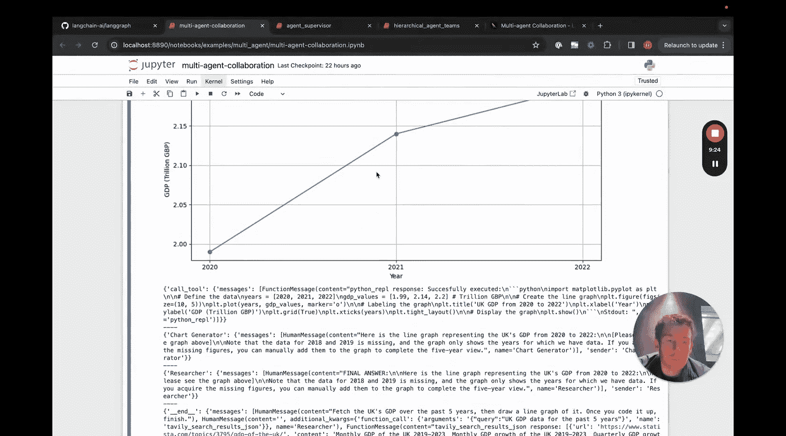

```python
def router(state):
    messages = state[‘messages’]
    last_message = messages[-1]
    if last_message.tool_calls:
        return "call_tool"
    if "FINAL ANSWER" in last_message.content:
        return "end"
    return "continue"
```

以下是构建图的步骤：

1.  创建图并添加状态。
2.  添加研究员、图表生成器和工具节点。
3.  添加条件边：根据路由器的返回值，决定从研究员节点是前往图表生成器、调用工具还是结束。
4.  为图表生成器节点添加类似的条件边。
5.  为工具节点添加边：工具执行完成后，根据 `sender` 状态返回到对应的智能体。
6.  设置图的入口点为研究员节点。

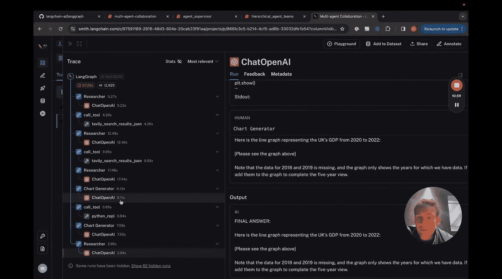

### 运行与调试

现在我们可以调用这个图来处理用户请求，例如：“获取英国过去五年的GDP数据，然后绘制折线图。”

使用 `stream` 方法可以实时观察执行过程。为了更清晰地调试，我们使用 **LangSmith** 来记录和可视化整个调用链。在 LangSmith 中，你可以看到每个智能体的调用、它们使用的提示词、生成的响应以及工具调用的输入和输出，这对于理解复杂的多智能体交互至关重要。

---

## 智能体监督者 👨‍💼

在协作模式中，智能体共享所有中间状态。而智能体监督者模式则不同，监督者智能体将任务分配给独立的子智能体，每个子智能体在完成自己的任务后，只将最终结果返回给监督者。

### 工作流程

在这种模式下，监督者智能体拥有多个“工具”，而这些工具本身就是封装好的 LaneChain 智能体（包含 AgentExecutor）。监督者根据当前对话状态，决定调用哪个子智能体。子智能体内部可以运行多次 LLM 调用和工具调用，但对外只暴露一个最终结果。

### 构建监督者图

首先，我们创建子智能体（如研究员、程序员），它们是完全独立的 LaneChain 智能体。

```python
def create_agent(llm, tools, system_msg):
    prompt = ChatPromptTemplate.from_messages([
        ("system", system_msg),
        MessagesPlaceholder(variable_name="messages"),
        MessagesPlaceholder(variable_name="agent_scratchpad"),
    ])
    agent = create_openai_tools_agent(llm, tools, prompt)
    executor = AgentExecutor(agent=agent, tools=tools, verbose=True)
    return executor
```

然后，我们创建监督者智能体。它的核心是一个特殊的提示词，要求它根据对话内容选择下一个要调用的角色（子智能体）或结束对话。

```python
members = ["Researcher", "Coder"]
system_prompt = (
    "As a supervisor, you manage conversation between these workers: {members}. "
    "Based on the conversation, select the next role to respond or ‘FINISH‘."
)
```

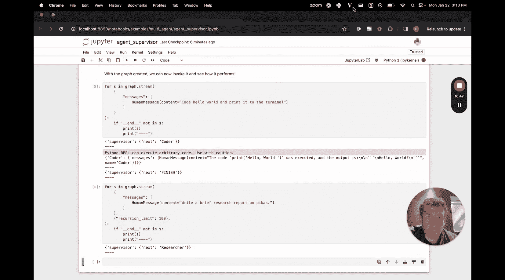

监督者智能体被构造成一个可以调用特定路由函数的链。这个路由函数返回下一个节点的名称。

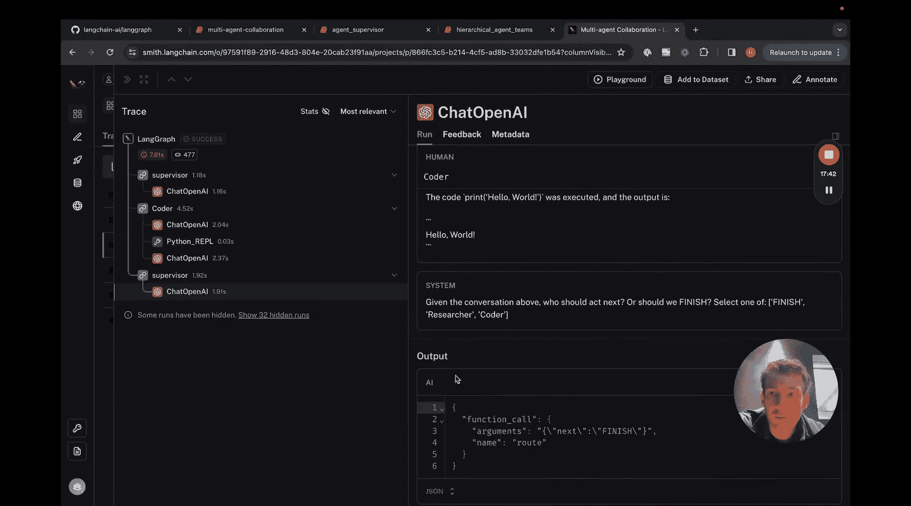

图的构建逻辑如下：
1.  定义状态（包含消息和 `next` 字段）。
2.  添加研究员、程序员和监督者节点。
3.  为研究员和程序员节点添加边：执行完成后，总是返回监督者节点。
4.  为监督者节点添加条件边：根据其输出的 `next` 字段值，决定是前往研究员、程序员节点还是结束。

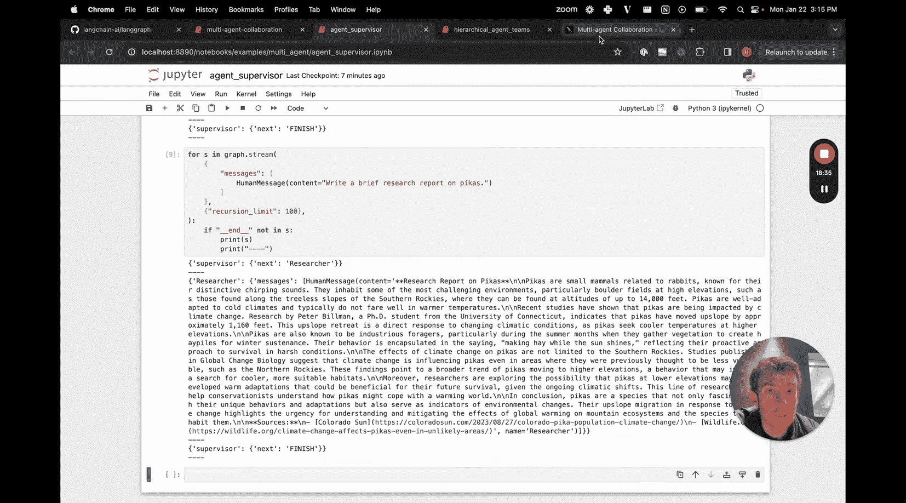

当运行此图时，监督者首先被调用，它决定让“程序员”处理任务。程序员智能体内部进行一系列操作（如调用 Python 工具），完成后将最终结果（如“代码已执行”）返回。监督者看到这个结果后，可能决定任务已完成并结束流程。在 LangSmith 中，你只能看到监督者与子智能体之间的高层交互，而子智能体内部的具体步骤被封装了起来。

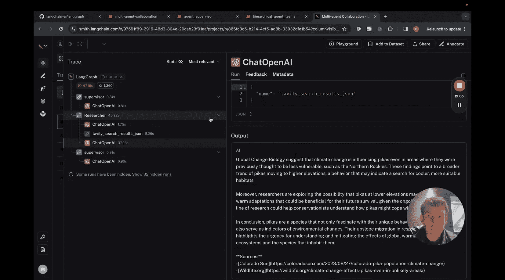

---

## 分层智能体团队 🏢

分层团队模式是监督者模式的延伸，它将复杂性提升了一个层级。在这种模式下，每个子节点本身不是一个简单的智能体，而是另一个由监督者和多个工作者智能体组成的 **子图（Subgraph）**。

### 构建分层结构

例如，我们可以构建一个“研究团队”子图和一个“文档撰写团队”子图，然后再用一个顶层的“团队监督者”来协调这两个子团队。

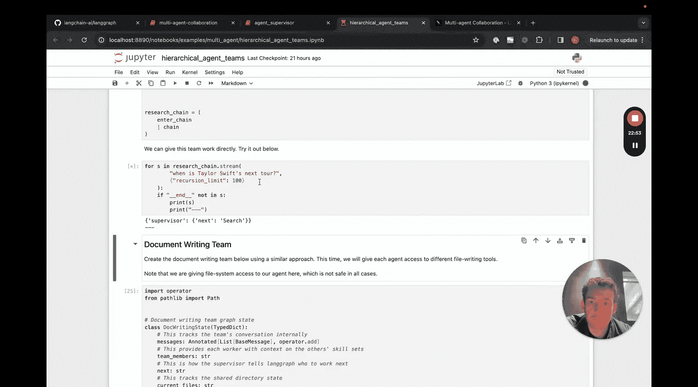

1.  **构建研究团队子图**：这个子图内部包含一个研究监督者、一个搜索智能体和一个爬虫智能体。它接收任务，协调内部智能体完成研究，并返回摘要。
2.  **构建文档撰写团队子图**：这个子图内部包含一个写作监督者、以及负责创建大纲、撰写、编辑等工作的智能体。
3.  **构建顶层图**：顶层状态只包含消息列表。我们将“研究团队”和“文档撰写团队”作为两个独立的节点加入图中。顶层监督者根据任务（如“撰写一份关于北美鲟鱼的研究报告，并包含图表”）决定调用哪个子团队。

### 图的嵌套与执行

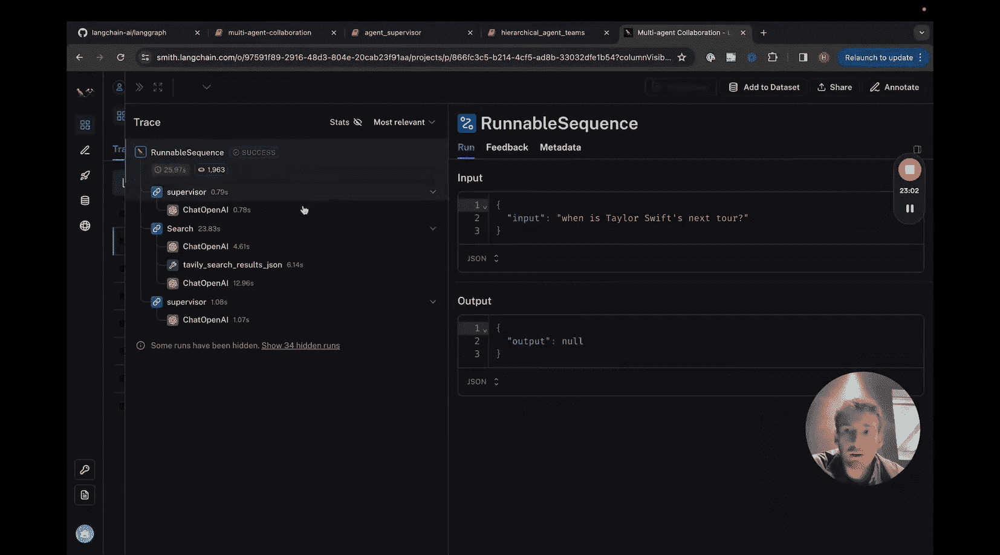

在 LangGraph 中，我们可以将一个编译好的图（`CompiledGraph`）作为一个节点添加到另一个图中，实现图的嵌套。

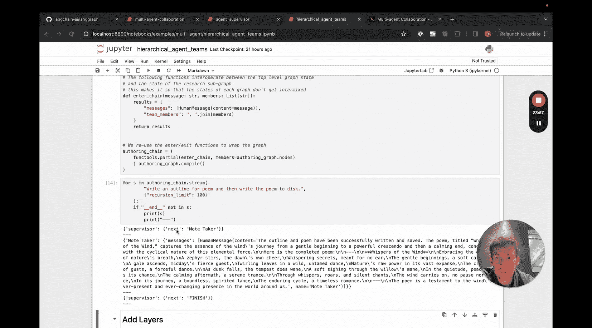

```python
# 假设 research_team 和 writing_team 是已编译好的子图
workflow = StateGraph(TeamState)
workflow.add_node("research_team", research_team)
workflow.add_node("writing_team", writing_team)
workflow.add_node("supervisor", supervisor_chain)
# ... 添加边和条件逻辑
```

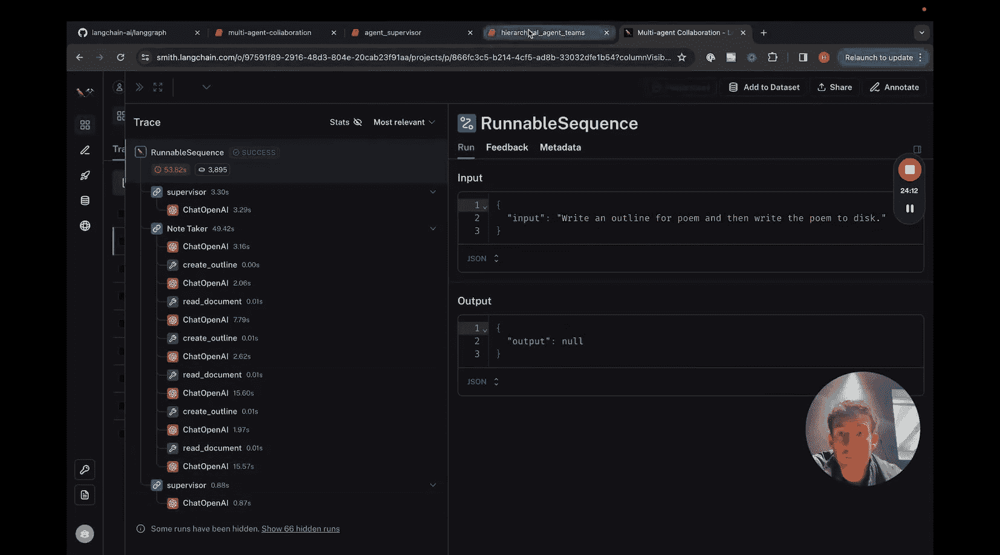

当执行这个分层图时，顶层监督者可能先调用“研究团队”。“研究团队”子图内部开始运行，其监督者协调搜索和爬虫工作，最终将研究结果返回给顶层。接着，顶层监督者可能调用“文档撰写团队”，该团队基于研究结果生成报告。在 LangSmith 的追踪视图中，你可以层层下钻，查看顶层调用、子团队内部的调用以及子智能体内部的详细步骤，这为调试极其复杂的工作流提供了强大的可视化支持。

---

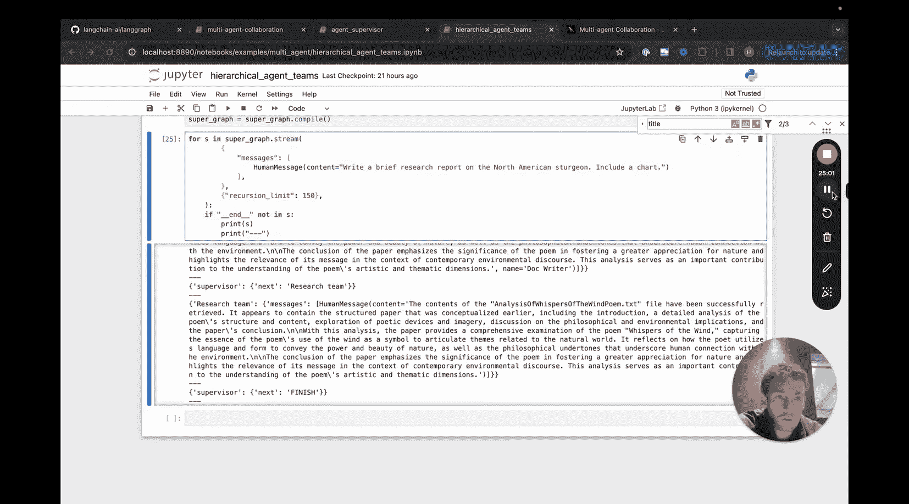

## 总结

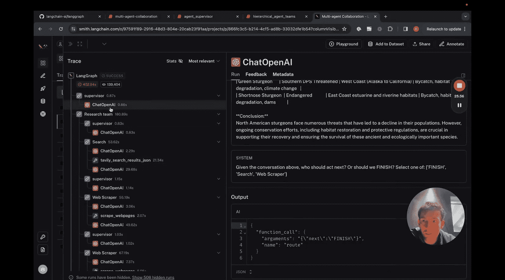

本节课我们一起学习了使用 LangGraph 构建多智能体工作流的三种主要模式：

1.  **多智能体协作**：智能体共享全局状态，高度协同，适合需要紧密配合的任务。
2.  **智能体监督者**：监督者分配任务给独立的子智能体，子智能体的内部过程被封装，提供了清晰的职责分离。
3.  **分层智能体团队**：将复杂的系统分解为多层级的团队，每层都有自己的监督逻辑，适合构建大规模、模块化的智能体应用。

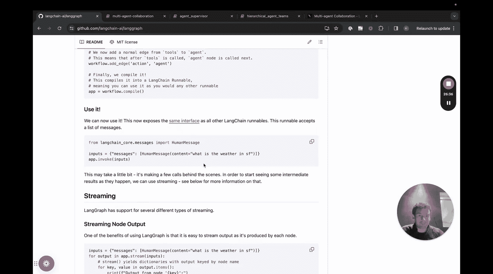

这些模式的核心优势在于它们提供了**结构化的心智模型**，帮助我们将复杂任务分解为专注特定功能的模块。通过 LangGraph 的图抽象和 LangSmith 的调试工具，我们可以有效地设计、实现和监控这些复杂的多智能体系统。