#  010：为 LangGraph 智能体添加持久化状态 🧠

在本节课中，我们将学习如何为 LangGraph 智能体添加持久化功能。持久化允许智能体在多次交互中记住状态，例如对话历史，从而实现连续对话和记忆功能。

## 概述

LangGraph 提供了一个检查点机制，可以在每次执行时保存图的状态。这使得智能体能够从之前中断的地方恢复，并记住所有先前的交互。一个典型的应用场景是为智能体赋予“记忆”能力。

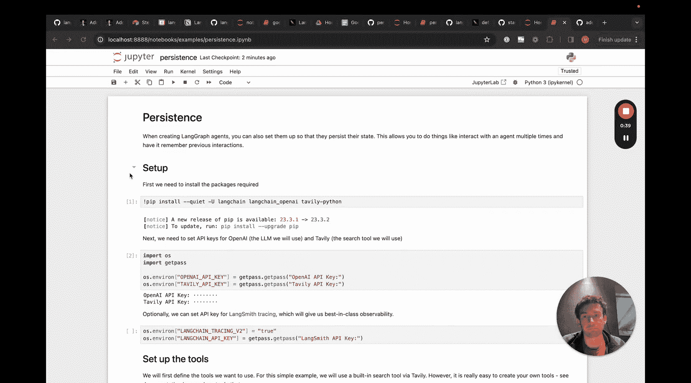

## 创建基础智能体

首先，我们需要创建一个基础的智能体。我们将使用 OpenAI 模型和一个 Tavily 搜索工具来构建一个简单的消息图智能体。

以下是设置环境和创建智能体的核心代码：

```python
# 设置 API 密钥
import os
os.environ["OPENAI_API_KEY"] = "your-openai-key"
os.environ["TAVILY_API_KEY"] = "your-tavily-key"

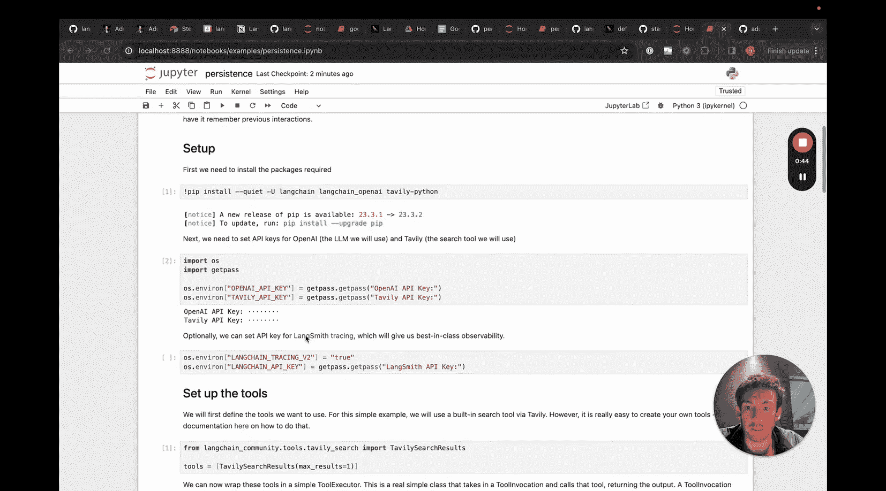

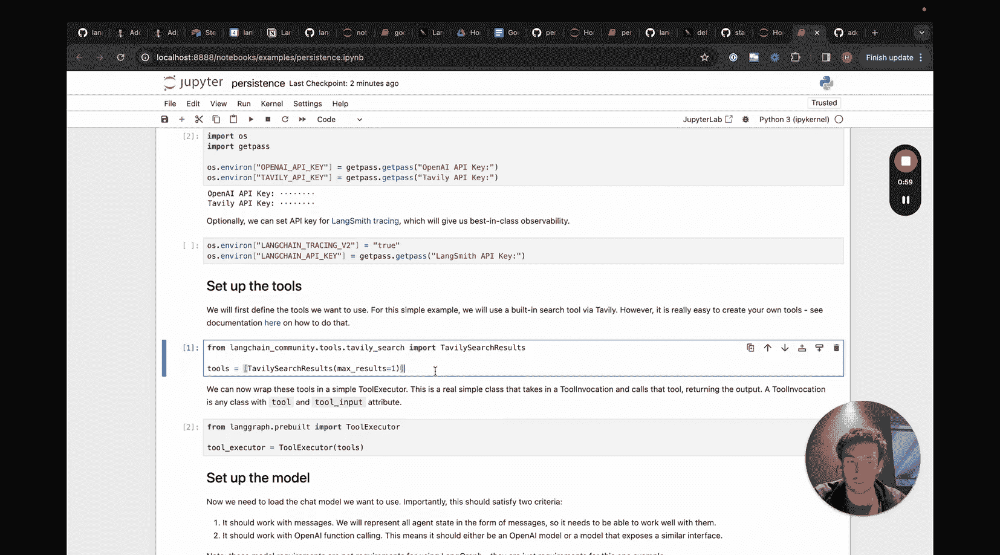

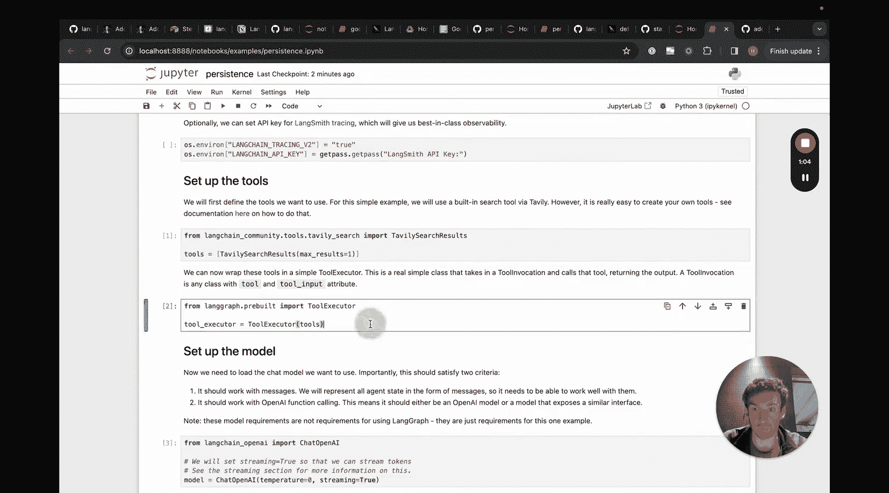

# 创建 Tavily 搜索工具
from langchain_community.tools.tavily_search import TavilySearchResults
search_tool = TavilySearchResults(max_results=2)

# 创建工具执行器
from langgraph.prebuilt import ToolExecutor
tool_executor = ToolExecutor([search_tool])

# 创建模型并绑定工具
from langchain_openai import ChatOpenAI
model = ChatOpenAI(model="gpt-4", temperature=0)
model_with_tools = model.bind_tools([search_tool])
```

## 构建消息图

接下来，我们定义智能体节点和工具调用节点，并将它们连接成一个图。

```python
from langgraph.graph import MessageGraph, END

# 定义智能体节点
def agent_node(state):
    messages = state["messages"]
    response = model_with_tools.invoke(messages)
    return {"messages": [response]}

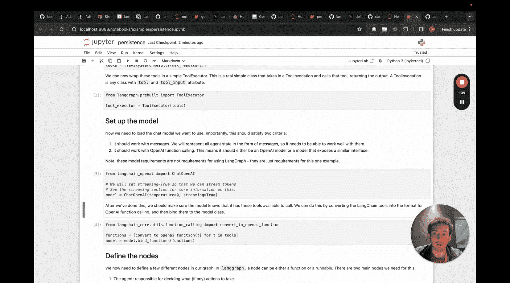

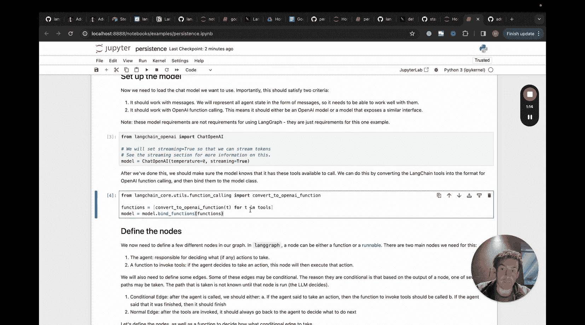

# 定义工具调用节点
def tool_node(state):
    messages = state["messages"]
    last_message = messages[-1]
    tool_calls = last_message.tool_calls
    results = tool_executor.batch(tool_calls)
    response_messages = []
    for result in results:
        response_messages.append(ToolMessage(content=str(result), tool_call_id=tool_calls[0]['id']))
    return {"messages": response_messages}

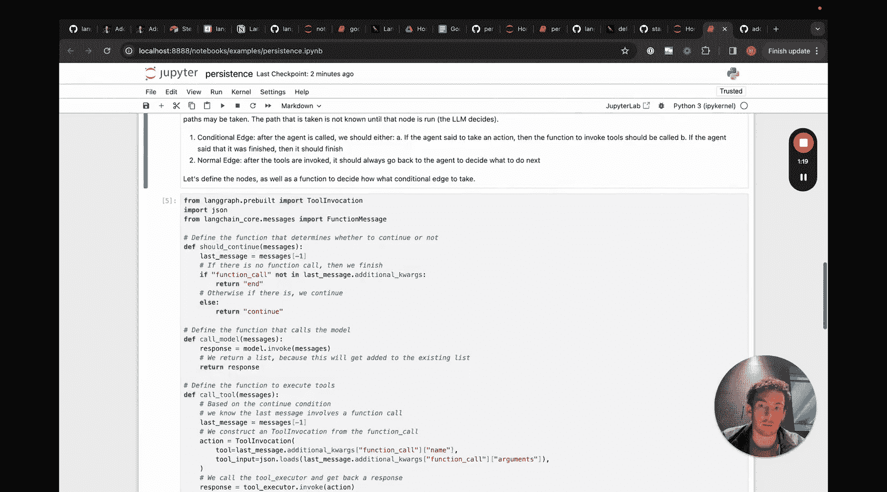

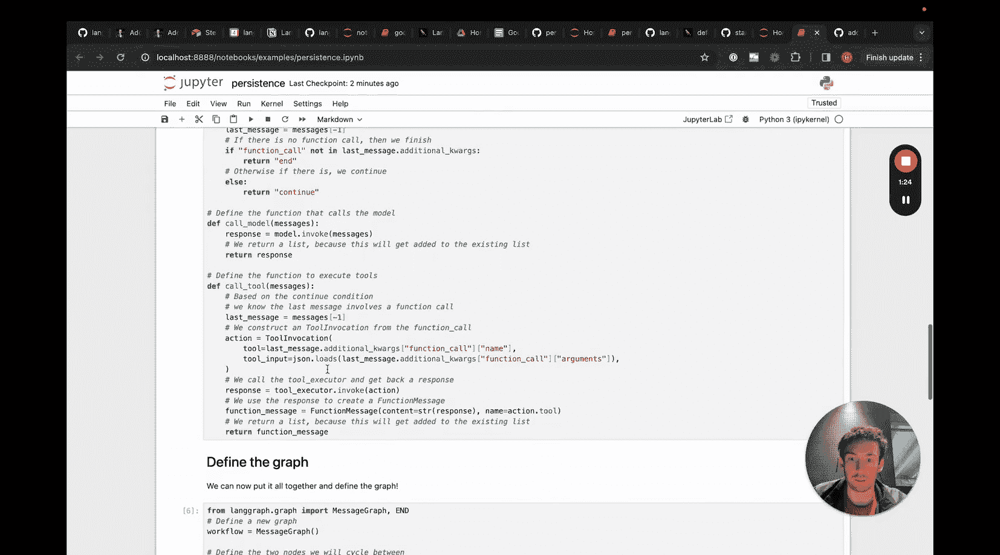

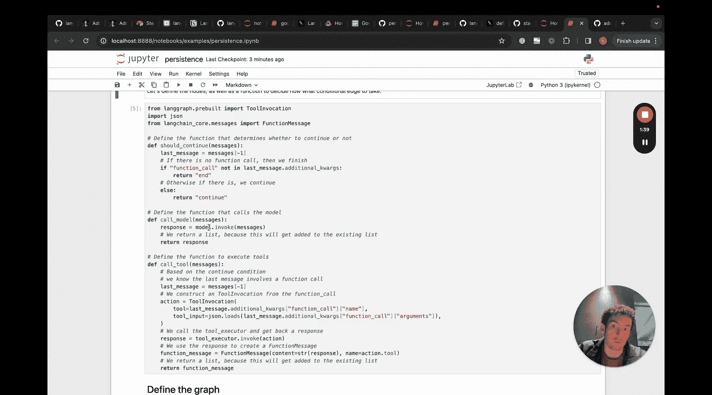

# 定义路由逻辑
def should_continue(state):
    messages = state["messages"]
    last_message = messages[-1]
    if last_message.tool_calls:
        return "tools"
    return END

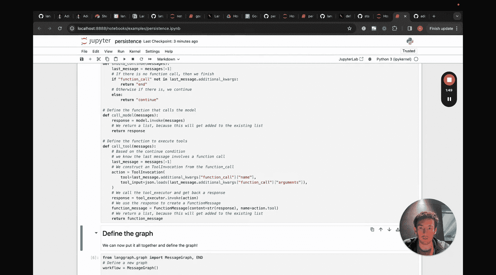

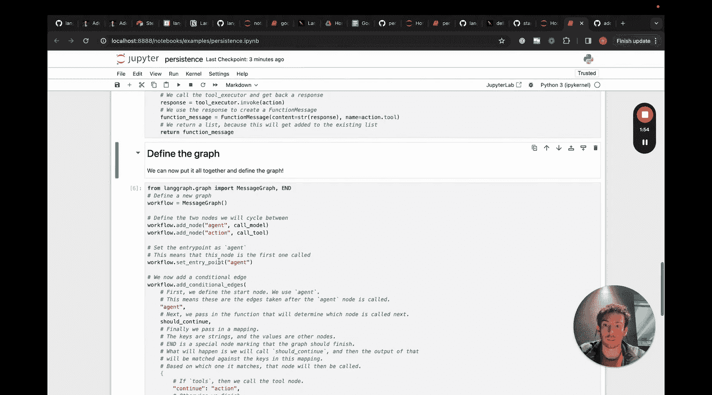

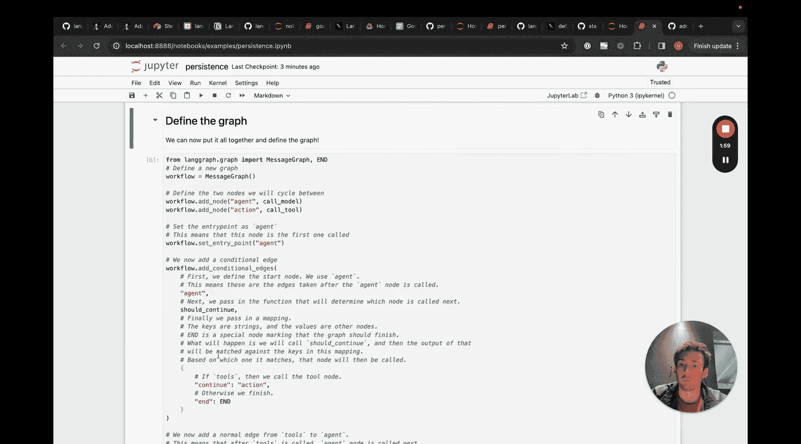

# 构建图
graph = MessageGraph()
graph.add_node("agent", agent_node)
graph.add_node("tools", tool_node)
graph.set_entry_point("agent")
graph.add_conditional_edges("agent", should_continue)
graph.add_edge("tools", "agent")
```

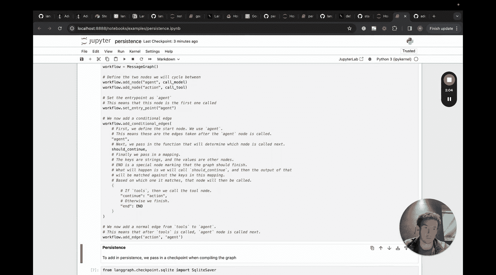

## 添加持久化检查点

这是本节课的核心。我们将通过添加一个 SQLite 检查点器来实现持久化。

```python
from langgraph.checkpoint.sqlite import SqliteSaver

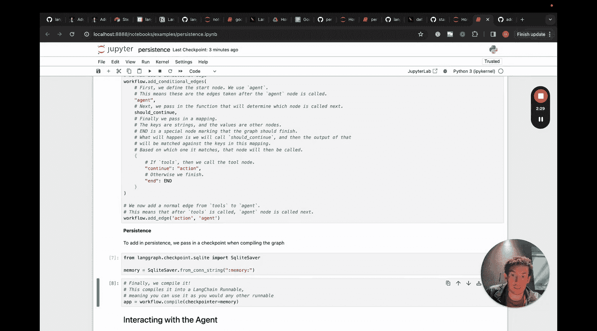

# 创建内存中的 SQLite 检查点器
memory = SqliteSaver.from_conn_string(":memory:")

# 编译图并传入检查点器
app = graph.compile(checkpointer=memory)
```

现在，我们的智能体图具备了状态保存能力。

## 使用持久化智能体

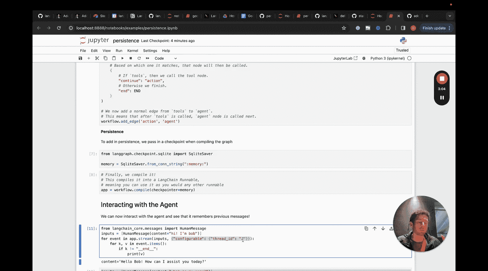

当我们调用智能体时，需要指定一个 `thread_id`。这个 ID 用于标识和检索特定的会话状态。

以下是调用智能体的示例：

```python
# 第一次交互，线程 ID 为 2
config = {"configurable": {"thread_id": "2"}}
inputs = {"messages": [("human", "Hi, I'm Bob.")]}
result = app.invoke(inputs, config=config)
print(result["messages"][-1].content)  # 输出: Hello Bob. How may I assist you?

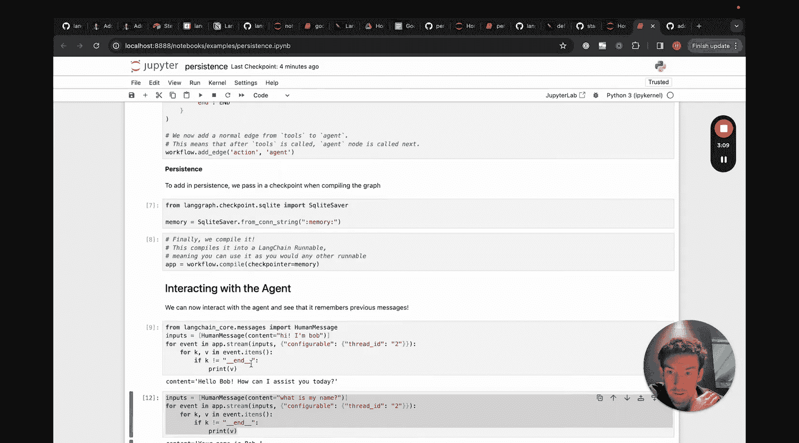

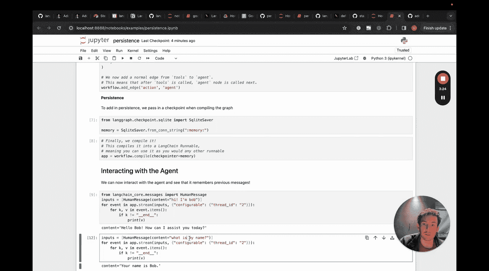

# 第二次交互，使用相同的线程 ID，智能体记得名字
inputs = {"messages": [("human", "What is my name?")]}
result = app.invoke(inputs, config=config)
print(result["messages"][-1].content)  # 输出: Your name is Bob.

# 使用新的线程 ID (3)，智能体没有之前的记忆
new_config = {"configurable": {"thread_id": "3"}}
result = app.invoke(inputs, config=new_config)
print(result["messages"][-1].content)  # 输出: I don't have that information.
```

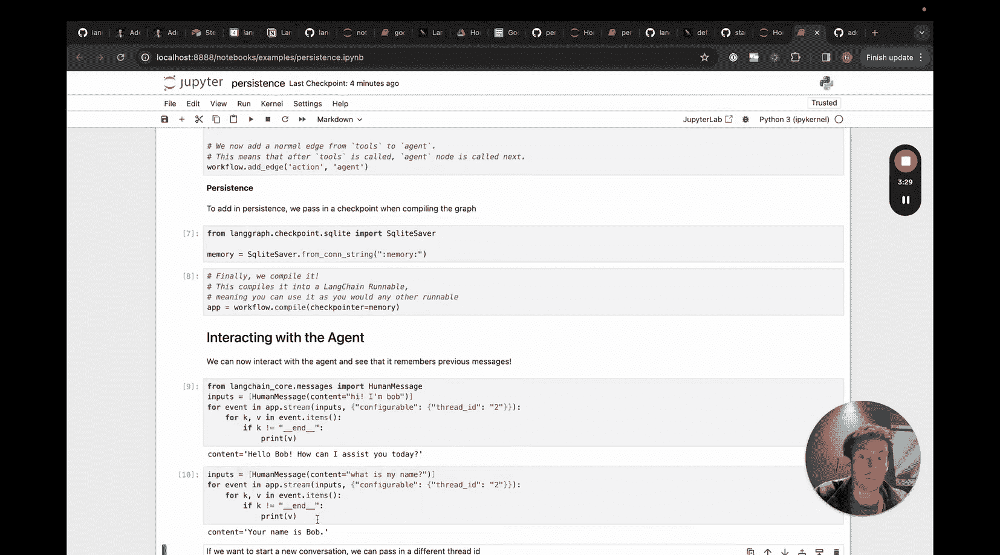

通过使用不同的 `thread_id`，我们可以管理多个独立的会话流。相同的 `thread_id` 可以恢复会话，而新的 `thread_id` 则会开始一个全新的、没有记忆的会话。

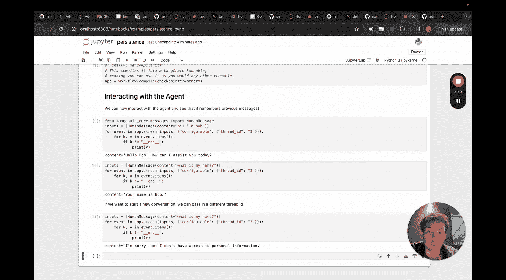

## 总结

本节课中，我们一起学习了如何为 LangGraph 智能体添加持久化状态。

1.  **核心概念**：通过 `SqliteSaver` 检查点器，在每次图执行时自动保存状态。
2.  **关键配置**：使用 `thread_id` 来唯一标识和检索不同的会话流。
3.  **实现效果**：智能体可以记住同一会话（相同 `thread_id`）内的历史信息，实现了基础的记忆功能。

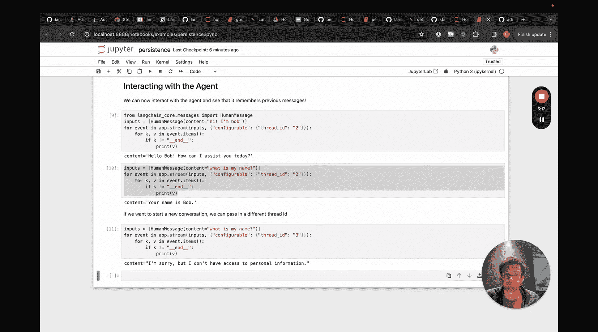

这种方法不仅适用于保存消息列表，也通用适用于 `StateGraph`，可以保存智能体状态的任何其他方面。通过配置 `thread_id`，你可以轻松地从上次离开的地方恢复对话。