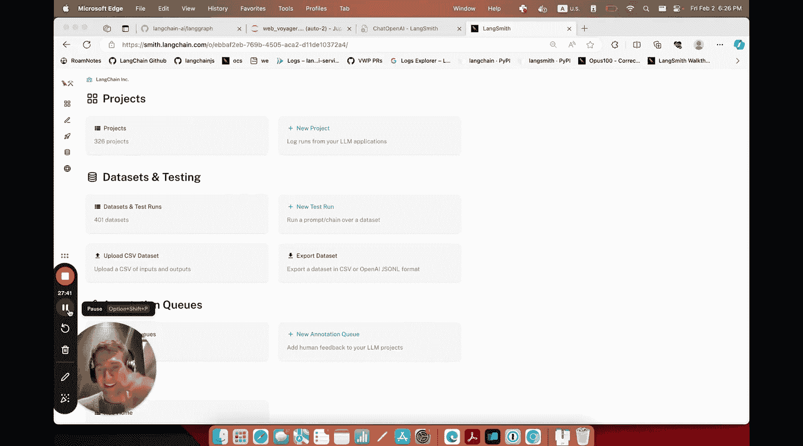

#  011：构建视觉驱动的网页浏览智能体 🚀


在本教程中，我们将学习如何使用 LangGraph 框架，构建一个能够“看见”并自主浏览网页的视觉智能体。这个智能体的设计灵感来源于浙江大学胡一凡等人的 WebVoyager 论文。我们将一步步解析其核心架构，并动手实现一个基础版本。

## 概述

LangGraph 是 LangChain 团队开发的开源框架，它擅长构建具有循环结构的 LLM 工作流，例如智能体。我们将基于 WebVoyager 论文的思路，创建一个结合了视觉感知和网页交互的智能体。其核心是一个“思考-行动”循环：智能体观察网页截图，生成推理链，决定下一步操作，执行工具调用，并根据结果决定继续或结束任务。

## 核心架构与状态定义

上一节我们介绍了智能体的基本概念，本节中我们来看看如何定义其运行状态。在 LangGraph 中，状态是一个有类型的字典，它记录了智能体运行过程中的所有信息。

```python
from typing import TypedDict, List, Annotated
import operator

class AgentState(TypedDict):
    # 网页对象
    page: Any
    # 用户输入的问题
    input: str
    # 带标注框的网页截图
    image: str
    # 标注框列表
    bounding_boxes: List
    # LLM 的预测输出（思考与行动）
    prediction: str
    # 工具执行后的观察结果
    observation: str
    # 历史消息记录
    messages: Annotated[List, operator.add]
```

## 构建交互工具

定义了状态之后，我们需要为智能体提供与外界（浏览器）交互的工具。这些工具是连接 LLM 决策和实际网页操作的 API。

以下是智能体可用的核心工具列表：

*   **点击**：接收标注框编号，在对应坐标执行点击。
*   **输入文本**：接收标注框编号和文本内容，在对应输入框键入文字。
*   **滚动**：控制页面上下滚动以浏览更多内容。
*   **等待**：让页面加载或等待动态内容。
*   **返回上一页**：在浏览历史中后退。
*   **跳转到谷歌**：提供一个重置或重新搜索的快捷方式。

每个工具函数都接收 `AgentState` 作为输入，从中提取必要信息（如页面对象、LLM 传入的参数）来执行操作，并更新状态。

## 智能体核心：标注、提示与解析

现在，我们来组装智能体的“大脑”部分。这部分负责将视觉信息转化为 LLM 能理解的指令，并解析 LLM 的回复。

1.  **标注函数**：此函数对浏览器页面进行截图，并使用边界框标注页面上的可交互元素（如按钮、链接、输入框）。标注后的图像会提供给 LLM，帮助它“看见”并精确定位元素。
2.  **提示工程**：我们设计一个系统提示词，指导 LLM 如何根据看到的图像、历史轨迹和当前目标进行思考并选择行动。提示词存储在 LangSmith 上以便管理和迭代。
3.  **输出解析**：LLM 会生成包含 `Action: [动作]; [参数]` 格式的文本。我们需要一个解析函数来提取动作类型和参数，以便调用正确的工具。

我们将提示词、LLM 模型和解析函数组合成一个可运行单元：

```python
# 伪代码示例：组合智能体
prompt = ChatPromptTemplate.from_messages([...])
llm = ChatOpenAI(model="gpt-4-vision-preview")
agent = prompt | llm | output_parser_function
```

## 组装 LangGraph 工作流

有了状态、工具和智能体核心，我们现在可以将它们组合成一个完整的、可循环运行的工作流图。

首先，我们需要一个 `update_scratchpad` 函数，它在每次循环后运行，负责整理工具执行的观察结果，并将其格式化为历史消息，供下一轮思考使用。

接下来，我们按步骤构建图：

1.  **创建图构建器**：`builder = StateGraph(AgentState)`。
2.  **添加节点**：
    *   `agent` 节点：运行智能体核心，产生思考和行动决策。
    *   `update_scratchpad` 节点：更新历史记录。
    *   各个工具节点（如 `click`, `type`）。
3.  **定义边（路由逻辑）**：
    *   设置 `agent` 为入口点。
    *   从 `agent` 节点出发，根据其输出的 `action` 值，通过**条件边**决定下一步：
        *   如果 `action == “answer”`，则结束，返回结果给用户。
        *   如果 `action == “retry”`，则返回 `agent` 节点重试。
        *   否则，路由到对应的工具节点（如 `click`）。
    *   工具节点执行完毕后，总是路由到 `update_scratchpad` 节点。
    *   `update_scratchpad` 节点完成后，路由回 `agent` 节点，开始新一轮循环。

最后，编译图：`graph = builder.compile()`。

## 运行与调试示例

现在，让我们运行这个智能体，并尝试几个任务来观察其表现。我们将使用 Playwright 来控制浏览器。

**任务示例 1：解释 WebVoyager 论文**
*   **过程**：智能体打开谷歌，搜索“WebVoyager paper archive”，点击搜索结果链接，阅读页面内容。
*   **结果**：成功找到并总结了论文的核心内容。

**任务示例 2：解释今日 XKCD 漫画**
*   **过程**：智能体搜索“today’s XKCD comic”，导航到官网，查看漫画并阅读文字。
*   **结果**：成功描述了漫画场景并解释了其幽默之处。

**任务示例 3：查找 LangChain 最新博客**
*   **过程**：智能体搜索“LangChain blog”，进入网站，浏览文章标题。
*   **结果**：成功找到了关于 LangGraph 和多智能体工作流的最新博文。

**更具挑战的任务：航班查询与地图导航**
当我们尝试更复杂的任务，如“查询纽约到雷克雅未克的单程航班价格”或“规划从旧金山市中心到 SFO 机场的路线”时，智能体可能会遇到困难。它可能因为步骤超限、界面复杂（如 Google Maps）或标注框不准确而无法完成目标。

这时，**LangSmith** 的追踪和调试功能就至关重要。你可以：
*   查看完整的执行轨迹，精确到每一步的输入和输出。
*   检查每次 LLM 调用时看到的图像和提示词。
*   在 LangSmith 的 Playground 中直接修改提示词并重新测试，无需改动代码。
*   通过分析轨迹，定位问题是出在工具、标注还是提示词上，从而进行针对性优化。

## 总结与后续步骤

本节课中，我们一起学习了如何使用 LangGraph 构建一个视觉网页浏览智能体。我们涵盖了从定义状态、创建工具、组装智能体核心到构建完整循环工作流的全过程。虽然当前实现的基础版本能完成一些简单任务，但面对复杂场景时仍有很大优化空间。

要改进智能体，你可以考虑：
1.  **增加更多工具**：如下拉选择、鼠标悬停等。
2.  **优化提示词**：提供更明确的指令和示例。
3.  **改进视觉标注**：提高边界框的准确性和覆盖范围。
4.  **利用 LangSmith**：持续追踪、调试和迭代你的智能体。



你可以访问 [LangGraph 代码库](https://github.com/langchain-ai/langgraph) 查看本教程的完整示例代码，并注册 [LangSmith](https://smith.langchain.com) 来获得强大的开发与监控能力。希望本教程能帮助你开启构建强大 AI 智能体的大门！