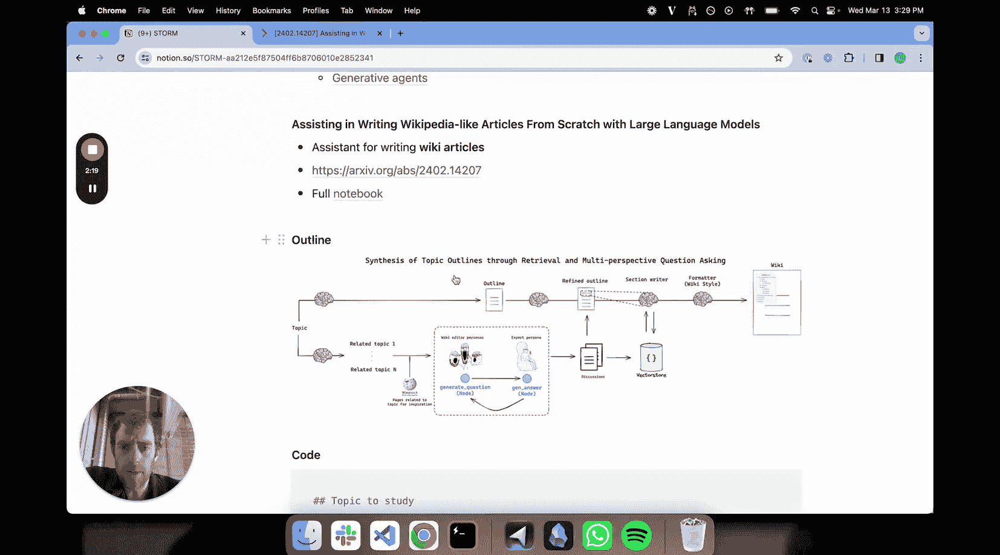
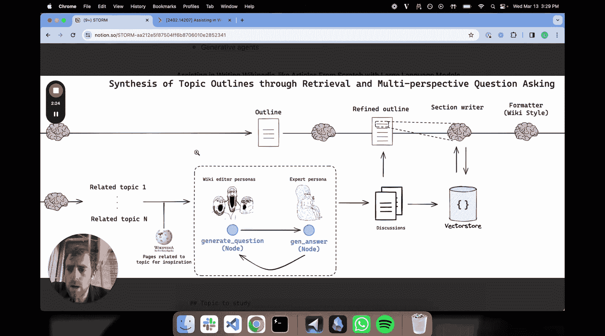
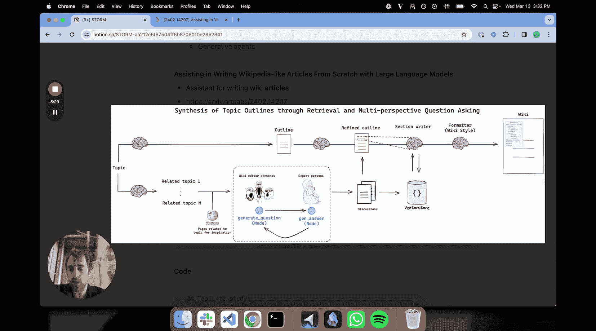
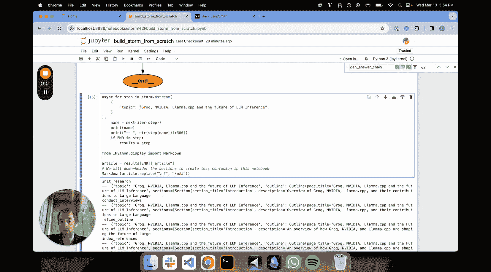

# 015：使用 LangGraph 从零构建 STORM 系统 🚀

## 概述
在本节课中，我们将学习如何利用 LangGraph 框架，从零开始构建一个名为 STORM 的系统。STORM 是一个结合了 AI 媒体助手、检索增强生成和智能体角色扮演三大主题的系统，旨在自动生成高质量的维基百科风格文章。我们将一步步解析其核心流程，并用代码实现关键组件。

## 章节 1：STORM 系统核心思想与流程 📝

上一节我们介绍了本课程的目标，本节中我们来看看 STORM 系统的设计理念和整体工作流程。

STORM 系统融合了三个关键思想：
1.  **特定任务的 AI 助手**：例如代码生成或网络研究助手。
2.  **检索增强生成**：利用外部知识检索来辅助内容生成。
3.  **角色扮演**：让 AI 扮演不同角色（如编辑、专家）进行协作或辩论，以深化对主题的理解。





STORM 的全称是“通过检索和多视角问答进行主题大纲合成”。其核心目标是自动撰写维基百科式的文章。

以下是系统的主要工作流程图解：


整个流程可以概括为以下几个阶段：
1.  **主题扩展与编辑角色创建**：输入一个核心主题，系统会将其扩展为多个相关子主题，并为每个子主题检索相关的维基百科文章作为参考，进而创建出具有不同视角的“维基百科编辑”角色。
2.  **专家模块构建**：创建一个“专家”模块，其核心能力是利用网络搜索等工具来回答问题。
3.  **编辑与专家辩论循环**：让编辑角色和专家角色就相关主题进行多轮问答式“辩论”。这个过程由 LangGraph 协调，并积累详细的讨论内容。
4.  **大纲生成与精炼**：在另一条并行路径上，系统会根据核心主题生成一个初步的文章大纲，然后利用上述辩论产生的讨论内容来精炼这个大纲。
5.  **内容撰写与格式化**：将辩论内容存入向量数据库以便检索。一个“章节撰写器”会依据精炼后的大纲，检索向量库中的详细讨论，逐节撰写文章内容。最后，一个格式化模块将内容整理成标准的维基百科格式。

## 章节 2：初始化环境与主题扩展 🌱

上一节我们介绍了 STORM 的整体流程，本节中我们开始动手编码，首先进行环境准备和主题扩展。

我们首先定义核心主题，并实现流程中的第一步：主题扩展。

```python
# 定义核心主题
topic = "What is the impact of million-plus token LLMs on RAG?"
```

接下来，我们运行主题扩展代码。这部分代码会调用大语言模型，基于核心主题推荐相关的子主题。



```python
# 主题扩展链的Prompt示例
prompt_template = """
你正在撰写一篇关于“{topic}”的维基百科文章。
请推荐一些相关的子主题或页面。
"""
```

运行后，我们可能得到如下相关的子主题：
*   Impact of million-plus token LLMs in RAG
*   Long-context language models
*   Retrieval-Augmented Generation frameworks

## 章节 3：创建维基百科编辑角色 👥

上一节我们生成了相关子主题，本节中我们利用这些子主题来创建具有不同视角的编辑角色。

以下是创建编辑角色的关键步骤：

首先，为每个子主题检索现有的维基百科文章作为参考模板。

然后，基于这些参考文章和子主题，生成不同的“编辑”角色。每个角色都被赋予特定的背景、专长和视角。

我们使用 Pydantic 模型来结构化地定义编辑角色：

```python
from pydantic import BaseModel, Field
from typing import List

class Editor(BaseModel):
    """定义编辑角色的数据结构"""
    name: str = Field(description="编辑的名称")
    affiliation: str = Field(description="编辑的所属机构或领域")
    description: str = Field(description="编辑的背景、专长和视角描述")
    focus: str = Field(description="编辑关注的具体子主题")

class Perspectives(BaseModel):
    """包含多个编辑角色的列表"""
    editors: List[Editor]
```

通过调用大语言模型并绑定上述结构化输出，我们生成了一组编辑角色。例如：
*   **Dr. Researcher**：专注于分析长上下文窗口对 RAG 检索精度的影响。
*   **Technical Architect**：关注于如何将超长上下文模型集成到现有 RAG 系统架构中。

## 章节 4：构建专家问答模块 🔍

上一节我们创建了负责提问的编辑角色，本节中我们来构建负责回答的专家模块。

专家模块的核心功能是：接收编辑提出的问题，利用网络搜索获取信息，并生成详实、有引用的回答。

专家的工作流程分为两步：
1.  **问题分解**：将编辑提出的复杂问题分解成几个更具体的子问题。
2.  **搜索与整合**：对每个子问题进行网络搜索，汇总搜索结果并生成最终答案。

以下是专家生成答案的核心函数框架：

```python
async def generate_answer(state: dict):
    """
    专家生成答案的函数
    state: 包含当前对话状态（如编辑提出的问题）
    """
    # 1. 从状态中提取问题
    question = state.get("current_question")
    # 2. 将问题分解为子问题
    sub_questions = break_down_question(question)
    # 3. 并行搜索每个子问题
    search_results = await search_web(sub_questions)
    # 4. 整合信息，生成带引用的最终答案
    final_answer = synthesize_answer(question, search_results)
    return {"answer": final_answer, "citations": search_results.urls}
```

专家使用的 Prompt 示例：
```
你是一位主题专家。你擅长利用网络信息高效回答问题。
一位维基百科编辑正在撰写关于“{topic}”的文章，他向你提问：{question}
请基于可靠的网络搜索信息，提供详细、准确的回答，并注明引用来源。
```

## 章节 5：使用 LangGraph 协调辩论循环 🔄

上一节我们分别构建了编辑和专家模块，本节中我们使用 LangGraph 将它们连接起来，形成一个自动化的多轮问答（辩论）循环。

LangGraph 允许我们以图的形式定义工作流。在这个场景中，图包含两个主要节点和条件边：

1.  **“提问”节点**：由编辑角色调用，根据当前讨论状态提出一个新问题。
2.  **“回答”节点**：由专家模块调用，回答编辑提出的问题。

两个节点之间通过条件路由连接，决定对话是继续还是终止。

```python
from langgraph.graph import StateGraph, END

# 定义图的工作流
workflow = StateGraph(AgentState)

# 添加节点
workflow.add_node("ask_question", ask_question_function)
workflow.add_node("answer_question", answer_question_function)

# 设置入口点
workflow.set_entry_point("ask_question")

# 添加条件边
def route_messages(state: AgentState):
    """
    根据当前状态决定下一步是继续提问还是结束。
    结束条件：
    1. 编辑说“感谢帮助，没有问题要问了”。
    2. 达到最大对话轮数（例如5轮）。
    """
    if state.get("conversation_end_signal") or len(state["turns"]) >= 5:
        return END
    else:
        return "answer_question"

workflow.add_conditional_edges(
    "ask_question",
    route_messages
)
workflow.add_edge("answer_question", "ask_question")

# 编译图
app = workflow.compile()
```

运行这个图，编辑和专家就会自动进行多轮问答。所有对话历史都会被完整记录。

## 章节 6：生成、精炼文章大纲与撰写内容 ✍️

上一节我们通过辩论循环生成了丰富的讨论内容，本节中我们利用这些内容来生成最终的文章。

此阶段包含三个步骤：

**1. 生成初步大纲**
基于原始主题，让大语言模型直接生成一个文章大纲。

**2. 基于讨论精炼大纲**
将上一步的初步大纲和辩论循环中产生的详细讨论一起输入给模型，让它输出一个更完善、更深入的大纲。

```python
refined_outline_chain = refine_prompt | llm
# refine_prompt 示例：你已从专家讨论中收集信息，请据此精炼你的文章大纲。
```

**3. 撰写章节内容**
这是最后一步。我们创建一个“章节撰写器”，它有两个输入：
*   **精炼后的大纲**：告诉它要写哪些章节。
*   **向量数据库**：其中存储了之前所有的编辑-专家辩论内容。

撰写器为大纲中的每个章节执行以下操作：
1.  从向量数据库中检索与该章节最相关的讨论片段。
2.  基于这些检索到的细节内容，撰写该章节的完整文本。

```python
for section in refined_outline:
    # 检索相关讨论
    relevant_discussions = vector_store.retrieve(section.title)
    # 撰写该章节
    section_content = write_section(section, relevant_discussions)
```

所有章节撰写完毕后，再通过一个简单的格式化模块，将其组合成符合维基百科风格的最终文章。

## 章节 7：端到端运行与效果评估 🎯

上一节我们完成了所有组件的构建，本节中我们将整个流程串联起来，进行端到端的运行测试，并查看生成结果。

我们定义一个新的主题来测试整个系统：“Groq 和 NVIDIA 的 LPU 在 AI 推理领域的未来”。

将主题输入给编译好的 LangGraph 应用，系统开始自动执行：
1.  扩展主题，创建编辑和专家。
2.  启动多轮问答辩论循环。
3.  生成并精炼大纲。
4.  检索讨论内容，撰写文章章节。

通过 LangSmith 等工具，我们可以实时观察每个步骤的调用详情，例如专家进行了哪些搜索，编辑和专家之间具体的对话内容是什么。

最终，系统在几分钟内生成了一篇结构完整、内容详实的文章，包含引言、对 Groq LPU 和 NVIDIA 技术的介绍、性能基准、对 AI 模型的影响以及未来方向等章节，并且文末附有引用来源。



## 总结
本节课中我们一起学习了如何使用 LangGraph 从零构建 STORM 系统。我们深入探讨了如何将**主题扩展**、**角色扮演**（编辑与专家）和**检索增强生成**相结合，通过一个由 LangGraph 管理的**多轮辩论循环**来深化对主题的理解，并最终利用这些讨论内容自动生成结构严谨、信息丰富的维基百科风格文章。这个项目展示了智能体协作和复杂工作流编排的强大能力，是构建高级 AI 助手的优秀范例。