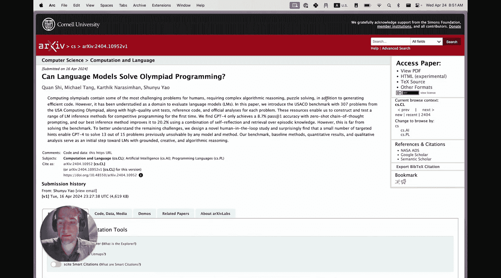
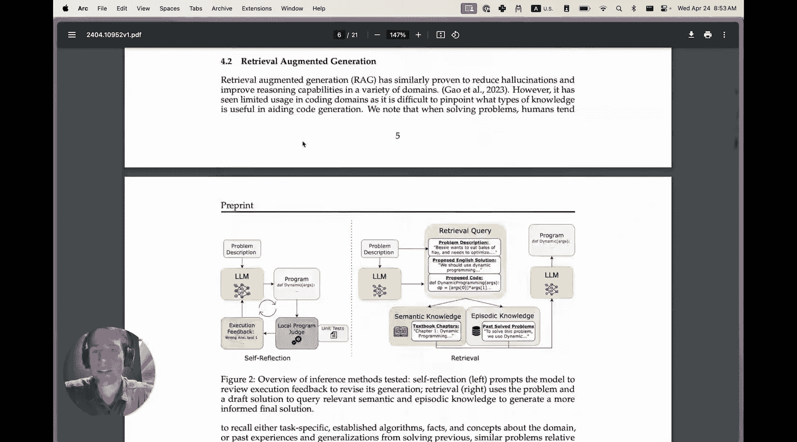
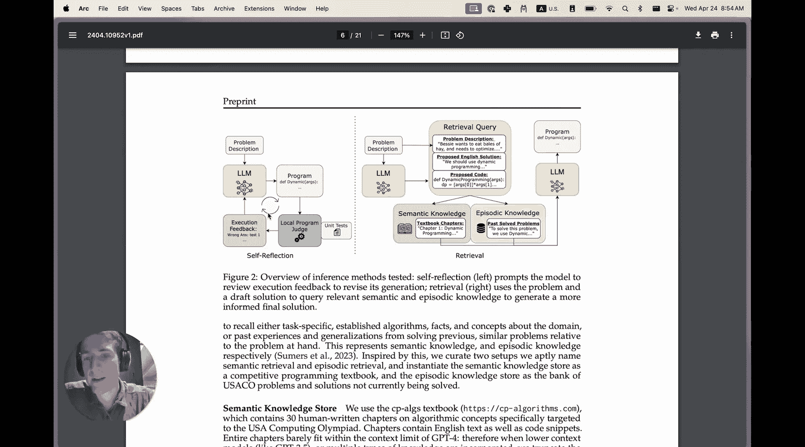
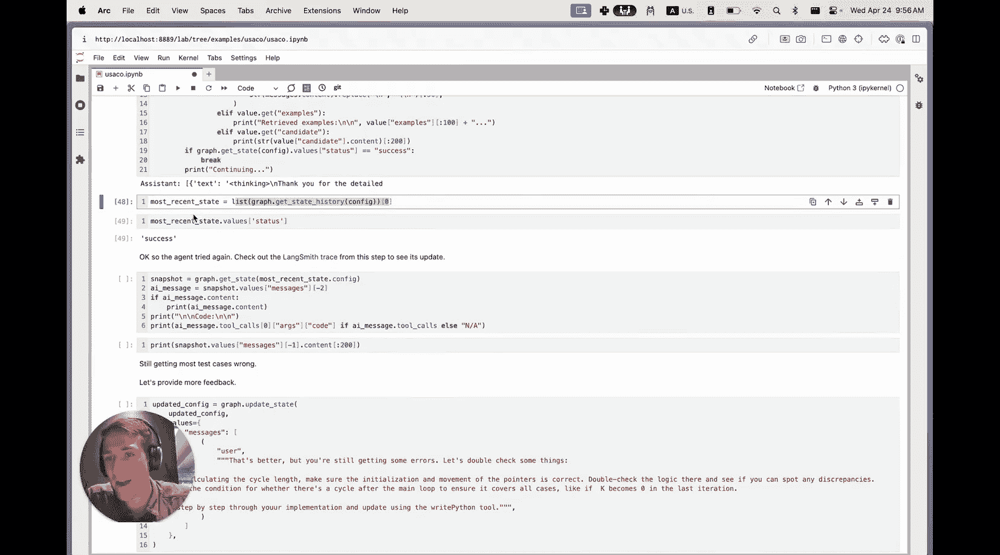
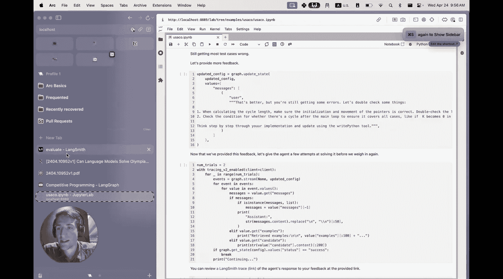
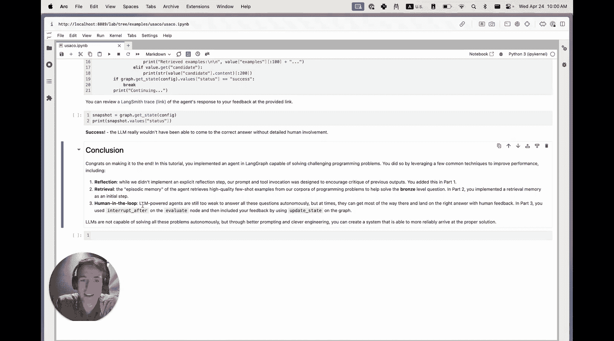

# 016：使用LangGraph构建计算奥林匹克竞赛智能体

在本教程中，我们将学习如何使用LangGraph框架，构建一个能够解决美国计算机奥林匹克竞赛（USACO）级别编程问题的智能体。我们将跟随一篇来自普林斯顿大学的研究论文的思路，逐步实现一个从基础到高级的智能体系统。

大约一周前，普林斯顿大学的一个团队发表了一篇名为《语言模型能解决奥林匹克编程问题吗？》的论文。该论文由Chen S和Shinny Ya等人完成，他们也曾参与著名的“ReAct”和“思维链”论文的研究。

这篇论文包含两个有趣的部分。一方面，它是一个数据集论文。他们发布了一个包含307道来自USACO竞赛编程问题的挑战性基准测试集。他们展示了GPT-4在使用简单的零样本ReAct智能体框架尝试解决这些问题时，仅有约8.7%的通过率。这与一些现有的基准测试（如HumanEval、MMLU）形成了对比，后者大多已被当前这批语言模型所饱和。

另一方面，论文展示了一些推理过程的优化方法，主要是提示工程或系统工程类型的方法，将平均性能从8.7%提升到了20.2%。在本教程中，我们将更详细地探讨这些技术。

让我们感受一下这个基准测试中问题的难度。以下是一个示例问题。可以看到，它们大多是文字问题，要求你识别需要解决的底层数学问题，使用高级数据结构和算法，并以创造性的方式组合它们来得出正确的解决方案。同时，解决方案必须以在给定时间限制内完成并实现的方式呈现。

从图中可以看出，其中涉及大量集合和其他类型数据结构的使用。这些问题具有挑战性，被称为“奥林匹克”级别是有原因的。

这个基准测试的有趣之处在于，它真正将大语言模型推向了极限，从而可以看到它们在哪里会失效。我认为，当我们在日常生活中使用它们时，常常会将其拟人化，认为它们在推理。但当你接触到这种程度的问题时，你会发现它们开始做出一些看似接近正确、但缺乏逻辑属性的行为。如前所述，当他们首次在GPT-4上运行这些问题时，通过率非常低。

随后，他们展示了许多可以改进的推理技术。其中一些包括自我反思。

另一些则涉及检索，无论是语义知识还是情景知识。他们做了大量实验，以展示哪些类型的检索能真正提高模型的性能。我们将实现性能最好的检索类型，即情景知识类型。因为它似乎与自我反思非常互补，并且很适合我们的教程结构。让我们查看LangGraph文档，了解如何在教程中实现这一点。

在视频的剩余部分，我们将创建一个智能体来解决这类竞赛编程问题。我们将按照论文的结构，将其分解为三个部分，构建能力逐步增强的智能体，以解决这些高级问题。

第一步，我们将实现Reflexion智能体，这是一个进行自我反思的零样本智能体。这对应于我们即将创建的图中的这个模块。它将有两个简单的节点，并循环运行，直到正确解决问题或超时。这大致类似于他们创建的Reflexion智能体，其通过率约为12.38%，同样优于基础的零样本智能体，但不及他们能达到的整体水平。

在本教程的第二部分，我们将实现检索作为一种情景记忆形式，论文称之为“情景记忆”。这是这里的第二部分，我们将检索一些高质量示例包含在提示词中，以期在模型中诱导出更好的逻辑性能。这对应于图中这个部分，在基准测试中整体通过率约为22.2%。

在第三部分，我们将添加人工中断，允许我们作为用户实际参与答案的生成，并帮助引导智能体得出正确答案。你可能认为这是作弊，事实上，我们不会在整个数据集上对此进行基准测试，作者也没有这样做。但在许多应用设计中，你真正想要的是最佳的整体结果。因此，人机协同的设置是一种非常实用的方法，可以在单独的人类或智能体都无法达到的情况下，获得更好的整体结果。

贯穿始终的一个主题是，自主智能体目前还不太成熟，尤其是在使用简单的零样本提示方法时。但是，你可以使用像LangGraph这样的框架来创建状态机，从而在你的任务领域内真正控制和引导它，以期获得更好的整体结果。

让我们下载这个笔记本，然后一起运行它。现在，我们准备开始运行教程。我们已经在Jupyter中打开了它，并在这里安装一些先决条件。主要是LangGraph。我们将使用LangSmith添加一些追踪功能。在我们的案例中，智能体将由Anthropic的Claude模型驱动。我们还需要一些其他东西来从Hub拉取内容。我们将设置环境变量，在我们的案例中是Anthropic的API密钥，用于连接他们的API。然后我们还将配置追踪。这里有很多步骤，每个程序可能相当长，因此在笔记本中可视化可能会很杂乱。我建议使用LangSmith，这样你可以调试每个步骤，确切地看到发生了什么，更容易发现错误，更容易了解情况。

然后，我们将获取存储在Google Cloud存储桶中的数据，并将其加载到内存中。最后，这里的实用程序是运行测试用例。需要注意的是，这是在本地执行代码。因此请谨慎操作，如果LLM生成了恶意代码或类似的东西，存在固有风险。

这里有一个测试用例运行器的示例运行，打印“hello world”，如果通过，则返回“pass”；如果不通过，则返回“wrong answer”以及预期输出。现在，我终于可以开始定义图了。在第一部分，我们将再次实现这个带有反思的简单零样本智能体。

在论文中，他们使用了明确的Reflexion提示。我们稍作调整，然后在这里提示我们的智能体在调用工具时对其输出进行反思。这个智能体将相对基础。它对应于在基准测试中获得约12%通过率的智能体。因此，对于我们的第一个问题，我们预计它不会通过，但这没关系。我们还有其他技巧。

接下来的部分，如果你已经构建过LangGraph，可能会觉得是复习，但我想无论如何还是回顾一下，因为我认为这很重要。LangGraph中的主要原语是状态图。它是你定义状态机的方式。基本上，节点定义了工作单元，边定义了控制流。一旦一个节点完成，边就定义了接下来要传递到哪个节点以继续操作。在最简单的情况下，你基本上有两个节点，在我们的案例中，它会循环返回，然后在达到某个结束状态时输出。

最后非常重要的一部分是状态。当然，这定义了所有节点的接口。因此，每个节点接收状态作为输入，然后返回对状态的更新，这可以是整个状态本身，也可以是某个子集，然后图能够将其合并到先前的状态中。

在我们的案例中，这个状态的主要方面将是这个消息列表，我们使用Python的注解语法，通过这个函数将其注解为仅追加。这基本上保持了智能体的草稿本，因为它生成候选答案，然后接收工具响应，然后继续迭代并尝试改进。

状态的其余部分主要保存测试用例和运行时限制，以配置评估节点的运行方式。智能体本身将忽略这些，但测试运行器会使用它们。

现在我们已经定义了状态。我们将更新数据为正确的格式，以便能够传入。我们可以开始定义核心部分了。记住，这有两个节点：求解节点和评估节点。首先是求解器。

这里很简单。我们基本上是获取一个提示词，然后将其与LLM组合。所以这里是将提示词格式化，然后传递给LLM。这个`bind_tools`操作只是为LLM配置一个模式，以便它知道应该以什么结构进行响应。在我们的案例中，我们将使用这个`write_python`工具。它的`write_python`模式，我们基本上会告诉它先进行一些推理和伪代码，以诱导出链式思维推理，然后最终将所有python3代码写入这里的`code`字符串中。这使得在后续解析时容易得多，因为你不需要解析原始字符串。

我将在这里运行它，然后定义一个求解器。我们从Hub拉取这个求解器提示词。它很简单，我在这里没有做太多提示工程。注意，我们有一个变量`examples`，稍后将在第二部分使用。现在，我们只是用一个空字符串来填充它。这将是一个占位符，稍后我们用检索到的附加信息来填充。但更多内容稍后再说。

这里有一个示例运行。我们可以问它：“如何从无限流中获取完全随机的样本？”我们已经得到了响应，你可以看到它生成了这个`<thinking>`标签，然后最终输出推理过程，你可能会看到伪代码，然后是最终的代码，它确实如我们所料在进行蓄水池抽样。所以至少它学习过一些代码，这是一个好的初步迹象。

我喜欢Claude相对于GPT-4的一点是，它被训练为在真正执行工具调用之前输出这种“思考”或前导文本。我认为，当使用GPT-4进行工具调用时，经常会出现如何整合链式思维的问题，我们发现，由于这个原因，它在处理一些更复杂的任务时有时会表现不佳。我认为，模型被训练为在工具调用之前输出这些内容是非常好的，这样你就不必在思考上做出牺牲。

因此，我们将在这个循环（智能体循环）中定义的第二个节点是评估节点。这里有很多错误处理等内容，但真正的关键部分是，我们将遍历状态中的所有测试用例。再次回忆，每个节点将接收状态的一个实例并返回输出，在这个案例中，是一个更新的消息。但它会遍历测试用例并运行它们。然后，如果成功，它将更新我们状态中的状态；否则，它将分别格式化所有这些内容，然后添加消息。

一旦你到了那里，你就可以创建图了。我们将可视化它。所以，这再次对应于我们上面的那个图。它更简单一些。我们把初始问题放在这里，尝试生成一个解决方案。它进行测试。然后我们进入这个控制边。如果成功，我们就结束；否则，我们回到求解器并继续循环。这里是控制边。

你可以看到，它也接收状态，然后检查状态以查看是否成功。然后它返回。这是一个字符串，带有双下划线。这只是告诉图它不需要继续循环。否则，它说回到求解器节点。这就是我们在这里定义条件边的方式。

让我们看看第一个问题。关于农夫约翰的问题。看看，你知道，前几天有一些生产力。贝西，你有一头牛。她相当复杂。它给出了样本输入和输出的数量，作为问题的一部分。

让我们尝试在这里运行我们的智能体。再次强调，这是我们今天将要构建的智能体中最简单的版本。我完全预计它不会成功。老实说，LangGraph通常通过图递归错误来指示这一点。基本上，默认情况下，图有有限的步骤数。你可以配置这个，我们在文档的其他地方展示了这一点。这里不详细说明。但如果超过了配置的最大步骤数，它将引发递归错误。让我们等待这个继续填充。

看起来，正如我们所说，它将达到递归限制。它实际上无法解决问题。你可以在下面看到每个步骤，我们实际上会跳转到LangSmith查看一下轨迹。

我们已经查看了这里的轨迹，你可以看到它按照我们定义的方式循环，有提示词和LLM，然后有评估，它在这个循环中继续，直到最终出现错误。我总是喜欢跳到一个较晚的LLM调用中，因为它收集了完整的消息历史，你可以确切地看到它在做什么。所以最初它说“解决这个问题”，关键洞察在这里，尝试写出伪代码，然后思考，然后在那里生成所有内容。第二次是“当前解决方案在较大的测试用例中超时，可能是因为它遍历了所有可能的情况”。所以它实际上是在尝试自我纠正，但未能成功。我猜，它的记忆中没有很多解决这类问题的好例子。所以你可以看到，它经历了很多事情。因此，它无法得到正确答案。

没关系，论文至少提出了一个我们可以纳入的自动改进方法，然后还提出了更像人机协同场景的想法，我们将在第三部分讨论。但在第二部分，让我们深入探讨记忆和检索优化。

回到笔记本的第二部分，我们将实现论文提出的这种少样本检索优化。作者称之为“情景记忆”，因为它从语料库中的其他问答对中检索这些输出。所以，如果你假设算法（智能体）已经解决了所有其他问题，它就可以回忆这些内容，并将其用于解决后续问题。这是一种有趣的框架，与人们通常谈论RAG和检索作为改进知识更新方式的经验法则形成对比，而不是作为实际改进智能体推理能力的机制。不过，由于这些是经过精心挑选、精心制作的领域内示例，这确实更符合少样本指令和类似优化。它更像是这种东西。论文还探索了语义记忆，即检索教科书等内容。这确实显示出短暂的提升，但当他们后来结合反思和其他内容时，似乎并没有保持同样的效果，因此它似乎是一种无法像这种高质量指令类型数据集那样扩展的技术。所以，在这里我们将跳过它，遵循论文，我们将使用BM25检索器作为检索器。它本质上是一种更传统的、非基于向量的、基于TF-IDF的检索机制，质量很高。

为了适应这些步骤，与第一部分相比，我们将在状态中添加两个新的键。我们将添加这个首先生成的候选消息，它将用于检索步骤。然后，我们将有格式化为字符串的示例。如果你还记得最初的提示词，它有一个示例模板，我们最终将在这里填充它。然后再次回忆，这个情景记忆发生在我们的智能体循环之前。这部分将保持不变，但在这里我们将有检索步骤，然后我们仍然会忽略这个，并说这是为第三部分准备的。

一旦我们定义了新状态，我们就可以定义求解器。这大部分是重复之前的，只是我们将有一个小的if语句来生成填充候选步骤，如果它仍然处于第一阶段。所以我们将创建这个草稿求解器和求解器。它们几乎相同，只是草稿求解器当然还没有问题在这里。

然后，为了确保避免通过将问题的实际答案放入检索器中来作弊，我们将把这些分为训练和测试语料库。然后我们将在这里创建检索器。最后，是时候定义检索节点了。和之前一样，它接收一个状态（所有节点都这样做），然后返回这个更新后的状态，所以它将特别更新`examples`键。

然后，在这个节点内部，它调用这里的检索器，所以`retriever.invoke`，挑选出前K个，然后将其格式化为一个字符串，我们将在提示词中更新。注意，在我们定义的图中，我们在这里添加了这些可运行的配置。我们将让你在调用实际智能体时，配置检索到的示例数量。一种方法是通过配置中的这些可配置参数，它总是第二个位置参数。

关于这个检索器设置，还有一点需要注意，我认为很有趣，那就是我们检索候选程序作为查询，而不是初始问题。这类似于你可能遇到的技术，比如HyDE或RAFT等其他类型的RAG索引策略。这里的观察是，查询的分布与你试图检索的文档的分布不同。因此，你要么想从文档中创建假设查询，以更好地与我们将输入系统的查询类型对齐；要么想将查询映射到你期望文档的样子，然后可能从那里检索。还有其他一些变体。但基本上，你是说我们将放入这两件事中的文本类型和词语类型不会相同。因此，如果你能尝试翻译它们，你会得到更好的结果。

最后，是时候构建图了。所以再次，我们这里的大部分内容是一样的。所以你看到求解、评估和所有这些内容都没有被改动。我们在这里真正添加的是开头的这个草稿节点，我们把求解器放在那里，然后是这里的检索节点。所以我们将草稿节点设置为入口点，进行检索。然后我们将始终从草稿到检索，再从检索到求解设置一条交互边。然后再次，我们将创建求解到评估的循环，然后从评估要么结束，要么回到求解。

所以让我们创建一个节点。这里是可视化，如果更容易看的话。所以再次，其余部分都一样。我们只是在开头添加了这两个步骤。让我们试试看。

我们将添加一个检查点，我们将忽略这个，但我们将说从语料库中检索三个示例并传入。这也会花一些时间，所以请耐心等待。看起来图已经完成了。你可以看到这有点截断。让我们跳转到LangSmith看看具体做了什么，但从我们得到的状态中，你可以看到它在第10次尝试中成功了。

现在你已经跳转到LangSmith跟踪，你可以看到这次只有几个步骤。这很好。按照我们的图结构，我们这里有草稿节点，它再次输入问题、系统提示，并输出初始答案。我们从中检索了一些示例。所以再次看到，查询是我们讨论过的候选程序，并从语料库中检索其他示例。然后我们将其传入。所以你现在可以看到，这些示例在求解器的系统提示中格式化了。然后它拥有了所有内容。我们没有在这里包含初始候选程序，因为我们已将其保存在状态的不同键中。然后它尝试生成一个答案。这次是正确的。测试用例成功。所以这很棒。

我将跳回第三部分，因为我们看到它解决了这个青铜级问题，但它在基准测试中解决一些更困难、更具挑战性的问题表现如何呢？回到笔记本，让我们在一个更难的银级问题上测试它。我们从数据集中得到了这个。你可以看到。这里的问题，它是一个河流巡航问题，基本上你试图检测循环，然后模拟它的不同步骤。它给出了几个样本输入，但这是一个比第一个更具挑战性的问题。我们将格式化它，然后运行它，看看它表现如何。我完全预计这不会成功，我预计这会失败。因为它只是一个更具挑战性的问题。而这些LLM，虽然它们已经训练了大量代码和推理类型的问题，但每当有新的问题时，它们往往难以以创造性的方式组合它们。所以其中一些技术可以提供帮助。但我认为，我们正在触及当前智能体推理能力的一些极限。

所以我们的优化图已经完成，我们得到了另一个图递归错误。它无法在分配的步骤数内正确回答问题。事实上，我们预料到了。这些都是极具挑战性的问题，它们将LLM（至少按它们今天的训练和设计方式）推向了其推理能力的极限。它需要以具有挑战性的方式新颖地组合算法和数据结构。

论文随后探索了最后一个推理时间优化，这真正将我们从自主智能体的领域带入了人机协同的领域。为了能够进行基准测试，他们将人类参与限制为简单的指导和推动，而不透露答案的任何部分。但是，当你构建实际应用程序时，你通常希望真正优化最终用户体验，并最大化实现目标的机会。

如果你要创建一个用户参与其中的应用程序，你希望给他们一个很好的能力，让他们能够随时随地提供指导。LangGraph使这变得相当容易。因此，为了本教程和第三部分的目的，我们只是为我们的智能体添加一个通用的人机协同接口。

我们将把它插入到这里。所以智能体图的结构将与第二部分完全相同。我们将插入问题。智能体将生成一个候选程序。该程序将从语义记忆或情景记忆的语料库中检索类似的高质量示例。然后智能体尝试解决它。它在这里生成程序，然后在它们上运行测试用例。然后，我们在第三部分改变的是，我们将在这里中断，然后说：允许人类在此时查看图的关键状态，或许可以选择添加一条消息，建议考虑替代路线，考虑查看生成程序的特定部分等。然后，由于LangGraph允许你将其持久化在检查点中并继续尝试，我们可以在任何时候恢复执行。你可以继续这个循环，并在过程中不断介入并提供反馈，希望防止LLM陷入这些局部最优解，即它只是循环往复，无法真正完成实际任务。一旦你可以协作得出最终答案，智能体和图就可以最终完成执行。理论上，这种设计只受所涉及用户的质量或能力的限制，因为实际上我们可以提供正确答案或任何类型的反馈，LLM将能够综合这些并将其纳入。

所以让我们深入这里，创建这个用于解决计算奥林匹克问题的人机协同智能体。这里的代码块与第二部分完全相同。我们在这里获取检查点，我们将在内存中进行，我们有我们的状态图，我们使用完全相同的状态，我们有提示词和LLM，我们创建这个草稿求解器，将其添加到节点，我们将其设置为入口点，我们创建检索节点，我们创建求解器节点和评估节点（或运行测试用例的节点），然后我们开始连接它们。所以我们添加从草稿到检索的边，从检索到求解，从求解到评估，然后我们添加这些条件边来定义条件循环。所以我们说，一旦你运行了测试用例，我们要么回到求解器，要么在成功时结束。

我也会创建检查点。第三部分与第二部分相比，一个不同之处是，我们将在评估命令之后添加这个中断。所以基本上，在它进入人工步骤之前，我们将告诉图：嘿，停止并允许人类或任何其他进程修改状态。让我们在这里可视化它。正如你所看到的，图看起来与第二部分完全相同，我们将开始运行它。

所以再次，这将持续执行，直到达到那个中断。我们的图已经停止执行。你可以通过使用配置的快照查看当前状态，你可以再次看到那里的问题。注意，它没有说图递归错误，但它仍然得到了不正确的提交，正如我们所料。由于我们添加了中断，它实际上会停止这个循环，然后我们可以在任何时候恢复它。

所以我们可以再看一下，这是我们之前看的银级问题，到目前为止它无法解决，我们将查看它当前的候选解决方案，这是智能体现在打印出来的。看起来还行，可能有点简单，肯定没有处理所有的边缘情况。然后我们可以看看这个测试，因为这是最后一个工具消息“incorrect submission”，实际上10个中对了8个。所以它非常接近。假设，让我们在这里给它一些建议，作为一条人类消息。然后我们将检查以确保这确实反映在状态中。所以你可以看到我们现在有了这条人类消息。我们通过调用`graph.update_state`并传入那里的配置来完成。所以它告诉要更新哪个快照，然后你在这里有人类消息，我们可以恢复。

我们在这里恢复的方式是传入空值和None，然后由于我们使用编译到图中的相同配置，它知道从检查点加载当前状态。再次，为了教程的目的，我们在这里使用内存中的SQLite检查点，但有很多实现可以用来连接你自己的存储架构。这将需要一点时间，所以再次，我们将在它执行完成后恢复。

在我们的案例中，这实际上足以让它成功。我这里还有其他代码试图将其引导到正确的位置，因为有时即使在第一次人工反馈后，它也不会成功。但在我们的案例中，它成功了。正如你所看到的，你可以在这里列出它的所有状态，所以我只是从这个图的执行中获取最近的检查点，我们看到它成功了。你实际上可以再次查看LangSmith跟踪，我会跳回去。

看看它的运行情况。我们看到，再次，我们传入了空值。如果你还记得笔记本中的循环，它加载，我们回到求解器，因为那是图中预定要执行的下一个节点。它已经运行了草稿、回忆和检索器以及所有这些步骤。你可以看到完整的消息列表，以确认，是的，它确实一直在从记忆中获取这些内容，并包含了我们添加的这个建议。我们都是在笔记本中完成这些的。但再次，你可以在LangGraph实现之上放置任何类型的UI，并允许用户以任意方式与你的协同系统交互。

因此，AI能够将这种分解纳入更新的响应中，然后通过了所有的测试用例，所以我认为这是成功的。这把我们带到了本教程的结尾。正如我们所看到的，目前训练出来的LLM本身并不太擅长解决这种由奥林匹克编程问题提出的挑战性推理问题。

然而，通过一些提示工程和更好的系统设计，你可以将平均性能从低于9%的低点大幅提高到20%以上。当你构建解决挑战性问题的实际应用程序时，你可以使用LangGraph轻松创建这类人机协同接口，使得与单独使用智能体或单独使用人类相比，能够达到更好的整体结果。我认为这些通用技术相当广泛，可以应用于许多领域。

所以回顾一下，首先我们从一个带有反思的零样本智能体开始。它基本上提示智能体查看测试用例结果，查看当前解决方案，然后尝试将这些结果和反馈纳入更新的候选答案中，最终得出并解决正确的问题。我们看到，即使在一个青铜级问题上，这也不总是有效。

因此，我们随后添加了一个额外的检索优化。这个被作者称为情景记忆的优化，允许模型从语料库中获取这些真正高质量的示例，并利用它们尝试触发一个遵循类似设计和方法的、稍微更好的输出。在这种情况下，由于这些少样本指令，可以诱导出更好的推理。我们看到这能够解决青铜级问题，但在银级问题上失败了。

所以，然后我们添加了这个人机协同接口，并在评估后中断，这允许我们进入并修改检查点状态图，以引导智能体得出问题的正确解决方案。正如你从所有这些步骤中看到的，自主智能体真的很酷，但它们在处理这些挑战性问题方面还不太成熟。然而，通过更好的工程，通过使用状态机和所有这些，可以设计出一些更好的系统，这些系统实际上能够完成一些相当令人印象深刻的工作。

我对这个新的数据集感到兴奋，因为它更具挑战性，并展示了我们当前类型语言模型在能力上的缺陷，同时也展示了这些混合系统、这些神经符号方法在提高性能方面可以非常强大。我期待看到其他人提出更好的系统，超越作者提出的那些，并希望达到即使不依赖更大模型也能解决所有这类问题的程度。

这就是我们今天教程的全部内容。如果你有任何问题或评论，请随时在下面的评论中留言。同时查看描述中的链接以查看代码并自己运行它，并告诉我们你希望看到哪些其他类型的教程，这些教程对你实现自己的智能体、聊天机器人和助手有帮助。直到下次，我是Will，祝你今天愉快。

