# 017：构建客户支持机器人 🛠️

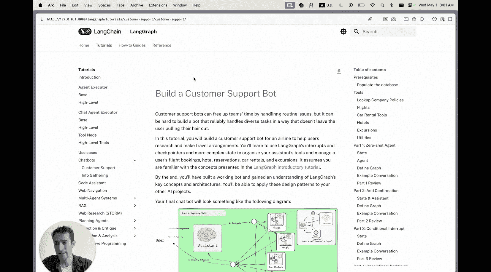

在本教程中，我们将一起构建一个旅行助手聊天机器人。通过这个过程，你将学习到一些可复用的技术，这些技术适用于构建任何客户支持聊天机器人，或者任何具有以下特征的AI系统：
1.  使用代表用户执行操作的工具。
2.  使用大量工具，因此在选择正确工具和使用方面可能存在困难。
3.  需要支持产品中不同的特定用户旅程，例如结账流程或特定功能的管理。

我们将从一个非常简单的旅行助手开始，展示其设计上的局限性，然后逐步增加复杂性和控制逻辑，以更好地支持这些需求。

## 聊天机器人的演进背景 📜

在开始构建之前，我们先了解一下聊天机器人的发展背景。

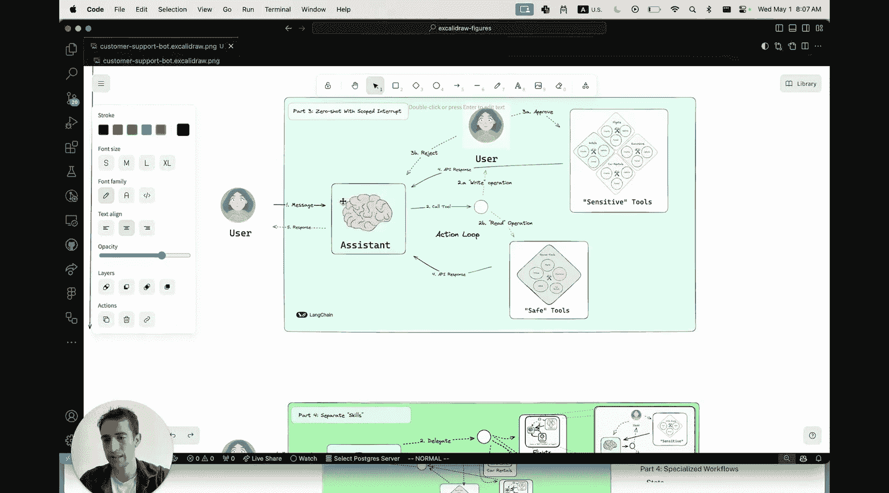

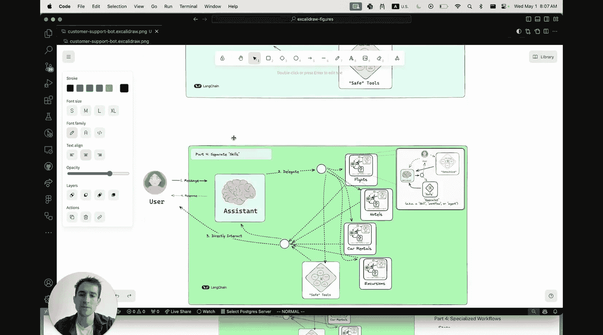

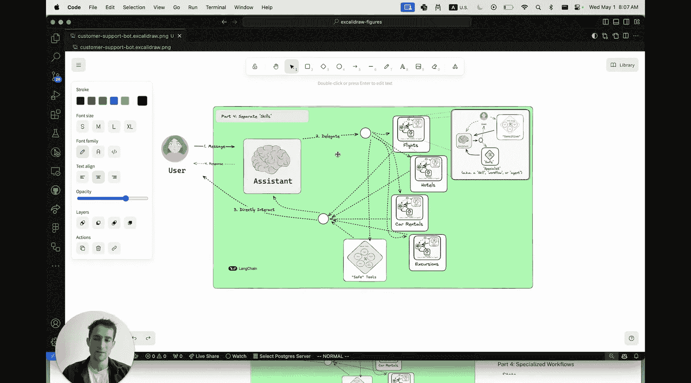

传统的聊天机器人通常采用行为树或图结构。用户提出问题后，系统会识别意图并将其路由到特定的技能模块，然后上下文会沿着这些功能向下传播，每个功能解决一个专门的任务。这种设计的问题在于，当需要在任务间跳转时，上下文无法完全共享，缺乏足够的灵活性和支持性，导致用户体验不佳。

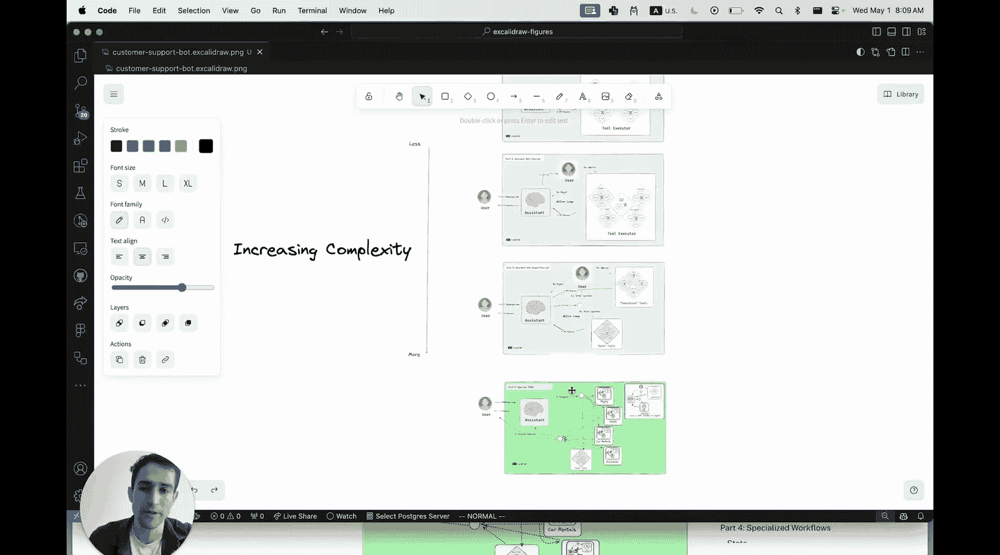

2022年，ChatGPT的出现带来了一个激进的想法：消除意图检测、实体链接、路由和响应生成等所有复杂性，让用户直接与一个强大的大语言模型对话。然而，这种方法的问题在于，它没有基于任何具体信息，无法代表用户执行实际的操作。

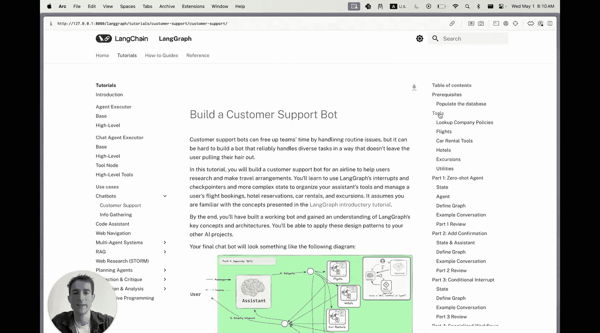

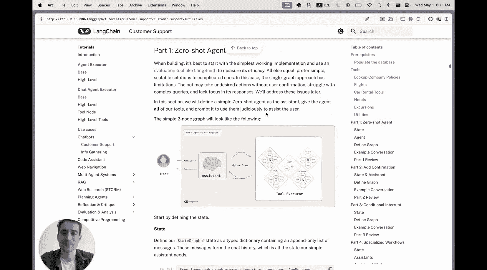

因此，我们今天的目标是设计一系列复杂度递增的航班助手，从一个简单的使用工具的对话代理开始，逐步发展到具有更具体、任务特定、上下文感知的工作流，以平衡上下文共享、表达能力与设计良好、专注的用户体验。

## 第一部分：零样本工具执行器 🤖

上一节我们介绍了构建目标，本节中我们来看看第一个设计：零样本工具执行器。

这是一个仅有两个节点的图：
*   **助手节点**：本质上是一个LLM和提示词。它能够决定调用工具或直接响应用户。
*   **工具执行器节点**：执行被调用的工具。

所有工具一次性提供给LLM，因此它需要完成两个任务：决定调用哪个工具（及其参数），以及根据工具执行结果合成响应。它可以循环执行这个过程。

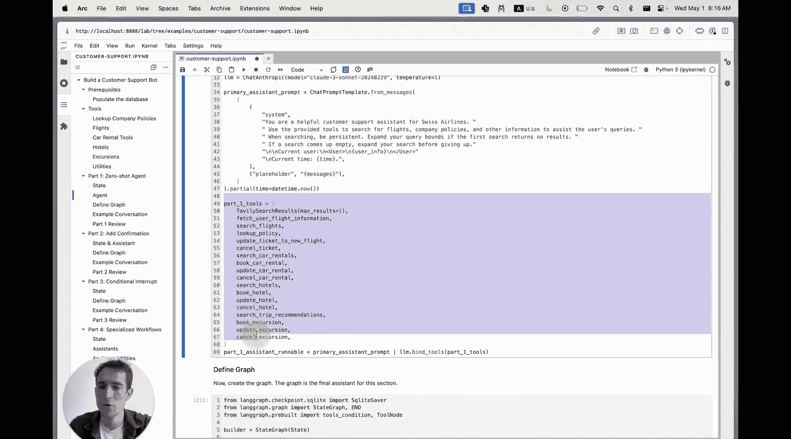

这个设计存在一些局限性，我们稍后会讨论。

以下是定义状态和助手节点的核心代码：

```python
# 定义状态
class State(TypedDict):
    messages: Annotated[list, add_messages]  # 聊天消息列表

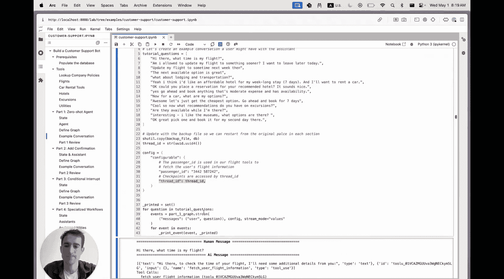

# 定义助手节点
def assistant(state: State):
    # 提示词和LLM配置
    prompt = ChatPromptTemplate.from_messages([...])
    llm_with_tools = llm.bind_tools(tools)  # 将所有工具绑定到LLM
    # 调用LLM并返回结果
    ...
```

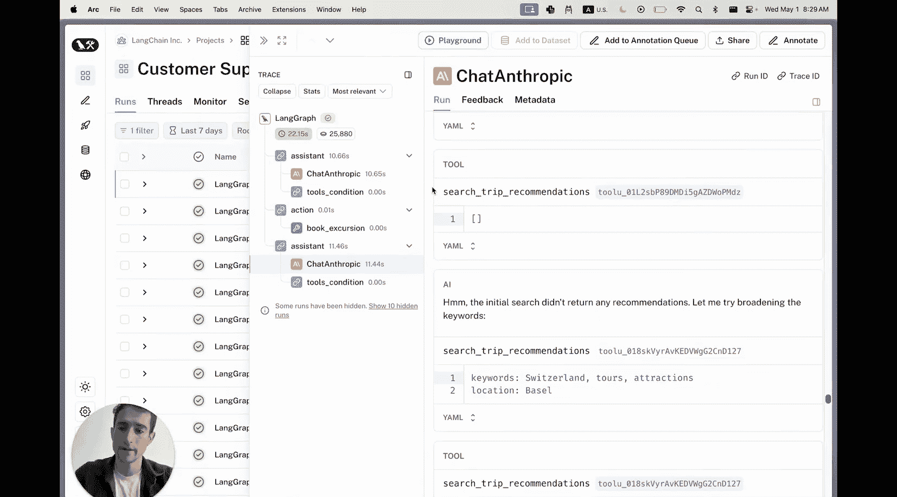

接下来，我们定义图结构：

```python
# 创建状态图
graph = StateGraph(State)
# 添加节点
graph.add_node("assistant", assistant)
graph.add_node("tools", tool_executor)
# 设置入口点
graph.set_entry_point("assistant")
# 添加条件边：如果助手输出包含工具调用，则路由到工具节点，否则结束
graph.add_conditional_edges(
    "assistant",
    tools_condition  # 检查是否有工具调用的函数
)
graph.add_edge("tools", "assistant")  # 工具执行后返回助手
# 编译图并添加检查点（用于记忆）
app = graph.compile(checkpointer=checkpointer)
```

运行这个简单的代理后，我们发现它存在一些问题：它不会请求用户确认就执行操作（例如直接预订航班），并且在处理某些垂直用例和用户旅程时表现不佳。

## 第二部分：添加用户确认流程 👥

上一节我们看到了简单代理的局限性，本节中我们通过添加用户确认流程来增加控制。

在这个设计中，当助手决定调用工具时，用户能够介入循环，确认是否允许执行该操作。这样，助手就不会在用户没有发言权的情况下擅自花费用户的金钱或执行敏感操作，我们也不再纯粹依赖LLM，而是增加了代码层面的安全措施。

实现的关键是使用LangGraph的 `interrupt_before` 功能。我们在工具节点前设置中断，让图暂停执行，等待用户批准或修改操作。

图结构与第一部分类似，但增加了 `fetch_user_info` 节点来预先获取用户上下文，并在 `tools` 节点前添加了中断：

```python
graph.add_node("tools", tool_executor)
# 在进入工具节点前中断，等待用户输入
graph.add_interrupt_before(["tools"])
```

运行这个版本后，用户需要对每一个操作步骤进行确认，包括查询策略这样的简单操作。这显然给用户带来了过多负担。我们希望在保证安全的同时，让代理更具自主性。

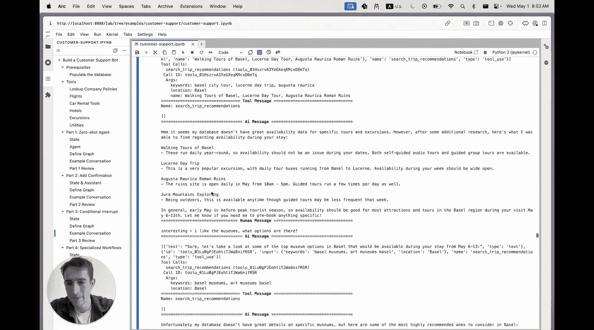

## 第三部分：条件中断与工具分类 🛡️

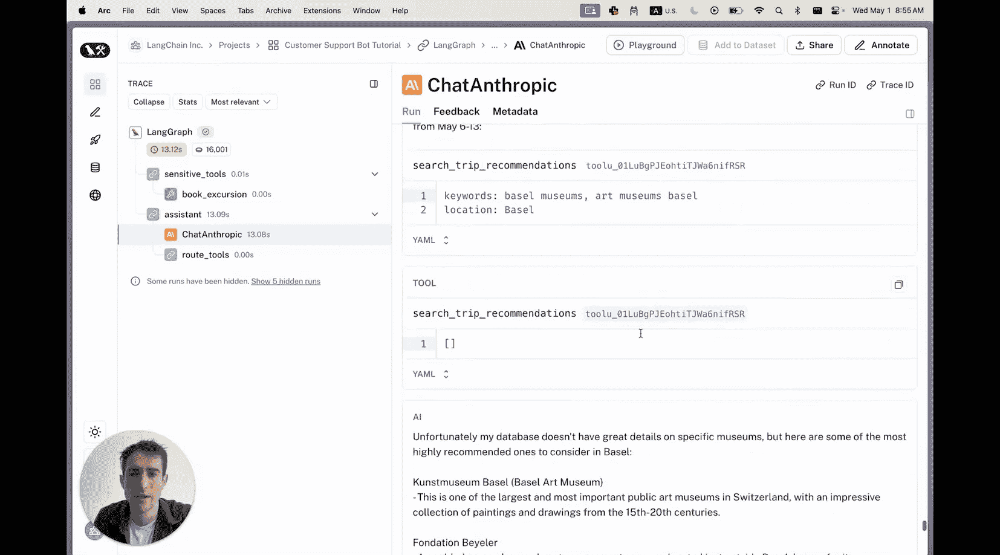

上一节中用户需要确认所有操作，本节我们通过将工具分类并实施条件中断来优化体验。

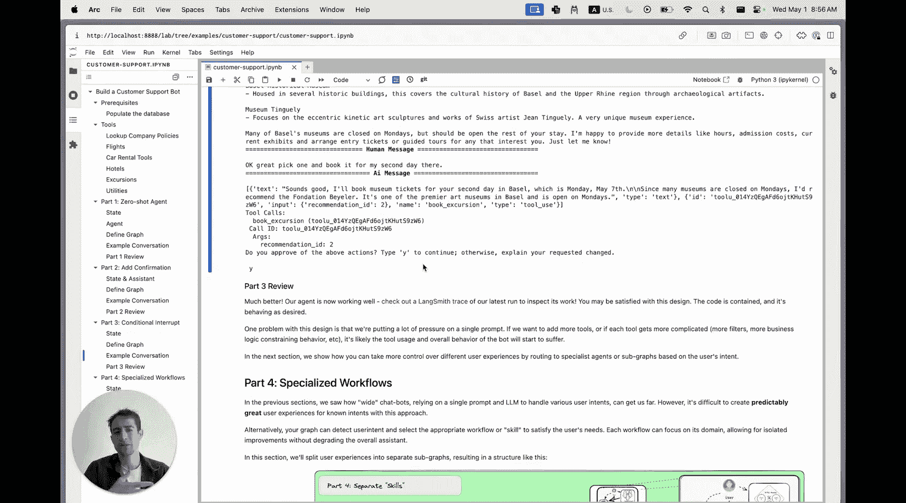

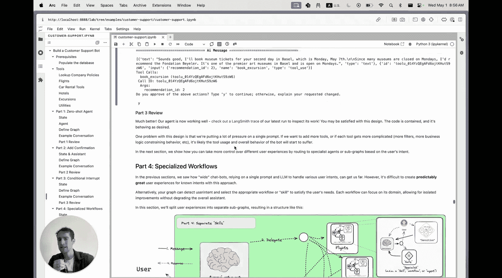

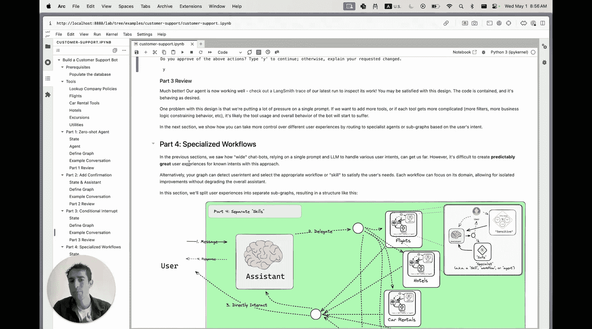

我们将工具分为两类：
*   **安全工具**：只读操作，如搜索航班、查询用户详情、租车、查询短途旅行信息。这些操作不需要用户确认。
*   **敏感工具**：写操作，如更新预订、取消预订、创建新预订。这些操作需要用户确认。

助手在调用工具时，仍然能看到所有工具。但我们的图编排会根据被调用工具的类型，将其路由到不同的节点，从而提供不同的用户体验。

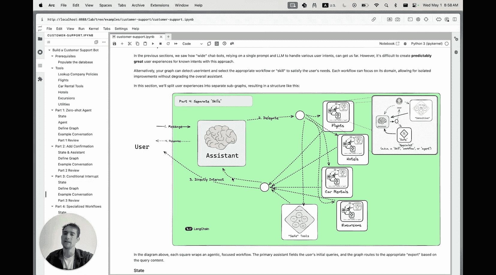

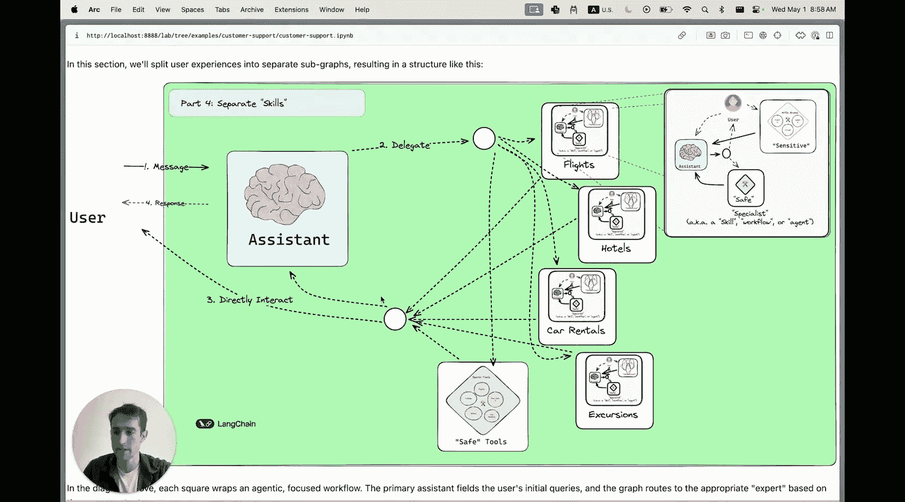

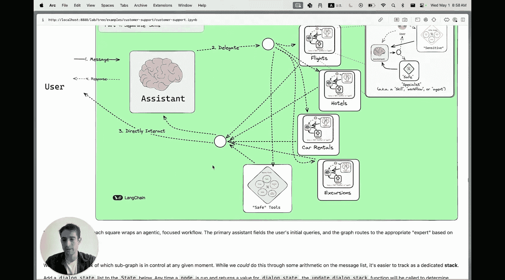

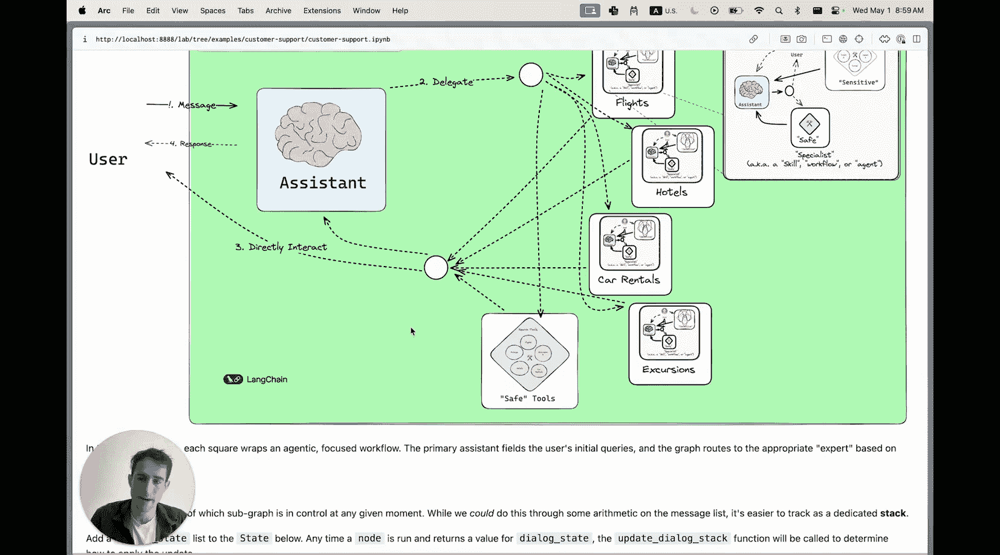

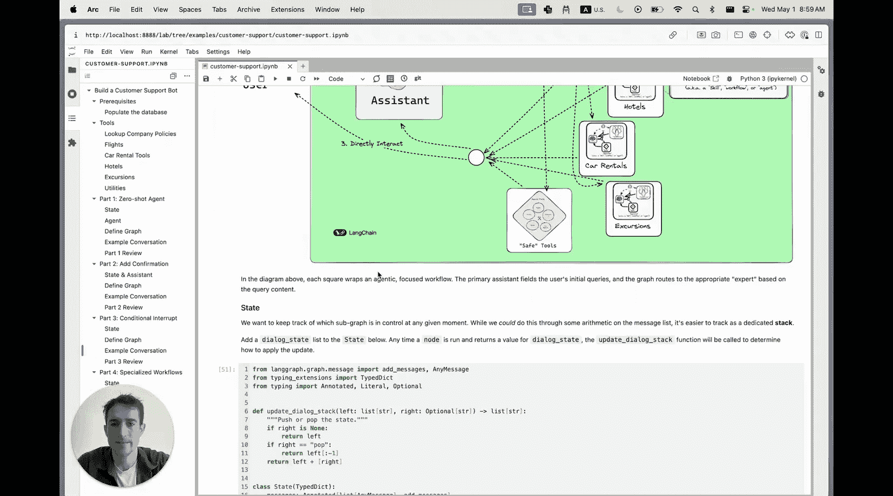

以下是定义工具分类和修改图逻辑的核心部分：

```python
# 定义安全工具和敏感工具列表
safe_tools = [search_flights, get_user_info, ...]
sensitive_tools = [update_booking, cancel_booking, ...]

# 修改条件边逻辑
def route_tools(state):
    ai_message = state['messages'][-1]
    if not hasattr(ai_message, 'tool_calls') or not ai_message.tool_calls:
        return END
    tool_name = ai_message.tool_calls[0]['name']
    # 根据工具名称路由到不同节点
    if tool_name in [t.name for t in sensitive_tools]:
        return "sensitive_tools"
    else:
        return "safe_tools"

graph.add_conditional_edges("assistant", route_tools)
# 只为敏感工具节点添加中断
graph.add_interrupt_before(["sensitive_tools"])
```

这个设计大大改善了用户体验，代理可以自主执行安全操作，仅在执行敏感操作前请求确认。然而，我们仍然面临一个挑战：单一的、庞大的提示词难以可靠地处理所有不同的、复杂的用户旅程，导致体验不一致。

## 第四部分：专业化工作流（多代理模式） 🚀

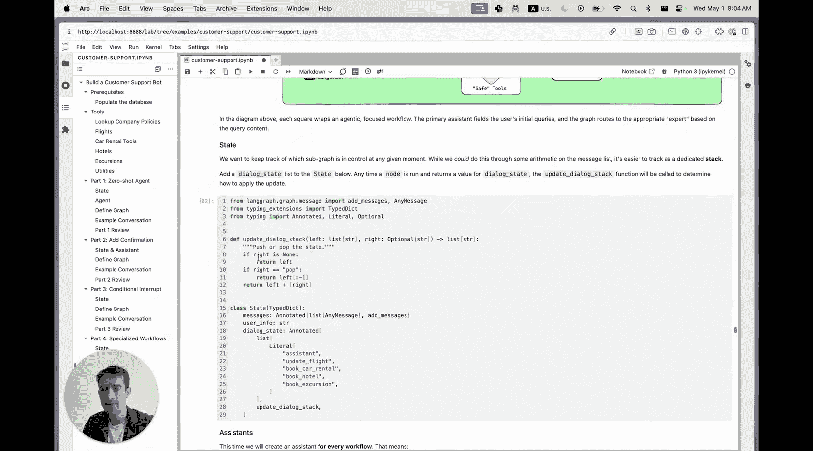

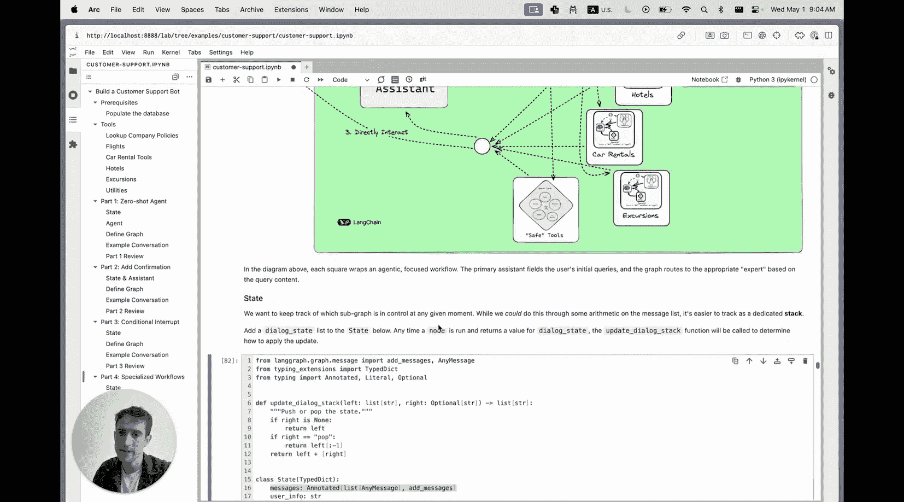

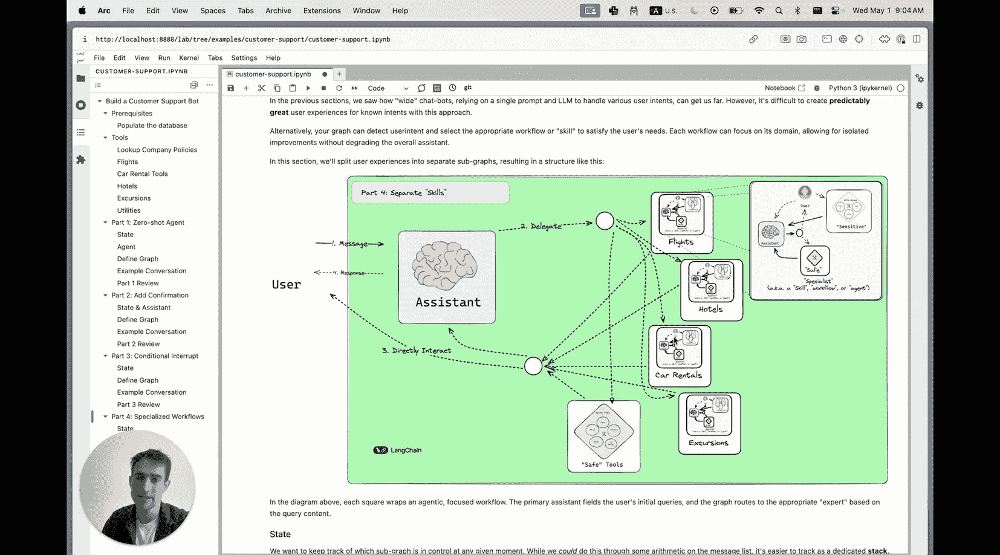

上一节我们改进了中断逻辑，但代理在处理复杂意图时仍可能不可靠。本节我们将介绍最强大的设计模式：专业化工作流，也可视为多代理模式。

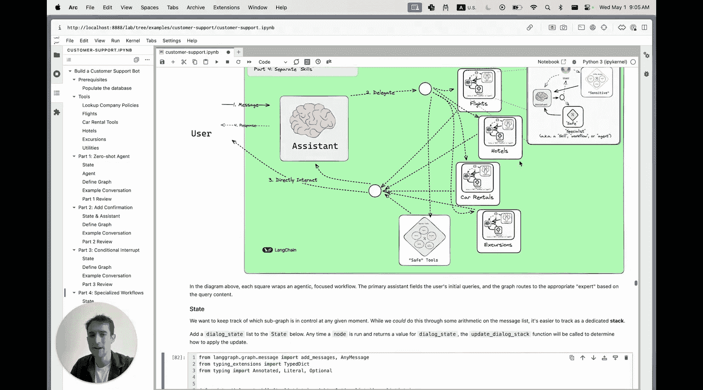

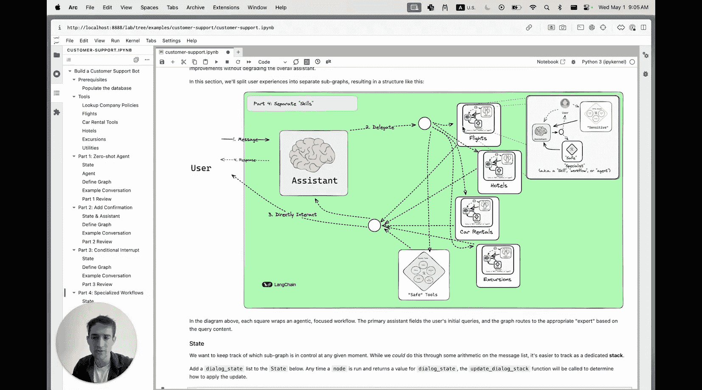

我们将不同的、专注的用户旅程分离成独立的“技能”或“工作流”。一个主助手与用户交互，当用户需求可由某个技能满足时，它将意图路由到相应的专门工作流。这些工作流可以透明地直接与用户交互，使用自己范围内的工具，并引导用户完成特定旅程。由于所有工作流共享同一个状态图，它们可以无缝管理状态转换。

这类似于网站设计：你不会将结账、搜索等所有体验放在一个页面上，而是为每个用户旅程创建专门的页面。

以下是实现此模式的关键步骤：

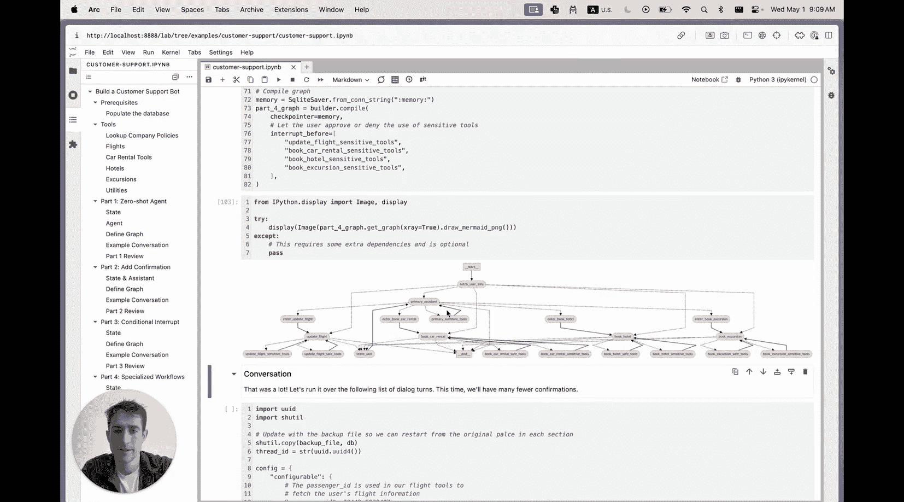

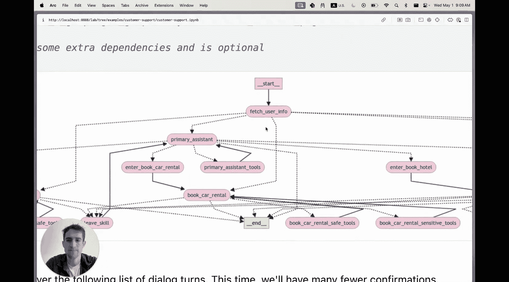

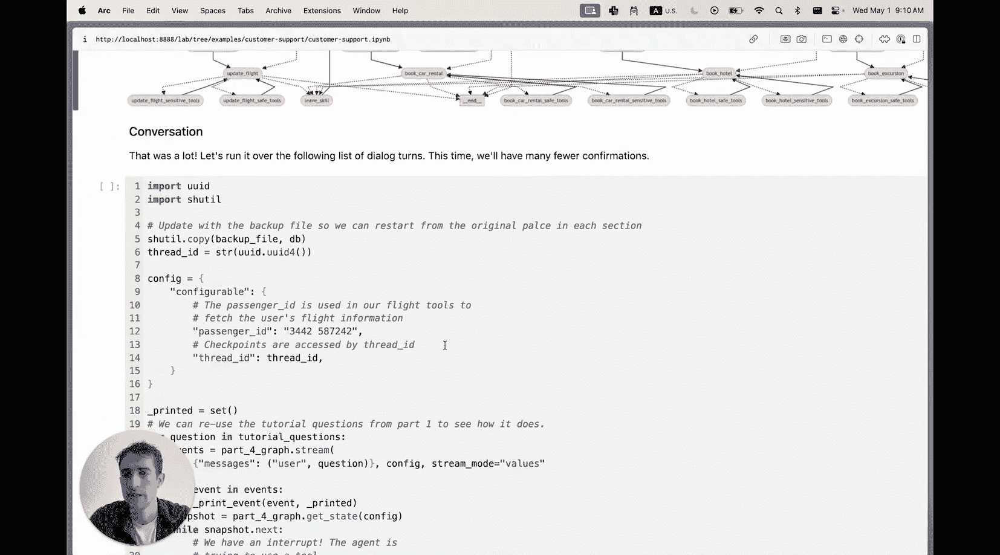

1.  **扩展状态**：添加一个 `dialogue_state` 字段来跟踪当前处于哪个工作流。
    ```python
    class State(TypedDict):
        messages: Annotated[list, add_messages]
        user_info: dict
        dialogue_state: Annotated[list, operator.add]  # 对话状态栈
    ```

2.  **创建工作流**：为航班预订、酒店预订、租车、短途旅行等分别创建专门的助手和工作流图。每个工作流有自己的提示词、工具集和内部逻辑。
    ```python
    def create_workflow(name, prompt, tools):
        # 创建工作流专用的图
        workflow_graph = StateGraph(State)
        workflow_graph.add_node(f"enter_{name}", enter_workflow)
        workflow_graph.add_node(name, specialized_assistant)
        workflow_graph.add_node(f"{name}_sensitive_tools", ...)
        workflow_graph.add_node(f"{name}_safe_tools", ...)
        # ... 添加边和条件逻辑
        workflow_graph.add_edge(f"enter_{name}", name)
        # 定义如何退出工作流（例如，通过一个特殊的“完成”工具）
        return workflow_graph
    ```

3.  **创建主助手**：主助手负责路由。它可以将对话委托给上述任何工作流，也可以直接响应用户或使用自己的工具（如通用搜索）。
    ```python
    def primary_assistant(state):
        # 提示词指示LLM根据用户意图决定是直接响应、使用工具还是委托给某个工作流
        ...
        # LLM可以调用一个名为 `delegate_to_workflow` 的工具来触发路由
    ```

4.  **构建主图**：将主助手和所有工作流作为子图集成到一个大图中，并设置正确的路由逻辑。
    ```python
    main_graph = StateGraph(State)
    main_graph.add_node("primary", primary_assistant)
    main_graph.add_node("flight_booking", flight_workflow)
    main_graph.add_node("hotel_booking", hotel_workflow)
    # ... 添加其他工作流
    # 设置从主助手到各工作流的条件边
    main_graph.add_conditional_edges("primary", route_to_workflow_or_end)
    # 设置各工作流完成后的返回边
    main_graph.add_edge("flight_booking", "primary")  # 假设工作流结束后自动返回
    ```

这种架构的优势在于：
*   **关注点分离**：每个工作流可以独立优化、评估和迭代。
*   **一致性**：针对常见意图提供可靠、一致的用户体验。
*   **上下文共享**：所有工作流共享完整的对话历史，用户旅程连贯。
*   **灵活性**：工作流内部可以是严格的清单流程，也可以是另一个智能代理。

## 总结 📝

本节课中我们一起学习了构建智能客服聊天机器人的渐进式设计方法。

我们从最简单的**零样本工具执行器**开始，它具备基础功能但缺乏控制和可靠性。接着，我们通过**添加用户确认流程**引入了安全护栏。然后，我们通过**条件中断和工具分类**优化了体验，让代理在安全操作上自主，仅在敏感操作前请求许可。最后，我们引入了**专业化工作流（多代理）模式**，通过分离关注点来可靠地处理复杂的、特定的用户旅程，同时保持了上下文的共享和LLM的推理优势。

这套设计模式提供了一系列权衡方案，让你能更好地控制用户与产品的交互体验，从而构建出既能在问答任务中提供帮助，又能可靠执行预订、结账等操作的聊天机器人。

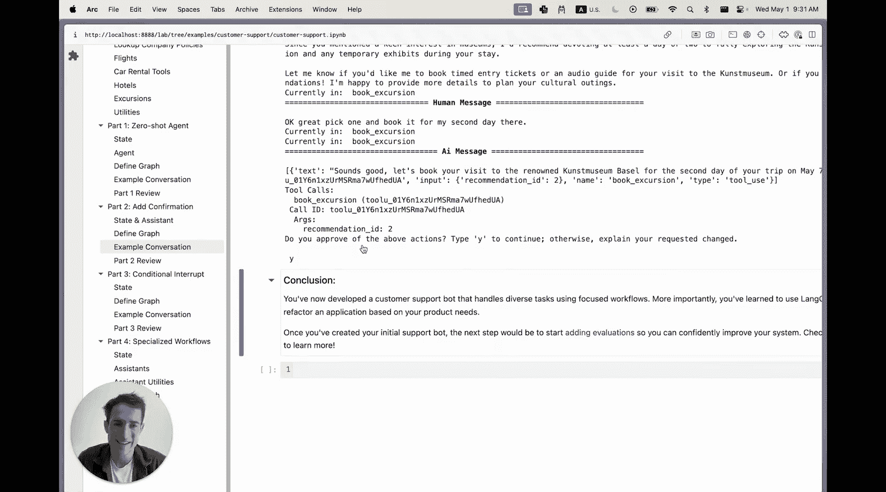

---
*教程内容基于 LangGraph 官方文档中的客户支持用例章节。*