# 018：在 LangGraph Cloud 中构建 MemGPT Discord 代理

## 概述
在本节课中，我们将学习如何使用 LangGraph 构建一个受 MemGPT 论文启发的智能代理。这个代理将具备管理自身记忆的能力，包括核心记忆和语义记忆，并最终将其部署到 Discord 服务器上，使其能够与用户持续互动并学习用户的偏好。

## 核心概念与准备工作
在开始构建之前，我们需要理解几个核心概念并完成一些准备工作。

### 核心概念：记忆管理
我们构建的代理将管理两种类型的记忆：
1.  **核心记忆**：关于用户的固定事实列表，例如“用户喜欢游泳”。
2.  **语义记忆**：存储在向量数据库中的对话片段，代理可以根据语义相似性进行检索。

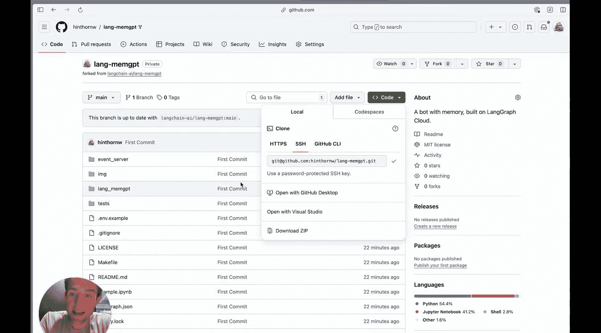

代理的工作流程可以概括为以下步骤：
1.  接收用户消息。
2.  **加载记忆**：根据用户ID获取该用户的核心记忆和相关的语义记忆。
3.  **决策与工具调用**：代理决定是否需要使用工具（如网络搜索、保存记忆）来辅助回答。
4.  **生成响应**：代理生成最终的消息回复给用户。

### 准备工作
在编写代码前，我们需要配置好以下外部服务：

1.  **向量数据库**：我们将使用 Pinecone 来存储和检索语义记忆。
    *   登录 Pinecone 控制台，创建一个新的索引（Index）。
    *   设置维度为 `1536`（如果我们使用 OpenAI 的 `text-embedding-ada-002` 模型）或 `768`（如果使用 `nomic-embed-text` 模型）。
    *   记下索引名称和所在区域。
    *   创建并保存好 API 密钥。

2.  **大语言模型**：我们将使用 Fireworks AI 提供的 Llama 3 微调模型来驱动代理。
    *   前往 Fireworks AI 获取 API 密钥。

3.  **网络搜索工具**：为了让代理能查询实时信息，我们需要一个搜索 API。
    *   可以注册 Tavily 等服务来获取搜索 API 密钥。

完成以上配置后，我们就可以开始构建代理了。

## 项目结构与代码解析
上一节我们介绍了核心概念和准备工作，本节中我们来看看具体的项目代码结构。

我们从 GitHub 上克隆项目仓库到本地。一个典型的 LangGraph Cloud 项目结构包含一个 `config.yaml` 配置文件，它定义了要暴露的图类型、需要注入的环境变量以及项目依赖。

项目中最关键的文件是 `graph.py`，它定义了代理的整个逻辑图。

### 工具定义
在 `graph.py` 中，我们首先定义了四个与记忆管理相关的工具函数：

```python
# 工具函数示例结构
@tool_node
def save_recall_memory(state):
    # 将记忆文本向量化，并附上时间戳等元数据，然后存入Pinecone
    pass

@tool_node
def search_memory(state):
    # 将查询文本向量化，在Pinecone中搜索相似记忆，并返回结果
    pass

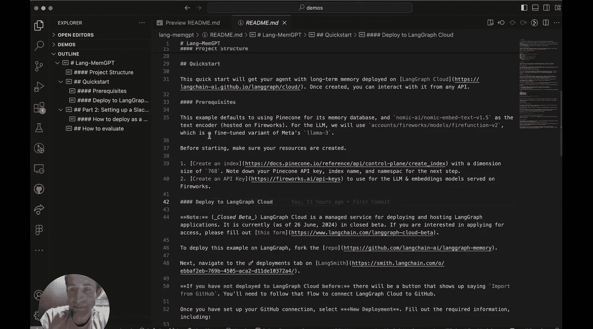

@tool_node
def fetch_core_memories(state):
    # 直接从数据库（如Redis）中获取当前用户的所有核心记忆
    pass

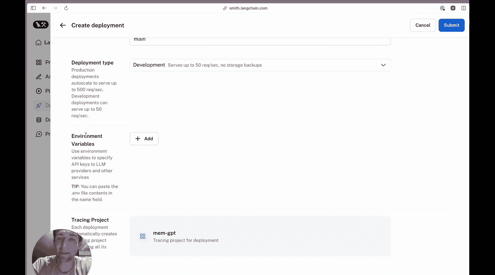

@tool_node
def store_core_memory(state):
    # 存储或更新用户的某条核心记忆
    pass
```

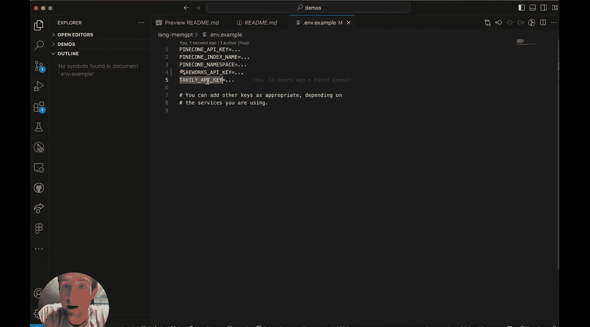

以下是这些工具的具体功能：
*   `save_recall_memory`: 将对话中的信息作为语义记忆保存到向量数据库。
*   `search_memory`: 根据用户当前的问题，在向量数据库中检索相关的历史语义记忆。
*   `fetch_core_memories`: 获取用户的静态核心记忆列表。
*   `store_core_memory`: 允许代理更新或创建新的核心记忆。

### 图节点与流程
定义了工具后，我们构建图的主要节点：

1.  **`load_memories` 节点**：这是图的入口。在将用户消息交给LLM之前，此节点会先根据配置中的用户ID，调用 `fetch_core_memories` 和 `search_memory`，获取初始记忆并注入到对话上下文中。
2.  **`agent` 节点**：这是LLM本身。它接收带有记忆的上下文，并决定是直接回复用户，还是调用上述某个工具。
3.  **`route_tools` 函数**：这是一个路由逻辑。它检查LLM的输出，如果包含工具调用，则将状态路由到 `tools` 节点；否则，直接生成最终响应。
4.  **`tools` 节点**：这是一个使用 `@tool_node` 装饰器预构建的节点。当状态进入此节点时，它会自动执行LLM请求调用的任何工具。

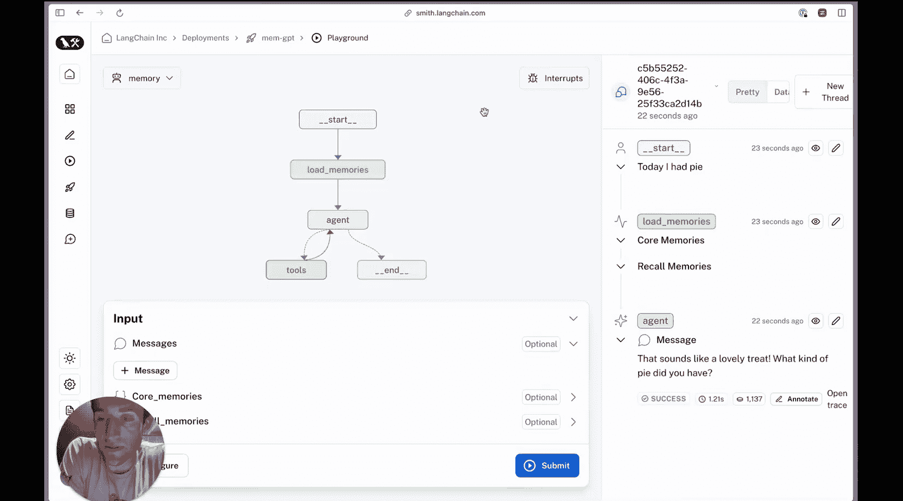

### 提示词与模型配置
我们为代理编写了系统提示词，鼓励它积极使用记忆工具。提示词中会模板化地插入已获取的记忆内容，并包含当前系统时间，以提供时间上下文。

模型配置在 `config.yaml` 中完成，默认使用 Fireworks 的 Llama 3 模型，但可以轻松切换为 OpenAI、Anthropic 或 Google 的模型。

现在我们已经了解了代码的核心部分，接下来将其部署到云端。

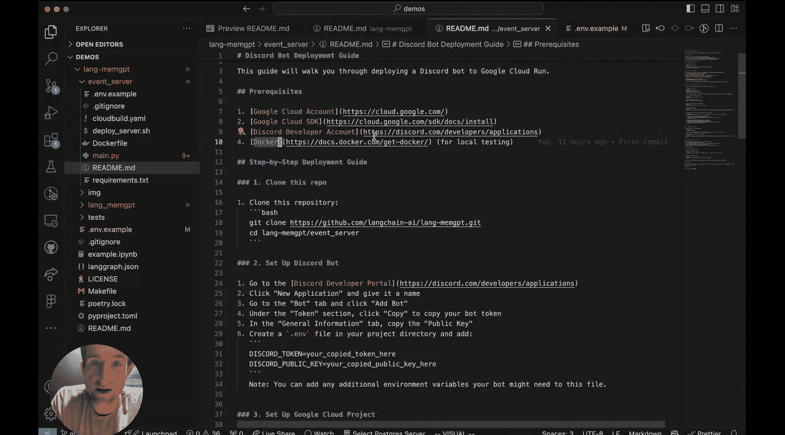

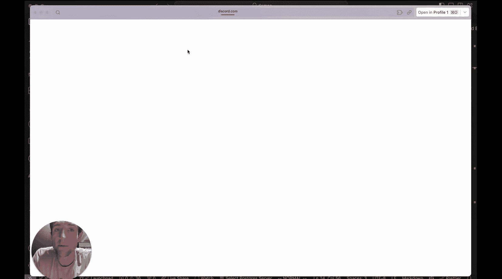

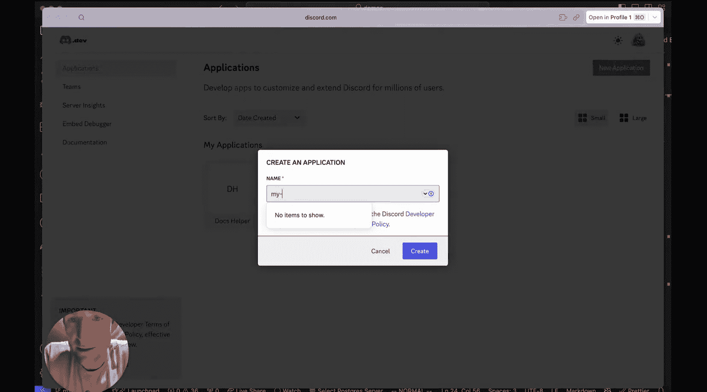

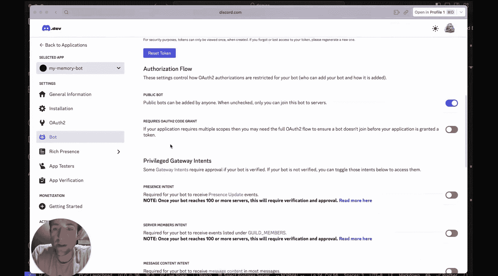

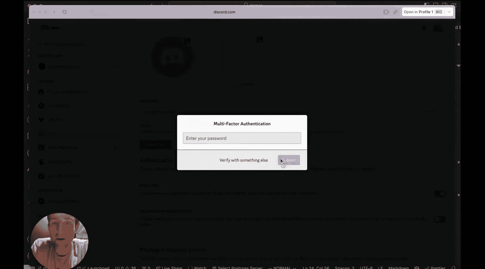

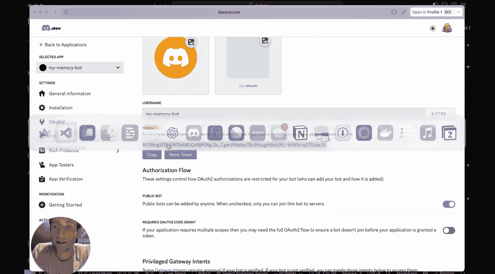

## 部署到 LangGraph Cloud
上一节我们分析了代理的代码结构，本节中我们来看看如何将其部署到 LangGraph Cloud 上运行。

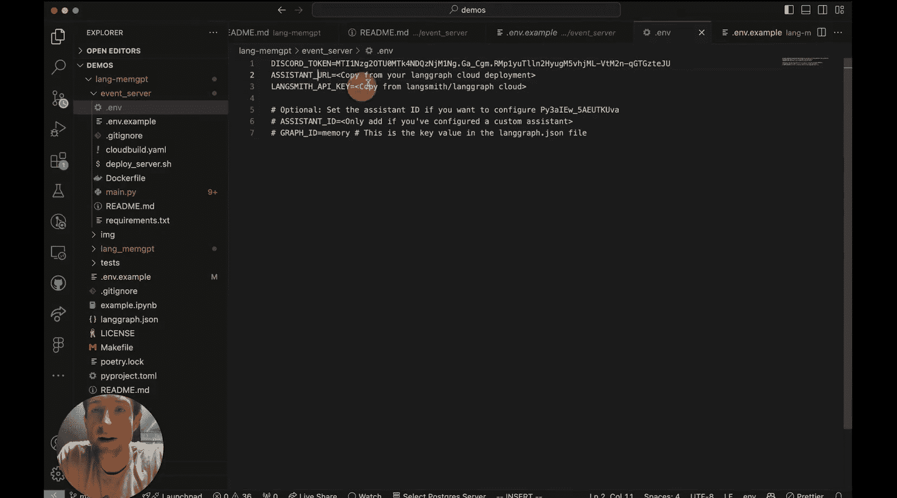

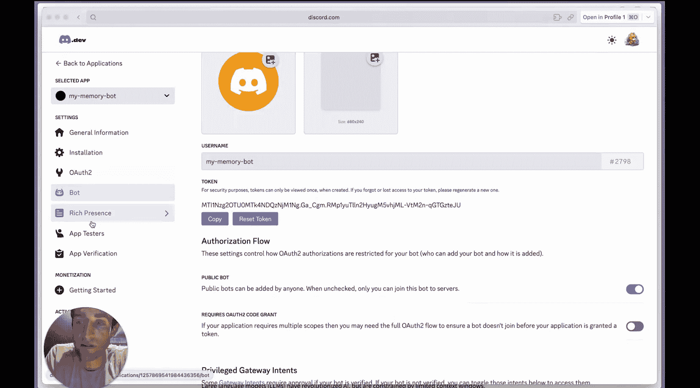

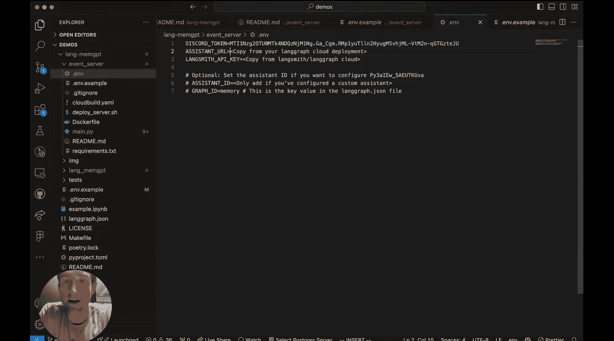

1.  登录 LangSmith 平台，进入 “Deployments” 页面，点击 “New Deployment”。
2.  首次使用需要将 LangGraph Cloud 应用安装到你的 GitHub 账户。授权后，选择包含我们代码的仓库（例如 `langchain-memgpt`）。
3.  创建部署时，需要：
    *   为部署命名（如 `MemGPT-Agent`）。
    *   指定配置文件路径（通常是根目录的 `config.yaml`）。
    *   选择部署环境（如 `development`）。
4.  最关键的一步是添加环境变量。在部署配置界面，添加我们在准备阶段获取的密钥：
    *   `PINECONE_API_KEY`
    *   `PINECONE_INDEX_NAME`
    *   `PINECONE_ENVIRONMENT`
    *   `FIREWORKS_API_KEY`
    *   `TAVILY_API_KEY` （如果启用搜索功能）
5.  提交后，LangGraph Cloud 会自动构建 Docker 镜像并部署。这个过程通常需要几分钟。如果失败，可以查看构建日志来排查问题，常见问题包括环境变量错误或依赖缺失。

部署成功后，我们可以直接在 LangGraph Cloud 提供的 Playground 中进行测试和调试。在 Playground 中，我们可以设置 `user_id`，模拟不同用户的对话，并可视化地观察整个图的执行流程和状态变化。

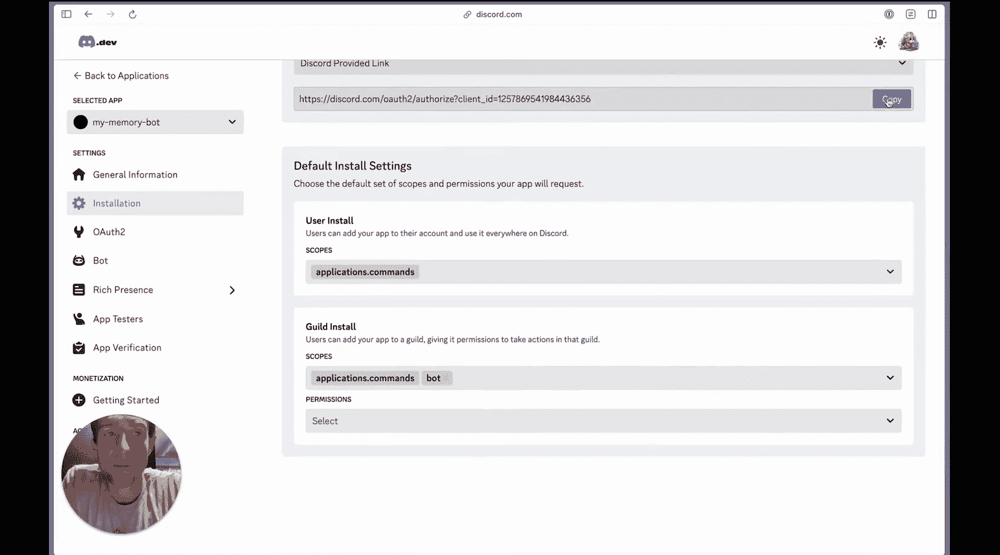

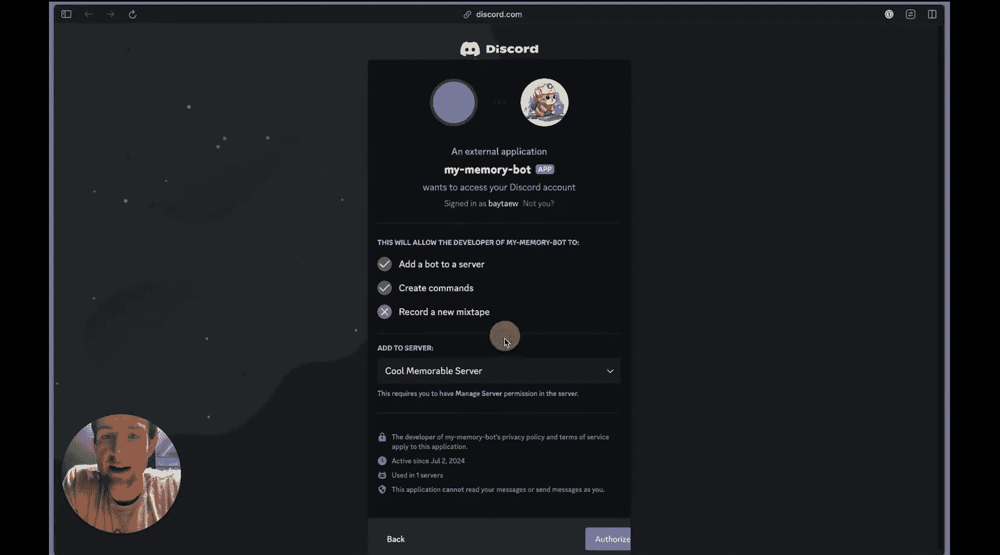

## 集成 Discord 机器人
代理在云端运行良好，但为了能让最终用户方便地使用，我们需要一个交互界面。本节我们将把代理集成到 Discord 机器人中。

我们使用项目仓库中提供的 `advanced_server` 代码来搭建 Discord 机器人服务端。

### 创建 Discord 机器人
1.  访问 Discord 开发者门户，创建一个新的应用（Application），例如命名为 “My Memory Bot”。
2.  进入该应用的 “Bot” 设置页面：
    *   重置令牌（Token）并妥善保存，这是机器人连接 Discord 的密码。
    *   在 “Privileged Gateway Intents” 下，开启 `MESSAGE CONTENT INTENT`，否则机器人无法读取消息内容。
3.  进入 “OAuth2” -> “URL Generator” 页面：
    *   在 Scopes 中选择 `bot`。
    *   在 Bot Permissions 中勾选 `Send Messages`, `Read Message History` 等所需权限。
    *   生成邀请链接，用此链接将机器人添加到你的 Discord 服务器。

### 配置并运行服务器
1.  在 `advanced_server` 目录下，创建或修改 `.env` 文件，填入必要的配置：
    *   `DISCORD_TOKEN`: 刚才保存的机器人令牌。
    *   `ASSISTANT_URL`: 你在 LangGraph Cloud 上部署的代理的 API URL。
2.  此服务器代码使用 Google Cloud Run 进行部署。你需要：
    *   安装 Google Cloud SDK 和 Docker。
    *   在 Google Cloud 上创建一个项目，并启用 Cloud Run、Cloud Build 等必要 API。
    *   为 Cloud Build 服务账户分配适当的 IAM 权限，使其能够构建和部署。
3.  运行项目提供的部署脚本（如 `deploy_server.sh`），脚本会自动构建镜像并部署到 Cloud Run。

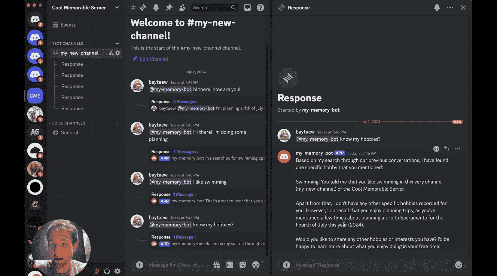

部署完成后，你的 Discord 机器人就上线了。在服务器中 @机器人 或与其私聊，它会将消息转发给 LangGraph Cloud 上的代理处理，并将回复传回 Discord。由于代理记住了 `user_id`（来自 Discord 用户ID），它能跨对话线程维护和更新每个用户的记忆。

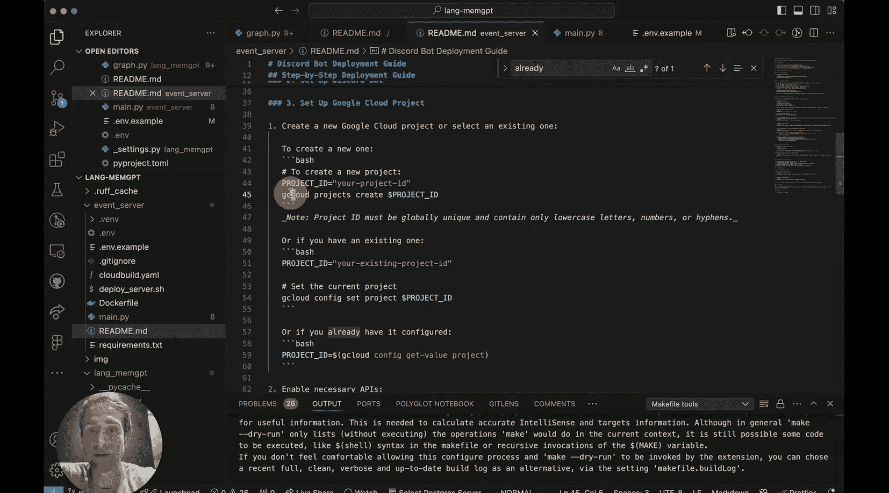

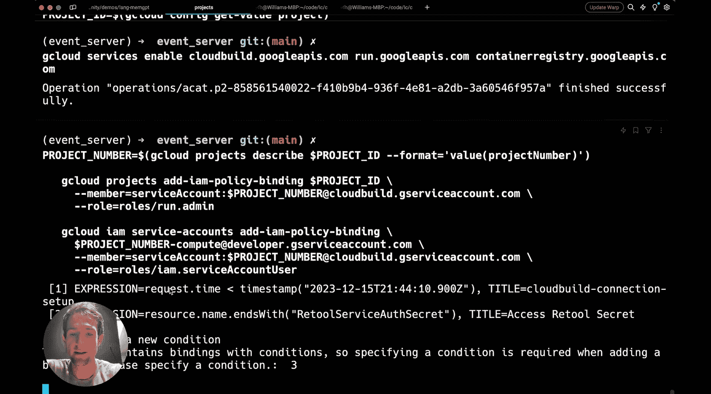

## 测试与评估
构建并部署了功能完整的代理后，确保其可靠运行至关重要。本节我们将探讨如何为这类基于LLM的代理编写测试。

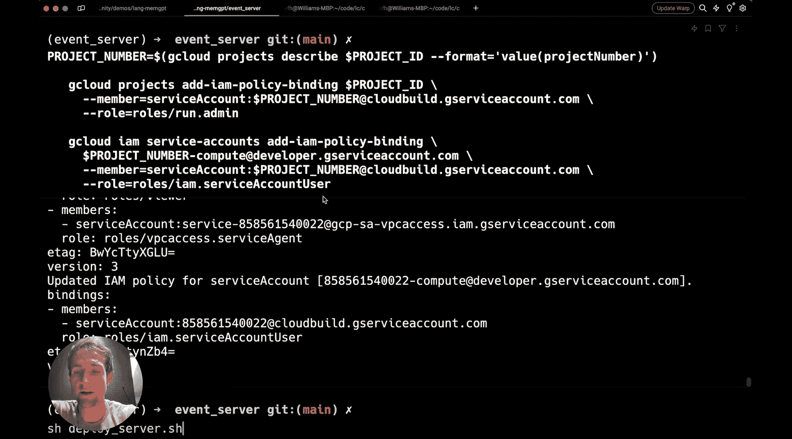

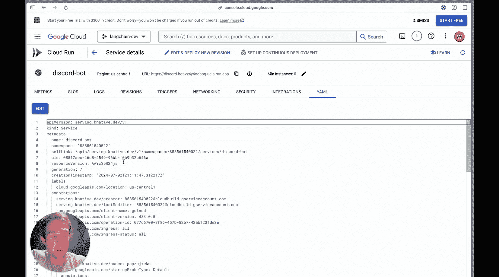

测试AI代理可能具有挑战性，但采用务实的方法非常有效：即使是从简单的断言开始，也比没有测试要好。使用 LangSmith 这样的工具可以极大地帮助调试和定位问题。

我们在项目中提供了一个示例测试文件 `test_memories.py`。它的基本思路是：

1.  **模拟对话**：编写一系列测试用例，模拟用户与代理的交互。
2.  **预设记忆**：在测试开始时，为模拟用户注入一些初始的核心记忆或语义记忆，观察代理如何利用它们。
3.  **断言验证**：对代理的行为和输出进行断言。例如，在对话后，检查向量数据库中是否保存了预期数量的新记忆，或者检查代理的回复是否包含了预期的信息。
4.  **使用 LangSmith**：通过 LangSmith 的测试装饰器，将测试运行与 LangSmith 数据集同步。这样，每次运行测试都会生成一个可追溯的链路（Trace），方便对比不同版本代理的表现，并在测试失败时深入调试每一步的输入输出。

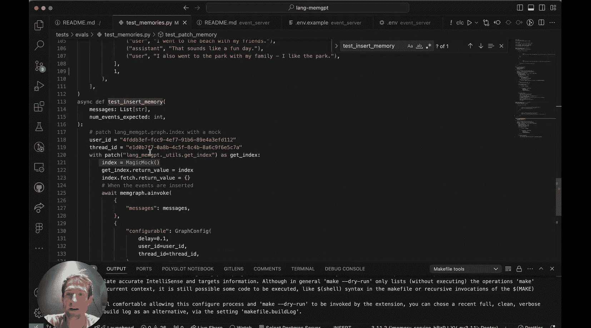

通过运行 `pytest` 命令执行这些测试，我们可以持续保障代理核心逻辑的稳定性，就像测试传统软件一样。

## 总结
在本节课中，我们一起学习了如何使用 LangGraph 构建一个具备长期记忆能力的智能代理。我们从理解 MemGPT 的核心思想出发，逐步完成了以下工作：

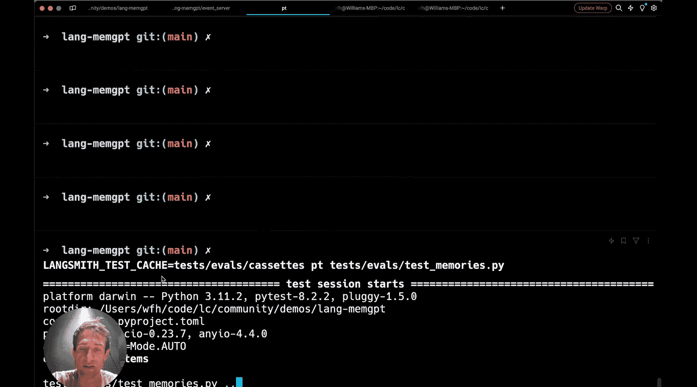

1.  **配置基础服务**：设置了 Pinecone 向量数据库和 Fireworks AI 的 LLM。
2.  **构建代理图**：定义了记忆管理工具，并组合成包含记忆加载、LLM推理和工具调用的工作流。
3.  **云端部署**：将代理成功部署到 LangGraph Cloud，并利用其 Playground 进行调试。
4.  **集成前端**：创建并配置了 Discord 机器人，将其与云端代理连接，实现了可交互的产品。
5.  **测试保障**：介绍了如何使用 pytest 和 LangSmith 为代理编写和运行测试，确保其行为符合预期。

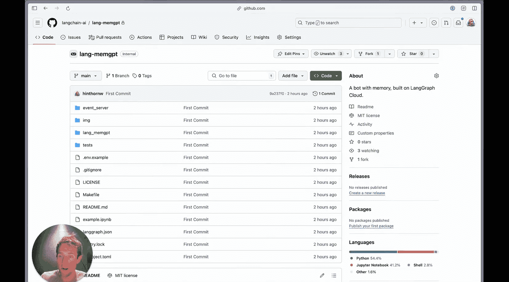

最终，我们得到了一个可以部署在 Discord 上、能够记住用户偏好并在多次对话中持续学习的智能助手。你可以 Fork 项目仓库，尝试修改提示词、添加新工具或更换模型，来构建属于你自己的个性化代理。