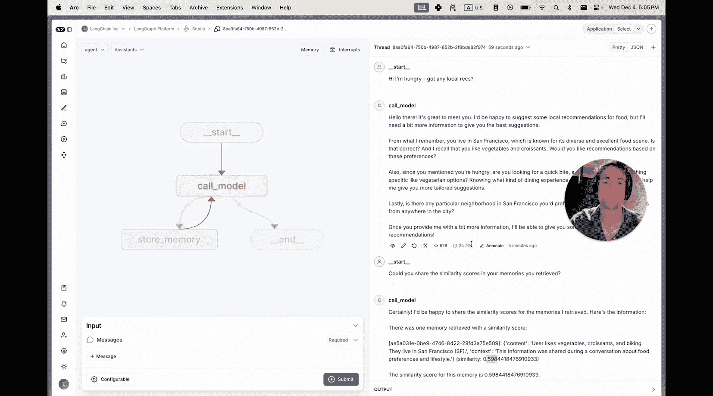
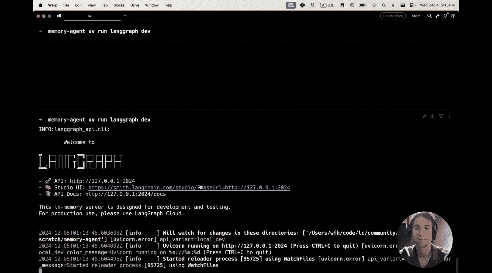
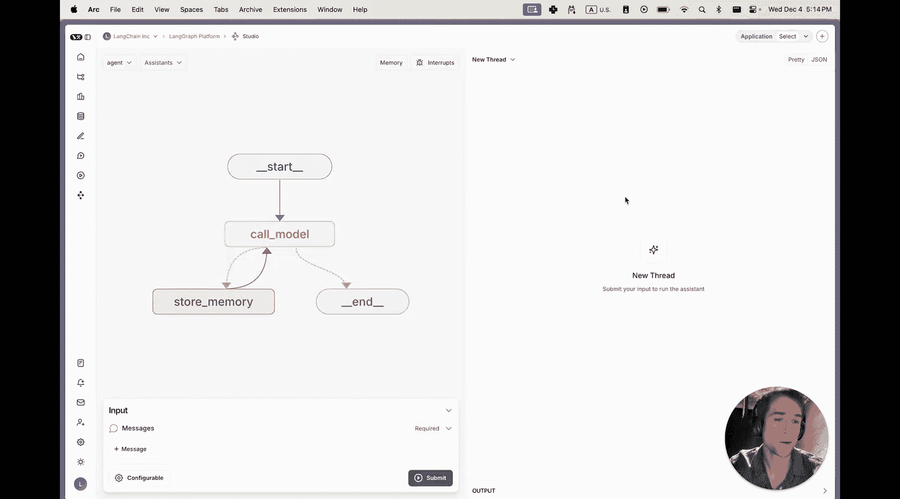
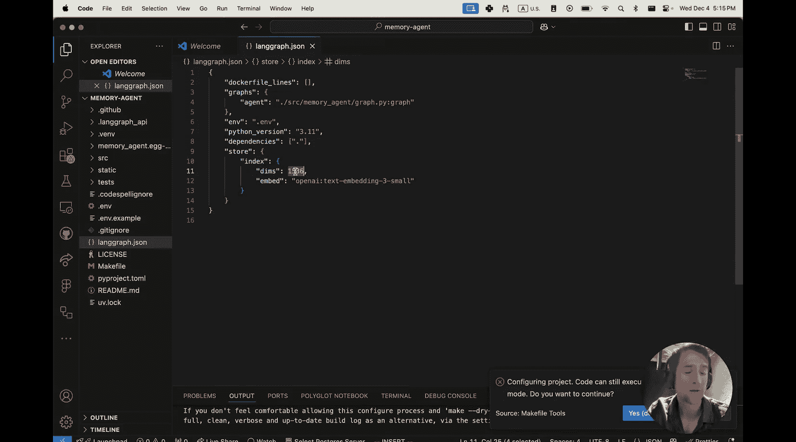
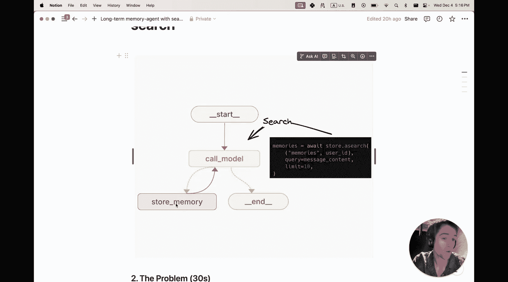
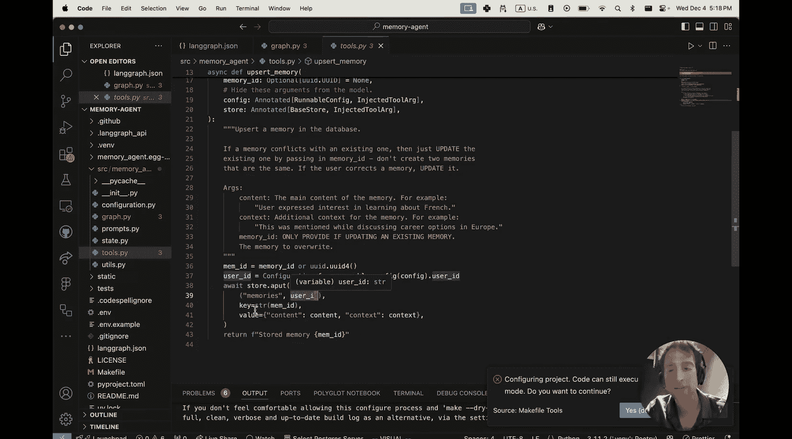
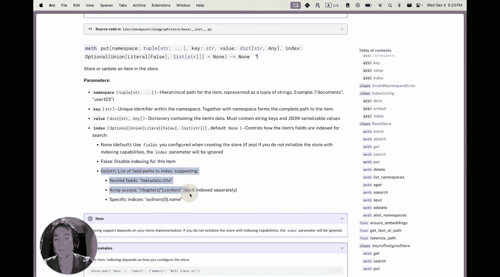

# 019：为LangGraph记忆代理添加语义搜索 🧠

在本节课中，我们将学习如何为LangGraph中的长期记忆代理添加语义搜索功能。语义搜索允许你跨对话线程搜索相似的记忆，从而创建更具个性化和更有效的应用程序。

## 概述

首先进行简要回顾。最基本的记忆类型是工作对话记忆，这由LangGraph的检查点提供，并且每个LangGraph实例都自带此功能。这使得AI助手能够在单个对话中保持连续性。

几个月前，我们在整个LangGraph中发布了基础存储抽象。这提供了一个灵活且模块化的文档存储，让你可以按任意组织方式保存记忆和文档，并在对话间共享信息。作为该版本的一部分，我们创建了记忆代理模板。

## 记忆代理模板解析

记忆代理模板定义了一个简单的代理，它在两个位置使用存储。

第一个位置是**存储记忆工具**。该工具允许它将任何字符串内容写入基础存储，以便在对话间持久化。

基础存储的第二个用途是在**调用模型节点本身**。在调用大语言模型之前，我们从基础存储中获取记忆，将其格式化为持久提示，然后调用大语言模型。这样，它就能够结合当前特定对话的上下文以及它认为足够重要、需要跨对话保存和持久化的长期信息来做出回应。

让我给你一个快速示例来说明我的意思。

我可以告诉代理我喜欢牛角包和蔬菜，并且我住在旧金山。代理随后可以决定调用工具来保存信息。它使用该工具存储记忆，然后代理可以选择回应。之后，我开始一个新的对话。代理能够回忆起这些信息并将其用于建议。你可以看到它回忆起我住在旧金山，并且喜欢牛角包和蔬菜。

你可以点击LangSmith跟踪来确认。在这里，我们确实看到我们成功地将刚刚保存的记忆信息模板化到了系统提示中。你也可以随时通过导航到记忆面板来查看所有已保存的记忆，并查看代理在那里保存的确切内容。

## 引入语义搜索的必要性

这一切都很好，但是当你保存了太多记忆时会发生什么？很容易陷入精确率-召回率曲线的任一端：要么你在系统提示中放入太多记忆，导致不精确、不相关，并且容易分散大语言模型的注意力；要么你丢弃了太多记忆，从而无法获得上下文最相关的信息。

语义搜索让你能够基于与用户查询的语义相似性或向量相似性来查询记忆。这些相似性分数可以帮助你从大量记忆语料库中获取你认为最合适的信息。

在接下来的内容中，我将展示分步说明，教你如何为任何LangGraph应用中的长期记忆添加语义搜索。

## 实施步骤

以下是实施语义搜索的具体步骤。

首先，你需要使用LangChain CLI在本地克隆记忆代理模板。我们将在此处使用Python版本。

```bash
langchain app new my-app --package memory-agent
```



接下来，进入目录。



```bash
cd my-app
```

创建一个虚拟环境，安装依赖项，设置环境变量，并安装服务器。



```bash
python -m venv .venv
source .venv/bin/activate  # 在Windows上使用 `.venv\Scripts\activate`
pip install -r requirements.txt
```

如果你正确安装了所有内容，它将带你进入我们之前看到的Studio UI。

## 配置语义搜索



要添加语义搜索支持，我们必须更改配置文件。如果你在此模板中打开 `langgraph.json` 文件，你会注意到常见的配置项：指向图中路径定义的代理的指针、我们定义的环境，以及其他一些内容。

我们在这里配置存储，并说明通过索引支持语义搜索。我们提供了使用哪个嵌入模型的配置，并且还指定了它的维度。维度允许我们创建用于存储向量的表。

## 代码实现解析

根据我之前的描述，我们在两个位置使用存储。



第一个位置是在**调用模型节点**，我们在其中搜索相关记忆并将其放入系统提示中。

第二个位置是在**存储记忆工具**中，该工具用于将新信息存储到存储中。

让我们看看这些在代码中是如何定义的。首先，我们查看调用模型节点。

你会注意到，在这里我们获取了由LangGraph自动注入的存储。我们在这个配置的用户ID命名空间内进行搜索，以便将我们代理的不同用户的记忆分开。然后，我们使用最近的消息来形成搜索查询，并使用它来通过语义相似性获取10个最相似的记忆。

这些记忆随后被放入系统提示中，然后我们在这里调用大语言模型。

如果我们跳转到工具文件，我们可以看到这个“观察记忆”的工具定义。大语言模型将填充内容和上下文信息，这将被存储在数据库中。

这里的记忆ID是为了让我们能够在需要时更新旧的记忆，例如当我们想要添加能进一步提供上下文信息的额外内容时。然后，我们使用每个LangGraph部署上都可用的相同基础存储来存储这些记忆。同样，通过存储在此命名空间内的记忆ID来区分不同用户的信息，我们将所有值存储在一个字典中。



## 进一步学习

关于LangGraph中的记忆以及如何在你的代理中实现语义搜索的更多信息，我建议查阅文档。我们有几个关于如何为长期记忆添加语义搜索的指南，展示了如何在几种不同场景中使用它，包括在创建反应代理中，以及一些关于如何将其添加到你的部署中的信息。

这将引导你完成类似的步骤，让你像本视频中一样快速上手，包括关于如何使用自定义嵌入的额外信息。

如果你想更进一步，我建议查看基础存储的参考文档。这可以帮助你更好地理解和使用LangGraph基础存储的不同参数，包括诸如索引之类的功能，以便在将项目插入存储时禁用其索引，或者自定义哪些字段将用于多向量检索。

## 总结



本节课中，我们一起学习了如何为LangGraph记忆代理集成语义搜索功能。我们从回顾基础记忆类型和记忆代理模板开始，理解了语义搜索在管理大量记忆时的必要性。接着，我们逐步完成了从克隆模板、配置环境到修改代码实现语义搜索索引和查询的全过程。通过将用户查询与记忆库进行向量相似性匹配，代理现在能够更精准地召回相关信息，从而提供更个性化和有效的回应。