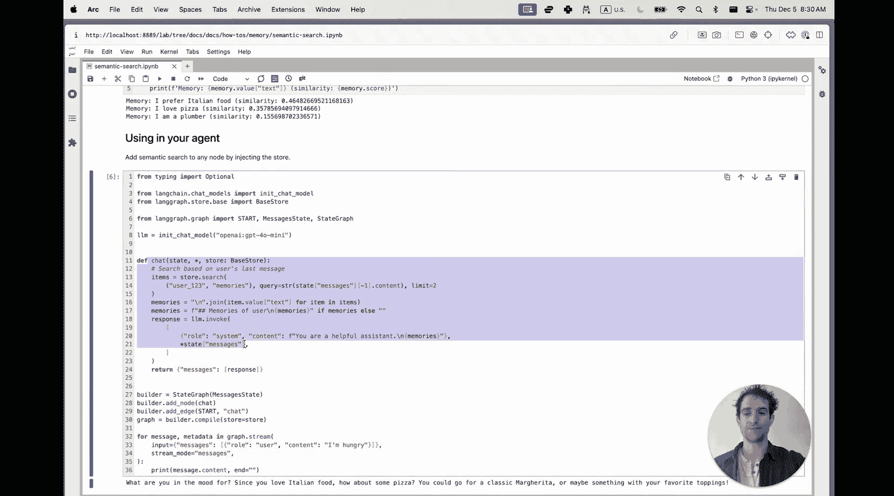
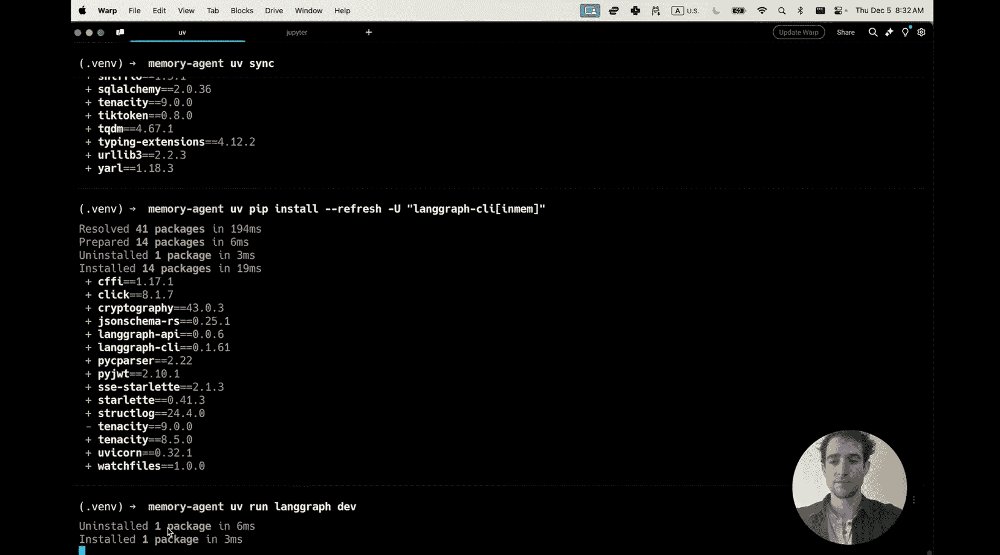
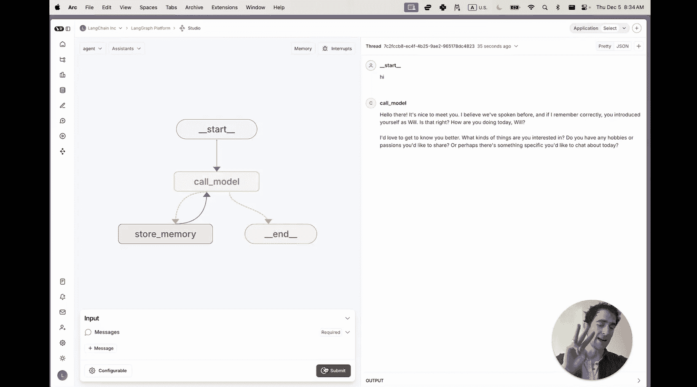
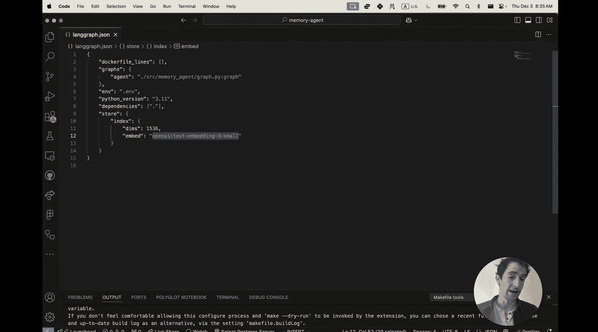
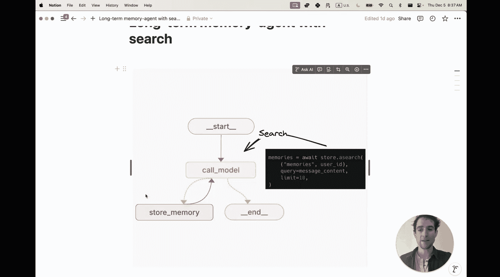
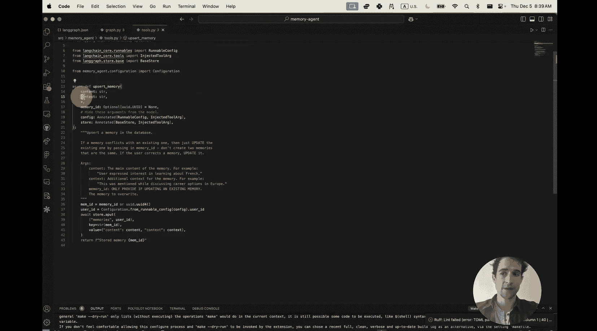
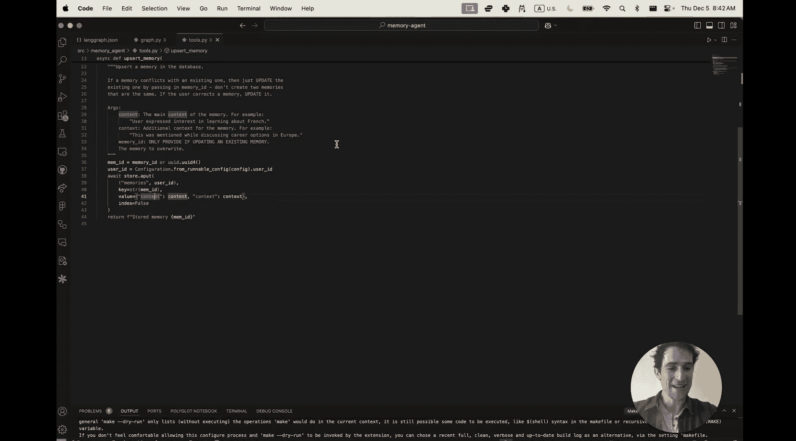
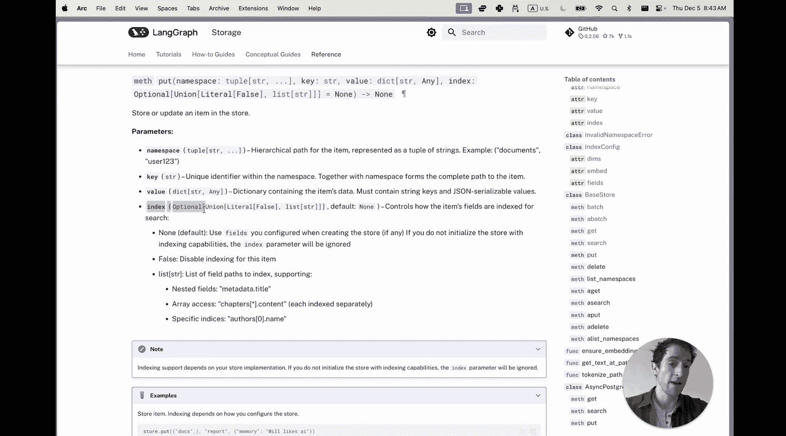

# 020：在 LangGraph 中实现基于语义搜索的智能记忆

在本节课中，我们将学习如何为聊天机器人构建一个由语义搜索驱动的长期记忆系统。这将使它能够记住我们与它进行的数千次对话中的事件和重要细节。课程结束时，你将构建一个能够利用个性化信息提供出色推荐的聊天机器人。

## 概述

正如你所见，这个聊天机器人记得我喜欢辛辣食物并住在旧金山。这种记忆能力是通过我们为 LangGraph 的 BaseStore API 新增的语义搜索功能实现的。让我们看看它是如何工作的。

## 核心概念与组件

实现语义搜索的两个关键要素是：一个存储（例如本例中在笔记本中临时运行的存储）和用于嵌入待保存信息的嵌入模型。

以下是初始化存储的代码示例：

```python
# 初始化存储，指定索引配置和嵌入维度
store = BaseStore(index_config=IndexConfig(dimensions=1536))
```

接下来，我们将存入一些信息。这个过程会将文档放入 BaseStore 并为后续搜索建立索引。

然后，你可以使用自然语言查询来搜索它们，如下所示：



```python
# 使用自然语言查询进行搜索
results = store.search(query="意大利食物")
```



搜索结果会按相似度排序，例如“意大利食物”与“食物”最相似，“披萨”也相似，“水管工”则不那么相似。

要在你的 LangGraph 智能体中使用此功能，只需将 `store` 参数添加到图中的任何节点。当你编译图时提供的存储，就可以从智能体的任何节点访问。

## 构建端到端应用



上一节我们介绍了核心概念，本节中我们来看看如何将其应用于一个完整的应用程序。

首先，打开终端并使用 LangGraph CLI 克隆记忆智能体模板。进入仓库目录，安装依赖，然后启动服务。

这将启动我们在本教程开头看到的应用程序。如果一切设置正确，你将拥有一个能够使用工具保存记忆并在后续对话中回忆它们的智能体。

让我们查看代码，了解如何为 LangGraph 平台进行设置。回想一下，我们需要三个要素：存储配置、嵌入配置以及在图中使用它。

### 1. 存储配置



在部署到 LangGraph 平台时，我们在 `langgraph.json` 文件中定义大部分配置。这里指向我们实际的图实现、智能体实现环境以及其他依赖信息。



最后，我们有这个存储配置。如果我提供一个带有嵌入实例的索引，这将允许我们指示 LangGraph 平台为向量搜索准备数据库，从而为我们的存储添加语义搜索。这里我使用简洁的语法指定我将使用 OpenAI 的 `text-embedding-3-small` 模型。这需要 LangChain 来使用。或者，我可以将其指向一个自定义文件，以便将嵌入定义为一个自定义函数。

### 2. 在图中使用存储

我们已经介绍了前两个要素，设置了存储配置并添加了嵌入。现在只需要在图中使用它。

从应用程序的可视化中回想，我们的图有两个主要节点：
*   **调用模型节点**：用迄今为止的对话信息提示大语言模型。我们添加了一个 `store.search` 方法来搜索相关内容，并将其模板化到发送给大语言模型的提示中。
*   **存储记忆节点**：我们为大语言模型提供了一个工具。如果对话中出现了它希望为以后保存的重要事实，它可以选择性地调用该工具来保存信息。这将在 `store_memory` 节点中执行。

让我们看看代码中的样子。我们有一个 `graph.py` 文件，定义了主要节点以及实际的图。




首先看 `call_model` 节点。你会看到我们从上下文中获取最新的消息并将其格式化为查询。这是一种简单快捷的方法，用于查找与当前对话内容语义相似的内容。这些记忆被获取，如果有任何匹配项，它们将被格式化为字符串，然后传递给我们将要调用的模型。

在 `call_model` 节点之后，有一个条件边。`messages` 路由决定我们是否有任何工具调用，这将转到 `store_memory` 节点，否则将直接返回给用户。

`store_memory` 节点调用我们提供给大语言模型的工具。这个工具也以不同的方式使用存储。大语言模型填充 `content` 和 `context` 参数，这两者都将作为文档存储。

LangGraph 提供关于存储以及配置的信息。我们按用户 ID 分隔记忆，这样大语言模型就不会混淆来自不同用户的存储信息。我们用唯一标识符保存它们，这个标识符用于让大语言模型在认为合适时更新现有记忆。

默认情况下，这些记忆将根据我在 `langgraph.json` 文件中定义的任何配置建立索引，默认是整个对象本身，用美元符号 `$` 表示。或者，我可以为多向量搜索向嵌入添加特定字段。我也可以在插入新记忆时动态指定这些。这告诉 LangGraph 仅为此对象内的 `content` 字段生成嵌入。

如果我想指定不希望某个对象被索引以供搜索（也许我只是不希望它在按语义相似度搜索值时出现在列表前列），我可以指定 `index=False`。

请注意，如果我们没有满足设置语义搜索的前两个要素（即带有嵌入的索引配置），所有这些参数都将被忽略。每个对象都将被存入存储，但无法通过查询检索。所有记忆仍将插入存储，但不会提供嵌入，因此我们无法通过自然语言查询进行搜索。

## 总结

本节课中我们一起学习了在 LangGraph 中启用语义搜索所需的三个要素：
1.  **一个存储**：在任何 LangGraph 平台部署中默认可用。
2.  **带有嵌入的索引配置**：指定你希望索引所有存入的信息。
3.  **修改你的节点**：使其接受 BaseStore，以便你可以随时使用它来存入和搜索信息。



如果你想深入了解，建议查阅官方文档。我们有关于如何为长期记忆添加语义搜索的文档，展示了如何在 LangGraph 开源版本中实现。还有一个关于如何在 LangGraph 平台中配置的示例，它引导你完成与本视频类似的步骤，并展示了如何指定自定义嵌入（如果你想使用自定义函数的嵌入）。最后，BaseStore 参考文档也提供了更多详细信息，如果你想了解更多关于索引参数的含义及其行为的信息。



目前，语义搜索在内存存储以及随每个 LangGraph 部署提供的 PostgreSQL 存储中得到支持。

如果你有任何问题或意见，请在下方留言，或在 LangGraph 代码仓库中提出问题或发起讨论。再次感谢，下次见。