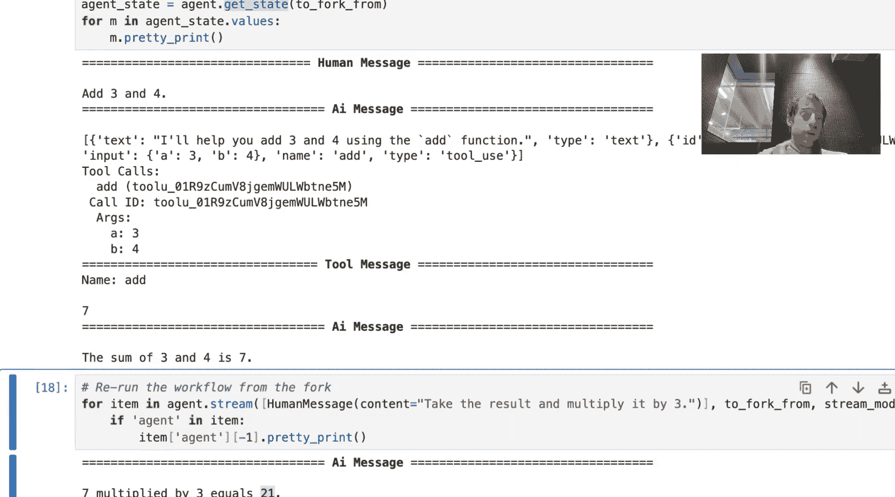
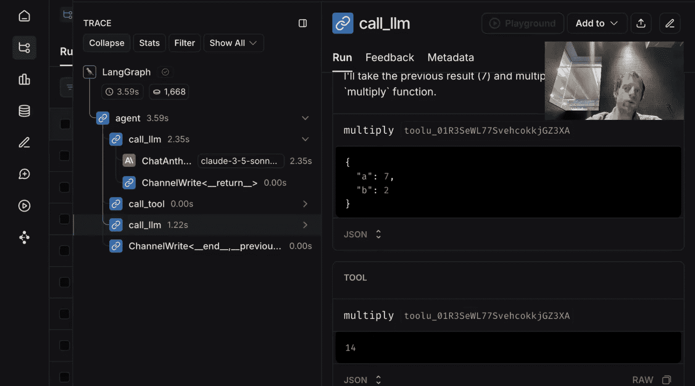
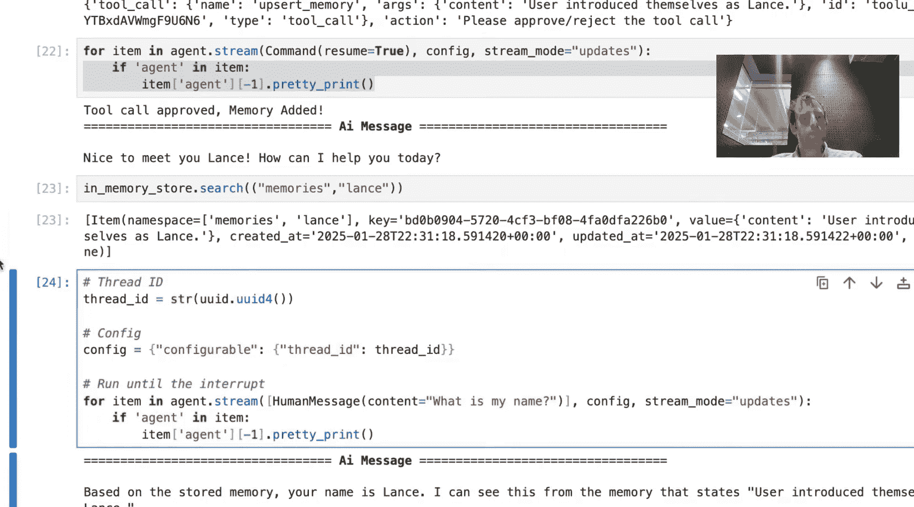
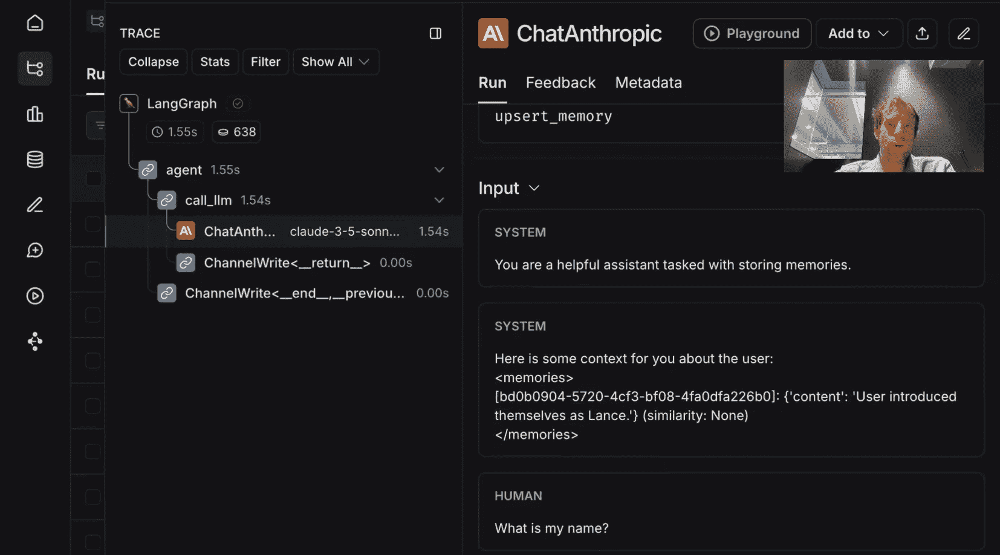
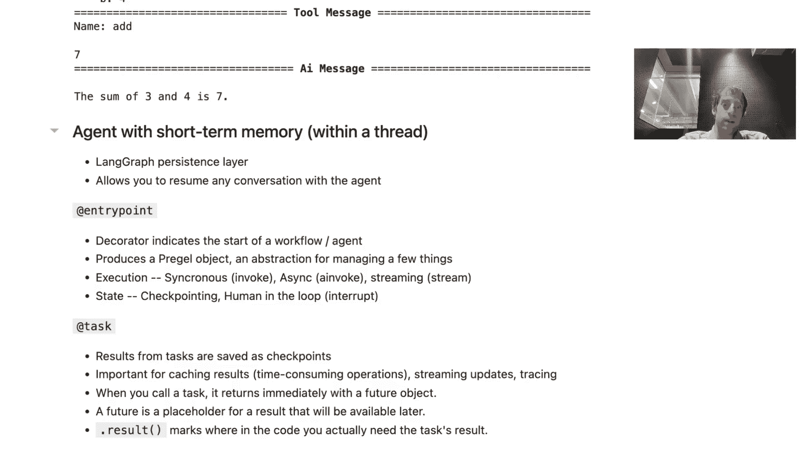

# 022：LangGraph 功能 API 概览 🚀

在本节课中，我们将学习 LangGraph 功能 API 的核心概念。我们将从一个简单的、不使用任何框架的 Python 智能体开始，逐步引入 LangGraph 的功能，展示如何通过添加少量装饰器代码，为你的应用获得持久化、流式处理、调试和部署等强大能力。

## 概述 📋

LangGraph 是一个用于构建 AI 智能体的框架。它的主要优势在于提供了**持久化**、**流式处理**、**调试**和**部署**支持。持久化包括短期记忆、长期记忆和人机交互循环。流式处理允许你实时获取 LLM 调用或智能体状态的更新。调试和部署则通过 LangSmith 等工具提供了可视化和可观测性。

使用框架通常需要学习新的 API。LangGraph 功能 API 的目标是：让你在几乎不改变现有 Python 代码结构的情况下，就能获得 LangGraph 框架的所有好处，将开发开销降到最低。

接下来，我们将通过构建一个算术智能体的例子，一步步展示如何实现这一点。

## 构建基础智能体（无框架）🤖

首先，我们创建一个不使用任何框架的简单智能体。这个智能体能够调用工具进行加、减、乘、除运算。

我们首先定义几个工具函数，并使用 LangChain 的 `@tool` 装饰器将它们包装成标准工具调用接口。

```python
from langchain_anthropic import ChatAnthropic
from langchain.tools import tool

# 定义工具
@tool
def multiply(a: int, b: int) -> int:
    """Multiply two numbers."""
    return a * b

@tool
def add(a: int, b: int) -> int:
    """Add two numbers."""
    return a + b

@tool
def divide(a: int, b: int) -> int:
    """Divide two numbers."""
    return a / b

# 初始化 LLM 并绑定工具
llm = ChatAnthropic(model="claude-3-haiku-20240307")
llm_with_tools = llm.bind_tools([multiply, add, divide])
```

然后，我们编写智能体的核心逻辑：循环调用 LLM，如果 LLM 决定调用工具，则执行工具并将结果返回给 LLM，直到 LLM 给出最终答案。

```python
def call_llm(messages):
    """调用绑定了工具的 LLM"""
    response = llm_with_tools.invoke(messages)
    return response

def call_tool(tool_call):
    """根据 LLM 的决策调用具体工具"""
    # 这里简化处理，实际应根据 tool_call 选择对应函数
    selected_tool = {"add": add, "multiply": multiply, "divide": divide}.get(tool_call["name"])
    if selected_tool:
        return selected_tool.invoke(tool_call["args"])
    else:
        raise ValueError(f"Unknown tool: {tool_call['name']}")

def agent(input_text):
    """智能体主函数"""
    messages = [{"role": "user", "content": input_text}]
    while True:
        # 1. 调用 LLM
        response = call_llm(messages)
        messages.append(response)

        # 2. 检查是否为工具调用
        if not response.tool_calls:
            # 如果没有工具调用，返回最终答案
            return response.content

        # 3. 执行工具调用
        for tool_call in response.tool_calls:
            tool_result = call_tool(tool_call)
            # 将工具执行结果作为消息添加回对话历史
            messages.append({
                "role": "tool",
                "content": str(tool_result),
                "tool_call_id": tool_call['id']
            })

# 测试智能体
result = agent("What is 3 plus 4?")
print(result) # 应输出 7
```

这个智能体可以正常工作，但它缺乏记忆能力，每次对话都是独立的。

## 引入 LangGraph 功能 API 获得持久化 💾

上一节我们构建了一个基础智能体。本节中，我们来看看如何使用 LangGraph 功能 API 为其添加**持久化**（短期记忆）能力，使对话可以跨多次调用延续。

功能 API 主要涉及两个装饰器：
1.  **`@entry_point`**: 标记智能体或工作流的起点。它创建一个用于管理执行和状态的 `Pregel` 对象。
2.  **`@task`**: 标记由入口点函数调用的任何函数。这确保了这些函数的执行结果会被**检查点**保存，这对于缓存耗时操作的结果、支持流式更新和启用追踪至关重要。

以下是修改后的代码：

```python
from langgraph.functional import entry_point, task
from langgraph.checkpoint import MemorySaver

# 1. 使用 @task 装饰器标记函数
@task
def call_llm(messages):
    response = llm_with_tools.invoke(messages)
    return response

@task
def call_tool(tool_call):
    selected_tool = {"add": add, "multiply": multiply, "divide": divide}.get(tool_call["name"])
    if selected_tool:
        return selected_tool.invoke(tool_call["args"])
    else:
        raise ValueError(f"Unknown tool: {tool_call['name']}")

# 2. 定义检查点保存器（实现持久化）
checkpointer = MemorySaver()

# 3. 使用 @entry_point 装饰器定义智能体入口，并注入检查点保存器
@entry_point(checkpointer=checkpointer)
def agent(input_text, config):
    messages = config.get("messages", [{"role": "user", "content": input_text}])
    while True:
        # 注意：调用被 @task 装饰的函数后，需要使用 .result() 获取结果
        response = call_llm(messages).result()
        messages.append(response)

        if not response.tool_calls:
            return response.content

        for tool_call in response.tool_calls:
            tool_result = call_tool(tool_call).result()
            messages.append({
                "role": "tool",
                "content": str(tool_result),
                "tool_call_id": tool_call['id']
            })
```

现在，我们可以像使用一个 LangGraph 应用一样运行智能体，并指定一个 `thread_id` 来保存对话线程。

```python
# 配置线程ID
config = {"configurable": {"thread_id": "thread_123"}}

# 第一次调用
result1 = agent.invoke("What is 3 plus 4?", config)
print(f"First result: {result1}") # 输出 7

# 第二次调用，引用之前的结果
result2 = agent.invoke("Take that result and multiply it by two.", config)
print(f"Second result: {result2}") # 输出 14
```

因为有了持久化层，智能体知道“that result”指的是上一次对话中计算出的 7。我们可以随时查看保存到该线程的完整状态历史。

```python
# 获取保存的状态历史
state_history = agent.get_state_history(config)
print(state_history)
```

## 实现人机交互循环（Human-in-the-Loop）🔄

拥有了持久化能力后，我们可以轻松实现**人机交互循环**，例如在智能体执行敏感操作（如写入数据库）前请求用户批准。

这主要通过 `interrupt` 函数实现。它允许我们在代码执行中暂停，向用户展示信息并等待输入。

我们对 `call_tool` 函数进行修改，在真正执行工具前插入一个中断点：

```python
from langgraph.functional import interrupt

@task
def call_tool(tool_call, config):
    # 在调用工具前中断，请求用户批准
    user_response = interrupt({
        "tool_call": tool_call,
        "action": "Please approve or reject this tool call."
    }, config)

    # 假设用户返回 {"resume": True} 表示批准，False 表示拒绝
    is_approved = user_response.get("resume", False)

    if is_approved:
        selected_tool = {"add": add, "multiply": multiply, "divide": divide}.get(tool_call["name"])
        if selected_tool:
            return selected_tool.invoke(tool_call["args"])
        else:
            raise ValueError(f"Unknown tool: {tool_call['name']}")
    else:
        return "Tool call rejected by user."
```

现在，当智能体尝试调用工具时，执行会暂停。用户（或外部系统）可以通过向智能体发送一个恢复命令来继续。

```python
# 模拟用户批准流程
config = {"configurable": {"thread_id": "thread_456"}}

# 开始执行，会在 tool call 处中断
# 在实际应用中，这通常在一个事件循环或Webhook中处理
# 这里我们模拟用户立即批准
agent.invoke("Add 5 and 6.", config)
# 假设在中断处，系统接收到了 {"resume": True}，然后继续执行
```

一个关键点是 **缓存**：因为 `call_llm` 被标记为 `@task`，它的结果在第一次执行后被缓存。当从中断点恢复时，它不会重新运行，而是直接使用缓存的结果，从而提高了效率。



## 探索时间旅行与分支 🌳



持久化层还开启了 **时间旅行** 的可能性。这意味着你可以回退到智能体执行过程中的任何一个先前检查点，并从那里尝试不同的操作路径（即创建分支）。

以下是如何操作的示例：

```python
# 假设我们已经完成了一次对话，线程ID为 `thread_789`
config = {"configurable": {"thread_id": "thread_789"}}
agent.invoke("What is 10 divided by 2?", config) # 得到结果 5

# 获取状态历史并选择第一个检查点（即计算 10/2 之后的状态）
state_history = agent.get_state_history(config)
fork_point = state_history[0] # 选择你想要分叉的检查点

# 从这个检查点分叉，尝试新的输入
new_config = {
    "configurable": {
        "thread_id": "thread_789_fork", # 新线程ID
        "checkpoint_id": fork_point["checkpoint_id"] # 指定从哪个检查点开始
    }
}
# 从分叉点尝试不同的操作
new_result = agent.invoke("Now multiply that result by 10.", new_config)
print(new_result) # 输出 50 (5 * 10)
```

这在你想要测试智能体在不同决策下的表现，或者纠正智能体错误后重新开始时非常有用。

## 实现长期记忆 🗃️

到目前为止，我们讨论的持久化（短期记忆）是**线程内**的，即局限于一次对话会话。**长期记忆** 允许你在**所有线程（会话）** 之间共享和存储信息，例如用户的姓名、偏好等。

LangGraph 通过 `BaseStore` 抽象来实现这一点。以下是一个示例：

```python
from langgraph.store import BaseStore, MemoryStore

# 1. 创建一个存储长期记忆的 Store
long_term_memory_store = MemoryStore()

# 2. 定义一个工具，用于向长期记忆写入信息
@tool
def update_memory(key: str, value: str, store: BaseStore):
    """Update long-term memory."""
    store.put("user_memories", key, {"info": value})
    return f"Memory updated for key: {key}"

# 3. 修改智能体入口，同时注入检查点保存器和长期记忆存储
@entry_point(checkpointer=checkpointer, store=long_term_memory_store)
def agent_with_memory(input_text, config):
    # 获取当前线程的短期记忆（消息历史）
    thread_messages = config.get("messages", [{"role": "user", "content": input_text}])

    # 从长期记忆存储中读取信息
    all_memories = {}
    for key, value in long_term_memory_store.search("user_memories"):
        all_memories[key] = value["info"]

    # 将长期记忆格式化并加入系统提示
    memory_prompt = "User memories:\n" + "\n".join([f"- {k}: {v}" for k, v in all_memories.items()])
    system_message = {"role": "system", "content": f"You are a helpful assistant. {memory_prompt}"}

    messages = [system_message] + thread_messages
    # ... 后续循环调用 llm 和 tool 的逻辑与之前类似 ...
    # 当需要更新记忆时，智能体会调用 `update_memory` 工具
```

现在，智能体可以在一个会话中记住用户的信息，并在未来的任何新会话中使用它。



```python
# 会话 1：告诉智能体你的名字
config1 = {"configurable": {"thread_id": "session_1"}}
agent_with_memory.invoke("Please remember that my name is Lance.", config1)
# 智能体会调用 update_memory 工具，将 (“name”, “Lance”) 存入长期存储。

# 会话 2：在新的对话中询问名字
config2 = {"configurable": {"thread_id": "session_2"}}
answer = agent_with_memory.invoke("What's my name?", config2)
print(answer) # 输出：Your name is Lance.
```



## 总结 🎯

本节课中，我们一起学习了 LangGraph 功能 API 的核心价值与应用方法。

我们从一个纯 Python 实现的简单智能体开始，逐步演示了如何通过添加 `@entry_point` 和 `@task` 等少量装饰器，为其注入强大的框架能力：

1.  **短期记忆（持久化）**：使智能体能够进行长时间、可中断的对话，所有状态自动保存到线程中。
2.  **人机交互循环**：允许在关键步骤（如工具调用）中断执行，请求用户批准或输入。
3.  **时间旅行与分支**：能够回退到任意历史检查点，并尝试不同的执行路径，便于调试和探索。
4.  **长期记忆**：通过 `BaseStore` 在不同对话线程间共享信息，实现跨会话的记忆。
5.  **开箱即用的追踪与调试**：所有步骤自动被记录，可以在 LangSmith 等工具中可视化查看执行流程。



最重要的是，获得这些功能所需的代码改动非常小。你基本上只需要用装饰器包装现有的函数，就能将普通的 Python 代码转变为具备生产级特性的 LangGraph 应用。这使得 LangGraph 功能 API 成为快速构建和迭代 AI 智能体应用的理想选择。