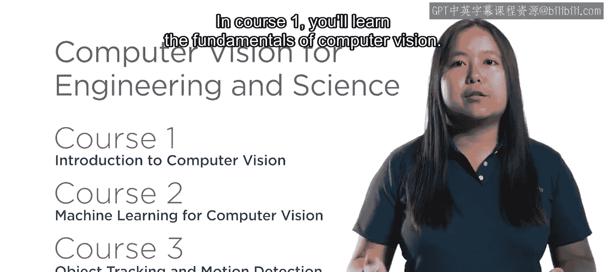
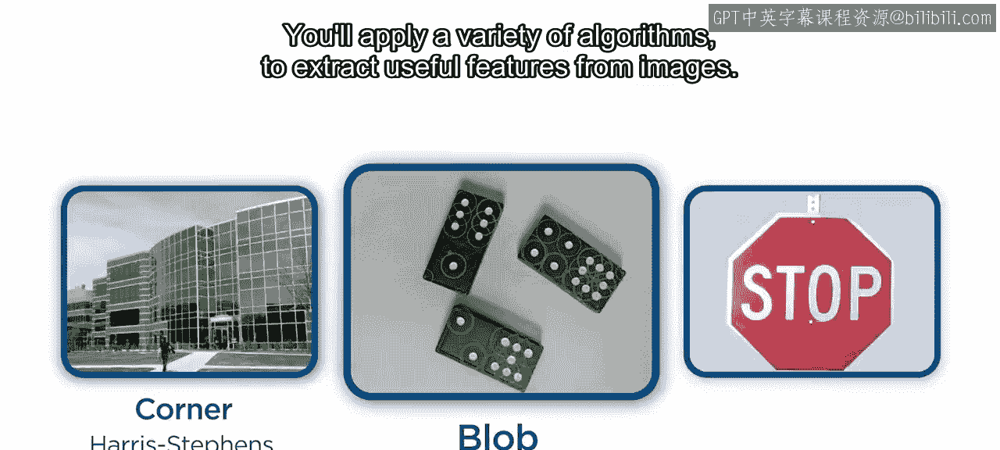
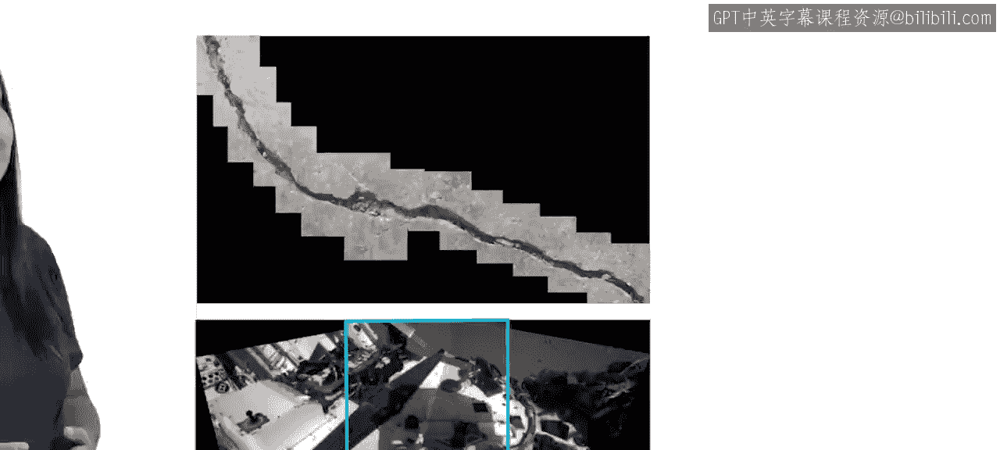
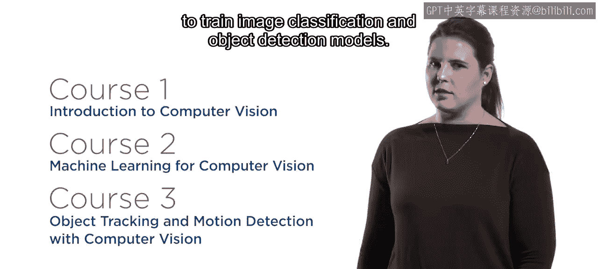
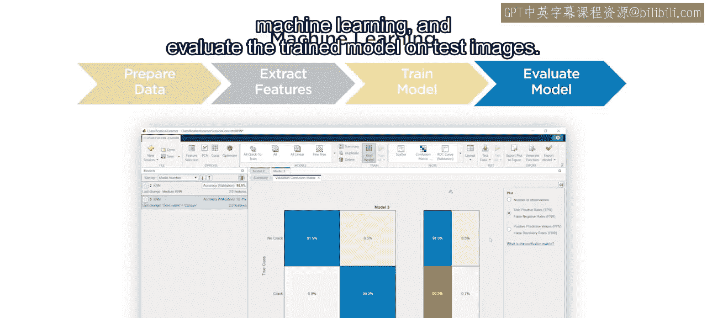
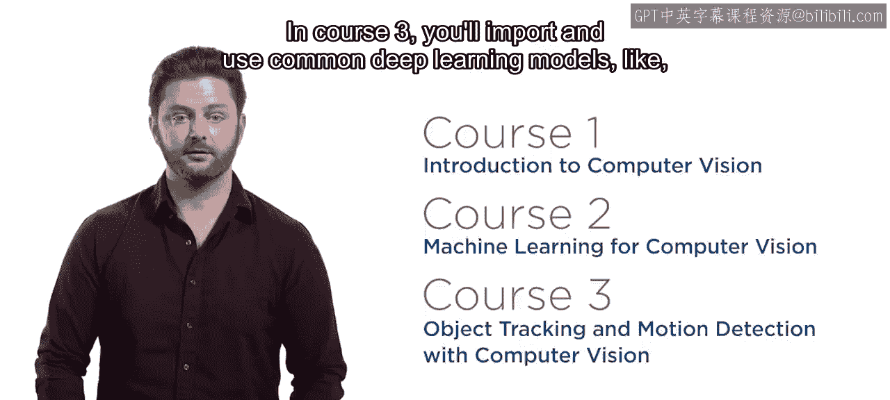
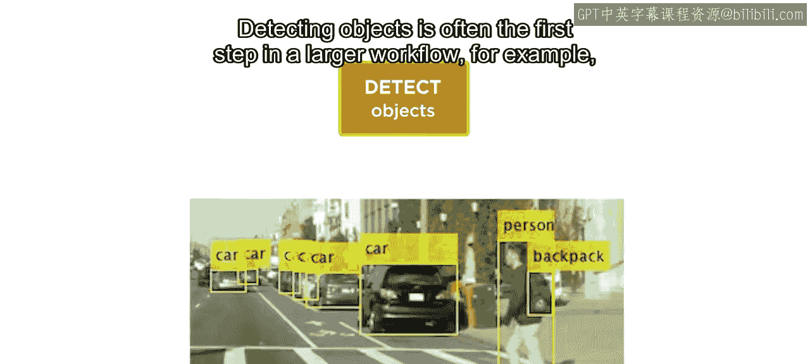
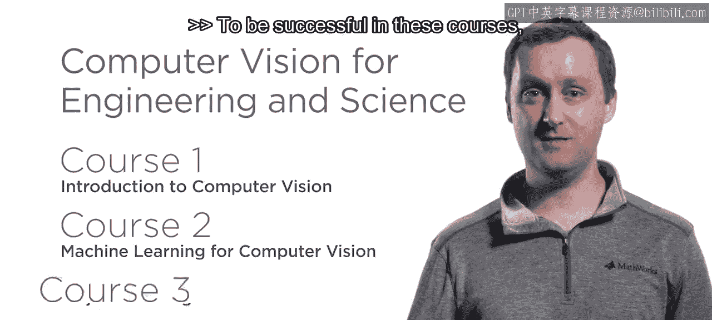
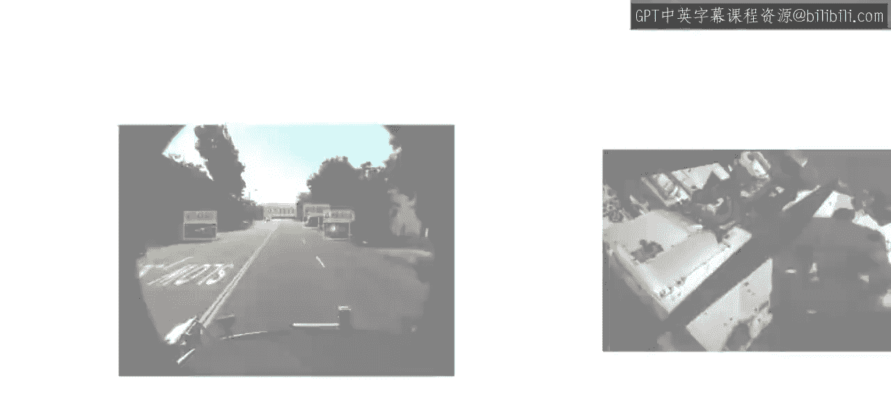

# 工程与科学计算机视觉：1：课程简介与概述

在本节课中，我们将要学习MathWorks在Coursera平台上开设的《工程与科学计算机视觉》专项课程的整体介绍。我们将了解计算机视觉的广泛应用、课程结构以及你将通过本系列课程掌握的核心技能。

计算机视觉算法正运行在我们的手机、汽车甚至冰箱上。随着越来越多的设备配备摄像头，对具备计算机视觉经验的人才需求正在快速增长。为此，MathWorks在Coursera上创建了《工程与科学计算机视觉》专项课程。

这个包含三门课程的专项课程将引导你完成一系列实际项目，例如对齐卫星图像、训练识别路标的模型，以及跟踪即使移出视野的物体。

## 🧠 课程一：计算机视觉基础

上一节我们了解了课程的整体背景，本节中我们来看看第一门课程的具体内容。

在课程一中，你将学习计算机视觉的基础知识。你将应用多种算法从图像中提取有用的特征。这些特征被广泛应用于图像配准、分类和跟踪等任务中。

以下是课程一结束时你将能够完成的核心任务：
*   检测、提取和匹配图像特征。
*   对齐并拼接多张图像。

## 🤖 课程二：机器学习与特征应用

掌握了基础特征提取后，本节我们将探讨如何将这些特征与机器学习结合。

在专项课程的第二门课中，你将使用这些图像特征，结合流行的机器学习算法，来训练图像分类和目标检测模型。然而，训练模型只是工作流程的一部分。为了获得良好结果，你需要学习如何为机器学习妥善准备图像，并在测试图像上评估训练好的模型。

重要的是，你所获得的这些技能同样适用于深度学习。在深度学习中，特征提取是由网络在训练过程中自动完成的。

## 🔍 课程三：深度学习与目标跟踪

在学习了传统机器学习方法后，本节我们将目光转向更强大的深度学习模型。

说到深度学习，目前已有大量现成的模型可用。在课程三中，你将导入并使用像YOLO这样的常见深度学习模型来执行目标检测。目标检测通常是更大工作流程的第一步。

以下是目标检测的典型后续应用：
*   将检测与运动预测结合，以区分并随时间跟踪多个物体。
*   在专项课程结束时，你将应用跟踪技术来统计繁忙道路上每个方向的车辆数量。

## 📚 预备知识建议

为了在这些课程中取得成功，具备一些先前的图像处理经验会很有帮助。如果你完全是图像数据处理的新手，我们建议你同时报名参加我们在Coursera上的《工程与科学图像处理》专项课程。

## 🎯 总结

本节课中我们一起学习了《工程与科学计算机视觉》专项课程的概览。计算机视觉是一个令人兴奋且不断发展的领域。随着图像和摄像头变得比以往任何时候都更加重要，本专项课程将为你提供在这个世界中取得成功所需的技能。