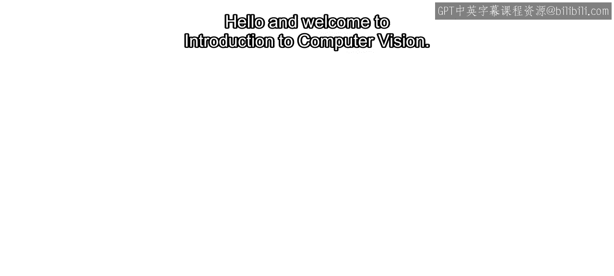
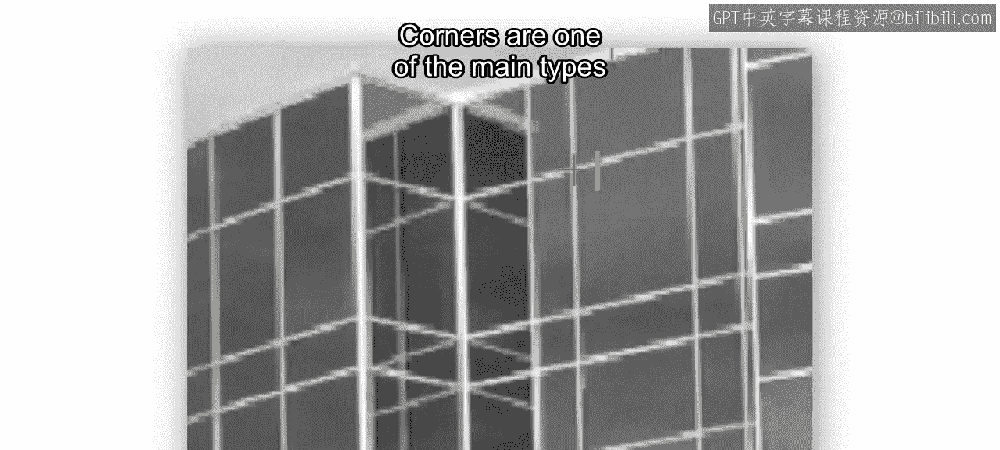
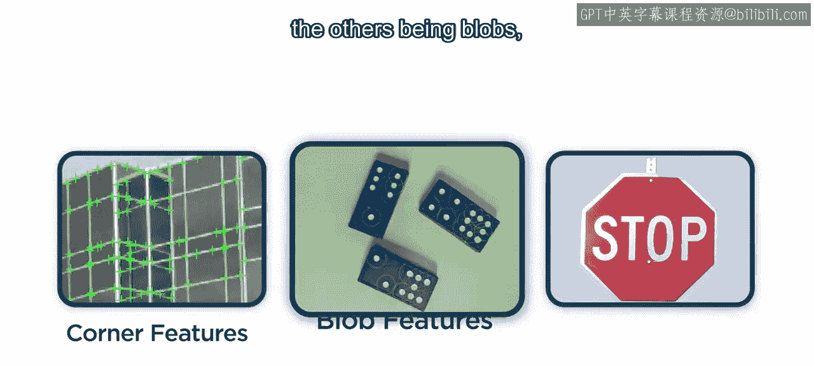
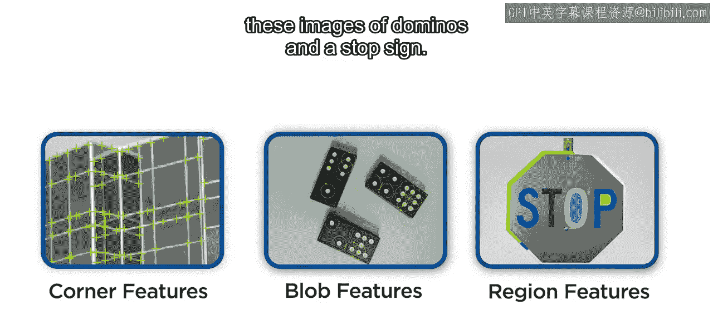
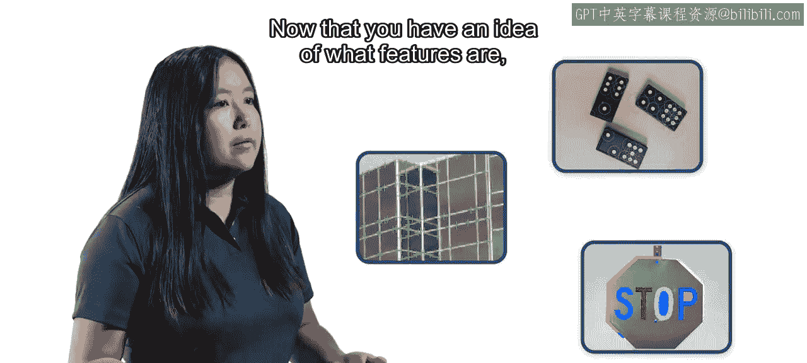
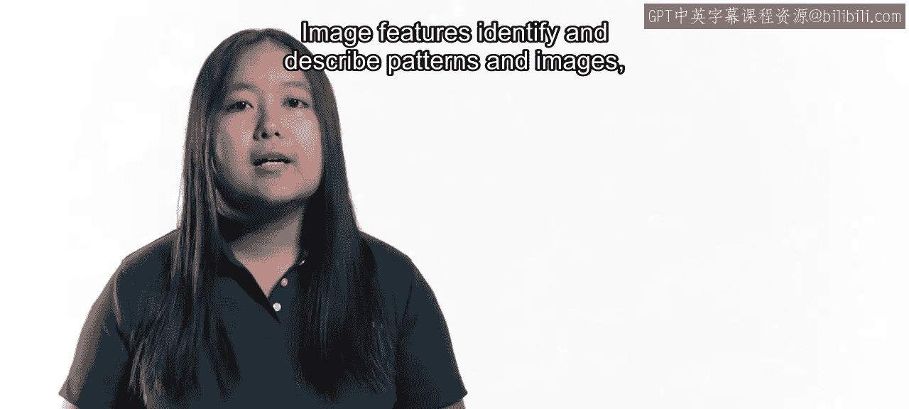
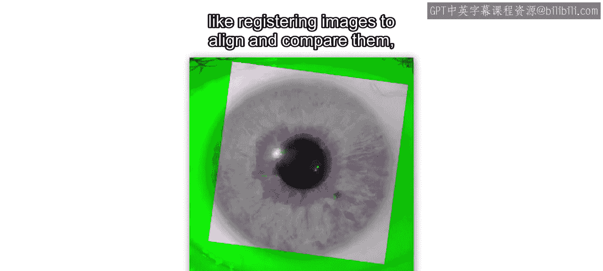
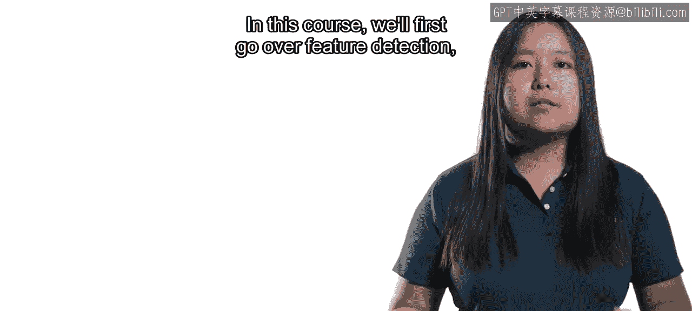
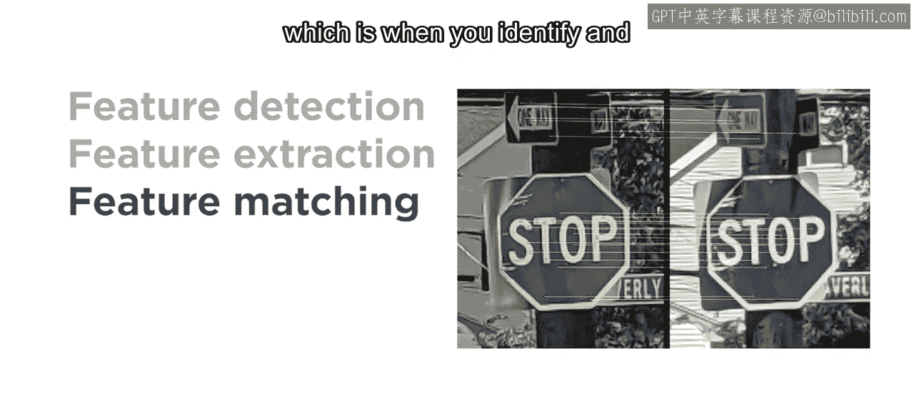
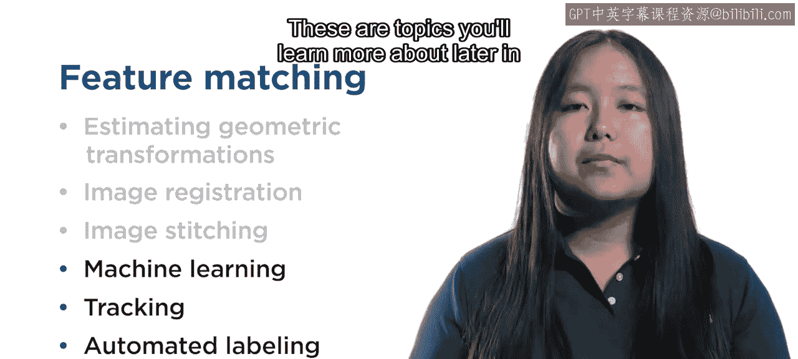

计算机视觉入门：P02-1：什么是特征 🎼

欢迎学习计算机视觉入门课程。

计算机视觉中最重要的概念之一是图像特征。那么，图像特征究竟是什么？为了回答这个问题，让我们来看一张建筑物的灰度图像。你首先注意到的是什么？你可能会说小路、门，或者走在中间的人。但计算机的视角有所不同。

请记住，数字图像本质上只是一个数字数组。因此，在计算机视觉的语境中，特征在本质上更具技术性。例如，计算机会看到代表这个窗角强度的数值，并利用这些值来识别这个位置发生了巨大变化。计算机将能够检测到边缘和角点。

角点是计算机视觉中主要的特征类型之一。

其他主要类型包括斑点，即图像中亮度与其周围区域不同的区域。

以及具有均匀强度的区域，如下面这些多米诺骨牌和停车标志图像中所示。

现在你对特征有了初步了解，你可能会想，为什么它们对计算机视觉如此重要。

图像特征能够识别和描述图像中的模式，这些模式可用于执行多种任务。例如，对图像进行配准以对齐和比较它们。

将多张图像拼接在一起以形成更宽的全景图。

以及将图像分类到不同的类别中。在本课程中，我们将首先介绍特征检测，你将使用多种算法来识别特征的位置，例如用于角点的**Harris角点检测算法**和用于斑点的**SURF（加速稳健特征）算法**。

😊

接下来，你将学习特征提取，也称为特征描述，它描述了特征周围像素邻域的信息。你还将进行特征匹配。

特征匹配是指在不同图像中识别和匹配相似的特征描述。

特征匹配对于许多工作流程至关重要，例如估计几何变换、图像配准和图像拼接。这些都是你将在本课程中探索的内容。不仅如此，特征还应用于机器学习、目标跟踪和自动化标注工作流程中。

这些是你将在本专项课程后续部分深入学习的主题。

让我们开始吧。