# 工程与科学计算机视觉：3：检测特征 🎯

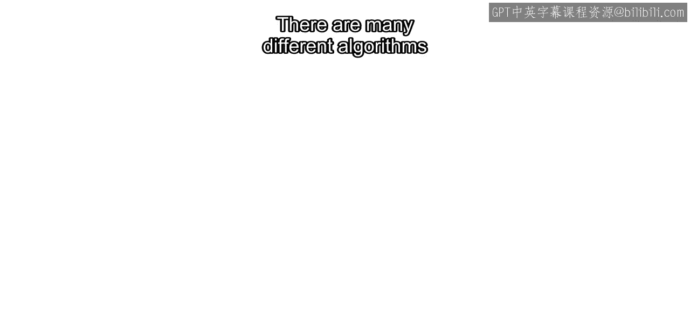

在本节课中，我们将学习如何在图像中检测特征。特征检测是计算机视觉的基础步骤，它能帮助我们识别图像中的关键点、区域或结构，为后续的图像匹配、目标识别等任务做准备。我们将通过三个具体示例，介绍三种流行的特征检测算法：Harris角点检测、SURF斑点检测和MSER区域检测。

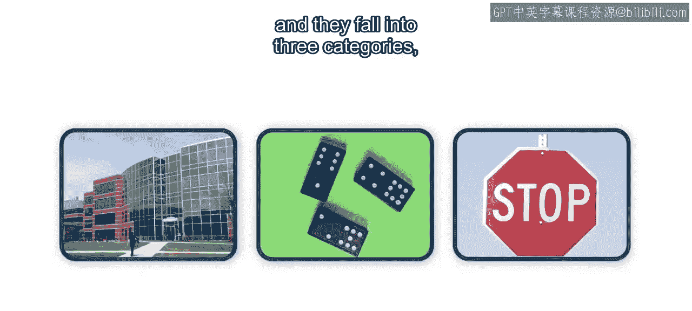

---

有许多不同的算法用于检测特征，它们主要分为三类：角点、斑点和区域。

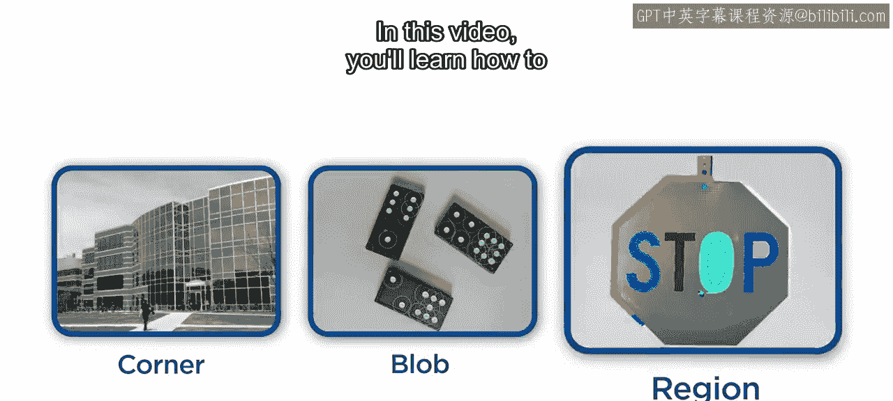


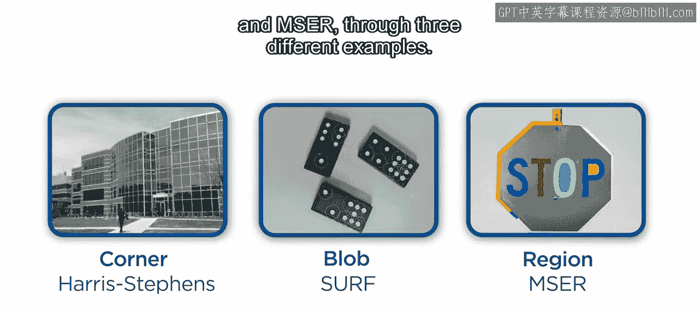

在本视频中，你将学习如何应用三种流行的特征检测算法。


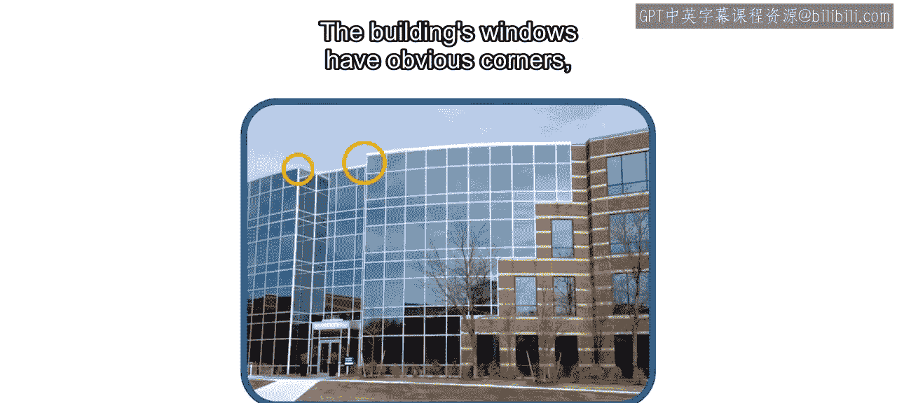

它们分别是：Harris角点检测、SURF（加速稳健特征）以及MSER（最大稳定极值区域）。我们将通过三个不同的例子来演示。

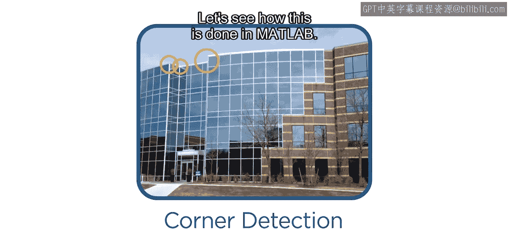

### 示例一：使用Harris算法检测角点

我们将从一张办公楼的图像开始。这栋建筑的窗户有明显的角点。


你可以使用Harris角点检测算法来检测这些角点。让我们看看如何在MATLAB中实现。

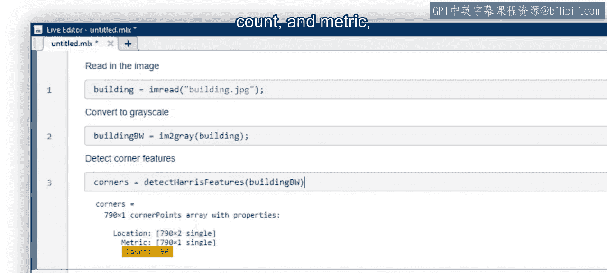

首先，读入图像并将其转换为灰度图。检测结构特征（如角点和斑点）通常不需要颜色信息。

```matlab
img = imread('office_building.jpg');
grayImg = rgb2gray(img);
```

然后，使用 `detectHarrisFeatures` 函数来寻找角点特征。

```matlab
corners = detectHarrisFeatures(grayImg);
```

输出是一个 `cornerPoints` 对象。这个对象有三个属性：`Location`、`Count` 和 `Metric`。你可以使用点号来访问这些属性。

*   `Location` 包含每个检测到的特征的X、Y坐标。
*   `Metric` 包含每个特征的强度值。在许多算法中，这个值代表对比度的度量。值越大，检测到的特征越强。
*   `Count` 是检测到的特征数量。

看起来这个函数找到了很多特征。为了可视化检测到的特征，可以显示图像，使用 `hold on` 命令以便在其上叠加显示特征，然后使用 `cornerPoints` 对象来绘制这些特征点。

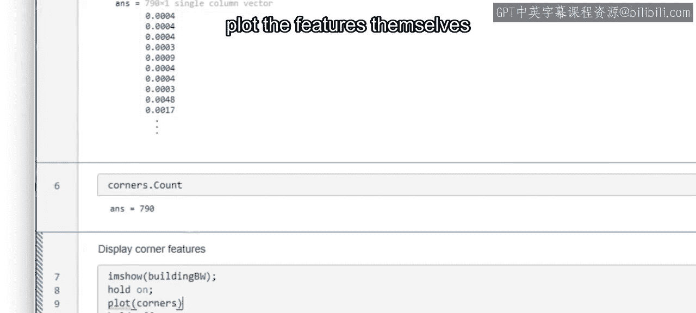

```matlab
imshow(img);
hold on;
plot(corners);
hold off;
```


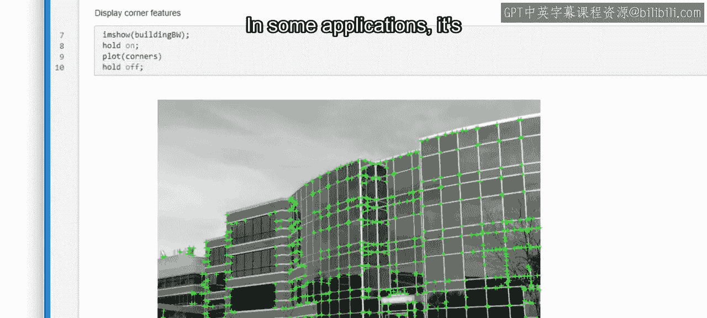

在某些应用中，专注于最强的特征是一个好主意。为此，可以使用 `selectStrongest` 函数，并指定要返回的特征数量。

```matlab
strongCorners = selectStrongest(corners, 100);
imshow(img);
hold on;
plot(strongCorners);
hold off;
```

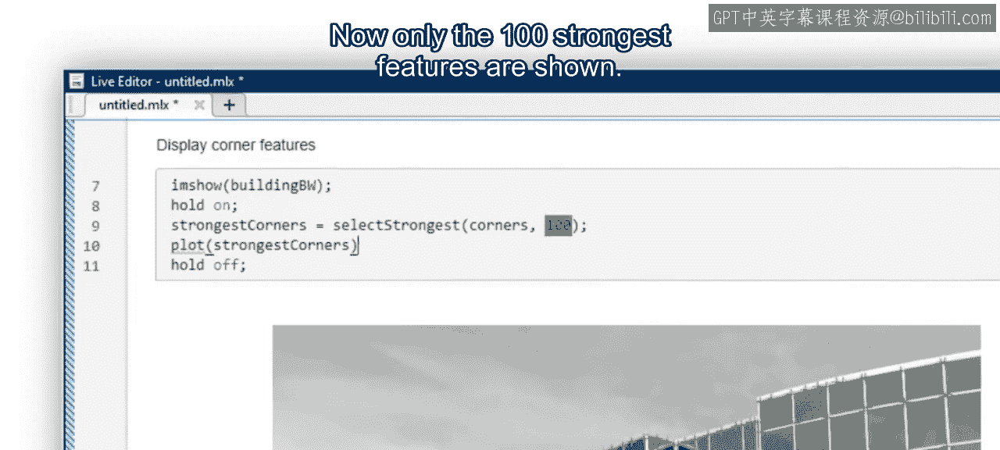

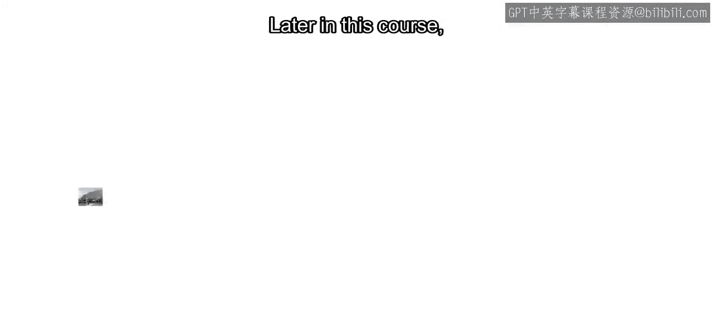

现在，只显示了100个最强的特征。


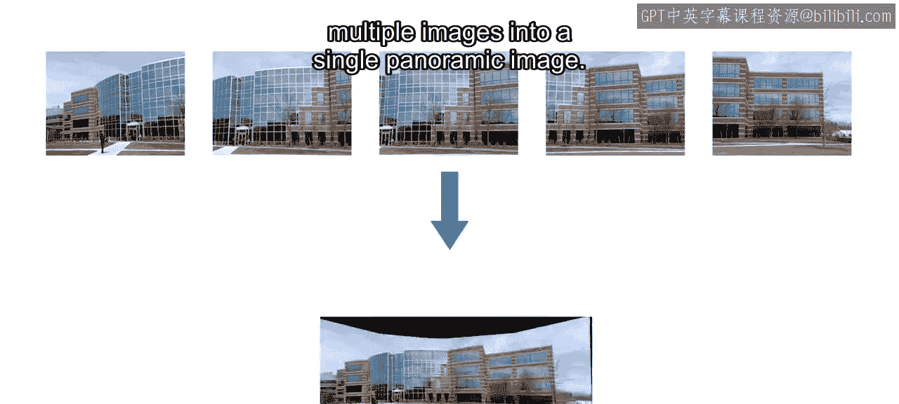

在本课程后面，你将使用角点特征将多张图像拼接成一张全景图。

### 示例二：使用SURF算法检测斑点

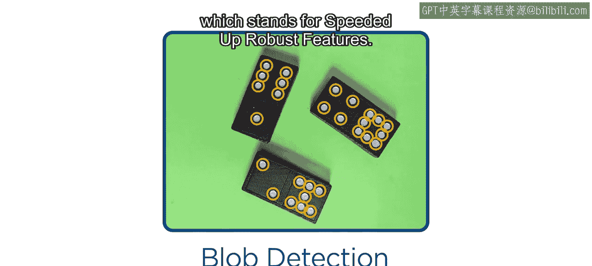

然而，并非所有有用的特征都是角点。例如，让我们使用斑点检测器来定位这些多米诺骨牌上的白点。

一个常见的斑点检测算法是SURF，它代表“加速稳健特征”。这里的工作流程与角点检测相同。

导入图像并转换为灰度图，然后使用 `detectSURFFeatures` 函数。

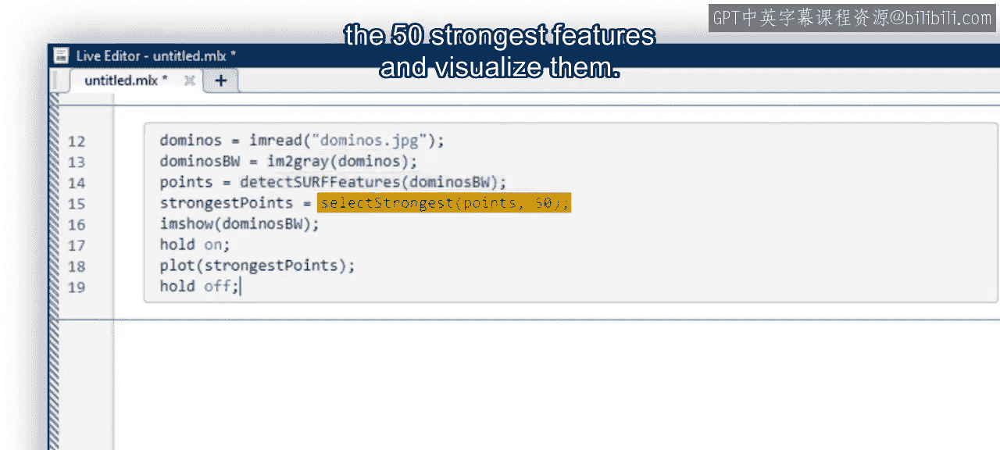

```matlab
img = imread('dominoes.jpg');
grayImg = rgb2gray(img);
blobs = detectSURFFeatures(grayImg);
```

让我们将结果限制在50个最强的特征，并进行可视化。

```matlab
strongBlobs = selectStrongest(blobs, 50);
imshow(img);
hold on;
plot(strongBlobs);
hold off;
```

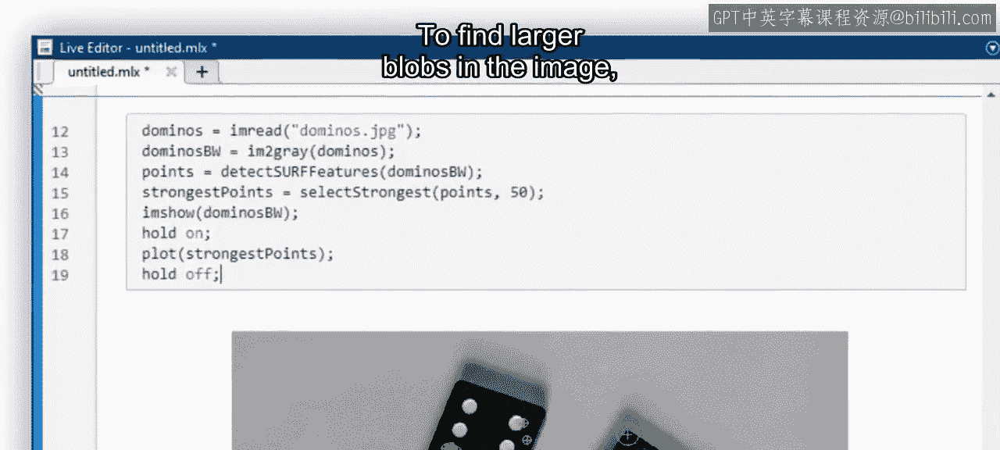


这些斑点比我们想要的小得多。与角点特征不同，斑点特征有与之关联的大小。为了在图像中找到更大的斑点，需要调整 `detectSURFFeatures` 的一个选项，叫做 `NumOctaves`。

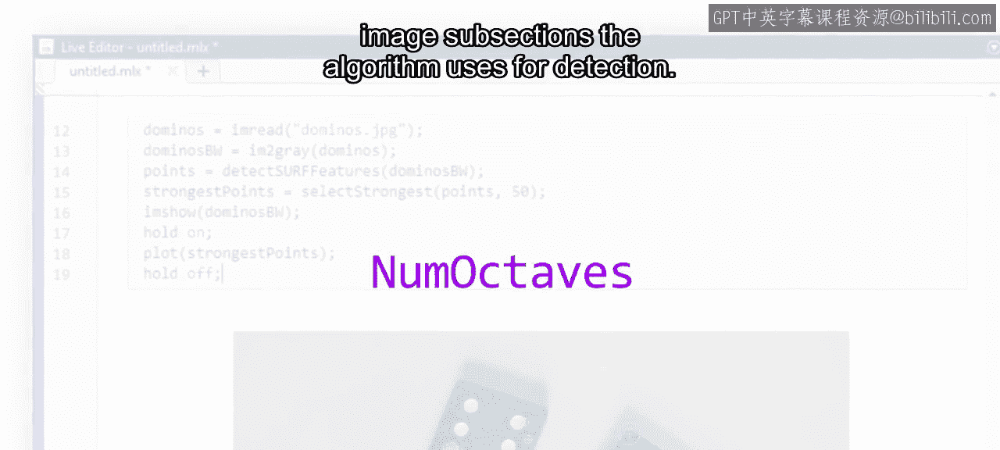

`NumOctaves` 决定了算法用于检测的图像子区域的大小。例如，默认值为3时，算法专注于像这样的小子区域来尝试检测斑点。更高的值，比如5，则专注于图像中更大的子区域。

因为白点比检测到的特征大，所以你需要增加 `NumOctaves` 的值，如下所示。

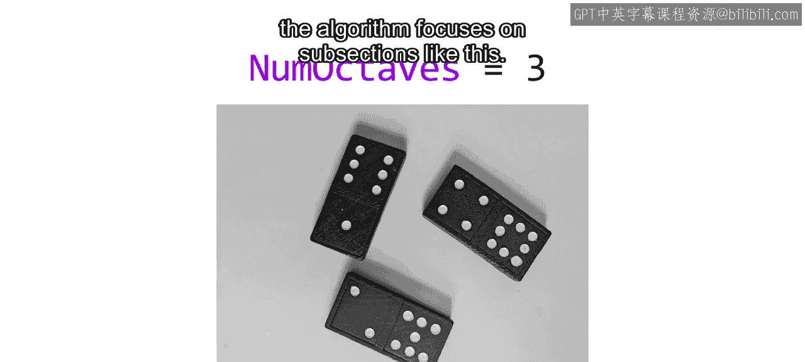

```matlab
blobs = detectSURFFeatures(grayImg, 'NumOctaves', 5);
strongBlobs = selectStrongest(blobs, 50);
imshow(img);
hold on;
plot(strongBlobs);
hold off;
```

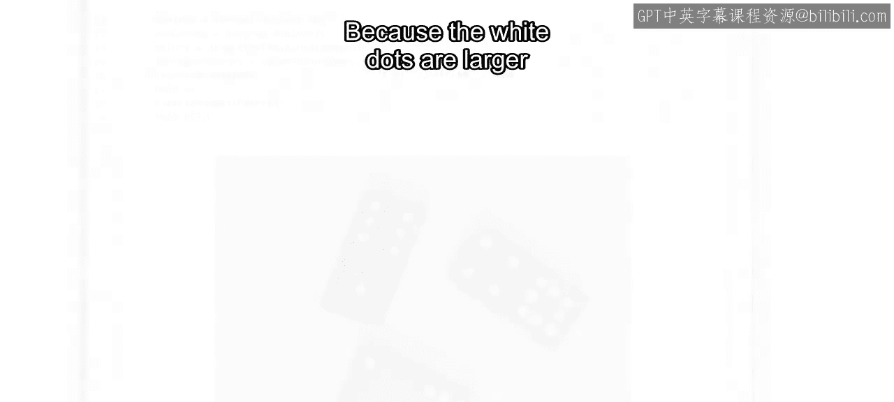
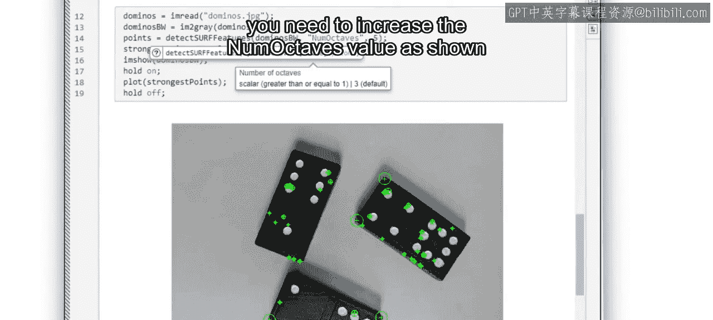


现在看起来好多了。


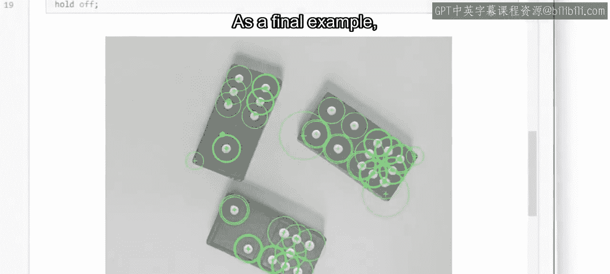

### 示例三：使用MSER算法检测区域

作为最后一个例子，考虑具有均匀强度区域的图像，比如这张停止标志的照片。

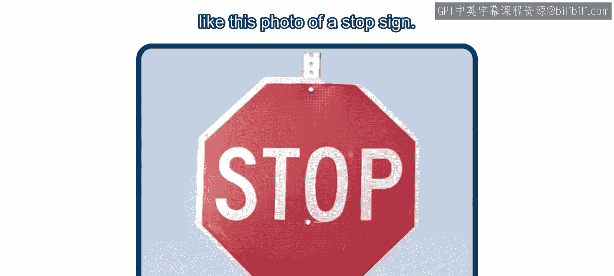


对于这类图像，MSER（最大稳定极值区域）算法通常有助于特征检测。

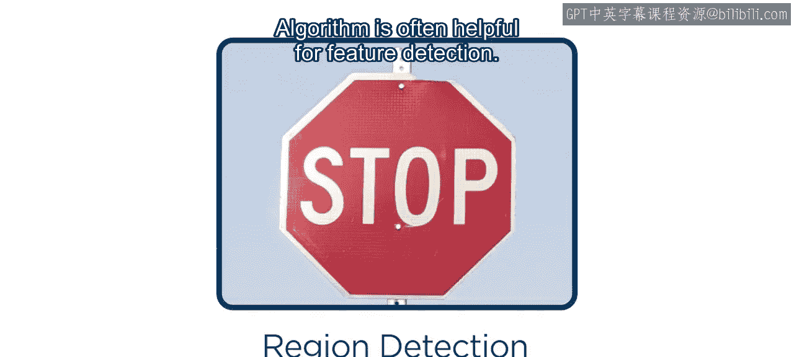

就像前两个例子一样，使用对应的函数来检测这张停止标志图像中的区域。

```matlab
img = imread('stop_sign.jpg');
grayImg = rgb2gray(img);
regions = detectMSERFeatures(grayImg);
```

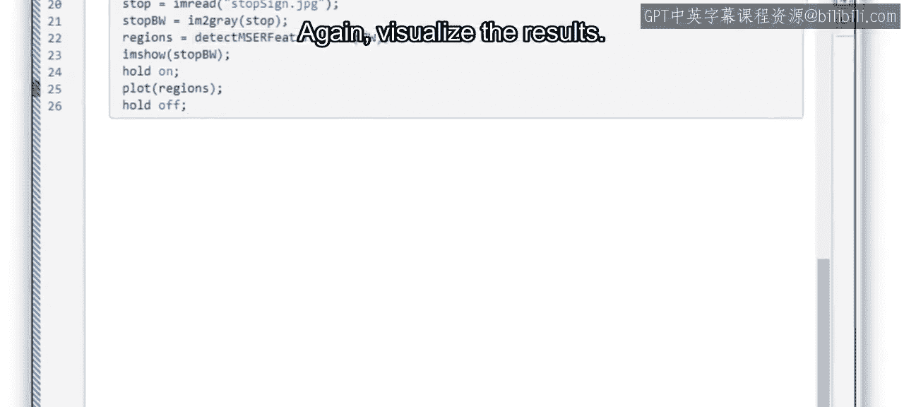

再次可视化结果。

```matlab
imshow(img);
hold on;
plot(regions);
hold off;
```

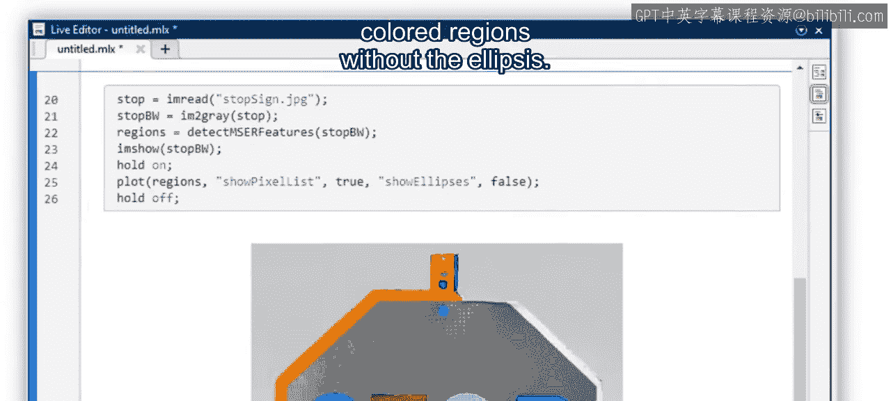


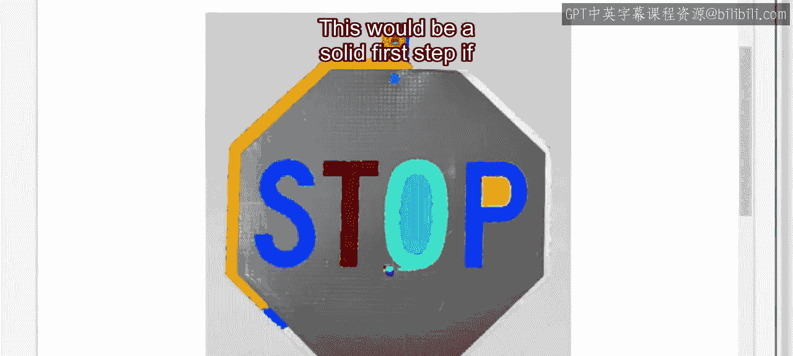

为了让区域显示得更清晰，可以调整 `showPixelList` 和 `showEllipses` 选项，以显示不带椭圆的彩色区域。

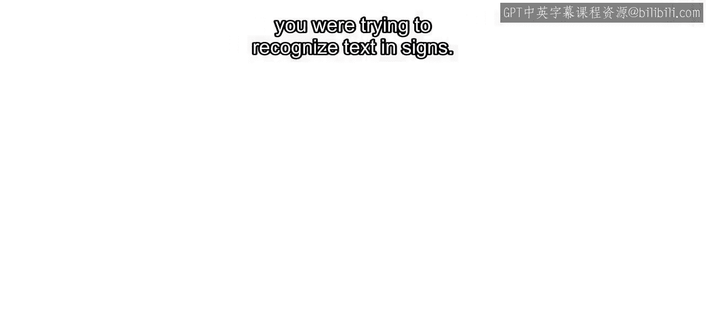

```matlab
imshow(img);
hold on;
plot(regions, 'showPixelList', true, 'showEllipses', false);
hold off;
```


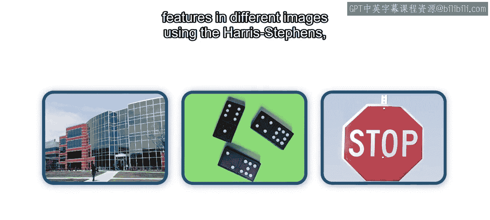

所有的字母都被检测为特征。如果你试图识别标志中的文字，这将是一个坚实的第一步。

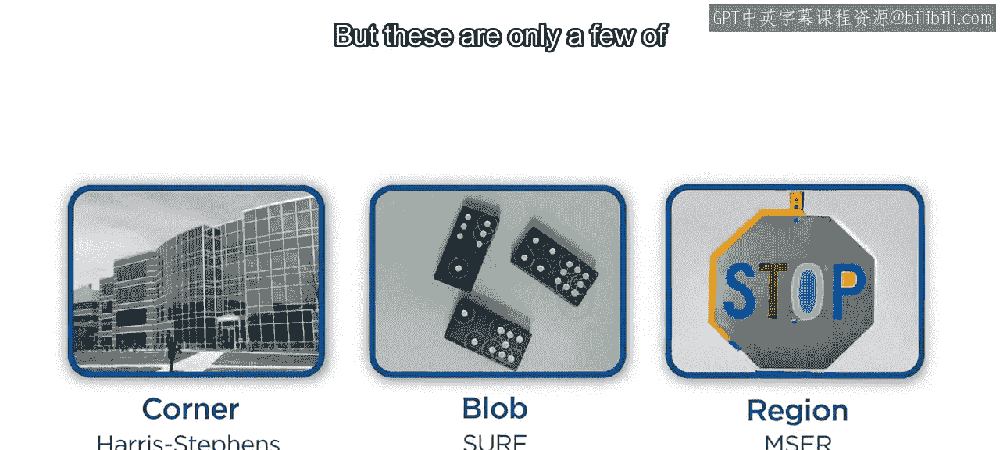

---

### 总结

本节课中，我们一起学习了如何使用Harris、SURF和MSER算法在不同图像中检测特征。但请注意，这只是众多可用特征检测算法中的几种。很难预知在特定应用中你会想要使用哪一种，因此你通常需要用自己的图像尝试多种方法。