# 工程与科学计算机视觉：4：提取特征 🎼

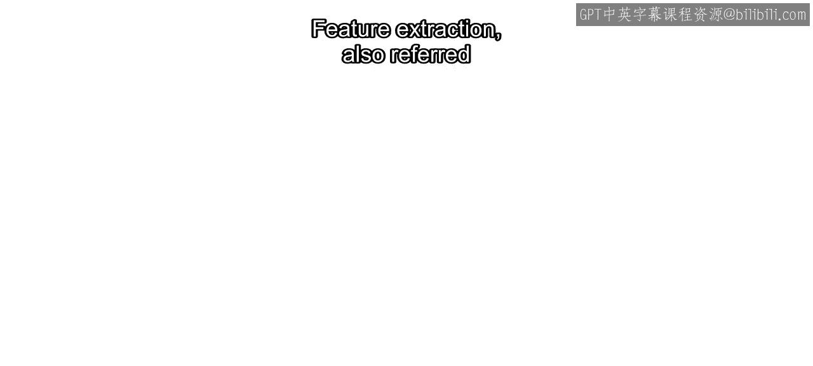

在本节课中，我们将学习计算机视觉流程中的关键一步：特征提取。我们将了解什么是特征描述符，它们如何被计算，以及它们在图像匹配、配准和机器学习等任务中的重要作用。

---

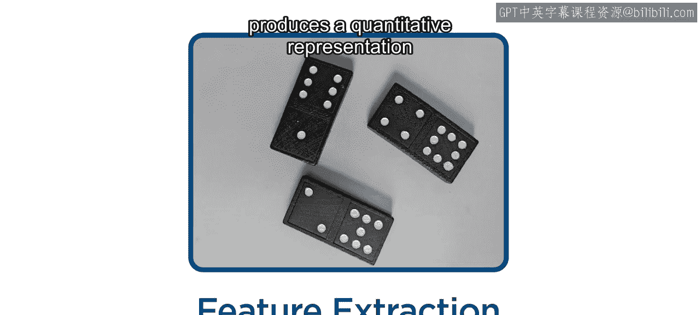

特征提取，也称为特征描述，其目的是为检测到的特征点周围的像素邻域生成一个定量表示。


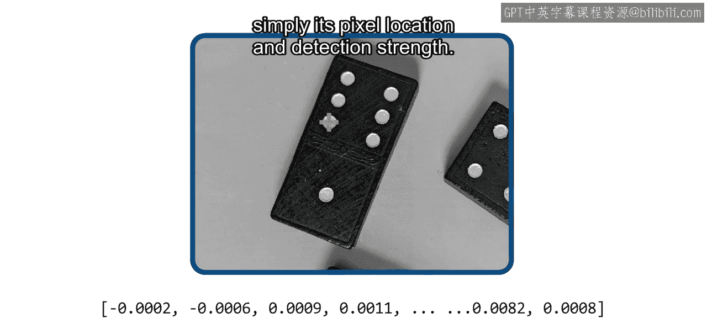

这种表示通常以**向量**的形式存在，被称为**特征描述符**。一个描述符所包含的信息远不止特征点的像素位置和检测强度。


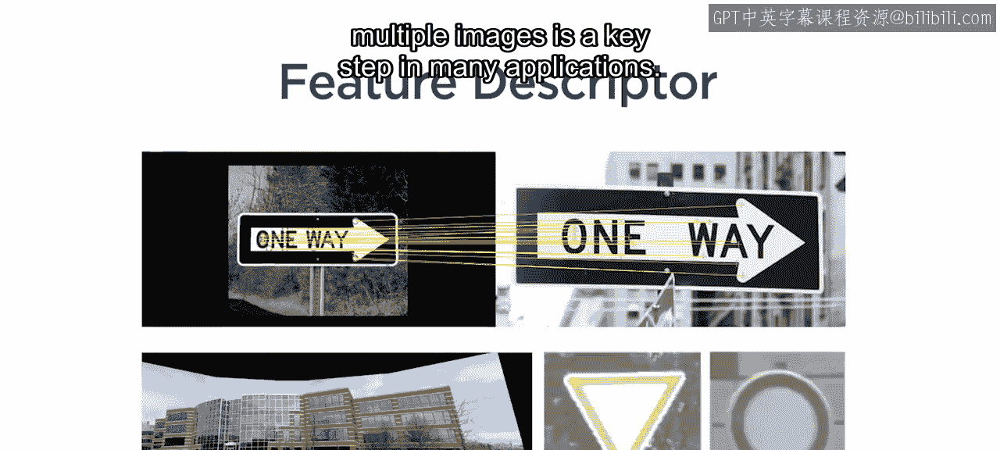

特征描述符有多种用途。在多幅图像中匹配特征是许多应用中的关键步骤。


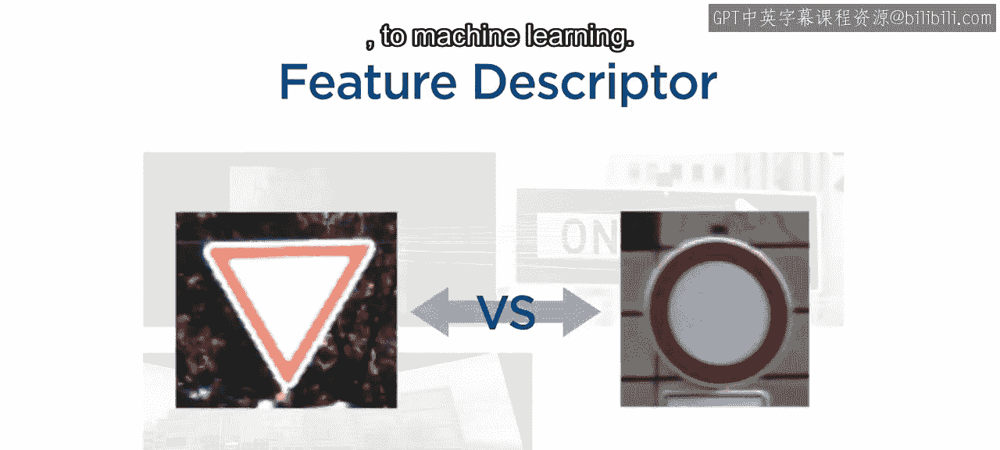

从图像配准与拼接，到机器学习，都离不开它。


与特征检测一样，也存在许多不同的特征提取算法，例如 **SURF**、**FREAK** 和 **ORB**。在本视频中，我们将重点介绍 **SURF** 提取算法，因为它被用于图像分类，并且许多其他提取算法也使用类似的技术。

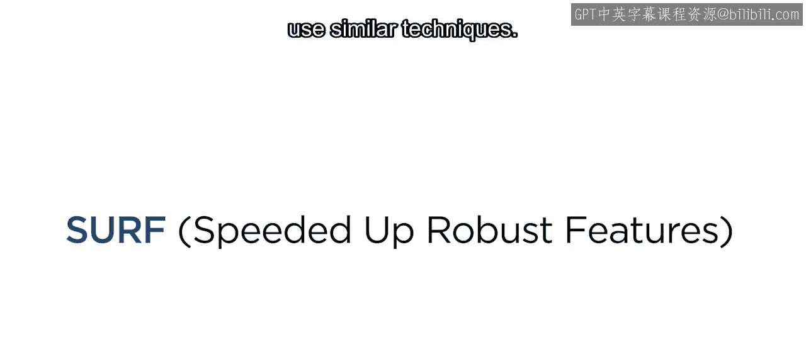


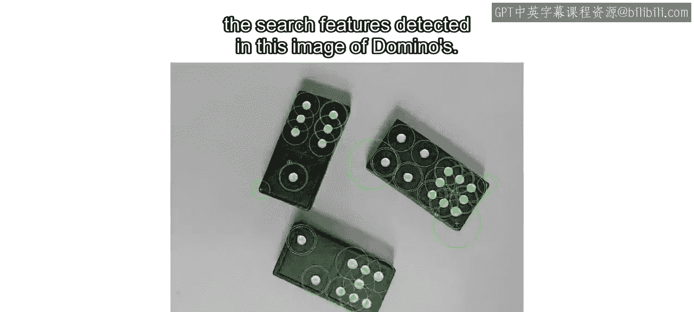

## 回顾SURF特征检测

首先，让我们回顾一下在这张多米诺骨牌图像中检测到的SURF特征。

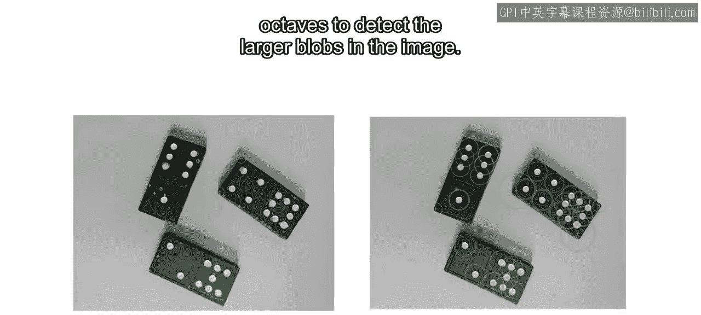


我们曾调整了**octaves**的数量，以检测图像中更大的斑点。


对于每个octave，算法会在四种滤波器尺寸下搜索图像。octave的数量决定了尺寸的范围。这意味着同一个特征可能在多个尺度下被检测到，因此SURF被认为是一种**尺度不变**的算法。


## SURF特征提取过程

在检测步骤识别出SURF特征点之后，SURF提取算法会计算它们的主方向。

以下是计算主方向的步骤：
1.  算法首先确定特征点周围的一个圆形邻域（如图中圆圈所示）。
2.  利用该区域内像素强度的局部梯度估计，确定一个主方向。

这个方向对我们来说可能意义不大，但它使得算法在另一幅图像中即使特征发生了旋转，也能更容易地识别出同一个特征。像SURF这样具有此特性的算法，被称为**旋转不变**算法。

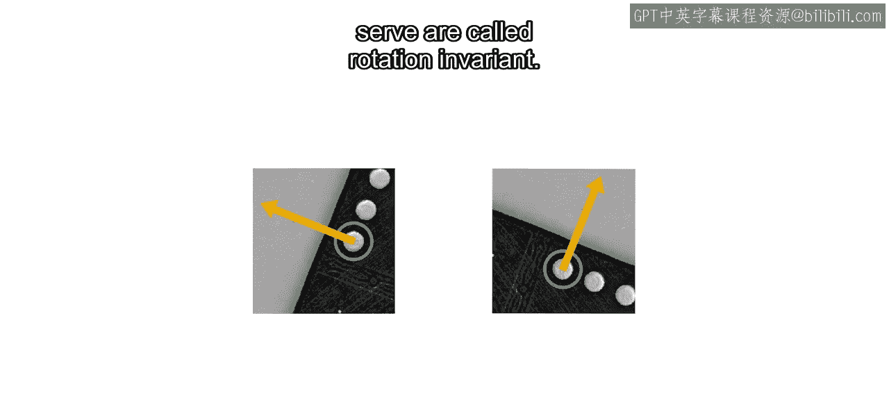


接着，SURF算法会围绕特征点隔离出一个正方形区域，该区域的两条边垂直于主方向，如图所示。

之后，这个正方形被划分为16个子区域。为每个子区域计算四个梯度值。最后，所有这些值被收集到一个向量中，形成**64维的特征描述符**。

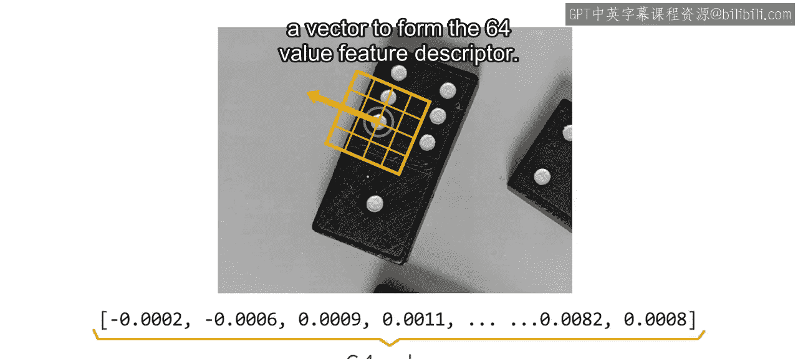


## 不变性的权衡

需要注意的是，并非所有算法都具有尺度和旋转不变性。你可能会想，为什么有人会使用不具备这些不变性的算法呢？

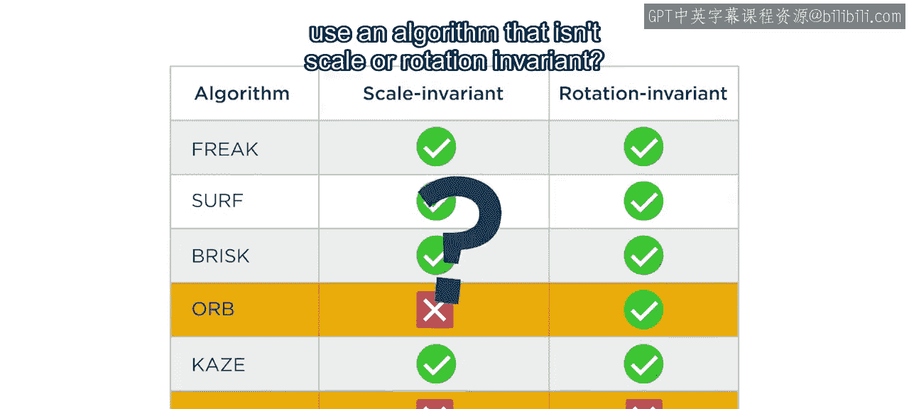


虽然这些不变性对某些应用非常有帮助。

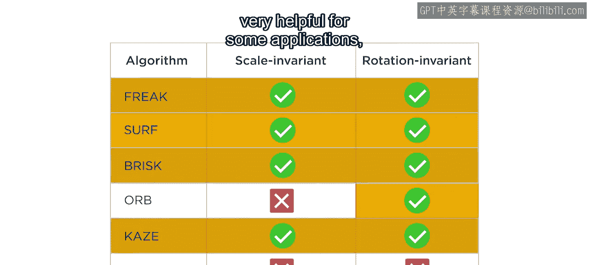


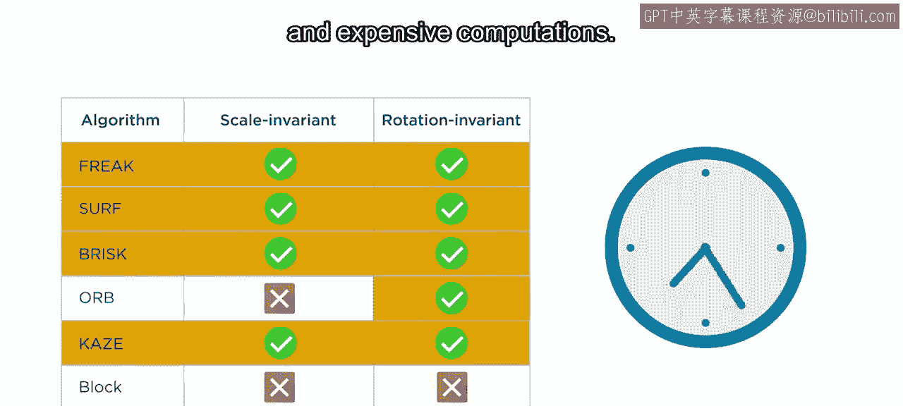

但它们会导致更复杂和更昂贵的计算。


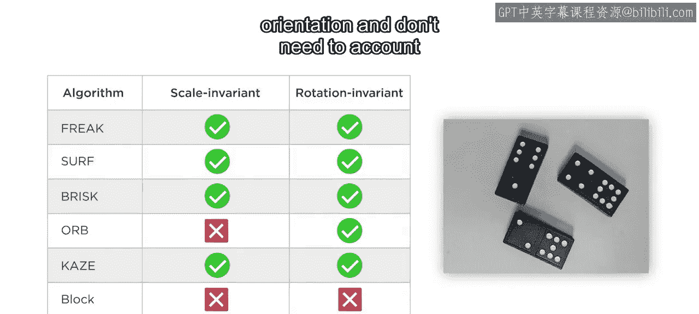

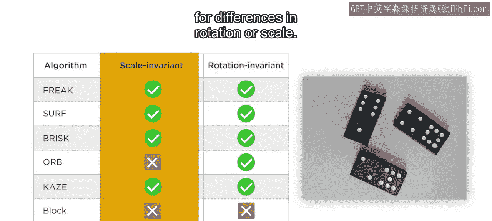

根据你的应用场景，你可能有一个固定方向的摄像头，不需要考虑旋转差异。


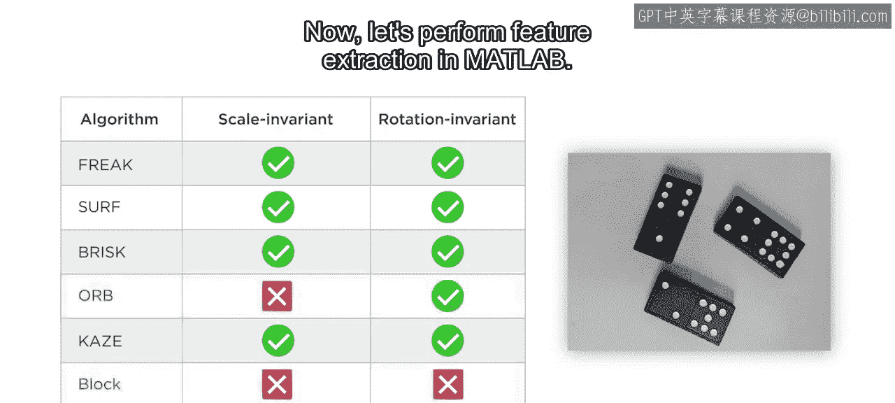

或者尺度差异。


在这些情况下，为了提高效率，你可以选择使用不具备尺度或旋转不变性的不同算法。


## 在MATLAB中进行特征提取

现在，让我们在MATLAB中执行特征提取。你已经知道如何读取图像、将其转换为灰度图并执行特征检测。

接下来，使用灰度多米诺骨牌图像和检测到的特征点作为输入，应用 `extractFeatures` 函数。MATLAB会根据输入自动选择提取算法。在本例中，由于输入来自SURF检测算法，它会选择SURF。

```matlab
[features, validPoints] = extractFeatures(grayImage, points);
```

这个函数产生两个输出：
*   **`features`**：一个数值矩阵，其中每一行代表一个不同的特征描述符。
*   **`validPoints`**：一个数组，包含每个提取特征的多种属性。

请注意，提取到的特征数量有时可能少于检测到的特征数量。如果某些特征点太靠近图像边缘，其邻域会超出图像边界，导致无法计算部分描述符值。

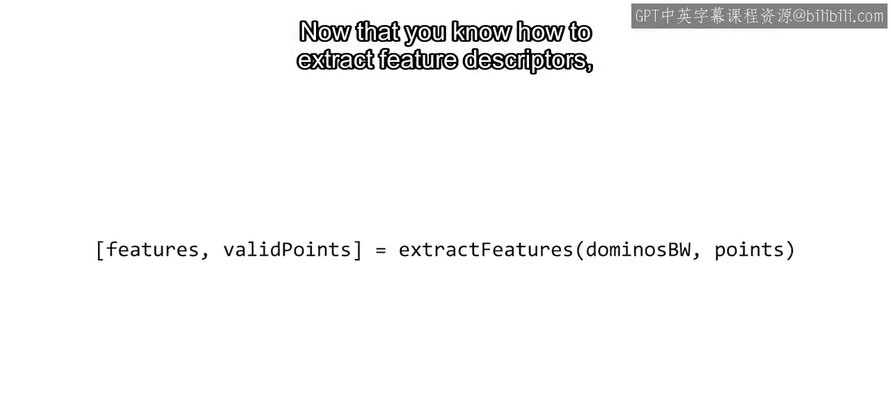


现在你已经掌握了如何提取特征描述符，接下来就可以进入**特征匹配**的学习了。之后，你将把特征匹配应用于图像配准与拼接，以及图像分类任务。

---

本节课中，我们一起学习了特征提取的核心概念。我们了解到特征描述符是特征点邻域的向量化表示，SURF算法通过计算主方向和局部梯度来生成具有尺度和旋转不变性的64维描述符。同时，我们也认识到不变性是以计算复杂度为代价的，需要根据具体应用场景进行权衡。最后，我们在MATLAB中实践了特征提取的步骤，为后续的特征匹配与应用打下了基础。