# 工程与科学计算机视觉：p05：特征匹配 🧩

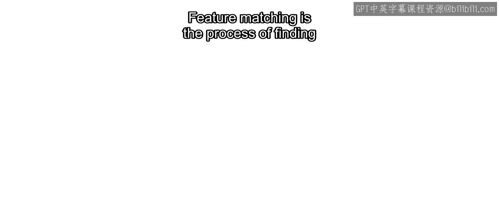

在本节课中，我们将要学习计算机视觉中的一个核心概念——特征匹配。特征匹配是许多高级视觉应用的基础，例如图像拼接和视频稳定。我们将了解其工作原理，并通过MATLAB示例展示其实现流程。

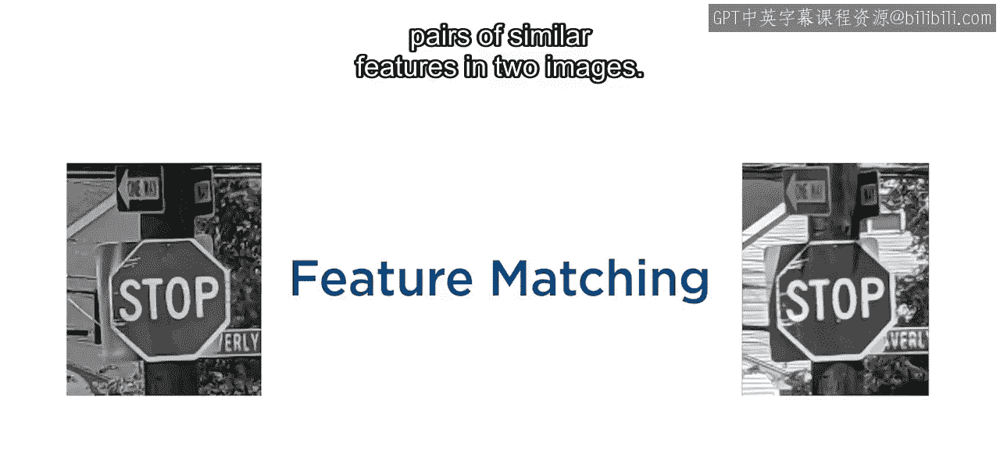

## 什么是特征匹配？

特征匹配是在两幅图像中寻找相似特征对的过程。

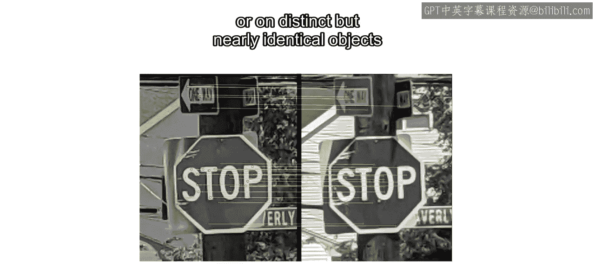

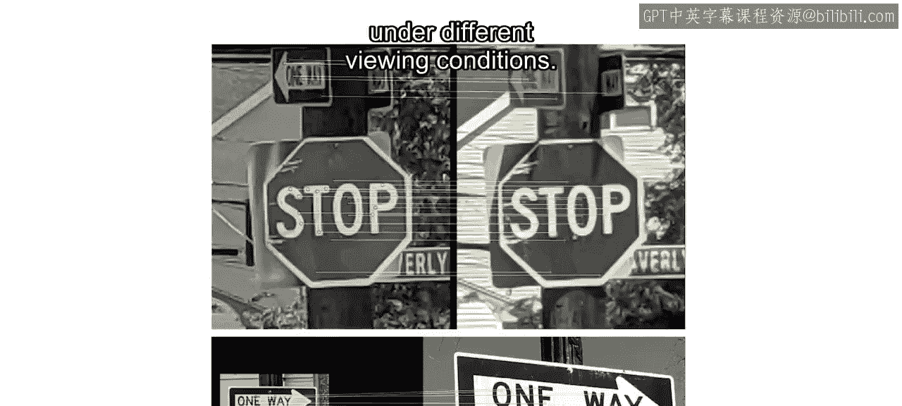

这通常意味着在不同成像条件下，找到同一物体上的相同点，或不同但几乎相同的物体上的对应点。

特征匹配是诸如对齐卫星图像、拼接多张照片以及视频稳定等应用不可或缺的一部分。

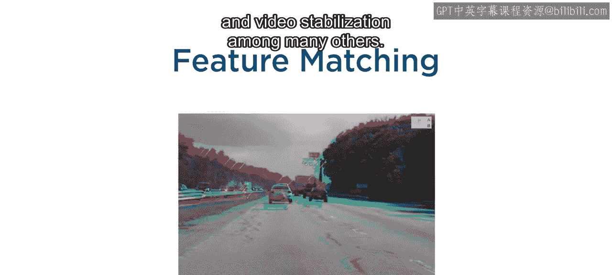

## 特征匹配的三个步骤

特征匹配包含三个主要步骤：
1.  在一对图像中检测特征点。
2.  从每幅图像中提取特征描述符。
3.  使用这些描述符来寻找匹配的特征对。

上一节我们介绍了特征匹配的基本概念，本节中我们来看看它的具体工作原理。

## 特征匹配如何工作？

让我们考虑两幅不同路标上同一位置检测到的SURF特征点，以及来自另一个不同区域的额外点。

每个提取出的特征描述符都给出了检测到的特征点周围像素邻域的定量描述。在本例中，SURF描述符是64维向量，其值在每个邻域内的网格上计算得出。

特征的相似性（或不相似性）反映在描述符向量的相似性（或不相似性）上。每个描述符存在于一个64维坐标空间中，但我们可以用二维空间来阐述这个概念。

**一个特征对是匹配的，当且仅当它们在描述符坐标空间中的距离低于某个阈值；否则，不匹配。** 用公式可以表示为：

`distance(descriptor_A, descriptor_B) < threshold` → 匹配

在此图示中，描述符A和B足够接近，因此匹配；而A和C距离太远，不匹配。

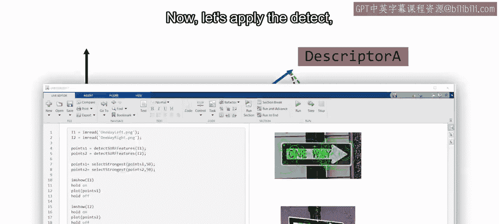

## 在MATLAB中应用“检测-提取-匹配”流程

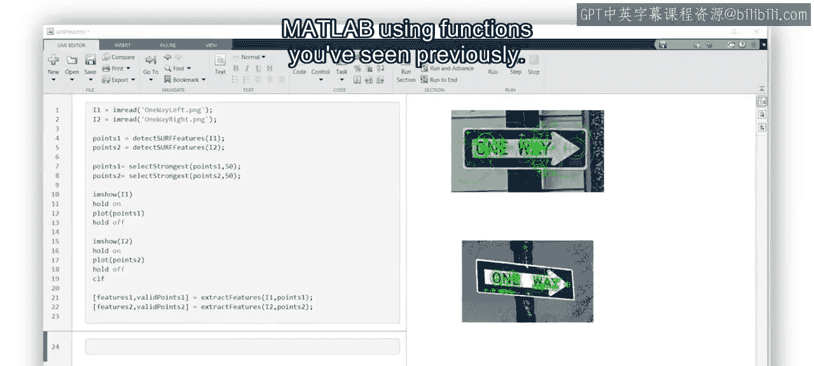

现在，让我们在MATLAB中应用“检测-提取-匹配”的工作流程。

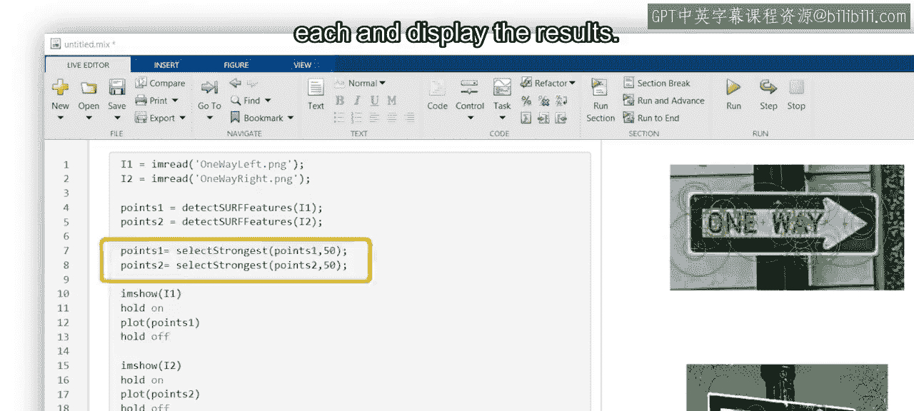

使用之前介绍过的函数，我们已经分别在两幅图像中检测到了SURF特征，并各自选择了最强的50个特征点。

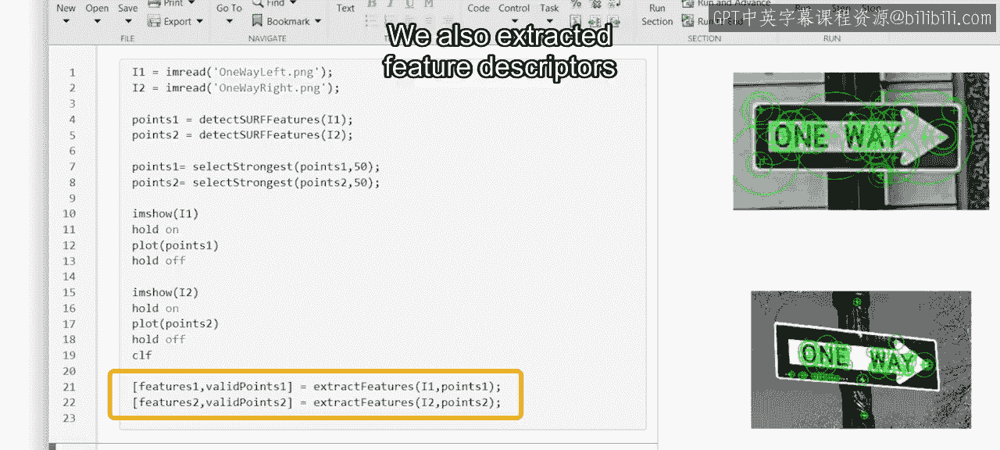

我们也提取了特征描述符及其对应的检测点位置。

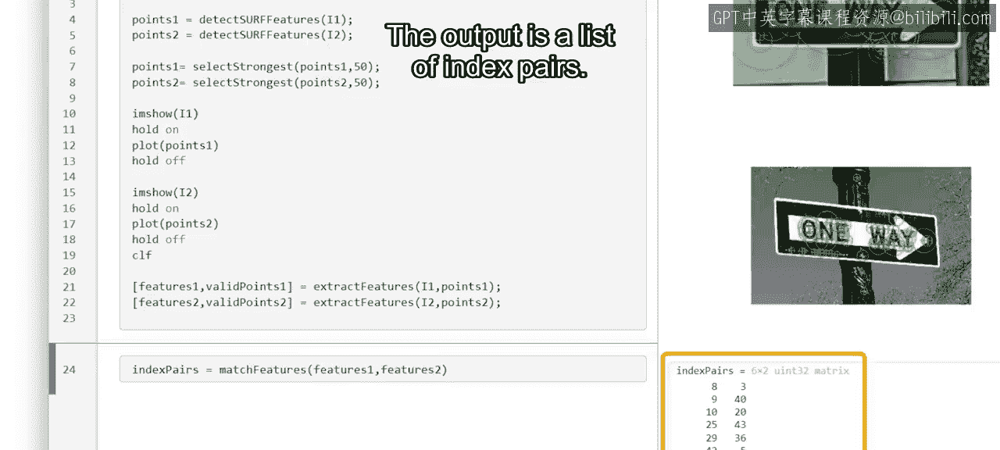

接下来，使用 `matchFeatures` 函数来确定两组特征描述符中所有可能配对之间的匹配关系。该函数的输出是一个索引对列表。

每个索引对对应一个匹配的特征描述符对。其中，第一列包含来自第一幅图像的特征索引，第二列包含来自第二幅图像的特征索引。

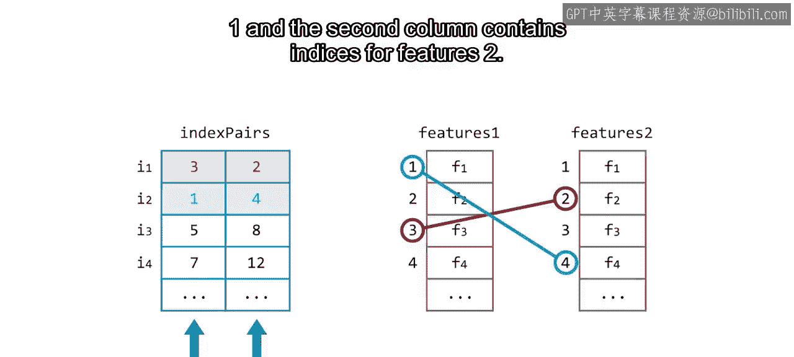

为了获取每幅图像中匹配特征的位置，我们需要使用索引对的第一列来索引第一幅图像的 `validPoints` 输出，使用第二列来索引第二幅图像的 `validPoints` 输出。

然后，使用 `showMatchedFeatures` 函数来可视化结果，将两幅原始图像以及两组匹配点作为输入。

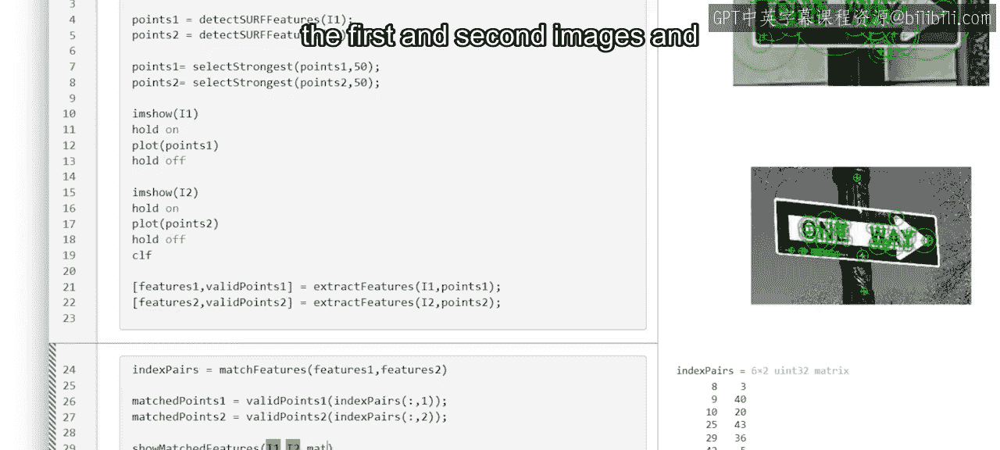

该函数的默认显示方式更适合尺寸相同、且物体仅发生平移和/或旋转的图像对。

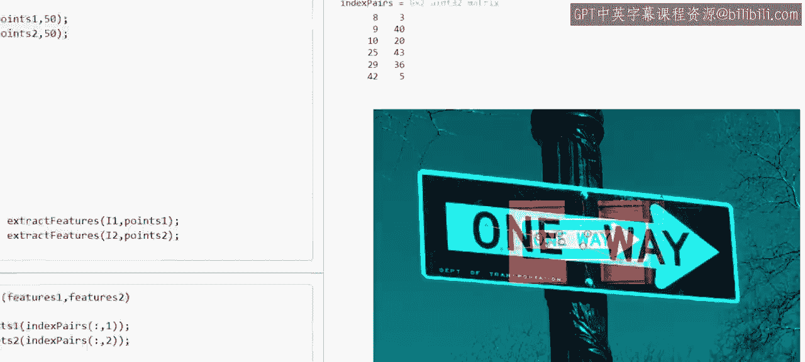

为了在当前例子中更清晰地查看匹配，可以添加 `‘montage’` 选项。

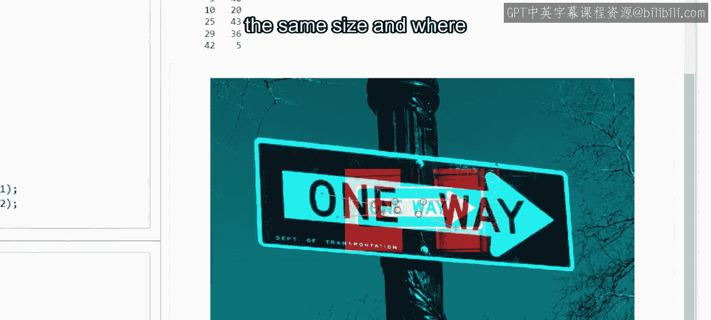

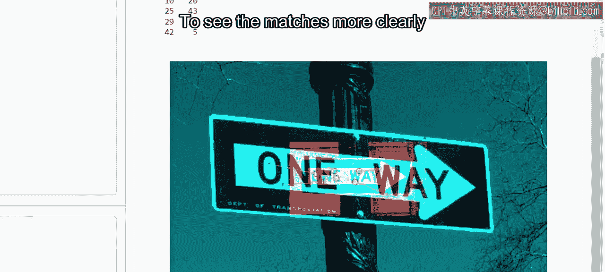

## 总结与后续练习

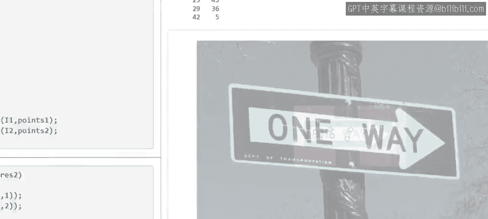

现在你已经了解了“检测-提取-匹配”的整体工作流程，可以准备在MATLAB中亲自尝试了。

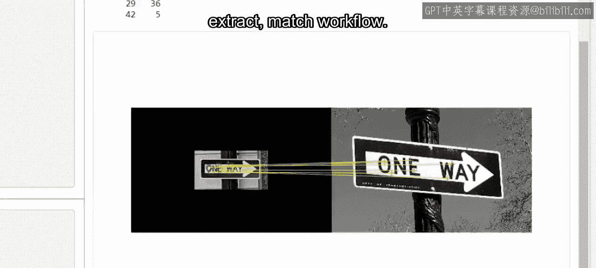

在接下来的阅读材料中，你将进一步练习和探索这个工作流程。

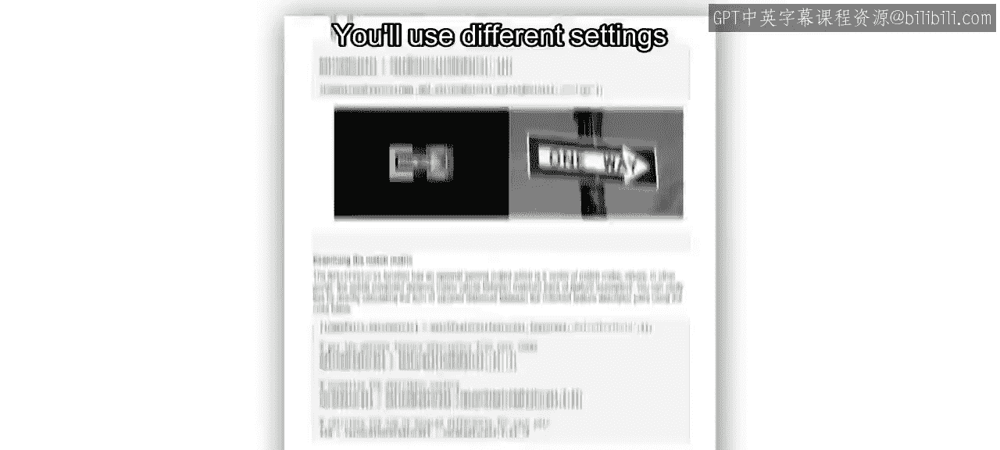

你将尝试使用不同的匹配阈值、匹配唯一性以及其他参数，以提升匹配性能。

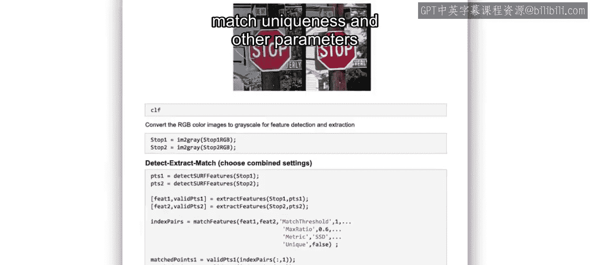

本节课中我们一起学习了特征匹配的定义、三个核心步骤及其工作原理，并通过MATLAB示例演示了完整的实现流程。特征匹配通过计算描述符之间的距离来判断相似性，是连接多幅图像信息的关键技术。