# 工程与科学计算机视觉：5：估计和应用几何变换

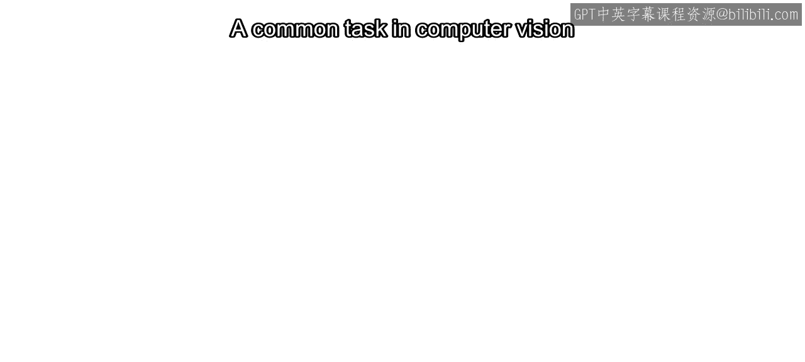

在本节课中，我们将学习如何描述图像之间的视角变化，即估计和应用几何变换。这是计算机视觉中的一项常见任务，广泛应用于图像配准与拼接、视频稳定和运动估计等领域。

## 概述：五种视角变化类型

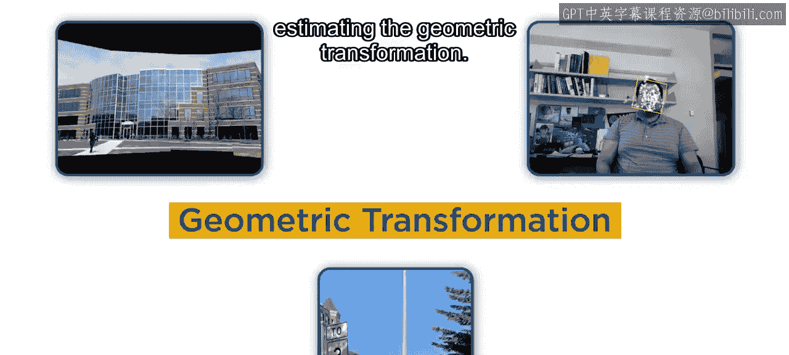

二维图像的几何变换基于五种基本的视角变化类型。我们将使用一个停车标志的图像来演示这些类型。

以下是五种基本变化类型：
*   **平移**：图像在平面内移动。
*   **旋转**：图像围绕一个点转动。
*   **缩放**：图像尺寸放大或缩小。
*   **剪切**：图像在某一方向上发生倾斜变形。
*   **倾斜**：图像因平面外旋转而产生的透视变形。

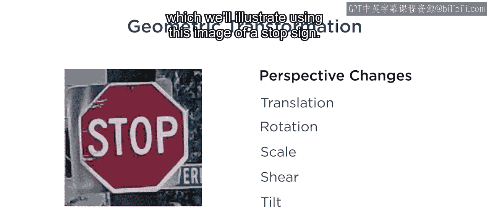

## 四种几何变换类型

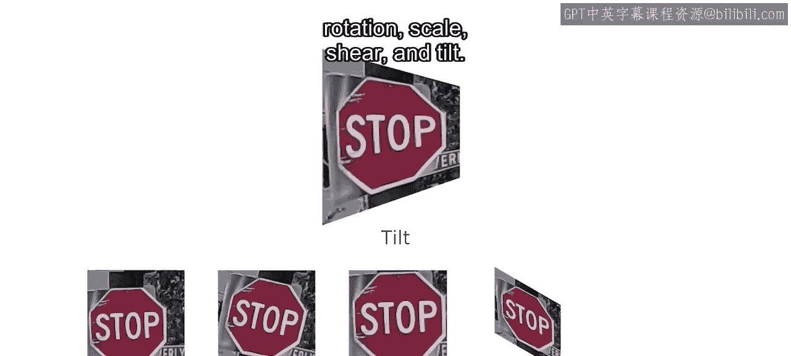

基于上述五种基本变化，存在四种几何变换类型，每种类型涵盖不同的变化组合。

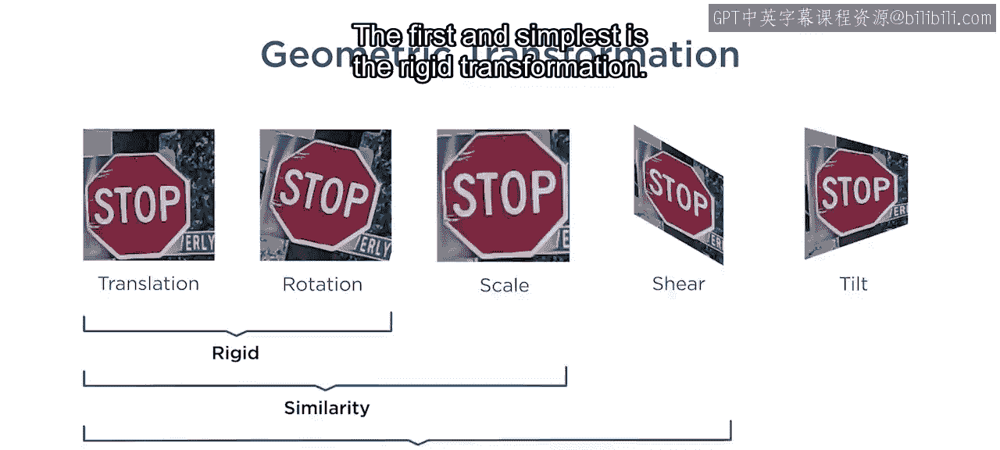

### 刚体变换

上一节我们介绍了五种基本变化，本节中我们来看看第一种也是最简单的变换类型——刚体变换。

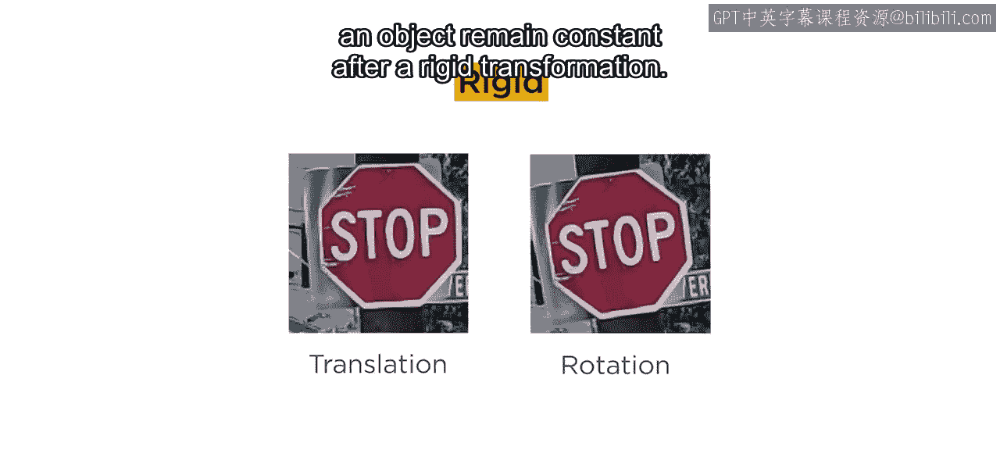

如果两幅图像之间仅存在**旋转**和**平移**差异，那么连接这两幅图像的变换就是刚体变换。物体的**大小和形状**在刚体变换后保持不变。

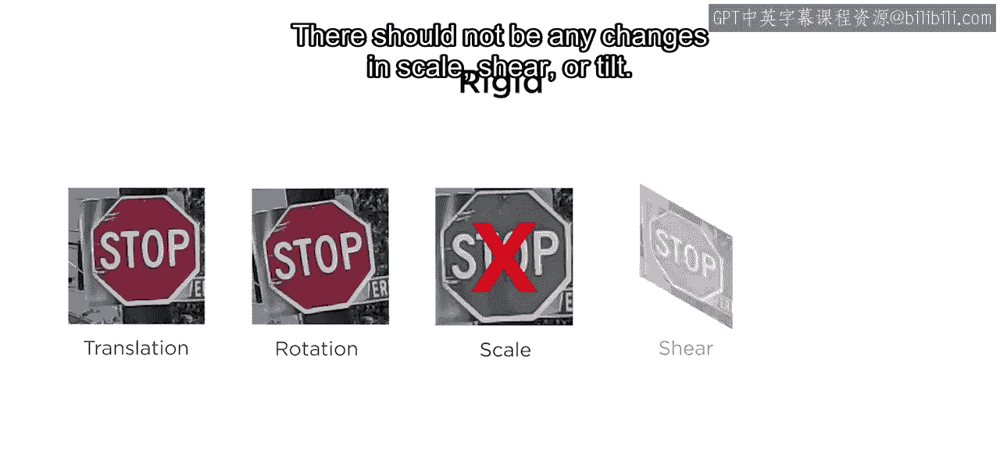

刚体变换不包含任何**缩放**、**剪切**或**倾斜**变化。

### 相似变换

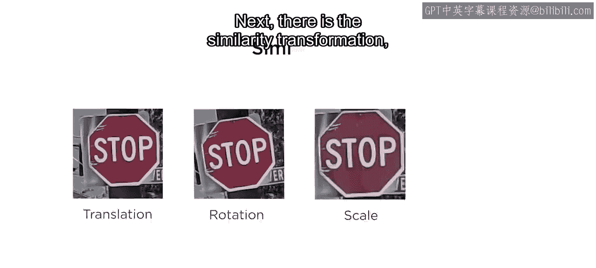

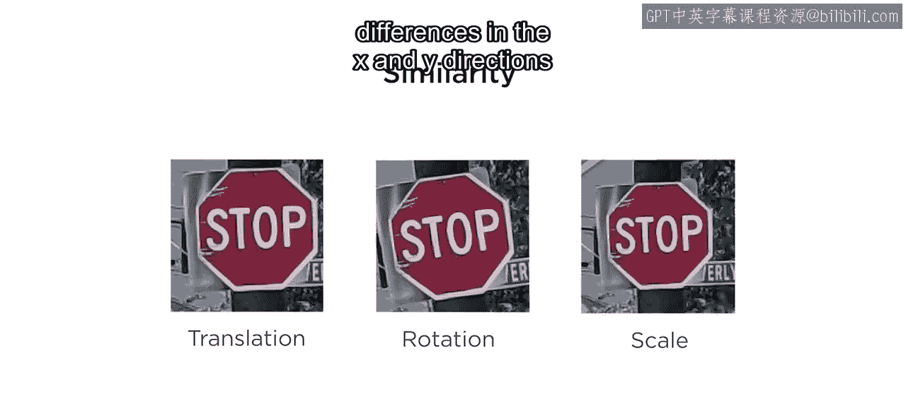

接下来是相似变换，它在刚体变换的基础上，增加了**缩放**变化。

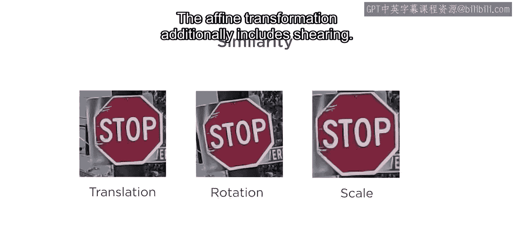

相似变换允许图像在x和y方向上进行缩放，同时包含平移和旋转。

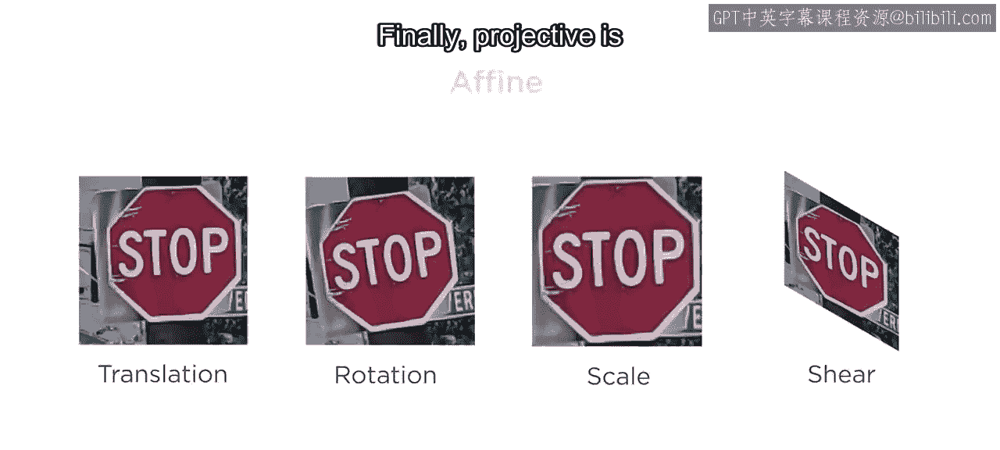

### 仿射变换

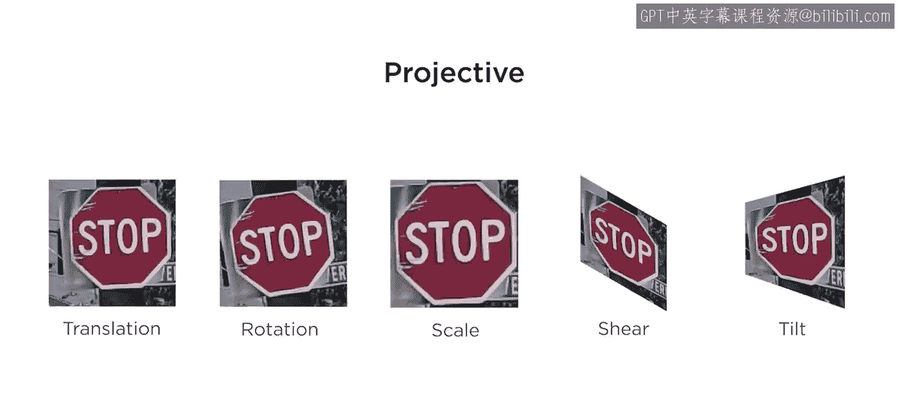

仿射变换在相似变换的基础上，进一步包含了**剪切**变化。

因此，即使物体看起来可能很不同，但**平行线**的性质在仿射变换后得以保持。

### 投影变换

最后，**投影变换**是最广泛的二维几何变换类型。

它包含了所有五种基本变化，即平移、旋转、缩放、剪切以及**倾斜**（或称平面外旋转）。

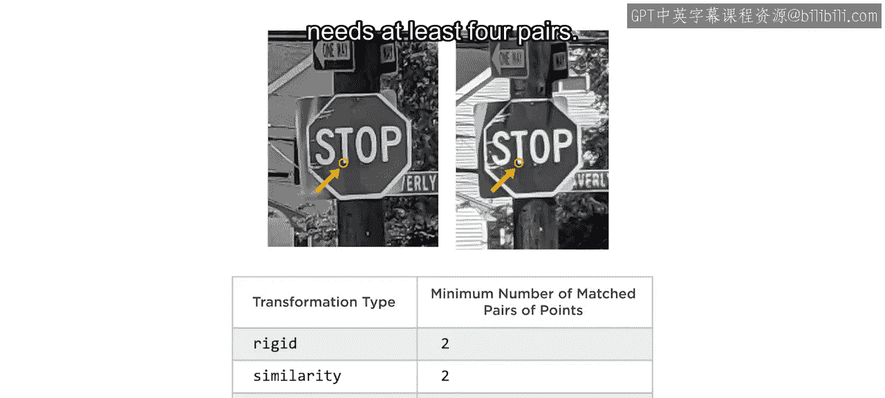

## 如何估计几何变换

要执行几何变换估计，你需要图像上**匹配点**（有时也称为控制点）的位置。例如，一对匹配点可以是“STOP”字样中字母T的左下角。

根据变换类型的不同，计算变换估计值所需的最少匹配点对数量也不同。以下是所需的最少匹配点对数量：
*   **刚体变换**：至少需要 **2** 对匹配点。
*   **相似变换**：至少需要 **2** 对匹配点。
*   **仿射变换**：至少需要 **3** 对匹配点。
*   **投影变换**：至少需要 **4** 对匹配点。

然而，在实际操作中，你通常需要比最少数量多得多的匹配点对，因为在多幅图像中精确定位同一位置通常很困难。

### 处理错误匹配：RANSAC算法

基于特征的匹配是获取大量匹配点的好方法，但它通常会产生一些**错误的匹配**。

为了使变换估计更加稳健，通常会使用一种称为**随机抽样一致** 的算法。

为了简化理解，假设我们只有四对匹配点。RANSAC算法的工作流程如下：
1.  **随机抽样**：从所有匹配点对中随机选择一个子集（例如，对于投影变换，随机选择4对）。
2.  **模型估计**：根据这些选中的点对估计一个几何变换模型。
3.  **模型测试**：将此变换应用于第一幅图像中的所有匹配点，得到一组新的预测位置。
4.  **误差计算**：计算这些预测点与第二幅图像中实际匹配点之间的距离（误差）。
5.  **迭代与选择**：重复上述过程多次。算法最终会**返回误差最小的那个变换模型**。
6.  **点分类**：算法还会识别出符合该变换模型的匹配点（称为**内点**），以及不符合的点（称为**外点**）。

## 在MATLAB中实践

现在，让我们在MATLAB中实际估计几何变换。之前你已经学习了如何在图像间匹配特征。这里我们读入两幅停车标志图像，转换为灰度图，然后检测、提取并匹配SURF特征。匹配点的坐标被保存在两个变量中（例如 `matchedPoints1` 和 `matchedPoints2`）。

### 步骤1：估计变换

要估计几何变换，请使用 `estimateGeometricTransform2D` 函数。

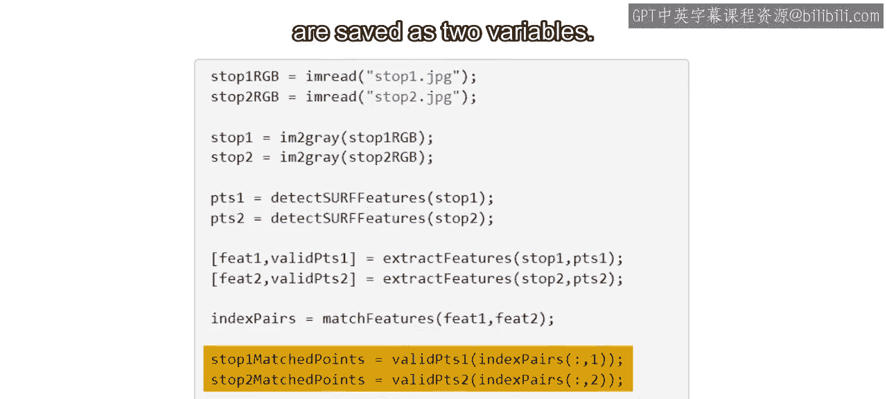

```matlab
% 估计几何变换
[tform, inlierIdx] = estimateGeometricTransform2D(matchedPoints2, matchedPoints1, 'similarity');
```
将第二幅图像的匹配点、第一幅图像的对应匹配点以及变换类型作为输入。图像中的停车标志似乎只有平移和缩放的变化，因此这里选择 `‘similarity’`（相似变换）类型。

此函数创建一个变换对象 `tform`，它能将第二幅停车标志图像中的点映射到第一幅图像中的对应位置。

函数产生两个输出：
*   `tform`：几何变换对象。
*   `inlierIdx`：一个逻辑数组，指示哪些匹配点对符合此变换。

这个内点索引向量可用于**移除特征匹配过程中发现的错误匹配**。

### 步骤2：应用变换并对齐图像

使用这个几何变换对象，你可以**扭曲**第二幅图像，使其与第一幅图像对齐，这需要用到 `imwarp` 函数。

```matlab
% 设置输出视图，使扭曲后的图像与第一幅图尺寸相同
outputView = imref2d(size(stopSignImage1));
% 扭曲第二幅图像
alignedImage2 = imwarp(stopSignImage2, tform, 'OutputView', outputView);
```
为了比较对齐后的图像，使用 `outputView` 选项来设置扭曲后图像的尺寸与第一幅图相同会很有帮助。

### 步骤3：比较结果

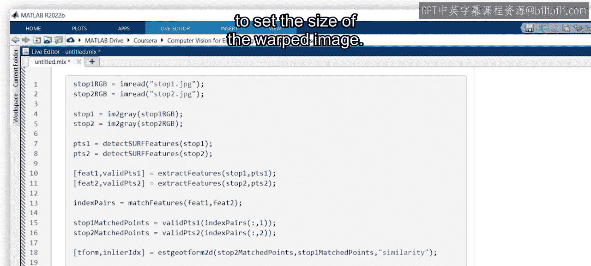

现在，使用 `imshowpair` 函数来查看原始两幅图像的重叠效果。

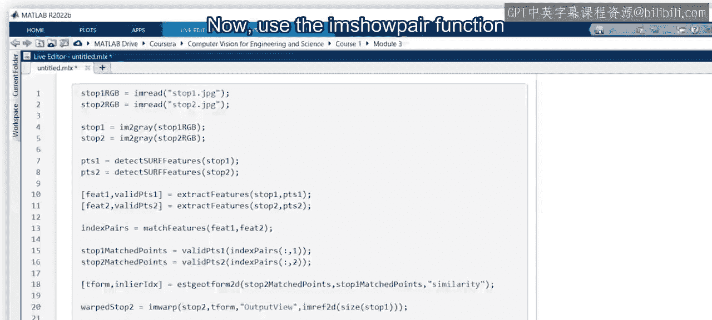

```matlab
% 显示原始图像的重叠
figure;
imshowpair(stopSignImage1, stopSignImage2, 'montage');
title('原始图像（并排显示）');
```
然后，将其与扭曲后的第二幅图像与第一幅图像的重叠结果进行比较。

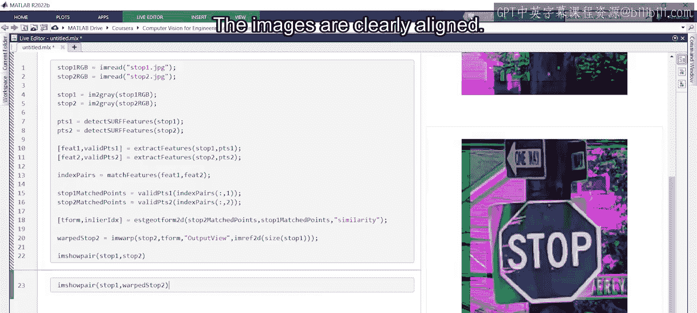

```matlab
% 显示对齐后的图像重叠
figure;
imshowpair(stopSignImage1, alignedImage2, 'blend');
title('对齐后的图像（混合显示）');
```
可以看到，图像已经明显对齐了。

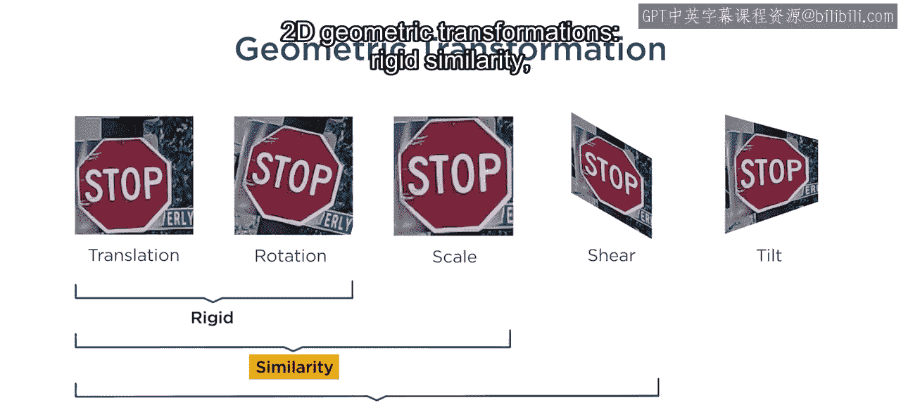

## 总结

本节课中，我们一起学习了二维几何变换的四种类型：**刚体变换**、**相似变换**、**仿射变换**和**投影变换**。我们还了解了如何在给定两幅具有匹配点对的图像时，在MATLAB中估计这些变换，并利用RANSAC算法处理错误匹配，最终应用变换以实现图像对齐。

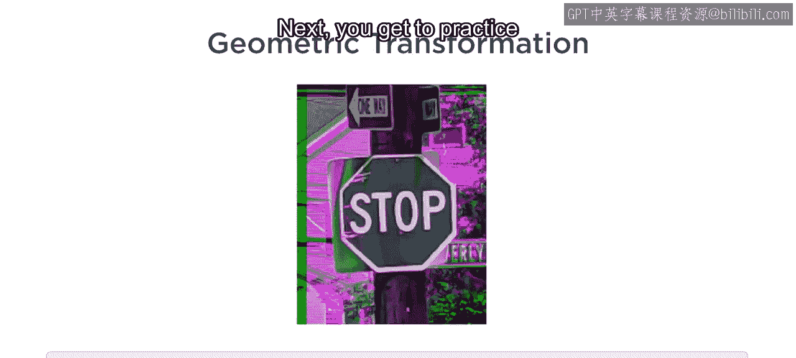

接下来，你将有机会自己练习估计几何变换。