# 工程与科学计算机视觉：7：基于特征的图像配准

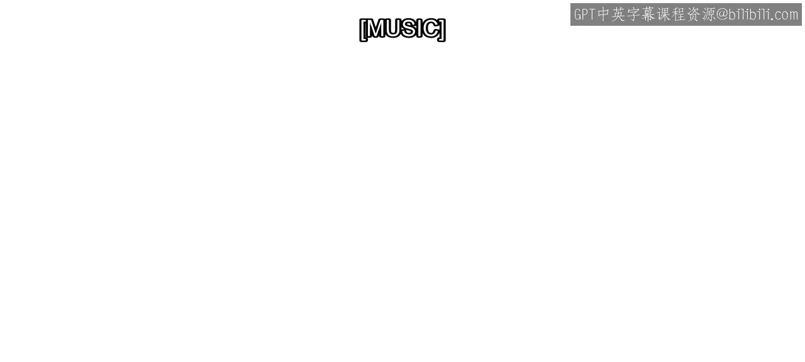

## 概述

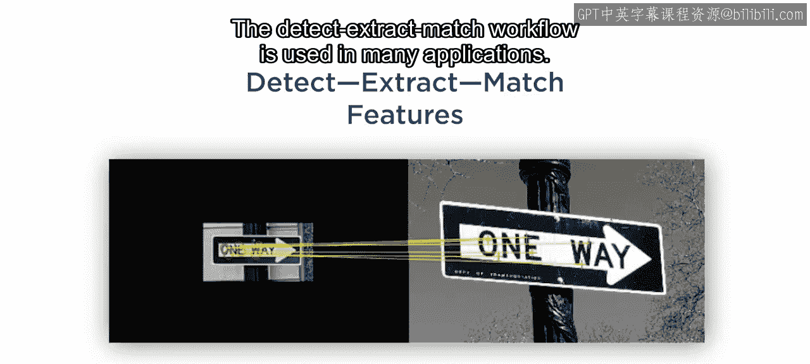

在本节课中，我们将要学习图像配准的概念及其应用。图像配准是通过应用几何变换来对齐图像的过程。我们将重点介绍基于特征的图像配准工作流，并使用MATLAB的配准估计器应用程序来实践这一过程。

---

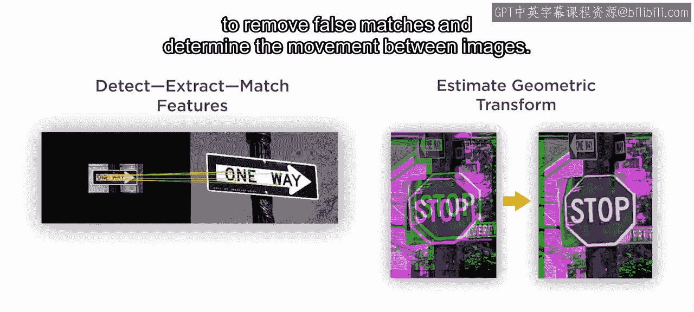

## 图像配准简介

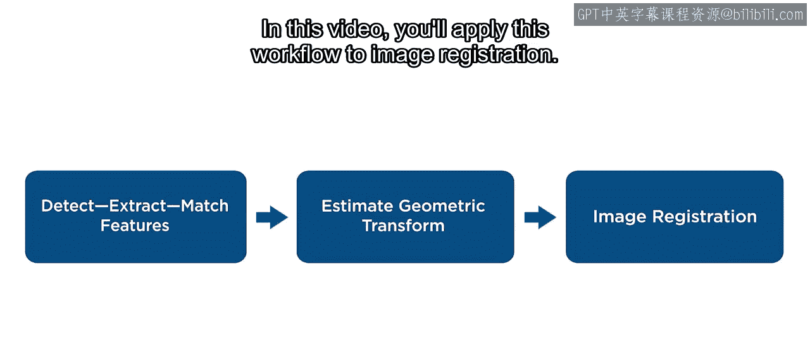

在许多应用中，都会使用到“检测-提取-匹配”的工作流。

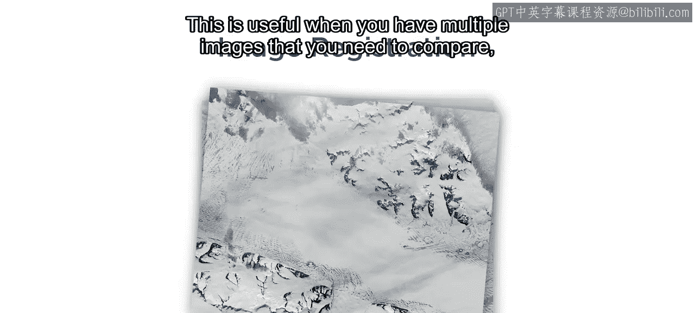

该工作流的一个关键部分通常是估计几何变换，以消除错误匹配并确定图像间的运动。

在本视频中，您将把此工作流应用于图像配准。

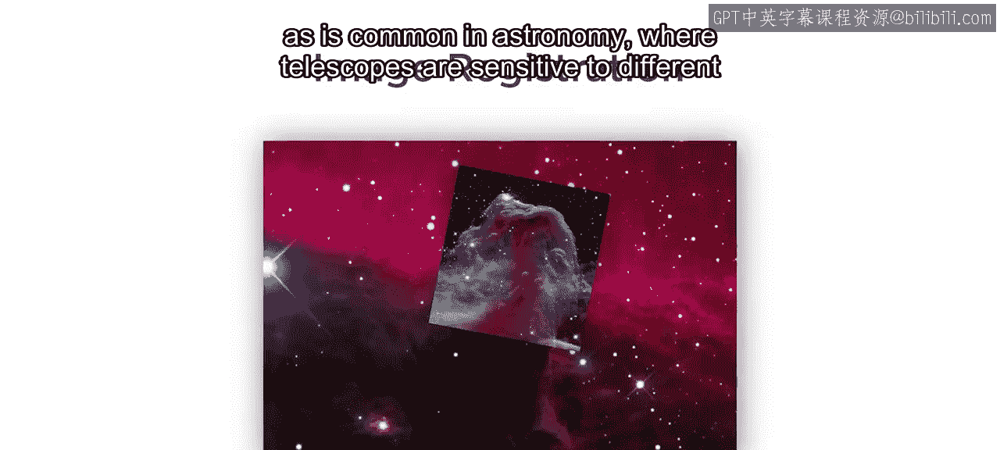

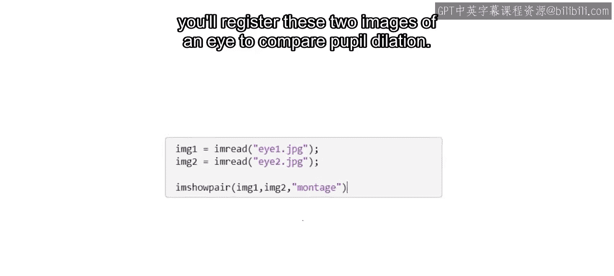

配准是应用几何变换以对齐图像的过程。当您需要比较多张图像时，例如卫星照片，这非常有用。

或者，如果图像是由不同设备捕获的，这在天文学中很常见，因为望远镜对电磁辐射的不同波长敏感。

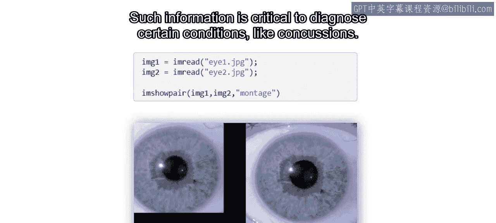

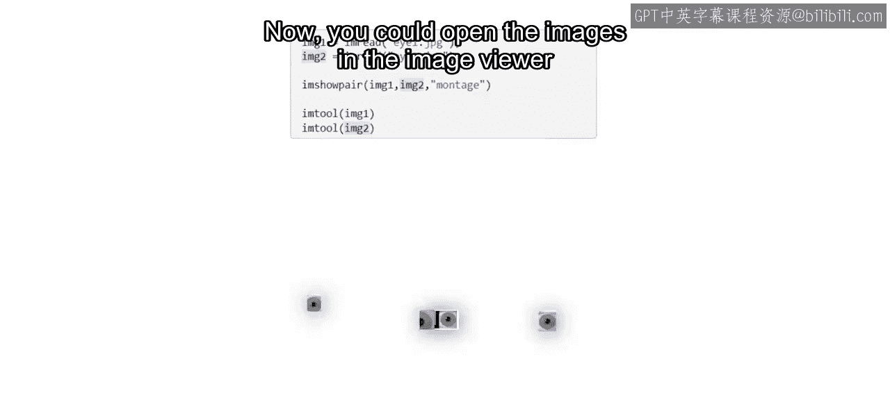

在本视频中，您将配准这两张眼睛图像以比较瞳孔大小。

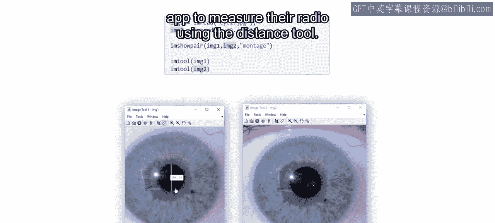

尽管这些图像看起来很相似，但它们是在不同时间拍摄的，并且存在一个我们想要测量的关键差异：瞳孔的扩张程度不同。但具体相差多少？这些信息对于诊断某些病症（如脑震荡）至关重要。

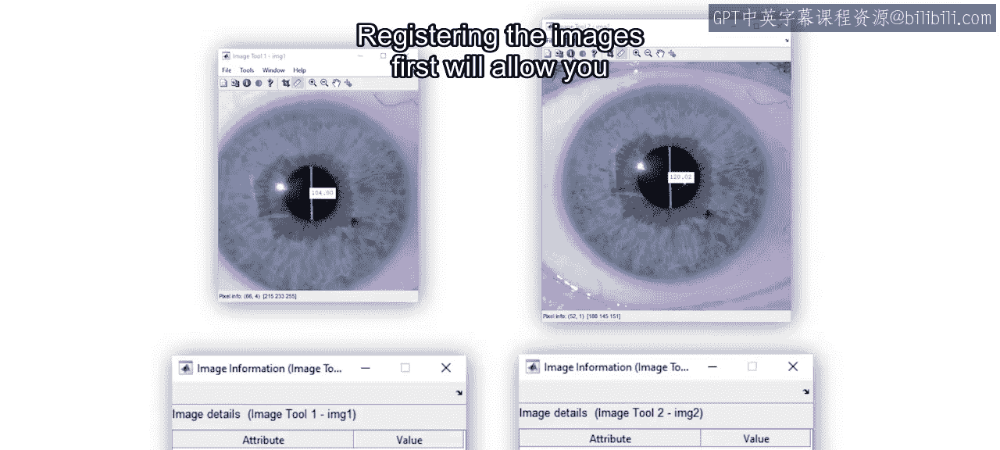

现在，您可以在图像查看器应用程序中打开图像。

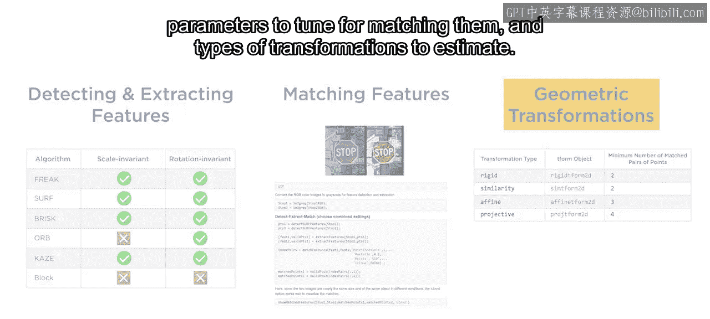

使用距离工具测量它们的半径。

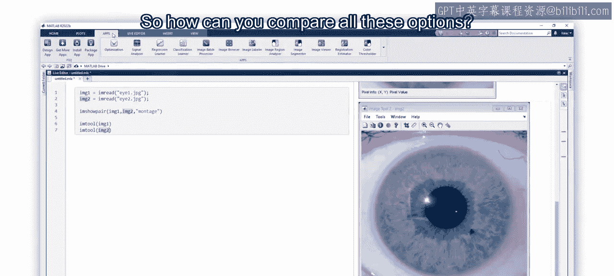

然而，这些值无法直接比较，因为图像具有不同的分辨率，并且拍摄时距离主体的距离也不同。首先配准图像将使您能够更准确地比较瞳孔大小。

---

## 使用MATLAB配准估计器应用程序

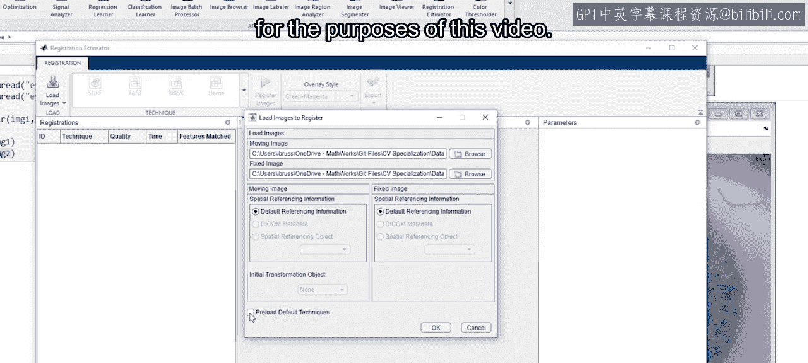

到目前为止，您已经了解到有许多类型的特征可以检测和提取，有许多参数可以调整以进行匹配，以及有多种类型的变换可以估计。

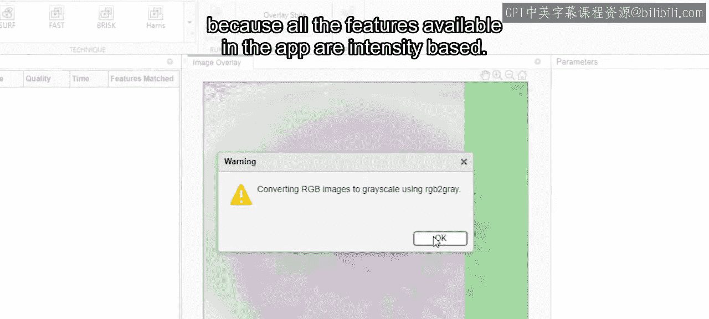

通常无法事先知道哪种方法效果最好。那么，如何比较所有这些选项呢？

MATLAB包含一个用于执行配准的应用程序。现在打开它以了解其工作原理。

首先加载您想要配准的图像。在本例中，您将变换图像1以与图像2配准。将它们分别选为移动图像和固定图像。同时，为了本视频的目的，请取消选中预加载默认技术的选项。

请注意，您的图像会自动转换为灰度图像，因为应用程序中所有可用的特征都是基于强度的。

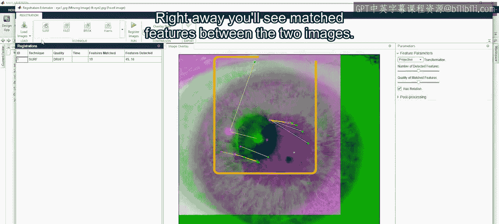

在开始之前，花些时间熟悉这个应用程序。中心视图使用绿色和洋红色叠加显示两张灰度图像，以突出它们之间的差异。顶部是各种配准技术。除了基于特征的方法，您还可以选择基于强度或非刚性的技术。但现在，请坚持使用您熟悉的基于特征的工作流。在本例中，让我们尝试SURF特征。

您会立即看到两张图像之间匹配的特征。

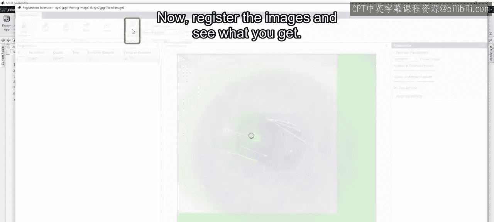

---

## 选择变换类型与评估结果

在配准之前，请考虑要估计哪种类型的变换。对于此示例，两张图像是从同一视角拍摄的，因此选择相似性变换类型，仅允许平移、旋转和缩放。现在，配准图像并查看结果。

图像视图更新，显示经扭曲并叠加到固定图像上的移动图像。

现在您已经执行了第一次配准，可以查看一些相关细节。包括每张图像中检测到的特征数量、匹配的特征数量、估计变换所花费的时间，以及一个衡量图像匹配程度的量化指标。这个数字范围从0到1，衡量变换后的图像与固定图像的相似程度。然而，这只是一个粗略的度量，因此在比较配准结果时，请务必运用您自己的判断。

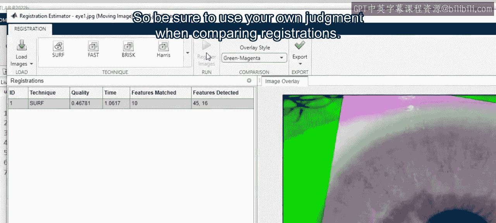

在本例中，请注意绿色的固定图像的虹膜仍然比洋红色的移动图像大。此外，右上角的血管没有对齐。

---

## 优化配准参数

让我们尝试通过增加检测到的特征数量来获得更好的匹配。对于SURF特征，增加八度数量可以实现这一点。

与第一次配准尝试相比，此更改有效地使匹配特征数量增加了一倍。这次配准看起来好了一些。您甚至可以将其与上次尝试进行视觉比较。但根据血管判断，它仍然不理想。您还能做什么？

这可能会让人觉得违反直觉，但有时通过降低匹配特征的质量可以获得更好的结果。

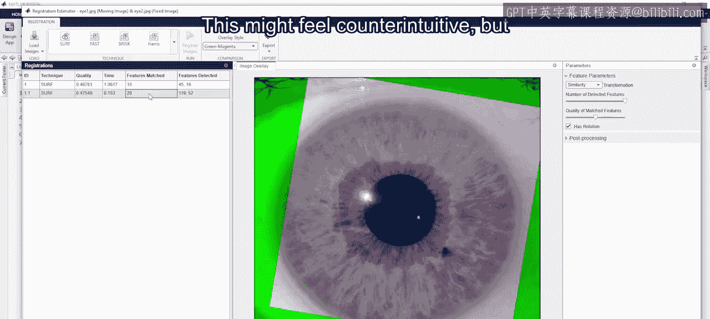

请记住，特征最初是根据其描述符值的相似程度进行匹配的。

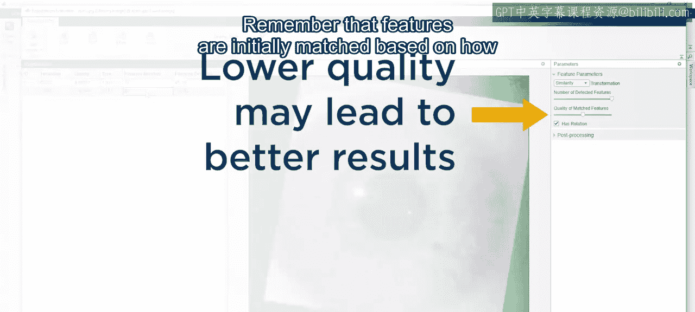

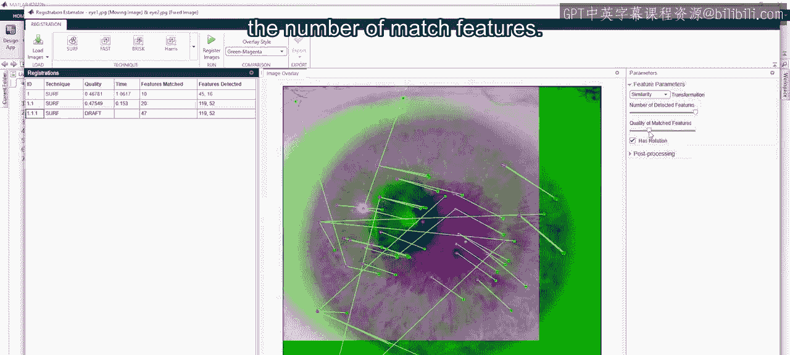

降低找到匹配所需的阈值将增加匹配特征的数量。

虽然此更改引入了一些额外的错误匹配，但也有更多正确的匹配。这没关系，因为请记住，估计几何变换的算法会剔除异常值。

这次配准图像给出了一个相当好的结果。尽管报告的质量较低，但这是迄今为止最好的配准。血管很好地重叠在一起。瞳孔是同心圆，虹膜中几乎没有留下绿色或洋红色，表明它们已对齐。您甚至可以将叠加样式更改为“差异”。配准图像差异最大的区域具有高亮度。在本例中，瞳孔周围的环表明它们确实是两个不同的大小。

---

## 导出与应用配准结果

一旦您对此配准结果满意，如何在MATLAB中使用它？像大多数应用程序一样，您可以导出函数以捕获您的最佳结果。

然后，保存它。

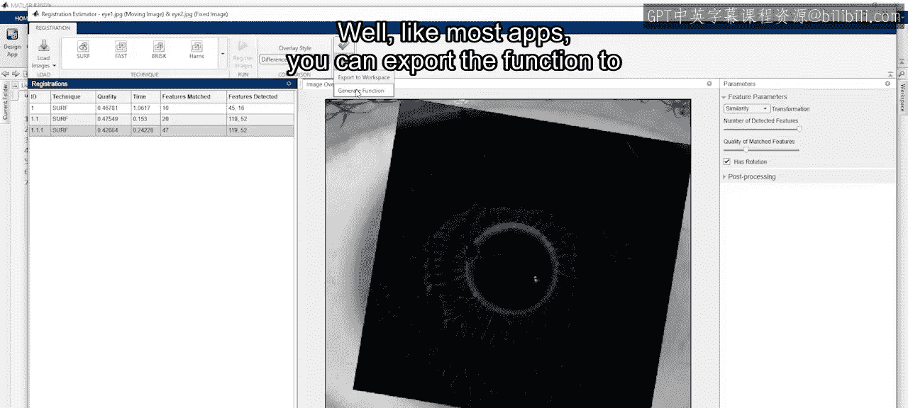

要应用该函数，请使用两张图像作为输入。

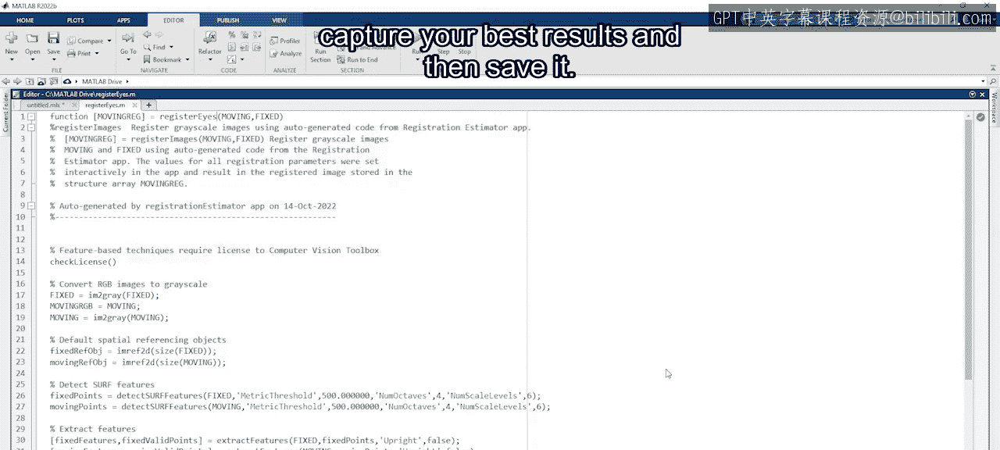

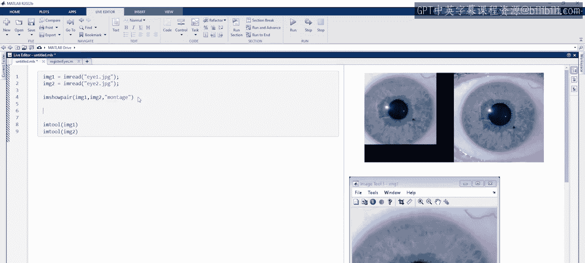

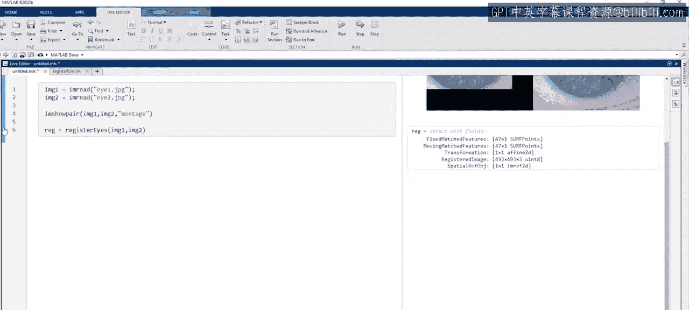

输出变量是结构体类型，存储了匹配的特征、变换矩阵和配准后的图像。为了完成我们最初比较瞳孔大小的目标。

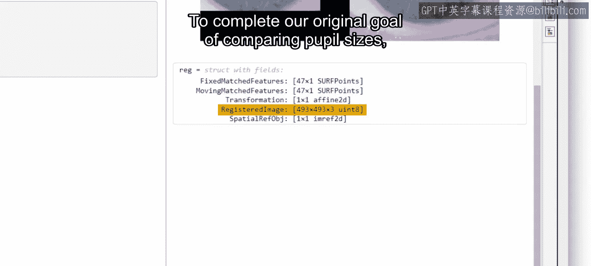

使用图像查看器应用程序打开新配准的图像。

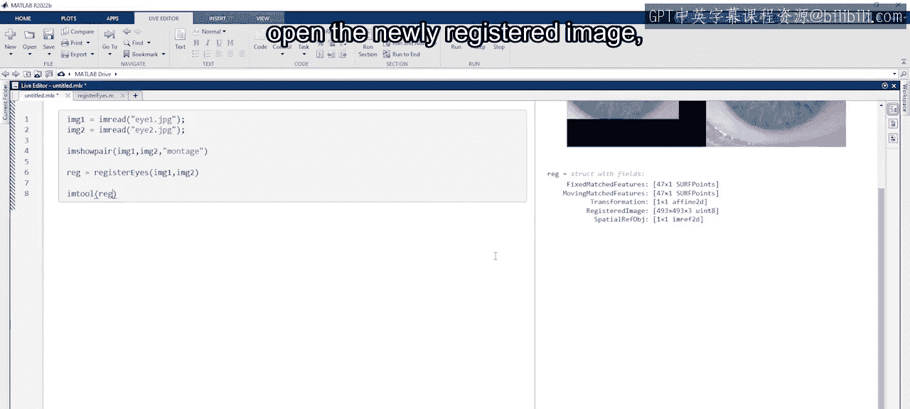

并测量它们的直径。看起来它们相差约13%。

---

## 总结

在本节课中，我们一起学习了图像配准。图像配准过程中可能需要调整许多参数。很难预先知道应使用哪种类型的特征、匹配质量应有多强，或者应允许哪种类型的变换。配准估计器应用程序使您能够快速尝试不同的方法，以找到最适合您应用的方法。

