# 工程与科学计算机视觉：8：可视化选择控制点 🎯


在本节课中，我们将学习如何在MATLAB中通过手动选择控制点来执行图像配准。当图像特征难以自动匹配时，这是一种非常有效的方法。

有时，在成对的图像中自动寻找控制点会很困难。例如，在这些天文图像中，特征检测算法很难区分不同的星星。

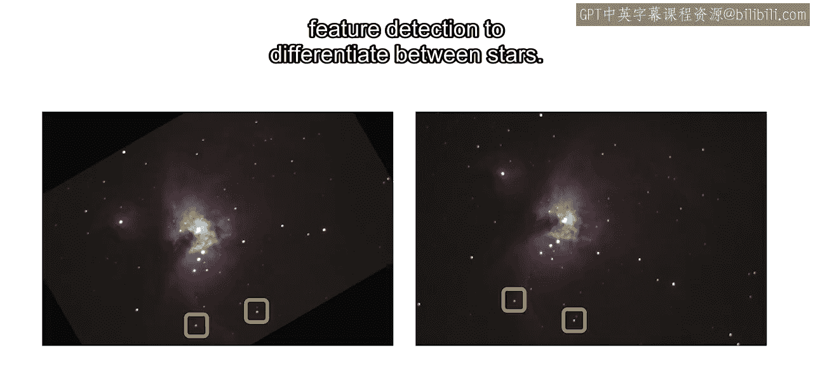


或者，您可能正在处理卫星图像，其中对应的区域看起来差异巨大。


在这些情况下，使用手动选择的控制点进行手动配准通常更为有效。在本视频中，您将学习如何使用这两张猎户座星云图像在MATLAB中执行手动配准。

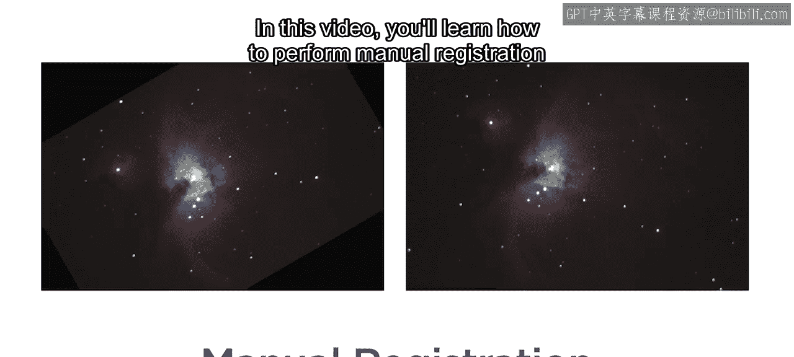

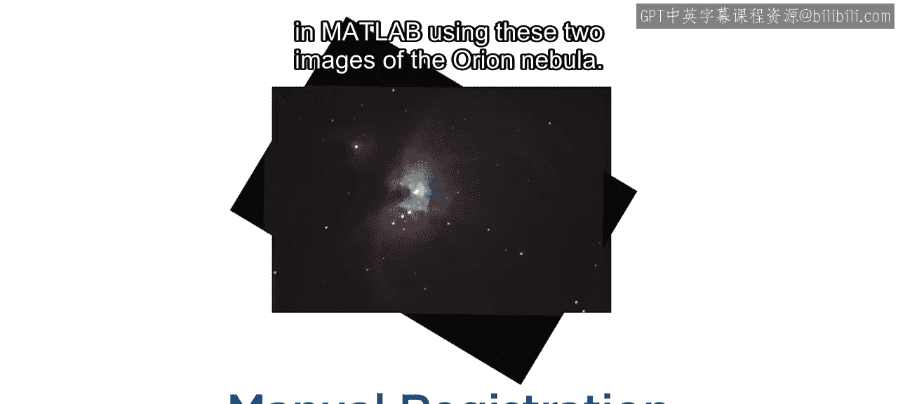


## 手动配准的三个步骤

整个过程包含三个核心步骤：
1.  选择控制点。
2.  根据这些点推断几何变换。
3.  使用得到的变换矩阵对齐图像。

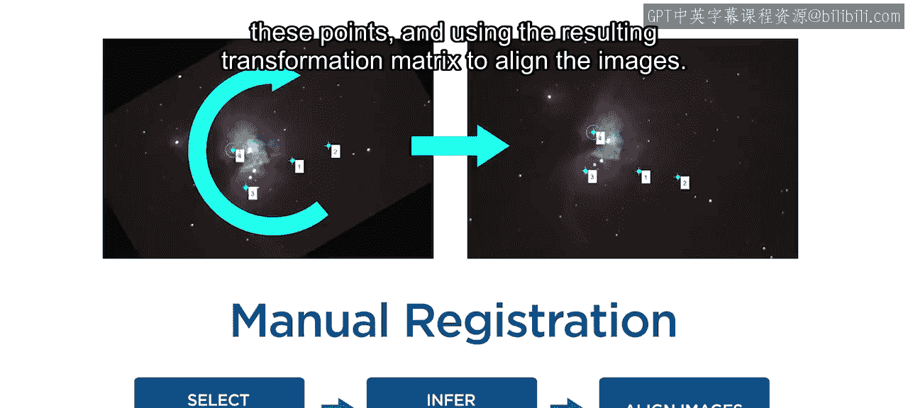


上一节我们介绍了手动配准的基本概念，本节中我们来看看具体的操作流程。

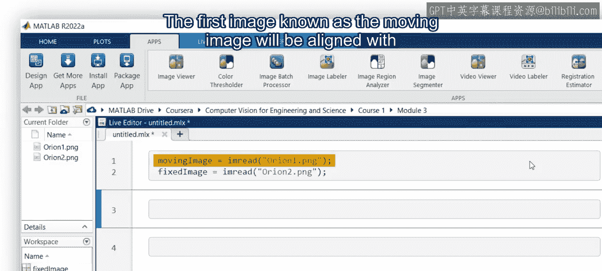

### 第一步：导入图像

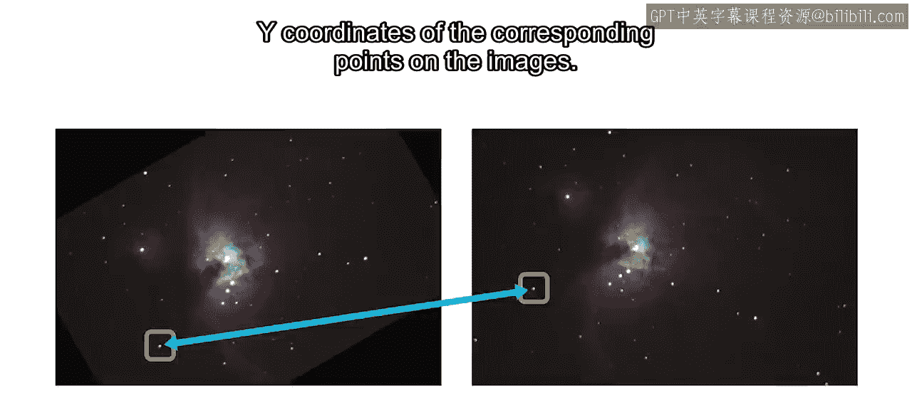

首先，打开MATLAB并将两张图像导入工作区。第一张图像称为**移动图像**，它将被对齐到第二张图像，即**固定图像**。

### 第二步：识别并选择控制点

接下来，您需要识别图像上对应点的XY坐标。

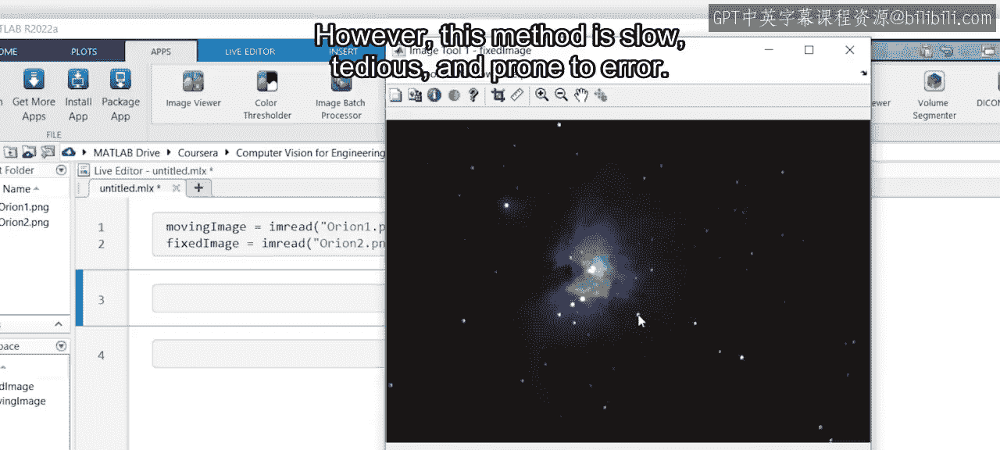


一种方法是查看其中一张图像，将鼠标悬停在一颗星星上，记录坐标，然后在另一张图像中对同一颗星星重复这些步骤。然而，这种方法速度慢、繁琐且容易出错。

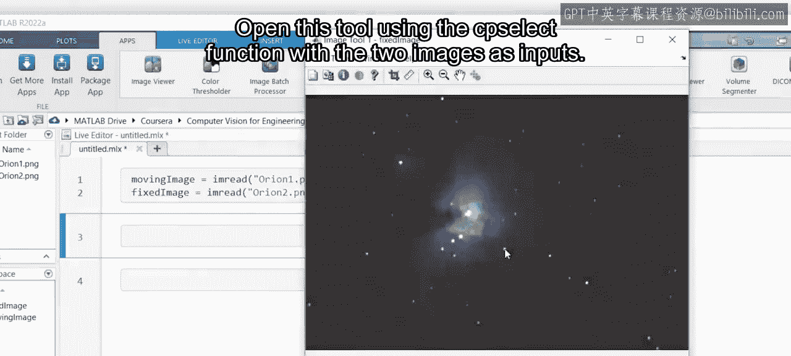


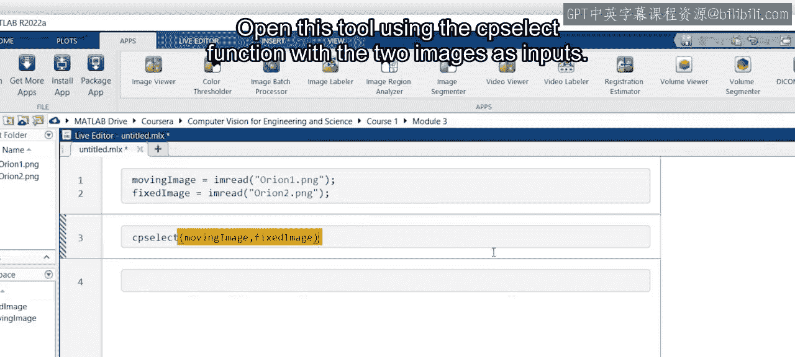

更好的方法是使用**控制点选择工具**。使用 `cpselect` 函数打开此工具。

```matlab
cpselect(movingImage, fixedImage);
```


工具打开后，您会看到左下角显示移动图像，右下角显示固定图像，顶部则是两张图像的放大区域。

让我们以星星为参考选择几个控制点。根据所需的变换类型，您需要不同数量的控制点对来推断变换矩阵。这两张图像存在旋转和缩放差异，因此**相似变换**足以对齐它们。这种变换只需要两对控制点，但通常多选几对会得到更好的结果。

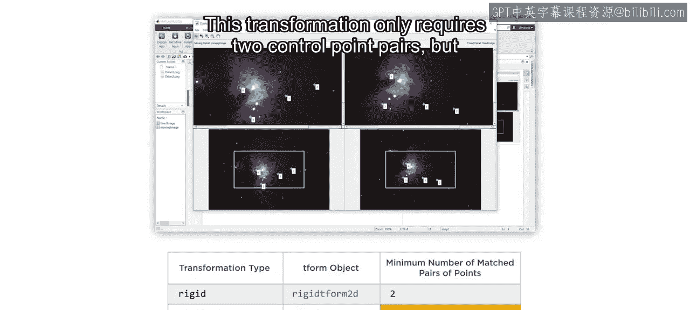


以下是选择控制点后的操作：
*   将点导出到工作区，生成两个矩阵：`movingPoints`（移动图像上控制点的XY坐标）和 `fixedPoints`（固定图像上对应控制点的XY坐标）。
*   关闭控制点选择工具。

现在，您可以使用这些坐标来创建变换矩阵。

### 第三步：创建变换并应用

然后，使用 `imwarp` 函数将变换矩阵应用到移动图像。使用 `‘OutputView’` 选项确保输出与固定图像对齐。

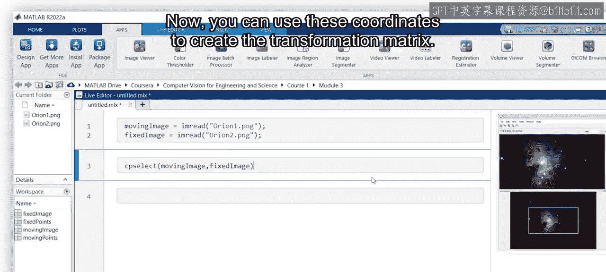

```matlab
tform = fitgeotrans(movingPoints, fixedPoints, ‘similarity’);
alignedImage = imwarp(movingImage, tform, ‘OutputView’, imref2d(size(fixedImage)));
```

最后，将变换后的移动图像与固定图像并排查看，以检查它们是否对齐。

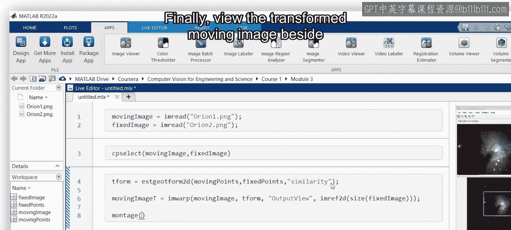
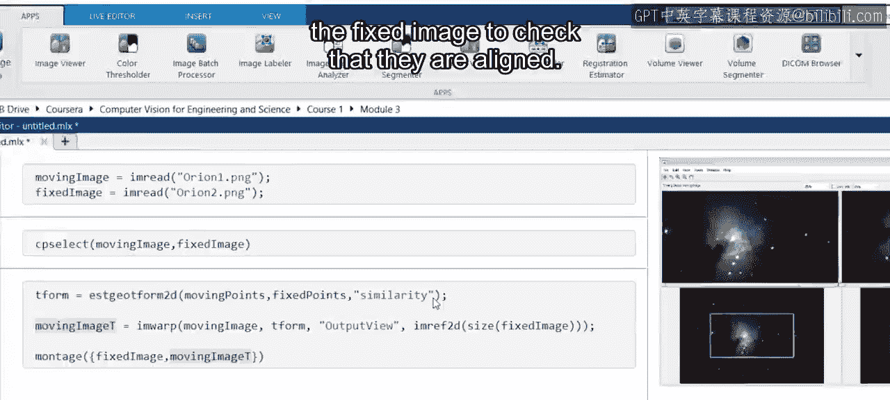


效果很好。


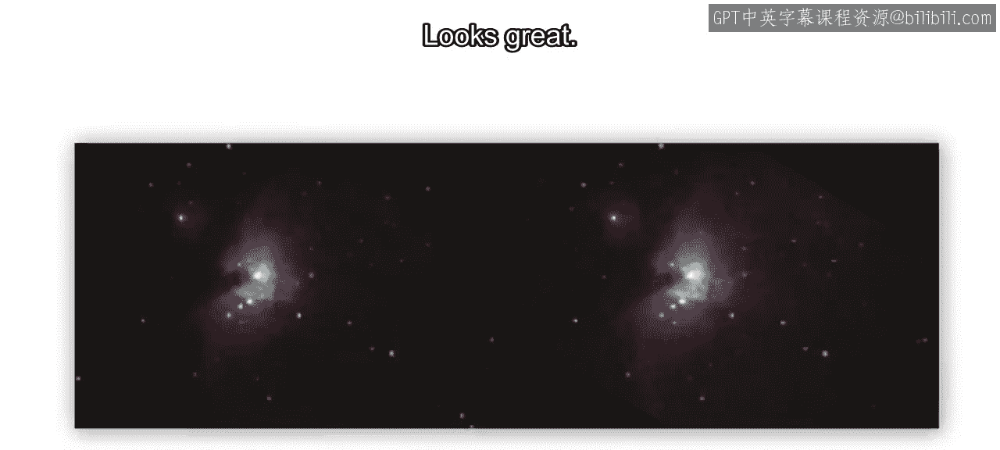


## 总结

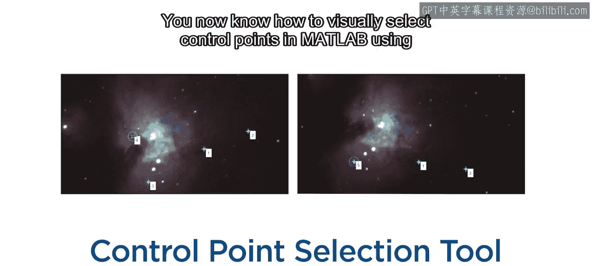

本节课中，我们一起学习了如何使用MATLAB中的控制点选择工具可视化地选择控制点，并完成手动图像配准。


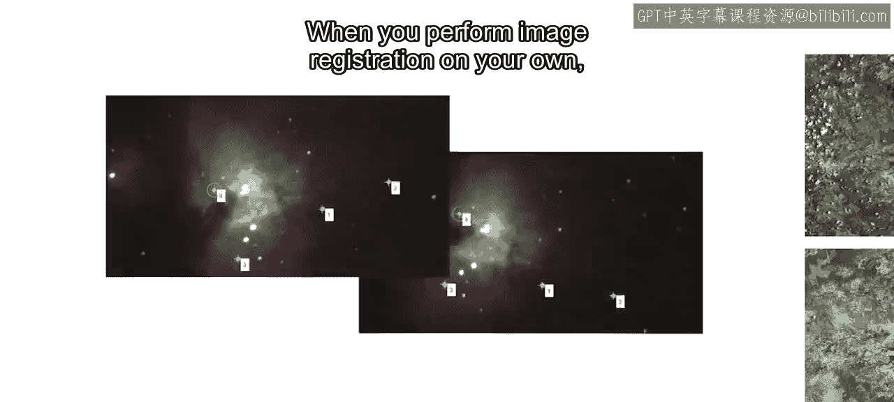

当您自己执行图像配准时，请记住：如果难以使用特征匹配，或者您只有少量图像需要处理，手动选择控制点是一个值得考虑的好方法。

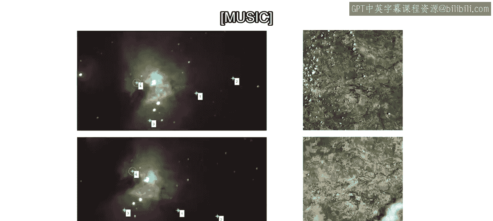


