# 工程与科学计算机视觉：9：拼接图像 🧩

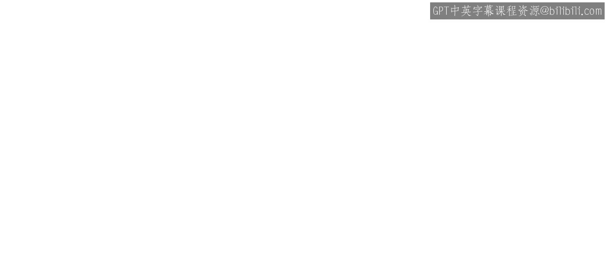

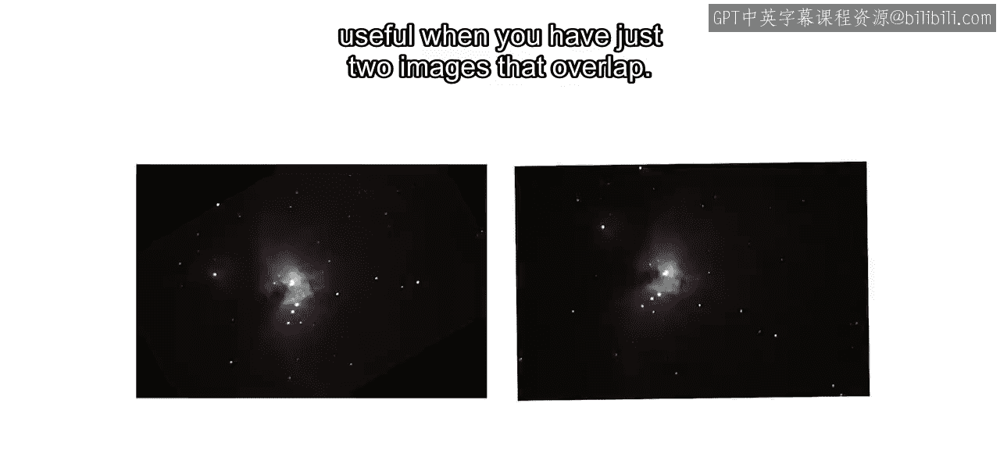

在本节课中，我们将学习如何将多张部分重叠的图像拼接成一幅更大的全景图。这个过程被称为图像拼接，是图像配准的一种特殊形式。我们将通过一个混凝土裂缝图像序列的实例，详细拆解拼接过程的三个主要步骤。

## 概述

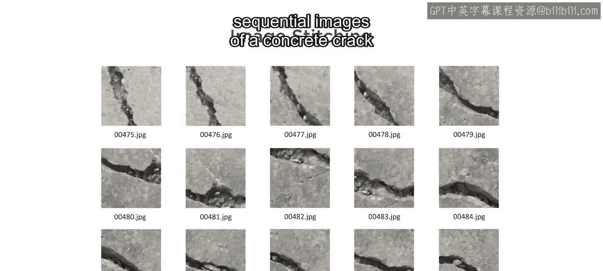

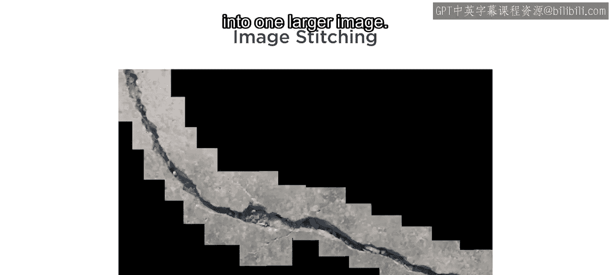

当您拥有多张部分重叠的图像，并需要将它们组合成一个更大的场景时，基础的两图配准方法就不够用了。这个过程被称为**图像拼接**。本节教程将指导您完成将一系列混凝土裂缝图像拼接成一张全景图的完整流程。

## 图像拼接的三个主要步骤

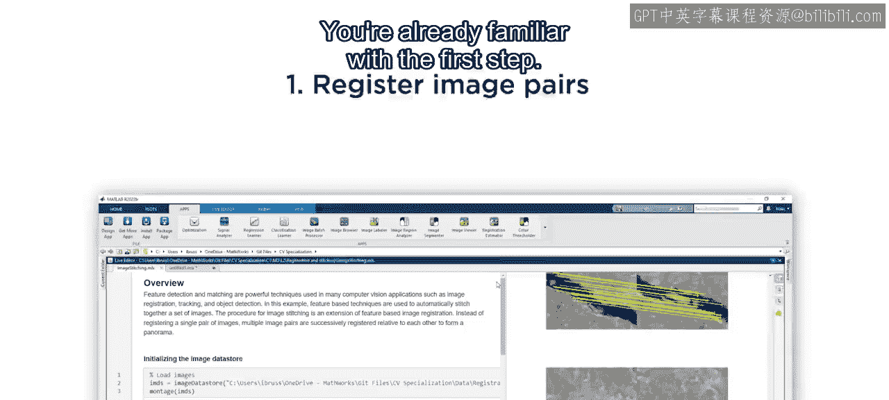

图像拼接可以分解为三个核心步骤：配准连续的图像对、初始化模板图像以及创建最终的全景图。

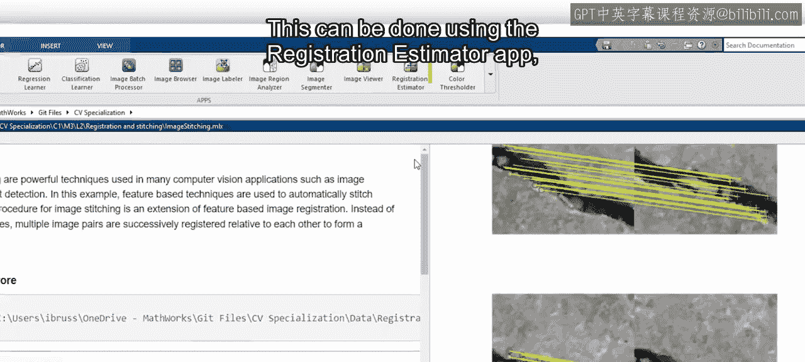

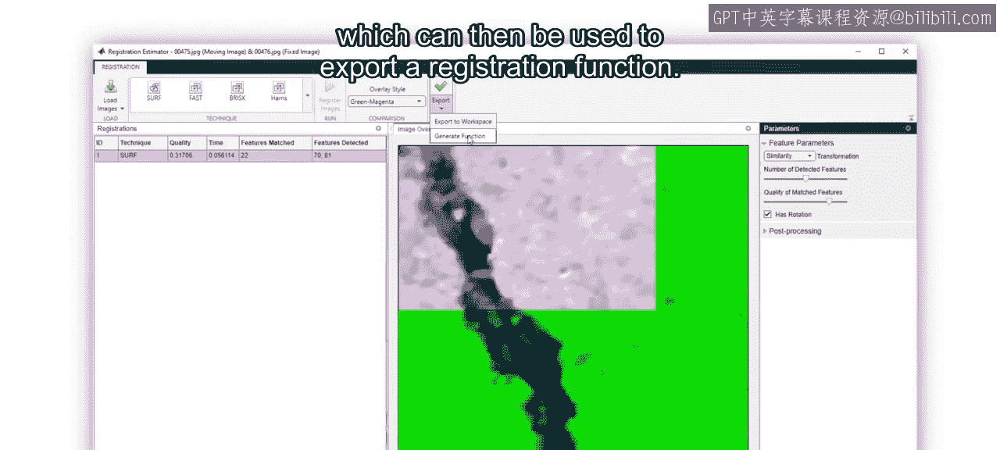

### 步骤一：配准连续的图像对

上一节我们介绍了基础的两图配准。在本节中，我们来看看如何为多张连续图像进行配准。

为了配准图像对，您需要估计一个几何变换。这可以通过使用 **Registration Estimator App** 来完成，该工具可以导出一个配准函数。

这个函数将被应用于每一对连续的图像（例如，这里显示的第4张和第5张图像）。要为所有14对图像计算变换，您可以多次运行此代码，但这会非常耗时。幸运的是，有一个更好的方法。

解决方案是使用**图像数据存储**来循环遍历所有图像。图像数据存储包含了您要处理的图像文件的位置信息，图像只在需要时才会被加载。

以下是估算所有连续图像对变换的步骤：

1.  使用 `for` 循环遍历数据存储。
2.  在循环中应用导出的配准函数。
3.  估算变换后，有一行代码用于可视化匹配点。
4.  步骤一的最后部分将每个变换保存到一个新变量中，然后将其与前一张图像的变换相乘。

这最后一行代码对于将图像正确放置在模板中至关重要。请记住，变换包含了如何扭曲图像坐标的指令。为图像2估算的变换会扭曲它，使其与图像1配准。同样，图像3的变换使其与图像2对齐。然而，因为我们想要拼接所有图像，所以需要传递图像2的变换，以便所有图像最终都相对于图像1进行配准。

这个过程对所有图像重复进行，确保尽管它们最初是成对连续配准的，但最终都配准回第一张图像。为了实现这一点，2D图像变换从线性代数中继承了一些有用的属性。具体来说，**组合两个变换的效果意味着将它们的矩阵相乘**。

运行步骤一的代码后，您将看到每对连续图像的匹配特征点。使用它们来确认变换估算是否正确。

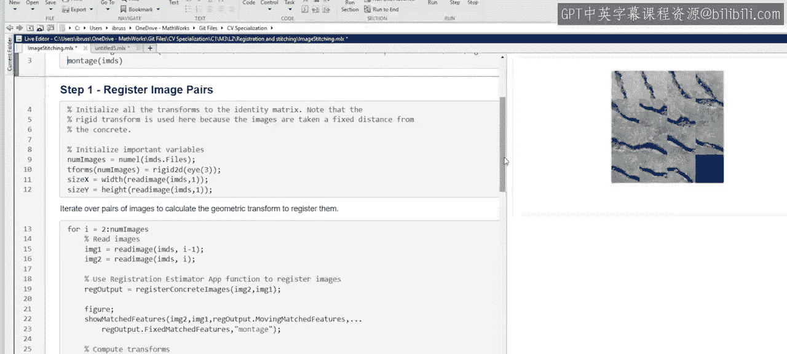

### 步骤二：初始化模板图像

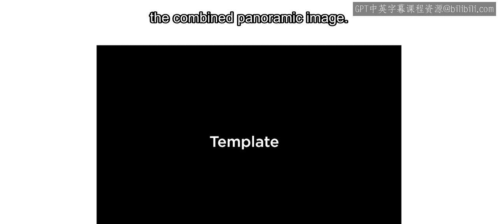

在成功配准了所有图像对之后，下一步是为组合的全景图创建模板。

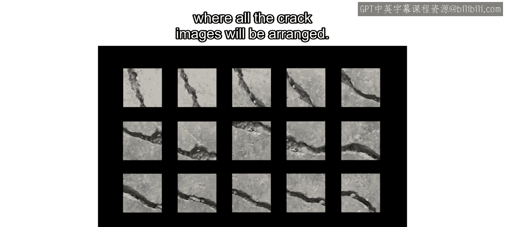

这个模板本质上是一个大的空白图像，所有裂缝图像都将被排列在其中。

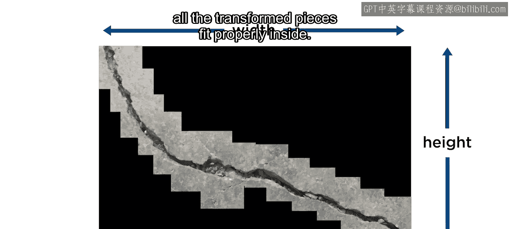

此处的代码计算模板所需的宽度和高度，以确保所有变换后的图像块都能合适地放入其中。然后，使用正确的尺寸初始化模板。

### 步骤三：创建最终全景图

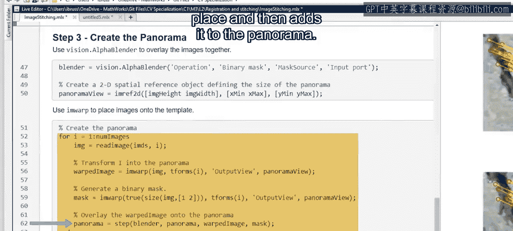

初始化了模板之后，最后一步是将所有组件图像合并到模板中。

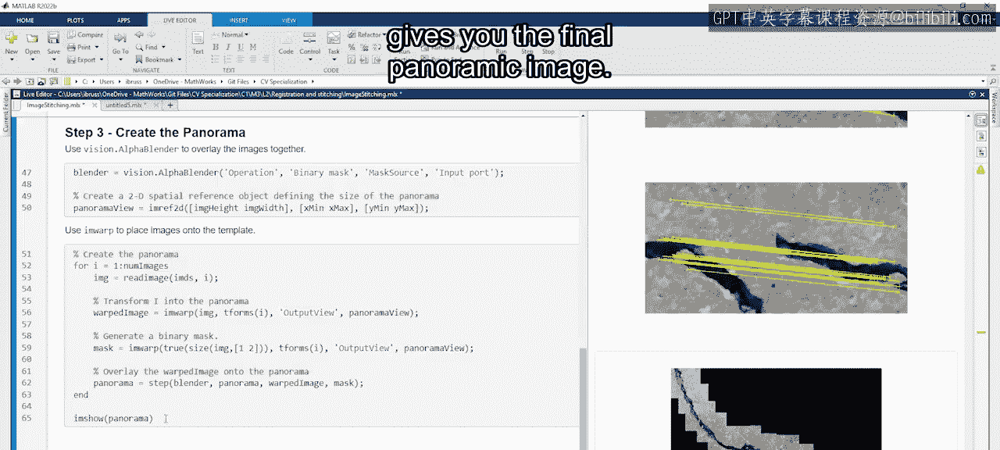

为此，您需要使用一个名为 **Alpha Blender** 的工具，它负责在将图像放置到模板上时合并图像。这个最终的循环将每张图像扭曲到位，然后将其添加到全景图中。

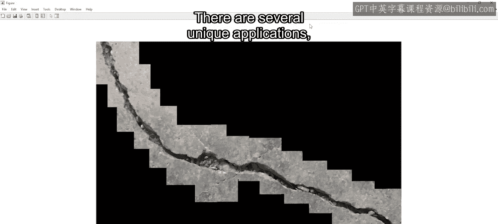

运行这最后一步，您将得到最终的全景图像。看起来我们的拼接过程在这个例子中效果很好。

## 脚本的适用性与调整

然而，这个脚本并不一定适用于所有图像拼接情况。有几种独特的应用场景，每种都可能需要对我们这里介绍的脚本进行修改。

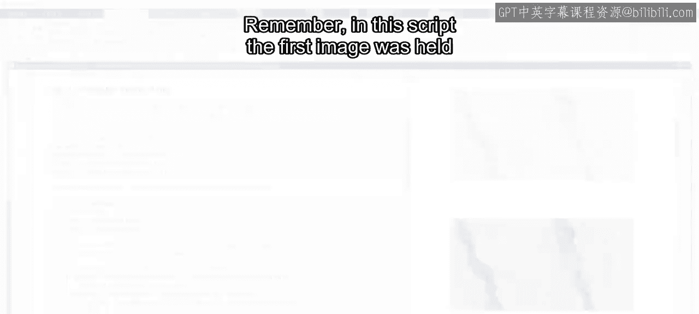

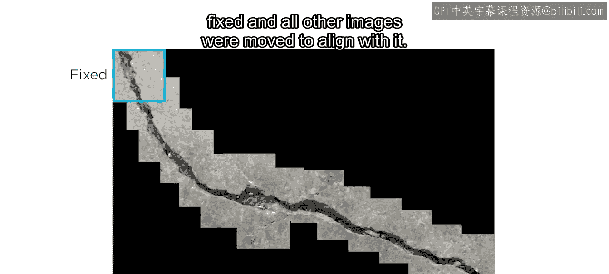

例如，在步骤一中，我们使用基于特征的方法来估算几何变换。但是，如果您的图像没有明显的特征，您可能需要使用 **CPSelect 工具** 手动选择控制点。这样，您将在每次循环迭代中被提示匹配点。

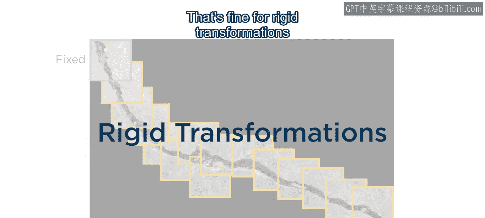

另一个难点是，如果您要拼接需要更复杂变换（如**投影变换**）的图像。请记住，在这个脚本中，第一张图像是固定不动的，所有其他图像都移动以与之对齐。这对于没有极端扭曲的**刚性变换**来说没问题。

然而，对于投影变换，情况就变得棘手了。以火星好奇号探测器拍摄的这三张图像为例。在这种情况下，连续的投影变换会导致全景图的末端出现显著的扭曲。

为了修正这种效果，您可以利用线性代数的另一个便利特性：将所有变换乘以您希望保持未变换的那个变换的**逆矩阵**（在本例中是中间图像的变换）。这个操作确保了全景图的中间部分不失真，并减少了边缘的扭曲效应。

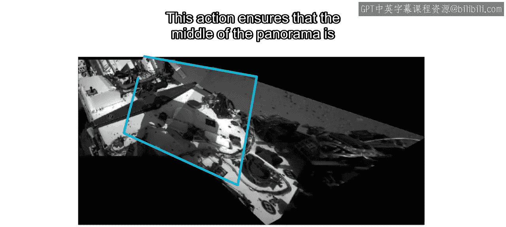

## 总结

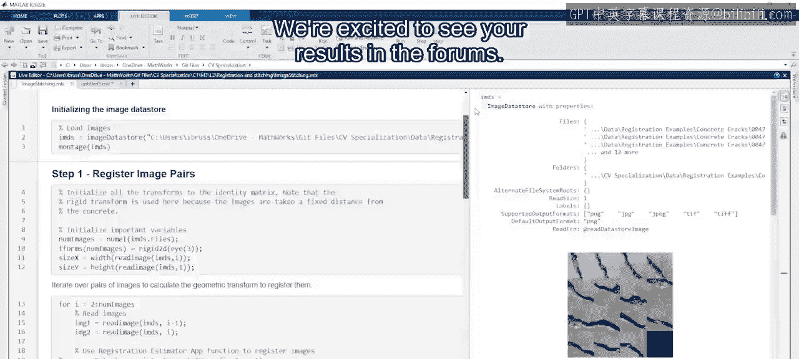

本节课中，我们一起学习了如何将多张重叠的图像拼接在一起。我们详细介绍了图像拼接的三个核心步骤：连续图像对的配准、模板图像的初始化以及最终全景图的合成。您还了解了脚本的局限性以及如何针对不同场景（如缺乏特征或需要投影变换）进行调整。现在，您可以使用这个脚本来组合您自己的重叠图像了。