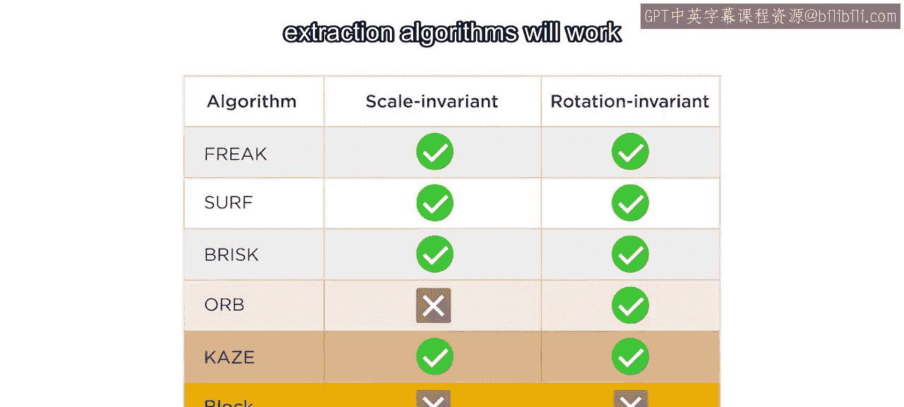
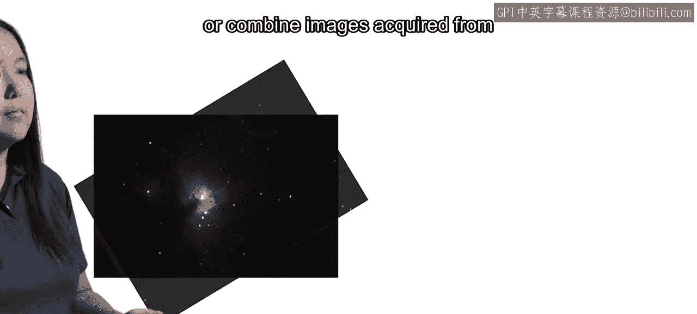
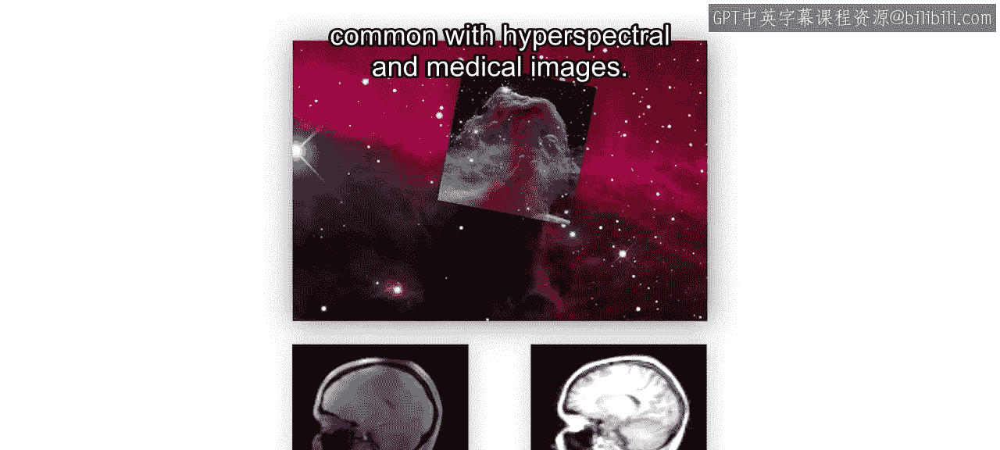
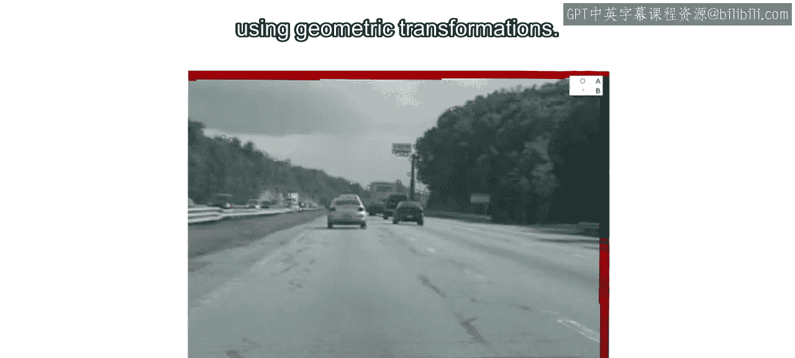
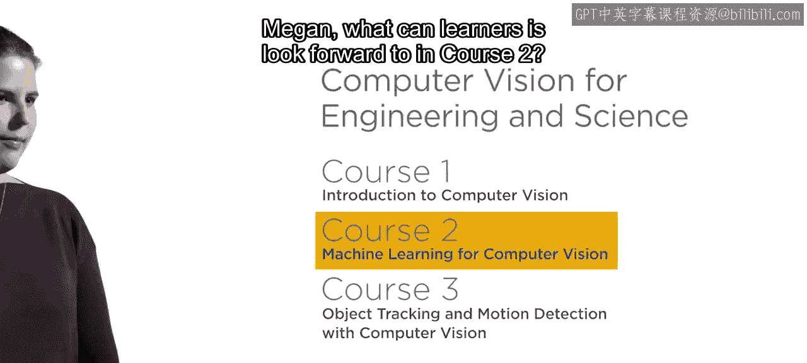
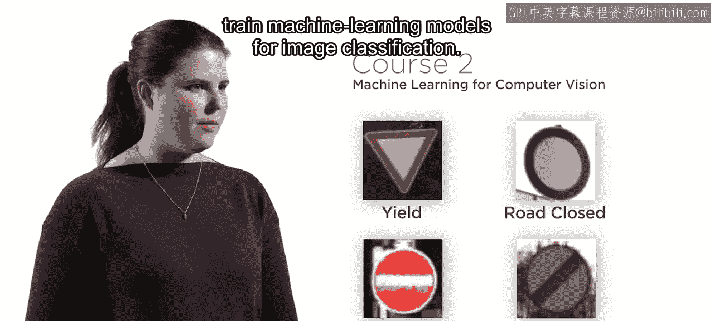
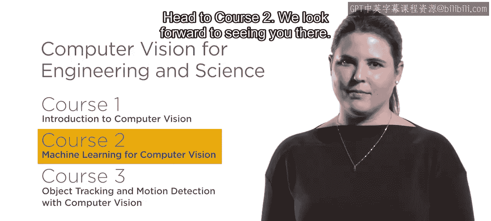

# 工程与科学计算机视觉：10：课程总结与展望

在本节课中，我们将对计算机视觉简介部分的核心内容进行总结，并展望后续课程将学习的关键主题。

## 概述

恭喜你完成本课程的学习。特征检测、特征提取与特征匹配是许多计算机视觉应用的关键初始步骤。

## 特征检测与提取

上一节我们介绍了特征的基础概念，本节中我们来看看其应用挑战。通常很难预先知道哪种特征检测或提取算法对特定问题最有效。

但现在你已经能够快速测试不同方法，并确定哪种方法适用于你的图像。

## 特征的应用

特征被用于众多应用中。在本课程中，你学习了一些最常见的应用，例如图像配准。

当需要比较在不同时间拍摄的同一场景图像时，配准是一个关键步骤。

或者，当需要组合从不同科学仪器获取的图像时（这在**高光谱图像**和**医学图像**中很常见），配准也至关重要。

## 其他基于特征的工作流

除了配准，计算机视觉中还有许多其他重要的基于特征的工作流。

例如，在视频中跨帧检测物体，以及使用**几何变换**（如仿射变换或透视变换）估计相机运动。

随着你继续学习本系列课程，你将使用特征来应对新的挑战。

## 后续课程展望

那么，学习者可以在课程2中期待什么呢？

感谢Amanda。在本系列课程的第二个课程中，你将运用在此学到的特征知识，来训练用于**图像分类**的机器学习模型。

你还将学习训练用于**目标检测**的模型。

分类和检测是两个最常见的计算机视觉任务。所以，请前往课程2。我们期待在那里见到你。😊

## 总结

本节课中我们一起学习了特征在计算机视觉中的核心地位及其多种应用，包括图像配准、物体检测与运动估计。同时，我们展望了后续课程将深入探讨的机器学习模型在图像分类与目标检测中的应用。