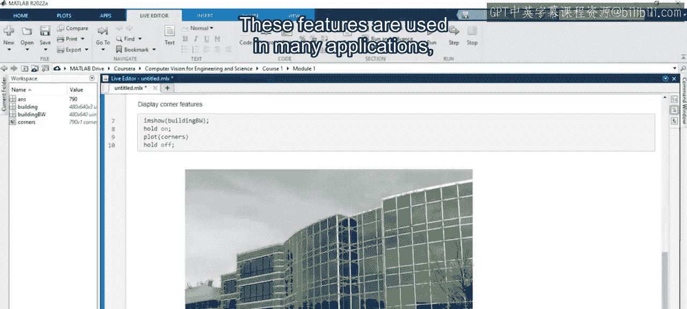
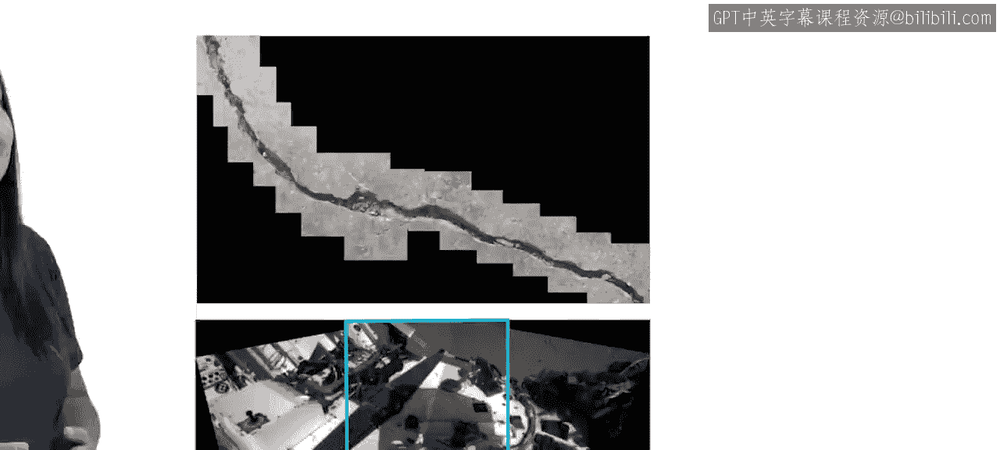
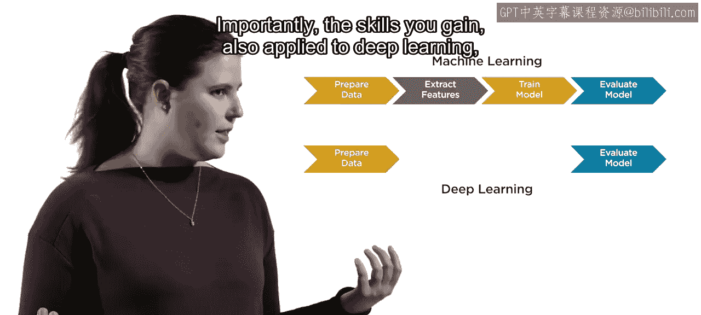
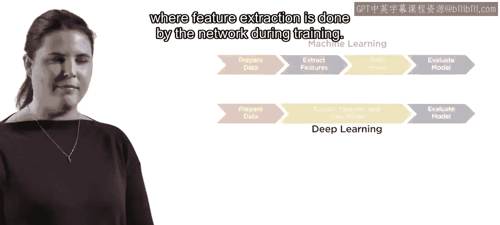
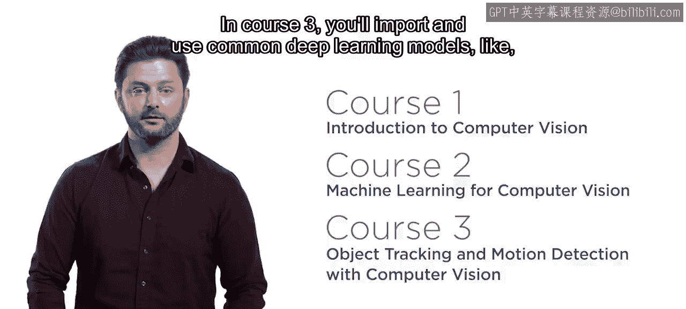
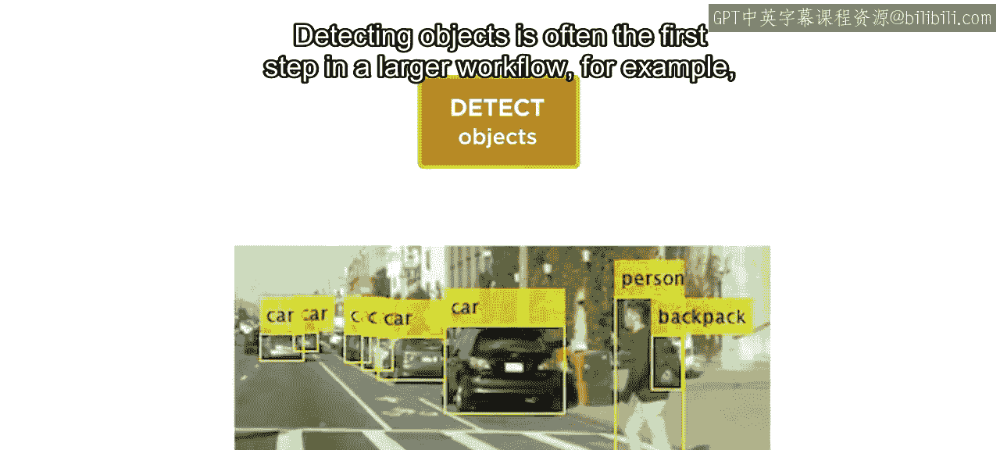
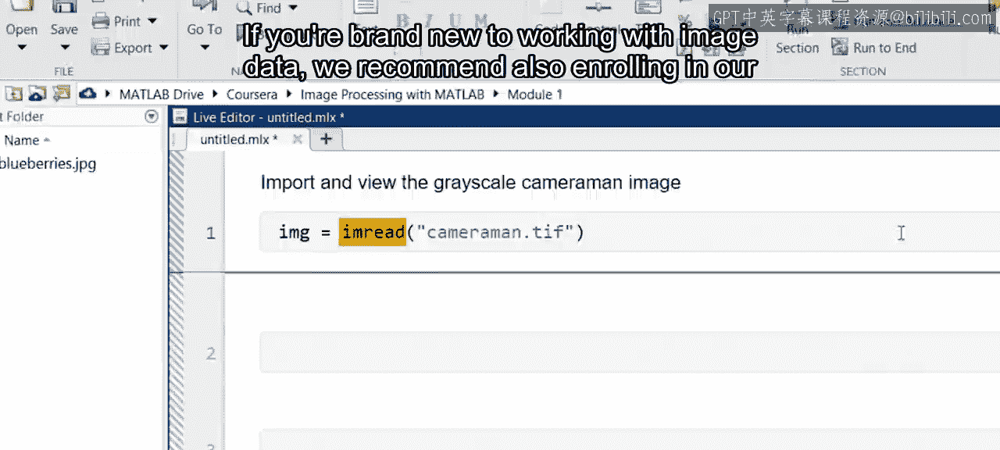
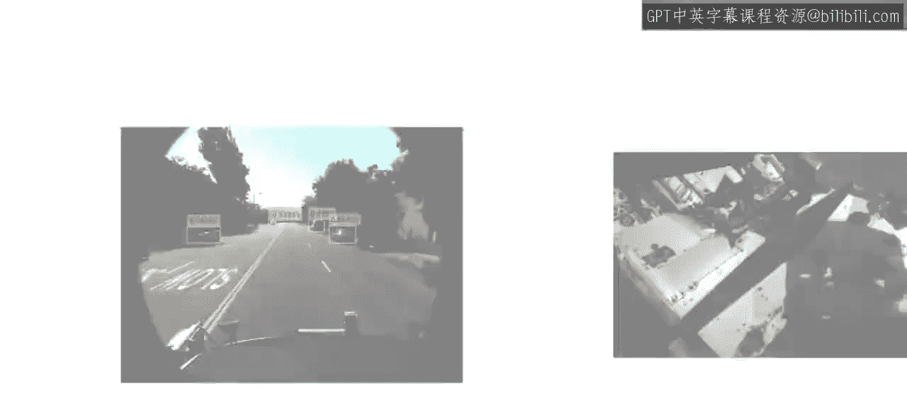

# 工程与科学计算机视觉：11：课程概述 🎯

在本课程中，我们将要学习MathWorks在Coursera平台上开设的《工程与科学计算机视觉》专项课程。该课程旨在帮助学习者掌握计算机视觉的核心技能，以应对日益增长的行业需求。

计算机视觉算法正运行在我们的手机、汽车甚至冰箱中。随着越来越多的设备配备摄像头，对具备计算机视觉经验人才的需求正在快速增长。为此，MathWorks在Coursera上创建了“工程与科学计算机视觉”专项课程。

这个包含三门课程的专项课程将引导你完成一系列实际项目，例如对齐卫星图像、训练识别路标的模型，以及跟踪即使移出视野的物体。

## 课程一：计算机视觉基础 🔍

上一节我们介绍了课程的整体背景，本节中我们来看看第一门课程的具体内容。

在课程一中，你将学习计算机视觉的基础知识。你将应用多种算法从图像中提取有用的特征。

以下是这些特征的一些典型应用场景：
*   图像配准
*   图像分类
*   目标跟踪

到课程一结束时，你将能够检测、提取和匹配特征，从而对齐并拼接如下所示的图像。

## 课程二：机器学习与特征应用 🤖

上一节我们学习了如何提取图像特征，本节中我们来看看如何将这些特征应用于机器学习。

在专项课程的第二门课中，你将把这些图像特征与流行的机器学习算法结合使用，以训练图像分类和目标检测模型。

然而，训练模型只是工作流程的一部分。为了获得良好结果，你需要学习如何为机器学习妥善准备图像，并在测试图像上评估训练好的模型。

重要的是，你所获得的这些技能同样适用于深度学习领域，在深度学习中，特征提取是由网络在训练过程中自动完成的。

## 课程三：深度学习与目标跟踪 🚀

上一节我们探讨了机器学习方法，本节中我们将聚焦于更先进的深度学习模型。

说到深度学习，目前已有大量现成的模型可用。在课程三中，你将导入并使用常见的深度学习模型（如**YOLO**）来执行目标检测。

检测目标通常是更大工作流程的第一步。例如，检测与运动预测结合使用，可以在一段时间内区分和跟踪多个目标。

在专项课程结束时，你将应用跟踪技术来统计繁忙道路上每个方向的车辆数量。

## 预备知识与建议 📚

要成功完成这些课程，具备一些先前的图像处理经验会很有帮助。如果你完全是图像数据处理的新手，我们建议你同时报名参加我们在Coursera上的“工程与科学图像处理”专项课程。

计算机视觉是一个令人兴奋且不断发展的领域。本专项课程将为你提供必要的技能，助你在一个图像和摄像头比以往任何时候都更重要的世界中取得成功。

---

本节课中我们一起学习了《工程与科学计算机视觉》专项课程的整体框架、三门课程的核心内容（基础特征提取、机器学习应用、深度学习与跟踪），以及学习该课程所需的预备知识。现在，让我们开始学习吧。