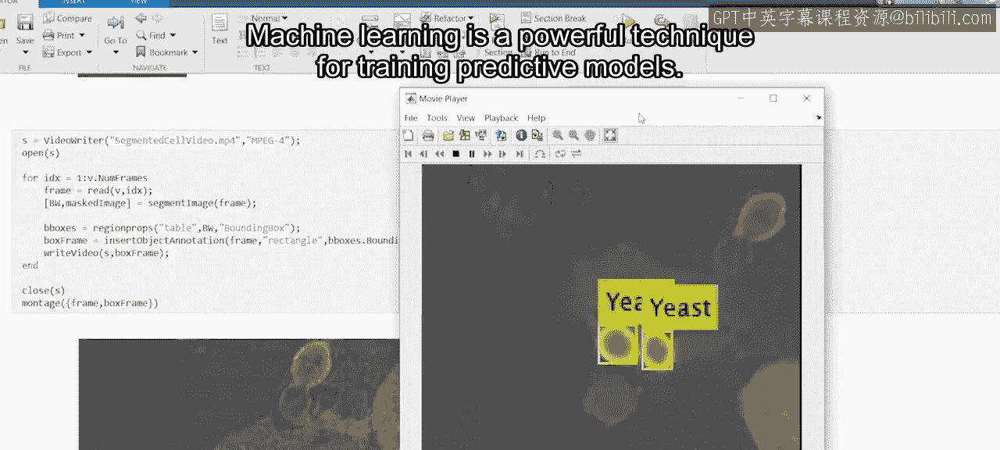
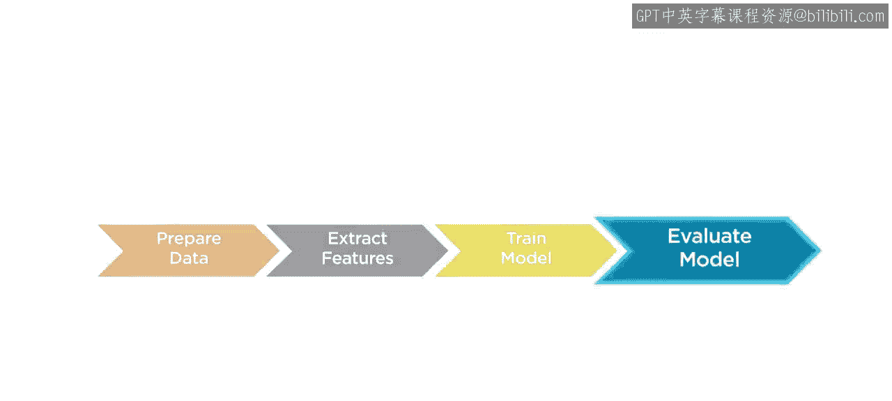
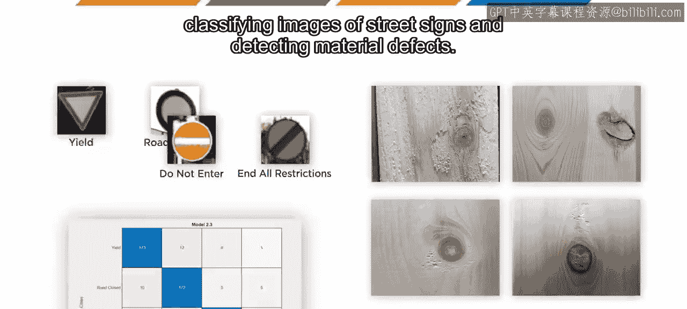
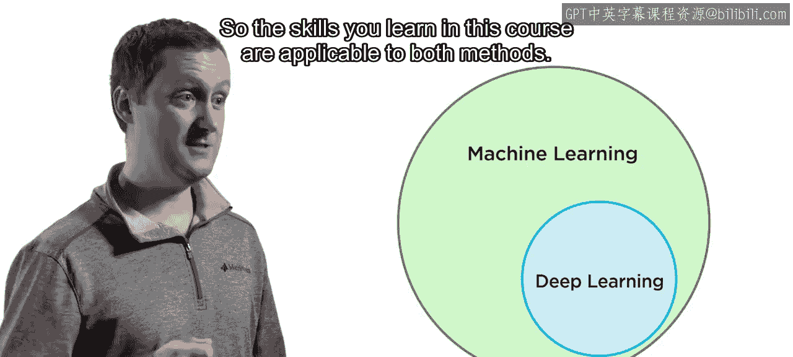
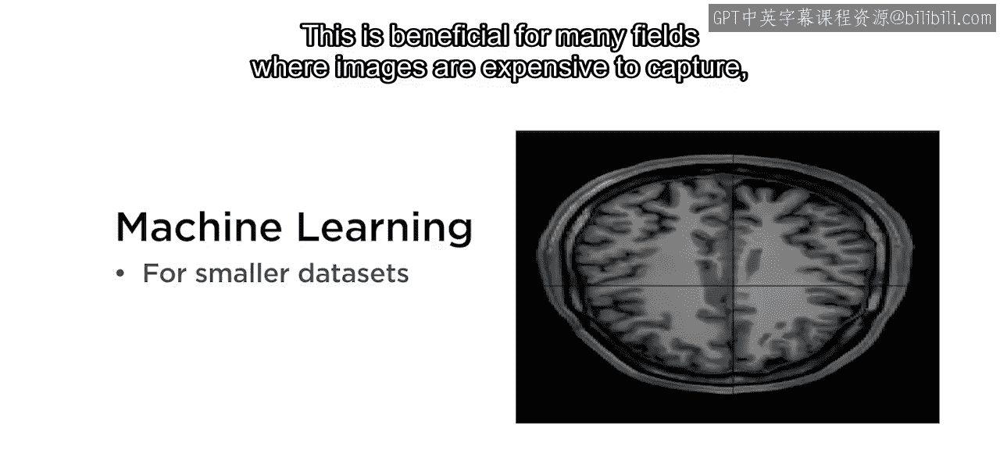
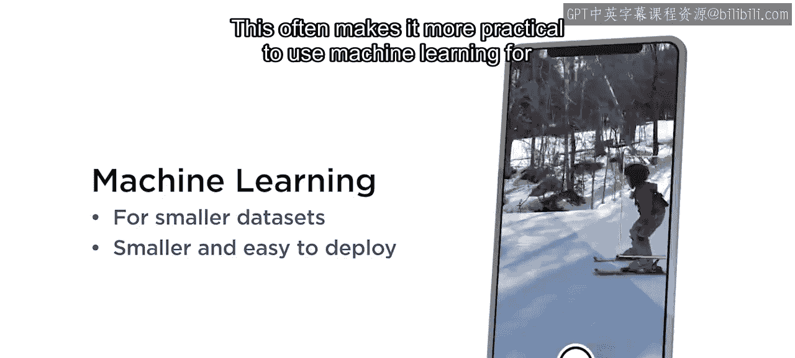
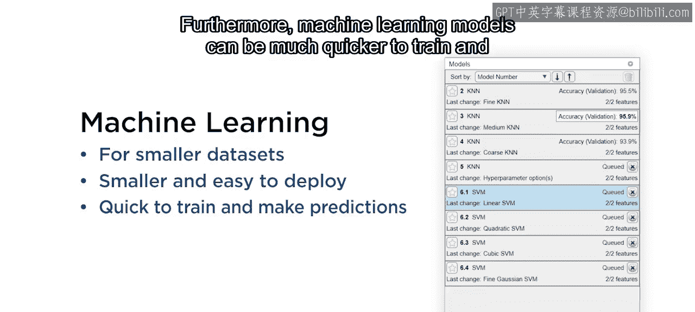
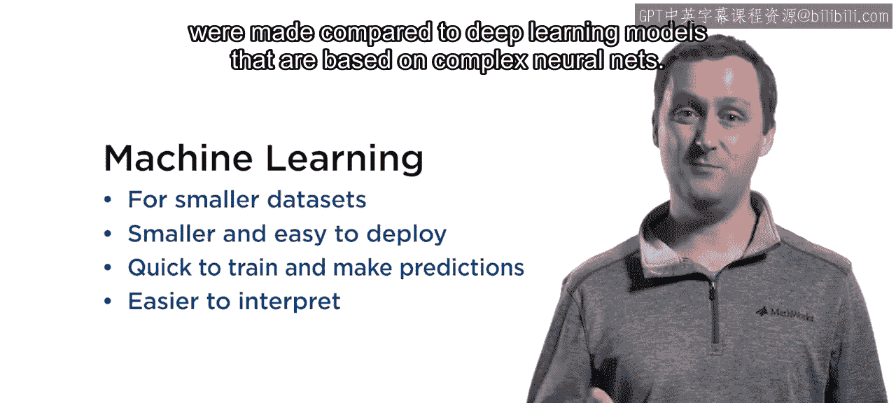
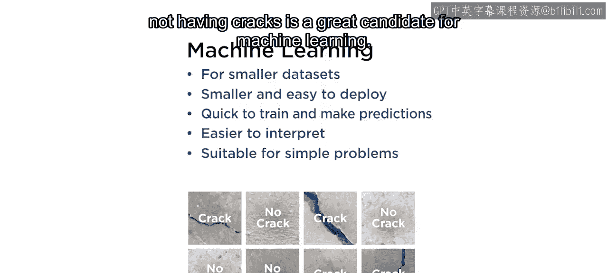
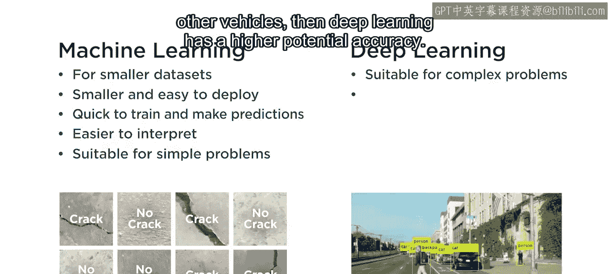

# 工程与科学计算机视觉：12：计算机视觉机器学习简介 👁️

在本节课中，我们将要学习机器学习在计算机视觉领域的基本概念、核心应用以及其相对于深度学习的优势。

机器学习是一种用于训练预测模型的强大技术。

在计算机视觉领域，这些模型所使用的数据是图像和视频。

## 机器学习在计算机视觉中的两大应用

以下是机器学习在计算机视觉中最常见的两种应用：

*   **图像分类**：为整张图像打上标签，预测其内容。
*   **目标检测**：定位图像中物体的具体位置。

## 机器学习工作流程

在本课程中，你将应用一个机器学习工作流程。这个流程将指导你完成从准备数据到评估结果的整个模型开发与使用过程。

随后，你将使用这个工作流程来完成两个项目：

*   **项目一**：对街道标志图像进行分类。
*   **项目二**：检测材料缺陷。

## 机器学习与深度学习的关系

计算机视觉中另一个流行的工具是**深度学习**，它使用基于深度神经网络构建的模型。

深度学习实际上是机器学习的一个子集。因此，你在本课程中学到的技能对这两种方法都适用。

深度学习在某些应用中非常强大，但本课程涵盖的标准机器学习技术更适合一些常见的计算机视觉任务。

## 机器学习的优势

上一节我们介绍了机器学习与深度学习的关系，本节中我们来看看机器学习在特定场景下的优势。以下是其主要优点：

*   **模型更简单，数据需求小**：机器学习模型更简单，因此可以使用较小的数据集进行训练。这对于许多图像采集成本高昂的领域（如医学）非常有益。
    *   **公式/代码示例**：`小数据集 + 简单模型 = 可行的训练方案`
*   **模型更小，易于部署**：机器学习模型也更小，更容易部署。这通常使得在小型设备上进行实时检测时，使用机器学习更为实用。
*   **训练和预测速度更快**：此外，机器学习模型的训练和预测速度通常要快得多。
*   **模型可解释性更强**：与基于复杂神经网络的深度学习模型相比，机器学习模型通常更容易理解其做出特定预测的原因。

## 适用场景总结

综上所述，机器学习最适合解决相对简单的问题。

例如，将这些混凝土图像分类为“有裂缝”或“无裂缝”，就是机器学习的一个绝佳应用场景。

反之，深度学习则适用于复杂问题。例如，如果你需要同时定位行人、自行车和其他车辆，那么深度学习具有更高的潜在准确度。

在本课程中，我们将专注于机器学习表现良好的场景。我们提供了一系列数据集供你练习，但也鼓励你用自己的例子来测试所学知识。

## 课程总结

本节课中，我们一起学习了机器学习在计算机视觉中的基础。我们了解了它的两大核心应用（分类与检测），认识了标准的工作流程，并探讨了其相对于深度学习在数据需求、部署便捷性、速度和可解释性方面的优势。完成本课程将帮助你应对计算机视觉中一些最常见且具有挑战性的问题。

如果在学习过程中需要帮助，请务必使用课程论坛。

祝你学习顺利！