# 工程与科学计算机视觉：13：机器学习工作流程 🗺️

在本节课中，我们将要学习机器学习在计算机视觉应用中的核心工作流程。这个流程是贯穿本课程的路线图，它将指导我们如何从数据准备开始，最终训练出能够对新图像进行预测的模型。

机器学习对于许多计算机视觉应用至关重要，从自动驾驶到生鲜食品配送，再到疾病诊断。本视频介绍了一个机器学习工作流程，你将在整个课程中遵循它。

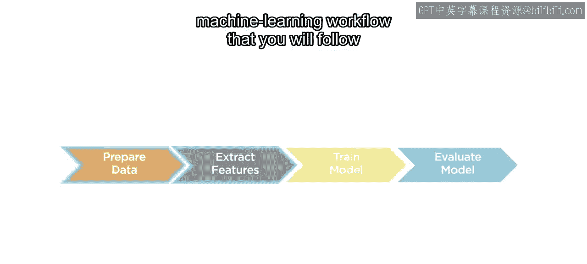

我们的最终目标是训练出能够执行图像分类和目标检测的模型，并对模型从未见过的新图像进行预测。

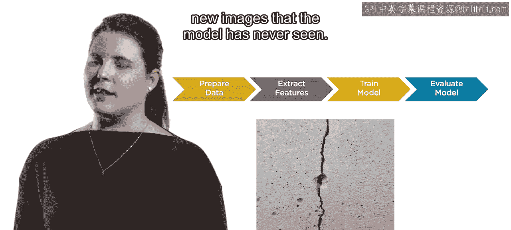

最终，给定一张新的、未标记的图像，你将能够提取出特征，供训练好的模型解读并分配一个标签。

## 数据准备 📊

创建模型的第一步是使用称为**预测特征**的数据来训练它。在计算机视觉中，这些预测特征是从一组图像中提取的。但在提取特征之前，你必须准备好你的图像。

分类和目标检测模型的训练需要两样东西：一组图像特征，以及每张图像对应的一个标签。

以下是数据准备的三个核心步骤：

1.  **创建标签**：为你的数据集创建标签是准备数据的第一步。这些标签将作为**真实值**。
2.  **划分数据集**：下一个准备任务是将你的标记数据划分为**训练集**和**测试集**。训练集将用于训练你的模型，测试集则暂时搁置，留待后续使用。在任何机器学习应用中，都应在工作流程开始前执行此步骤，以避免无意中使测试集产生偏差，从而导致误导或不正确的结果。
3.  **图像处理**：数据准备的最后一步是根据需要进行图像处理。例如，空间滤波或对比度调整可以改善后续特征提取步骤的效果。

## 特征提取 🔍

上一节我们介绍了数据准备，本节中我们来看看如何从准备好的图像中提取特征。

你已经在专业课程的第一部分学习了一些提取特征的方法。

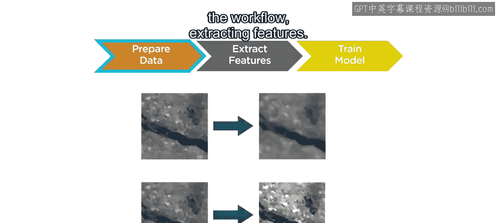

并且你将在这里学习新的方法。

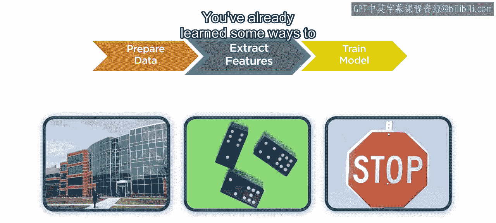

一旦提取了特征，你就可以将它们与图像或对象的标签结合使用来训练你的模型。

## 模型训练与调优 ⚙️

在获得特征之后，下一步就是利用它们来训练模型。

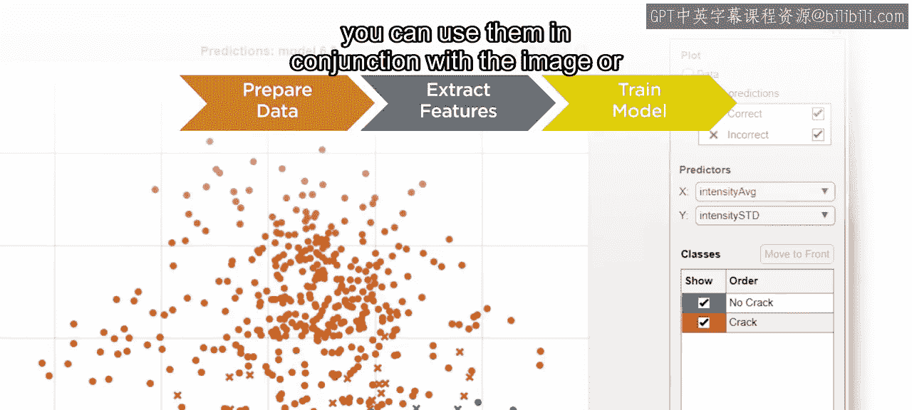

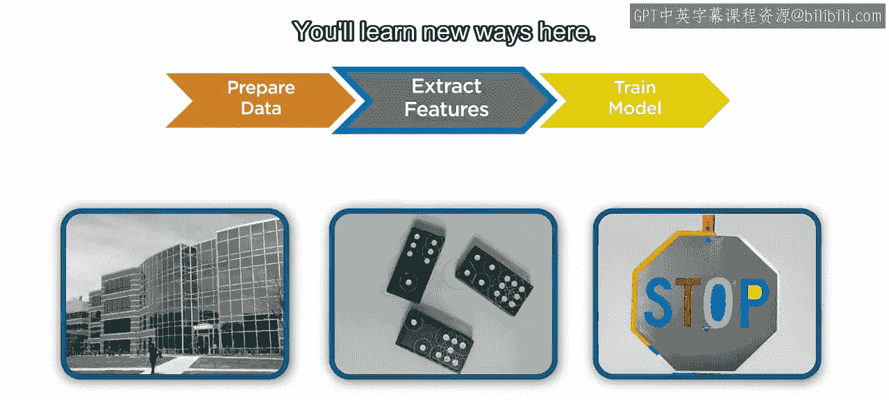

你将尝试多种不同的模型类型，并学习如何通过调整模型参数来改进结果。

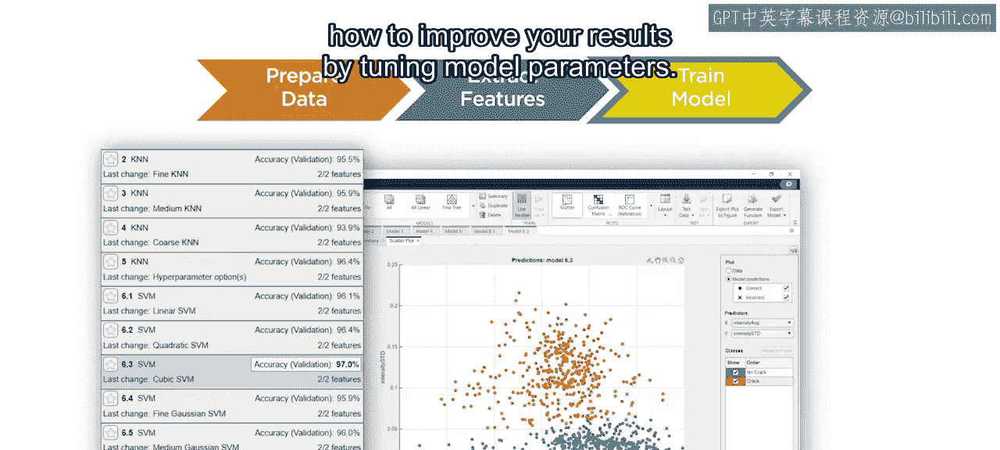

## 模型评估 📈

工作流程的最后一部分是评估你训练好的模型。

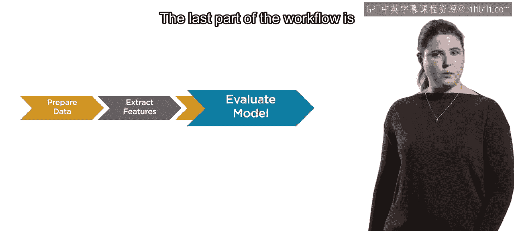

在此步骤中，你将确定哪个训练好的模型最适合你的应用。

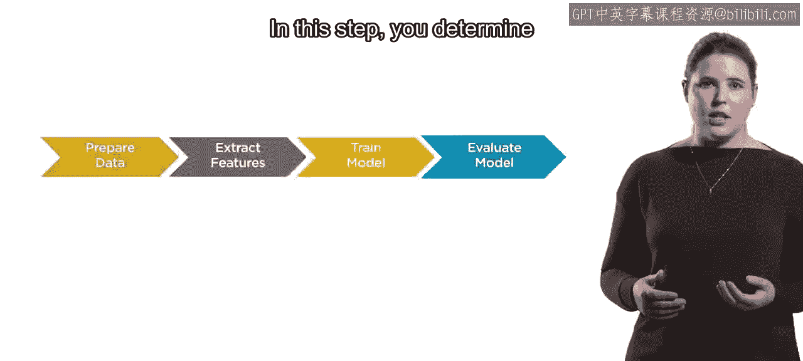

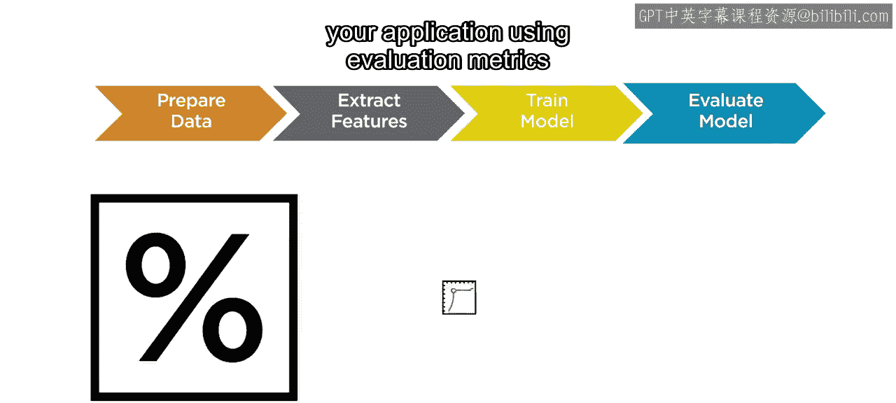

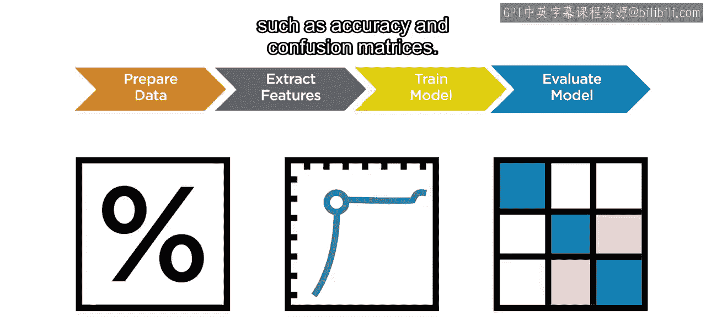

以下是常用的评估方法：

*   使用**准确率**和**混淆矩阵**等评估指标。
*   还记得之前预留的测试集吗？现在是使用它的时候了。将你的模型应用于测试图像并评估结果。这可以让你估计模型在新的、未标记图像上的表现如何。

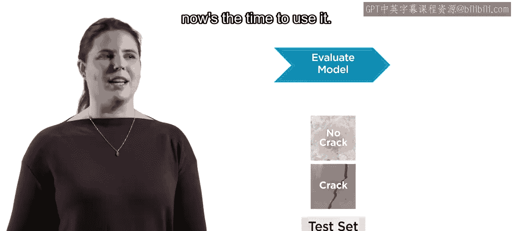

## 迭代过程与深度学习 🔄

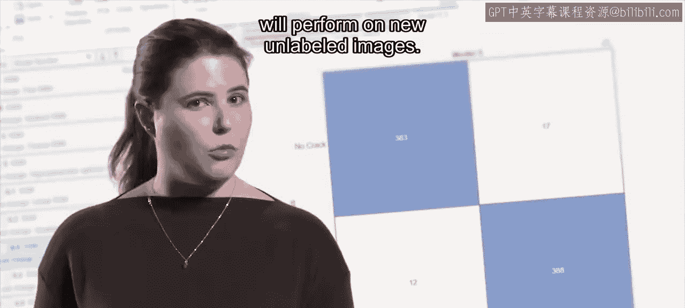

重要的是要记住，你不应该期望每个应用只严格地走一遍这个工作流程。因为机器学习是一个迭代过程，你通常需要更新策略并重新尝试各个步骤以获得最佳结果。

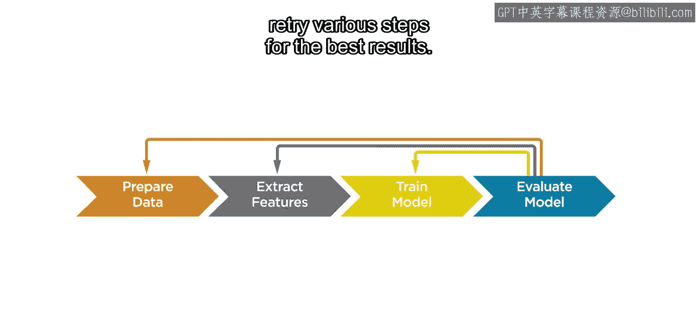

常见的尝试包括：

*   选择不同的模型进行训练。
*   调整模型参数。
*   选择不同类型的特征。

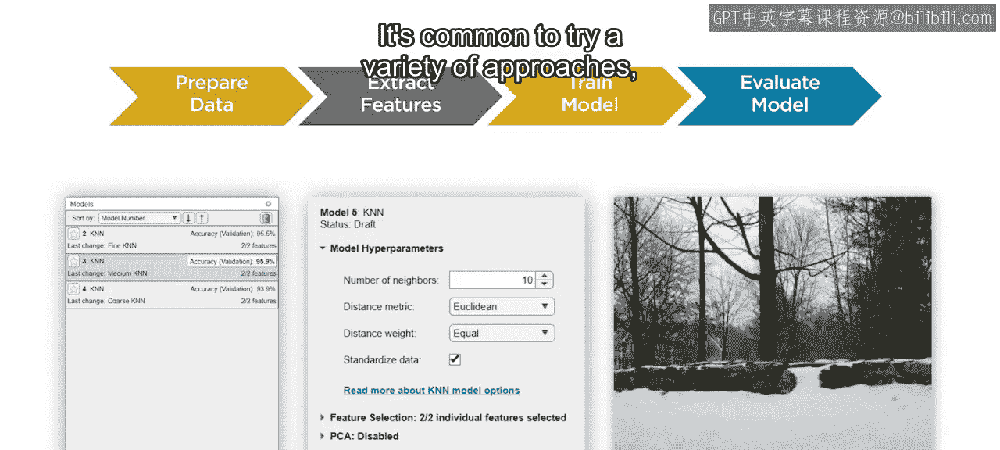

在本课程中，我们专注于传统机器学习。然而，深度学习遵循一个非常相似的工作流程。

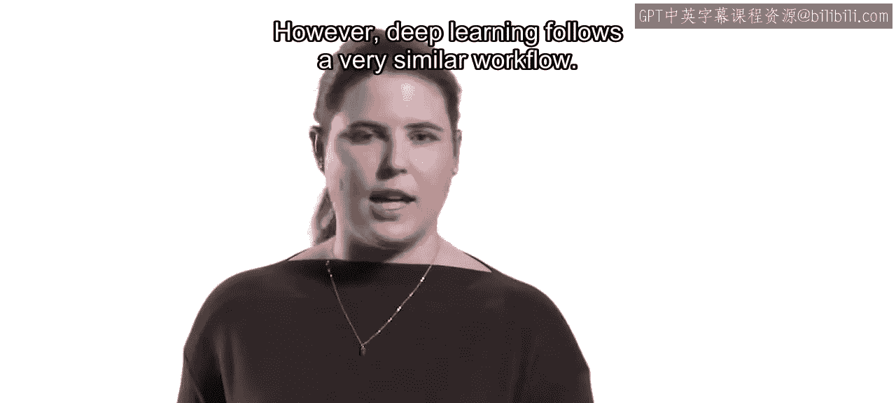

关键区别在于，在深度学习中，**提取特征**的步骤是由模型在训练过程中自行完成的，它直接以准备好的图像作为输入。

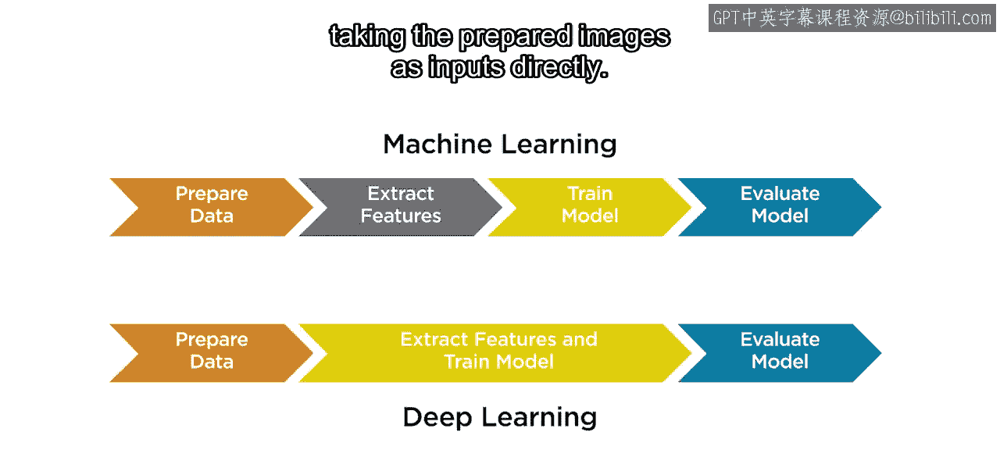

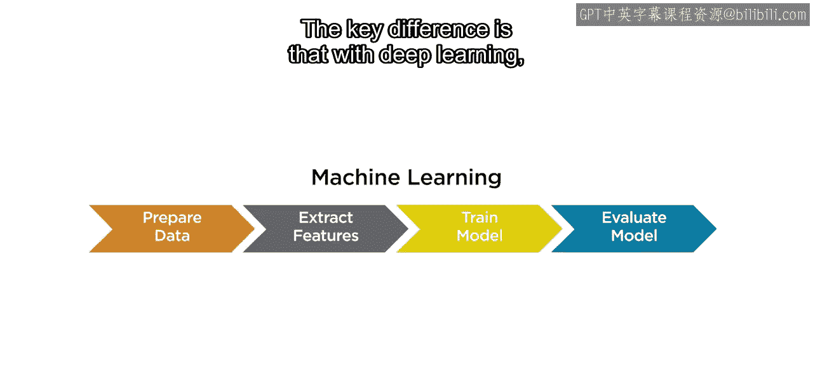

因此，当你的图像具有可辨别的共同特征时，传统机器学习非常适合。在本课程中，你将学习使用各种工具为你的数据集开发最佳模型。

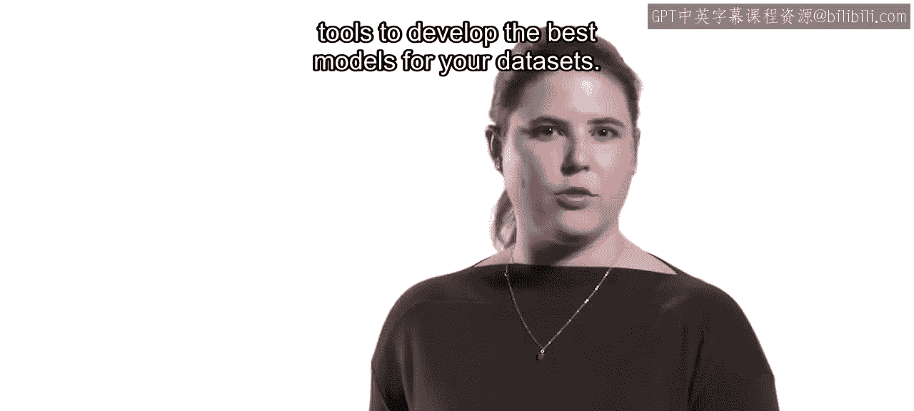

当你执行这些步骤中的每一步时，请将它们放在机器学习工作流程的背景下思考。

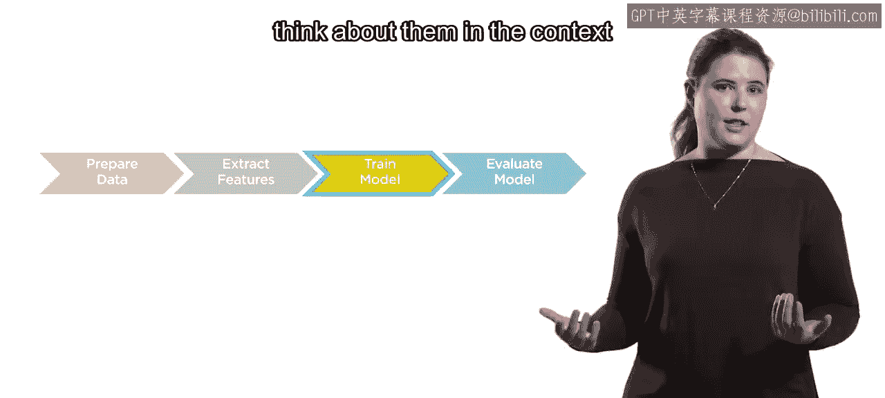

---

**总结**

本节课中我们一起学习了机器学习的标准工作流程。我们从**数据准备**（标记、划分、处理）开始，然后进行**特征提取**，接着利用特征进行**模型训练与调优**，最后通过**模型评估**（使用测试集和评估指标）来确定最佳模型。我们了解到这是一个**迭代过程**，可能需要反复尝试不同策略。同时，我们也简要对比了传统机器学习与**深度学习**在工作流程上的核心差异：后者将特征提取集成到了模型训练内部。掌握这个工作流程是成功应用机器学习解决计算机视觉问题的基础。