# 工程与科学计算机视觉：17：特征袋简介 🧩

在本节课中，我们将学习特征袋（Bag of Features）算法的基本原理。该算法通过提取图像特征描述符、构建视觉词汇表，并统计词汇出现频率，将图像转换为可用于训练分类模型的数值特征矩阵。

为了训练一个分类模型，数据集中每张图像的每个特征都需要有一个单一数值。这样，就能基于图像在共享特征上的相对值，建立图像之间的定量关联关系。我们将这些可用于训练的特征称为**预测特征**。

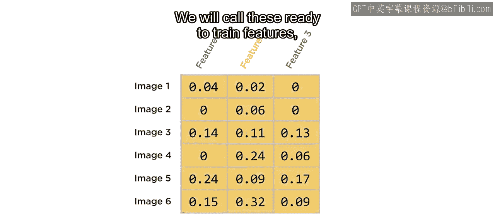

但是，如何获得这些预测特征呢？有时，你可以基于自己执行的计算，使用简单的预测特征。然而，通常你很难找到足够有区分度的特征来成功对图像进行分类。

例如，使用基于强度的预测特征来区分开裂与未开裂的混凝土非常有效。

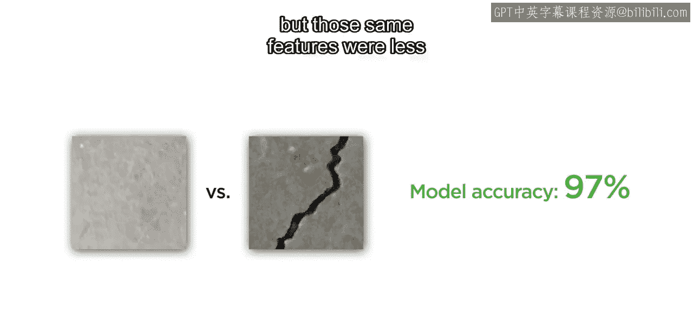

但同样的特征在分类交通标志时效果较差。

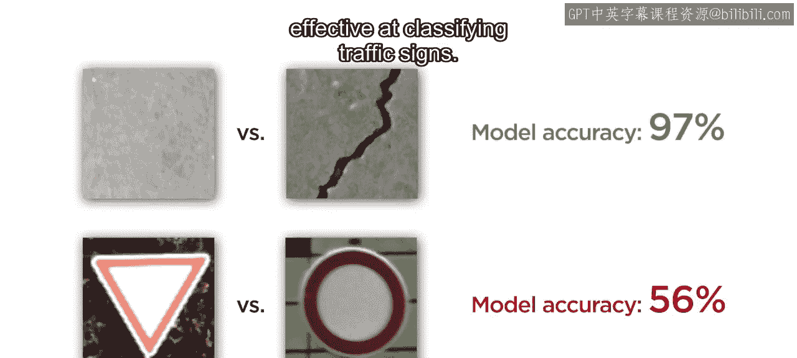

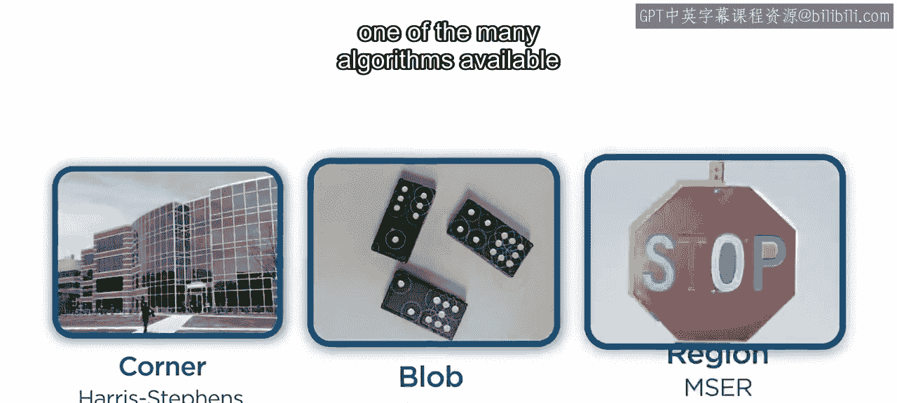

你通常可以利用众多可用的特征描述符提取算法之一来获得更好的结果。

由于图像中存在微小变化，例如光照、角度和背景的变化，即使是相似的特征，其描述符值也会不同。如果没有共享的特征向量，就难以创建训练模型所需的矩阵。

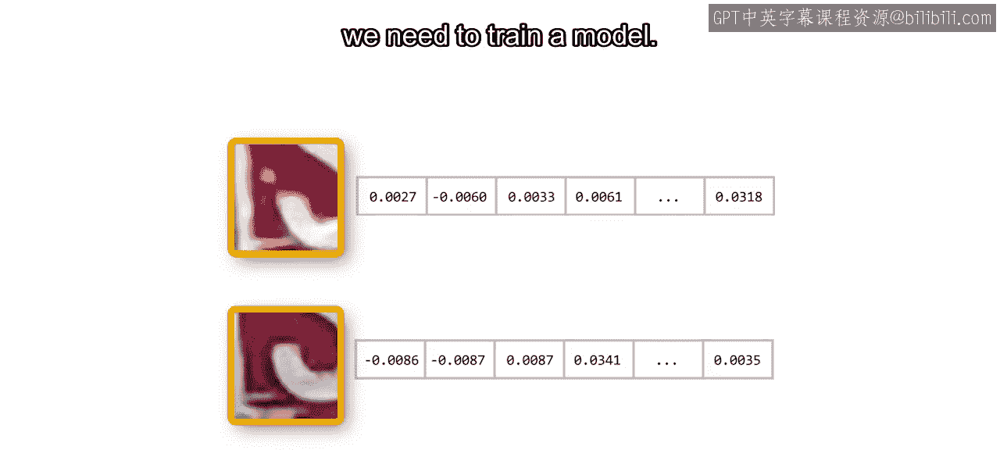

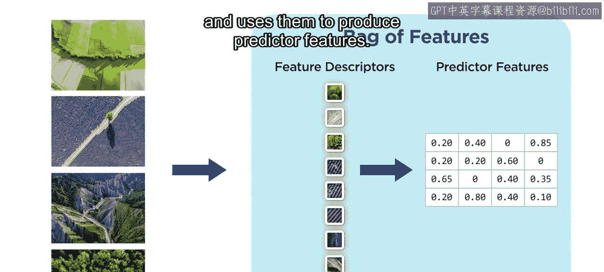

在本视频中，你将看到特征袋算法如何从图像中提取特征描述符，并用它们来生成预测特征。

## 构建视觉词汇表

考虑这张风景图及其描述符。有时，相似的描述符经常出现在其他图像中；有时，它们很少出现在其他图像中；还有一些描述符仅对单张图像是独特的。

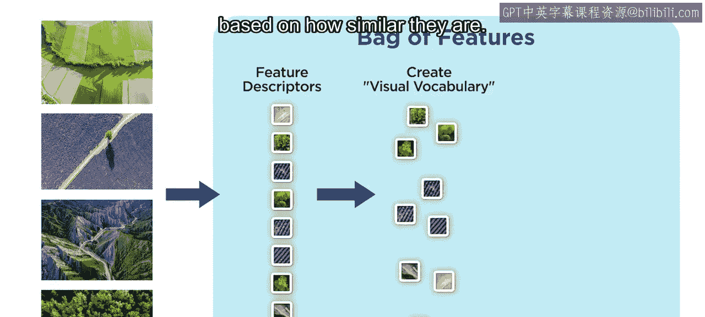

特征袋算法通过从所有图像中提取描述符，并根据它们的相似性将其聚类成组，从而创建一种比较图像的方法。

这个过程称为**构建视觉词汇表**。具有相似特征向量的描述符在空间上会更接近，而不相似的则相距较远。实际上，这种比较发生在多维空间中，这里为了简化只展示两个维度。

特征袋方法使用 **K-means算法** 将特征描述符聚类成组。相似的描述符会被聚类到同一组，而不相似的描述符则被分配到不同的组。每个组被称为一个**视觉单词**。所有组的集合构成了数据集的**视觉词汇表**。因此，特征袋有时也被称为**视觉词袋**。这个术语来源于文本检索中一种类似的技术，称为**词袋模型**。

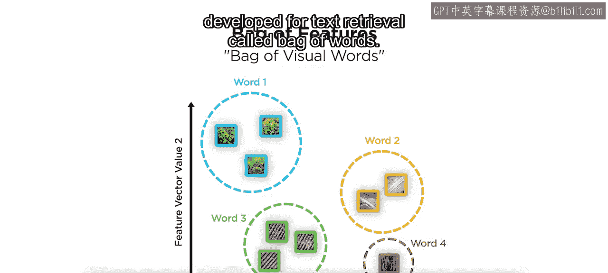

## 生成预测特征矩阵

在创建视觉词汇表之后，算法会重新处理每一张单独的图像。给定图像中的每个特征描述符都会被分配到一个视觉单词。接着，统计每个视觉单词在图像中出现的次数，并根据该图像描述符的总数进行缩放。这些值将成为你的预测特征。

以下是该过程的核心步骤：
1.  **分配**：将图像中的每个特征描述符分配到最近的视觉单词。
2.  **统计**：统计每个视觉单词在图像中出现的次数。
3.  **归一化**：将计数除以图像中描述符的总数，得到出现频率。

视觉单词在图像中出现得越频繁，其对应的预测特征值就越接近1；未出现在图像中的视觉单词，其值为0。

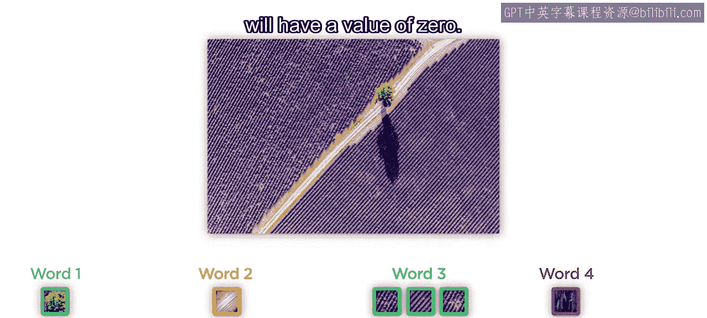

这些视觉单词的出现频率被记录在一个 **M × N** 的矩阵中。其中，**M** 是数据集中的图像数量，**N** 是整个数据集中出现的视觉单词（组）的数量。这个矩阵就是你的预测特征矩阵。

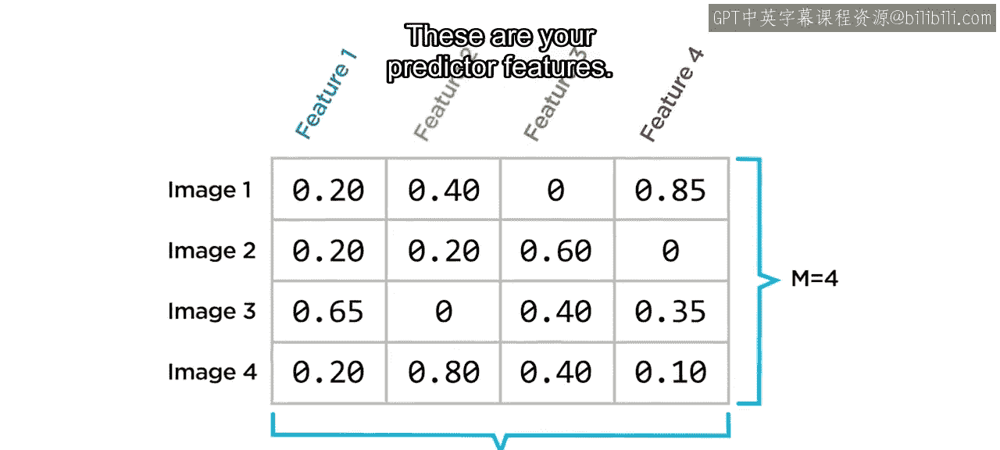

## 总结

本节课中，我们一起学习了特征袋算法如何为图像分类准备数据集。

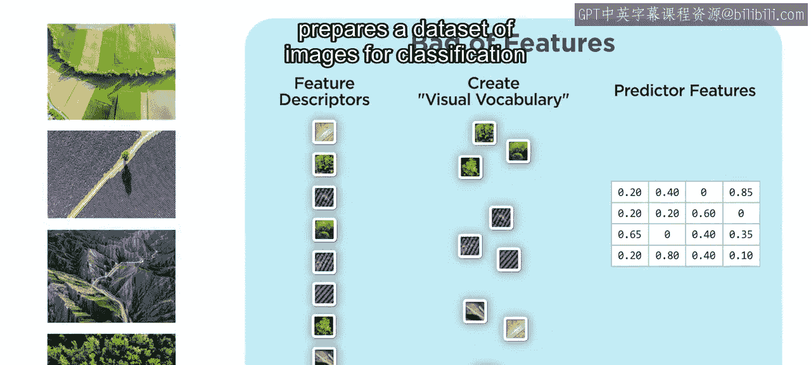

该算法主要包含三个步骤：
1.  **提取特征描述符**。
2.  **将描述符聚类为视觉单词**，构建视觉词汇表。
3.  **统计每张图像中视觉单词的出现频率**，生成预测特征矩阵。

一旦你获得了这个矩阵数据，就可以开始训练你的分类模型了。

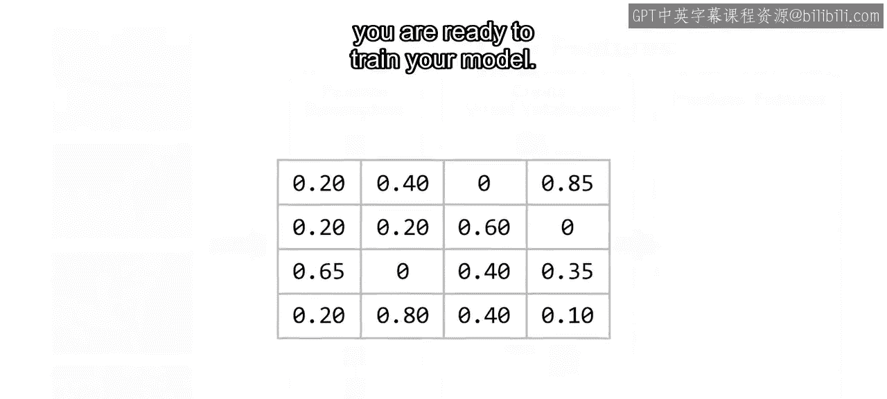

