# 工程与科学计算机视觉：18：使用特征袋进行图像分类 🖼️

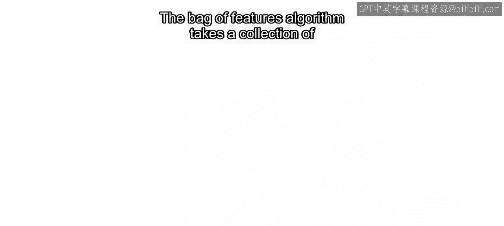

在本节课中，我们将学习如何使用“特征袋”算法从图像集合中自动提取特征，并利用这些特征训练一个分类模型。我们将以区分“有雪”和“无雪”的路面图像为例，逐步讲解算法的核心步骤、关键参数的调整方法，以及如何在MATLAB中实现。

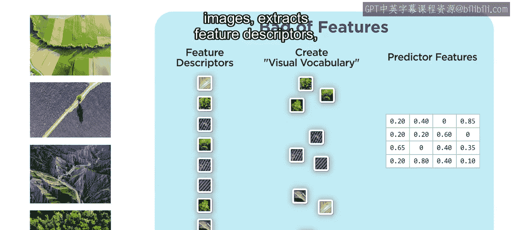

---

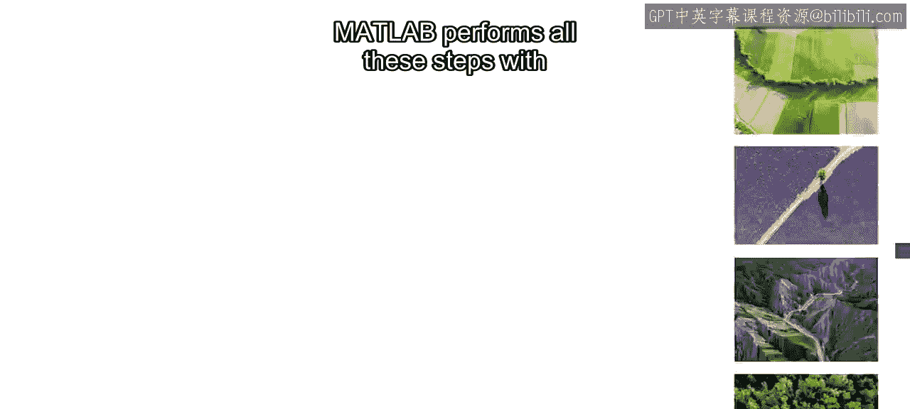

## 概述

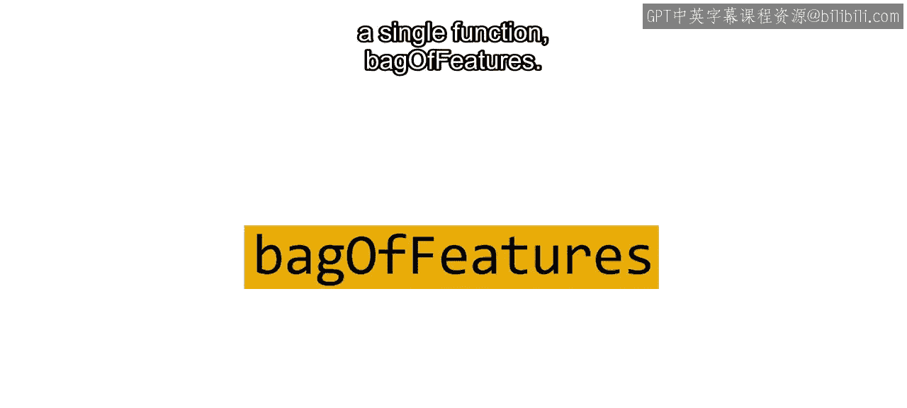

特征袋算法通过以下步骤将图像转换为可用于机器学习的数值特征：
1.  从图像集合中提取特征描述符。
2.  创建视觉词汇表。
3.  统计每张图像中视觉词汇的出现频率，生成预测特征。

MATLAB的 `bagOfFeatures` 函数可以一键完成所有这些步骤。

---

## 数据准备

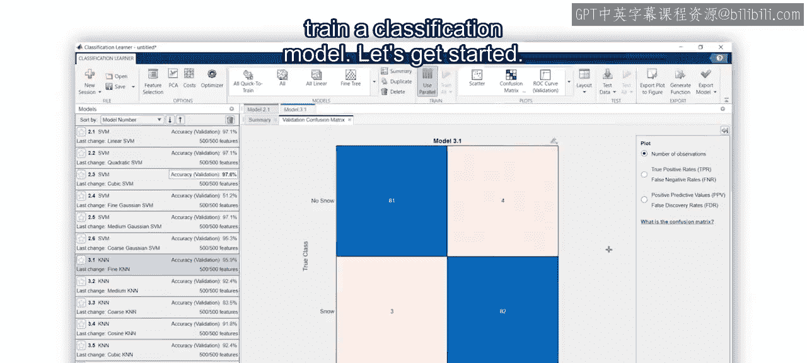

首先，我们需要在MATLAB中准备数据。

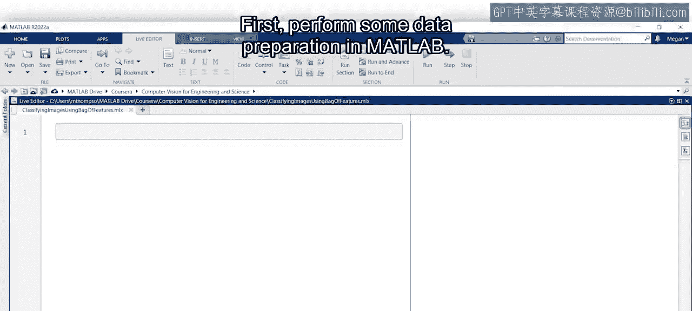

使用包含地面覆盖图像的文件夹创建一个带标签的图像数据存储。随后，将数据分割为训练集和测试集。

---

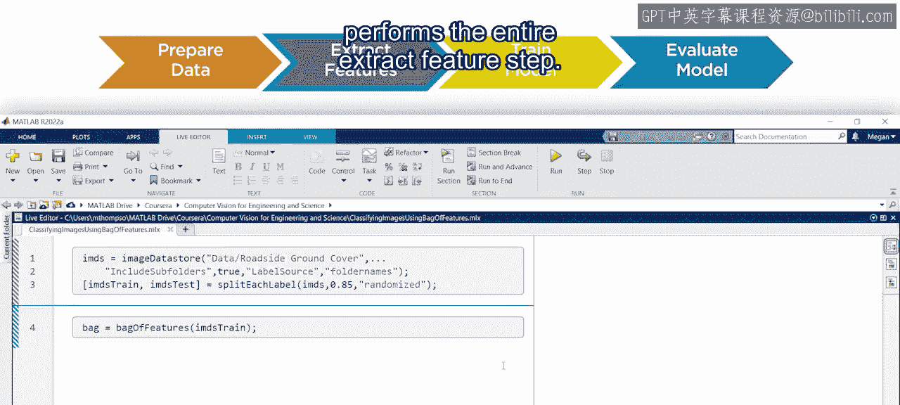

## 提取特征

现在开始提取特征。将训练图像数据存储输入到 `bagOfFeatures` 函数中。

这行代码将执行完整的特征提取步骤。

```matlab
bag = bagOfFeatures(trainingData);
```

该函数输出一个特征袋对象。通过将此特征袋对象和训练图像数据存储传递给 `encode` 函数，可以创建预测特征矩阵。

```matlab
trainingFeatures = encode(bag, trainingData);
```

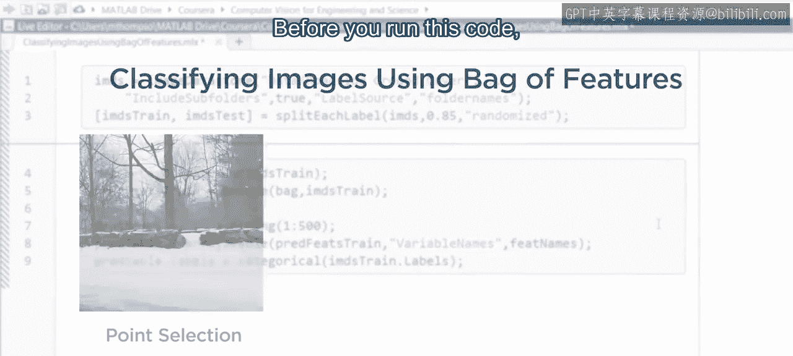

生成的矩阵每一行代表一张图像，每一列代表一个特征。默认特征数量为500个。

为了在分类学习器应用中使用这些特征，需要将此矩阵转换为表格。使用 `VariableNames` 参数为每个特征列命名。之后，添加类别标签。

在运行此代码之前，可以考虑修改一些可选参数，以使特征袋算法更适应你的数据。

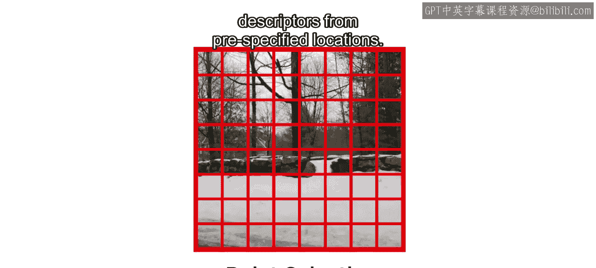

---

## 算法参数调整

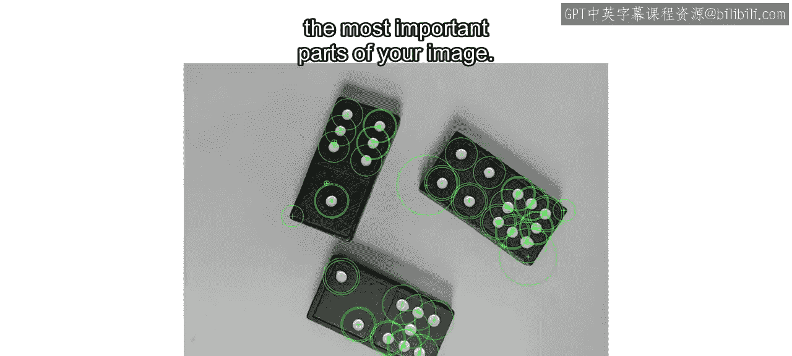

### 点选择方法

`PointSelection` 参数允许你选择算法如何决定提取SURF特征的位置。它有两个选项：
*   **Detector**：利用图像特性（如高对比度区域）来寻找提取点。
*   **Grid**：从预先指定的位置（网格点）提取描述符。

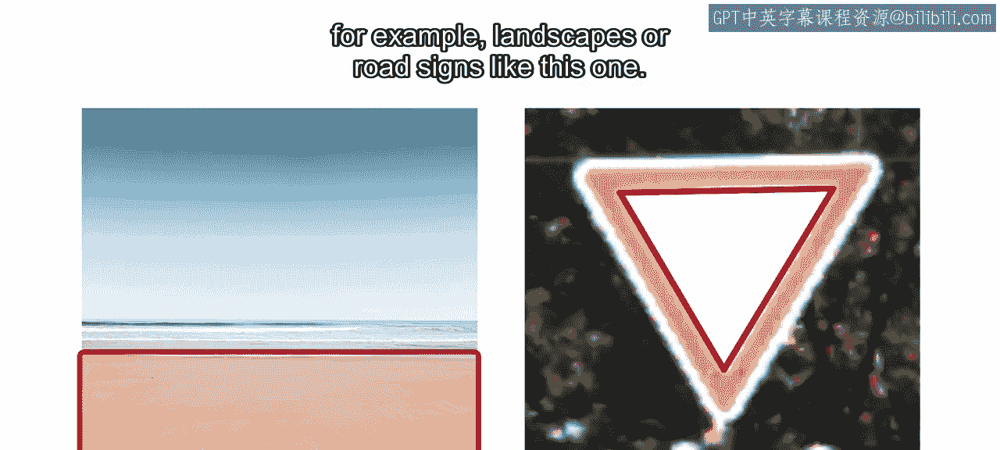

由于SURF特征检测会寻找具有高对比度和特定大小的区域，因此当图像中 distinct 的细节是最重要部分时，检测SURF特征效果最好。

然而，在许多图像中，最具区分性的特征可能并不具有高对比度。例如，具有相似纹理的大面积区域，如风景或某些路标。

对于地面覆盖图像，就存在这个问题。SURF检测在树枝和岩石区域识别出许多点，但在我们最感兴趣的雪地区域却几乎没有。

在这种情况下，沿网格提取特征描述符是一个好主意。这种方法跳过检测步骤，有利于在整个图像上均匀地收集信息。`Grid` 是 `bagOfFeatures` 默认使用的点选择方法，在不确定时使用它通常效果不错。

---

### 网格步长

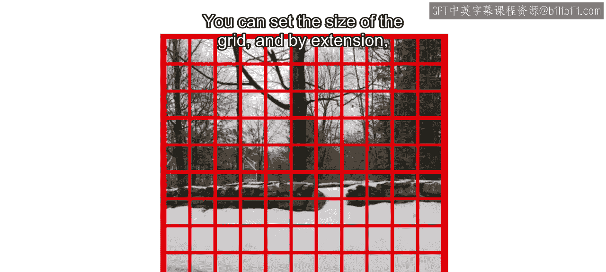

你可以通过 `GridStep` 参数设置网格的大小，从而控制收集的特征描述符的数量。

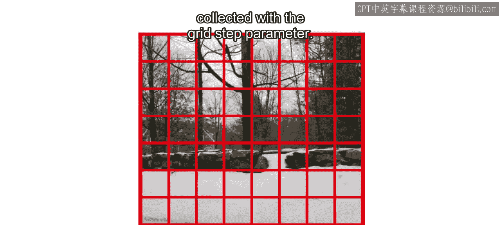

较小的步长适用于低分辨率图像或包含大量不同纹理的图像。在这些情况下，需要较小的步长来提取足够的描述符以充分描述图像。

在地面覆盖数据集中，图像分辨率高，且包含许多具有相似纹理的大面积区域。默认的8像素网格步长可能会提取出远超过训练模型所需数量的特征描述符，并且从每张图像提取会耗费很长时间。

回到MATLAB，我们可以通过将网格步长增加到24来加快速度。

---

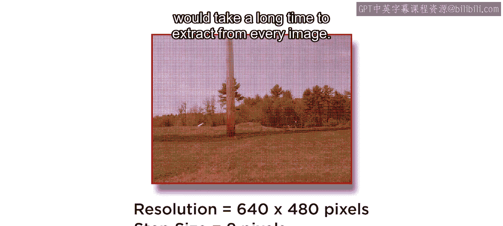

### 块宽度

对于SURF，使用像素周围邻域的梯度值来计算特征描述符。`BlockWidth` 参数决定了这个邻域的大小。

默认情况下，SURF使用四种块大小来提取特征描述符。由于我们寻找的是大面积的雪地区域，可以仅使用默认的两种最大块大小来减少训练时间。

如果训练模型的准确性因此受到影响，你随时可以创建一个具有更小网格步长和更多块的新特征袋。

使用更大的网格步长和更少的块创建特征袋，在我的测试中，其运行速度比默认设置快了15倍以上。

现在运行你的代码并创建预测特征表格。根据数据集和参数，这可能需要一些时间。

---

## 训练分类模型

现在你已准备好使用这些特征来训练模型。打开分类学习器应用，并使用你的预测特征开始一个新的会话。

正如在“训练图像分类模型”视频中所做的那样，训练几个支持向量机和K近邻模型。

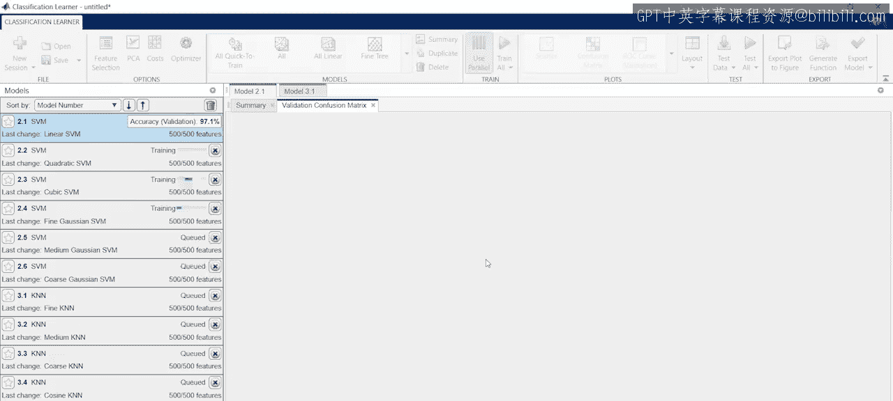

可以看到，我们最好的结果来自其中一个SVM模型。

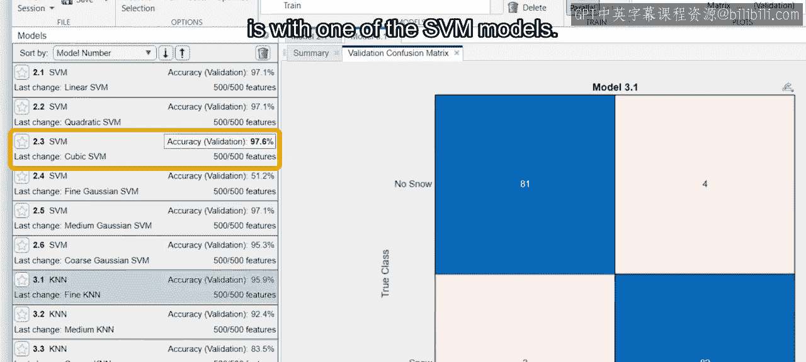

---

## 评估模型

最后一步是使用在本视频开头预留的测试数据来评估你的模型。

回到MATLAB，使用你的特征袋和测试数据准备一组预测特征。**切勿**从测试数据创建新的特征袋。这会创建仅属于测试集的新聚类，导致新的预测特征与之前的训练预测特征无法比较，就像训练集和测试集在说不同的语言。

为测试集创建预测特征矩阵后，将其转换为表格并添加标签。请记住为训练预测特征创建的特征名称，再次将它们作为 `VariableNames` 参数包含进来。这样，模型才能找到正确的特征来进行预测。

最后，将测试预测特征表导入到应用中，并测试你所有的模型。看起来我们的训练准确率与测试准确率是相当的。

---

## 总结

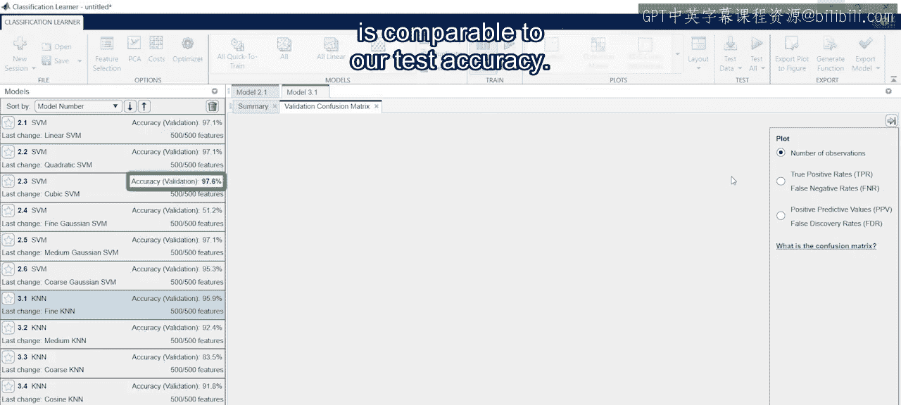

在本节课中，我们一起学习了特征袋算法的原理与应用。我们了解到，通过调整点选择方法、网格步长和块宽度等参数，可以优化特征提取过程以适应不同的图像数据。最后，我们利用提取的特征成功训练并评估了一个图像分类模型，仅用几行代码就实现了针对特定数据的自动特征提取。

有关自定义 `bagOfFeatures` 函数的更多方法，请查阅相关文档。