# 工程与科学计算机视觉：22：机器学习物体检测 🎯

在本节课中，我们将学习如何使用机器学习进行物体检测。分类技术适用于为整张图像打标签，但在许多实际场景中，我们需要在更大的图像中定位一个物体，甚至识别多个物体。这时就需要用到检测技术。本节视频将指导你训练一个物体检测器，具体来说，我们将重点介绍**聚合通道特征**算法。

## 概述：什么是ACF物体检测？

上一节我们介绍了图像分类，本节中我们来看看物体检测。ACF检测器的工作原理是：在图像上滑动一个小窗口，并运行一个训练好的分类模型。如果分类器给出阳性结果，则存储该窗口的边界框坐标。由于ACF本质上是重复的分类过程，因此该算法依然遵循相同的机器学习工作流程来训练模型。

在接下来的课程中，我们将使用一系列铁路道口标志的图像来训练一个检测器。

## 第一步：准备数据与真实标注

训练检测器的第一步是准备数据，这其中包含一项额外任务：获取图像的真实标注数据。

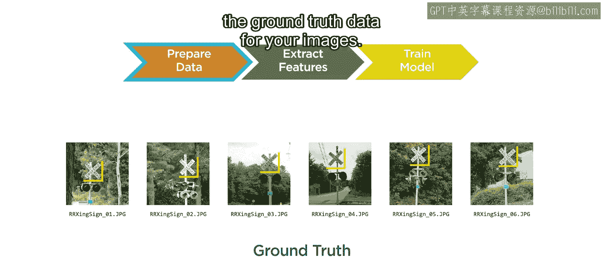

这些数据包含图像列表以及每个物体对应的边界框坐标。

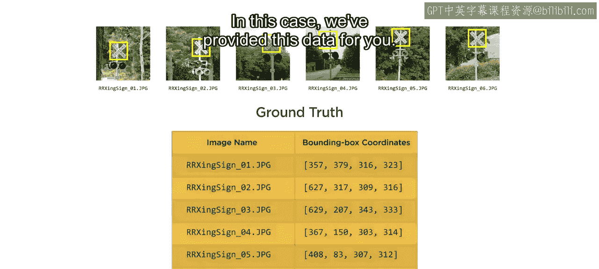

在本例中，我们已经为你提供了这些数据。训练前的下一步是特征提取。

## 第二步：特征提取与ACF算法原理

ACF是一种因其速度而流行的机器学习检测算法。它使用简单的特征（有时称为通道），这些特征计算迅速，例如像素强度。

ACF检测器使用10个通道来帮助检测物体：
*   其中3个通道来自**LUV色彩空间**，其中L代表亮度，U和V指定颜色。
*   1个通道使用**梯度强度**来测量边缘强度。
*   剩余的6个通道用于测量这些**边缘的方向**。

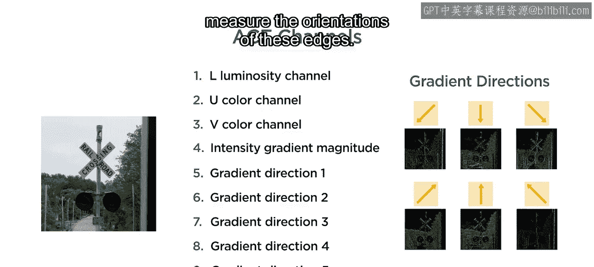

这10个通道共同识别物体的显著特征。例如，动物可以通过其颜色来识别，而铁路标志则可能通过其有角度的边缘来检测。

然后，这些通道被组合或**聚合**成一个预测特征列表。

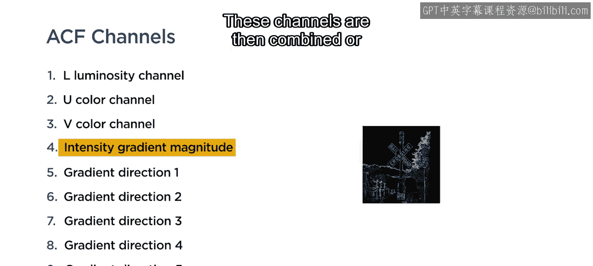

真实标注数据用于识别代表包含物体的区域的**正样本**，以及不包含物体的区域的**负样本**。

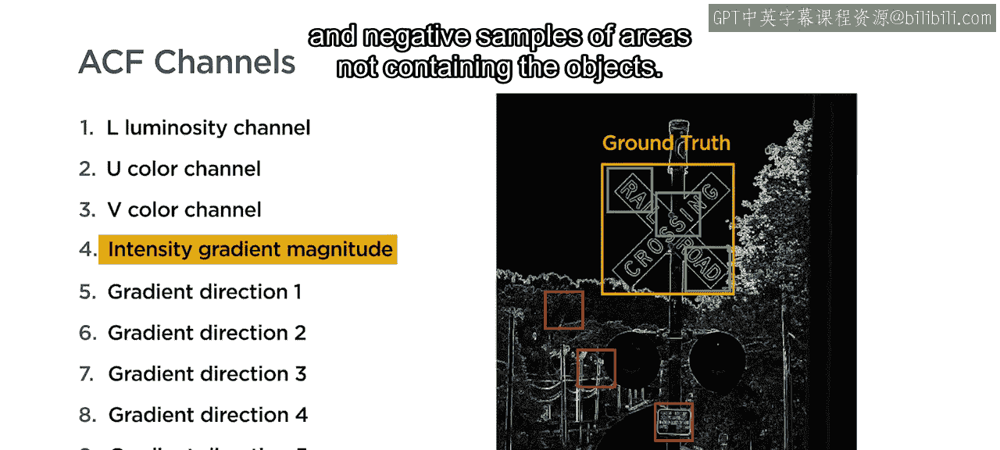

最后，训练一个检测器来区分正样本和负样本。

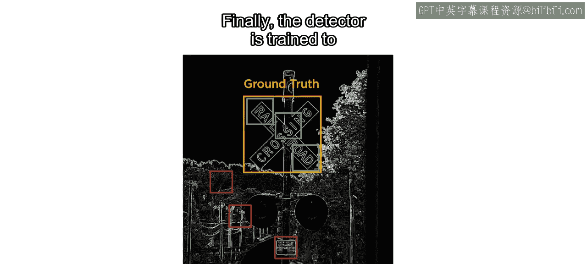

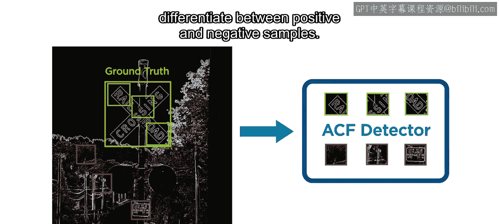

## 第三步：应用训练好的检测器

在图像上使用训练好的检测器，需要在滑动窗口内反复对图像的各个部分进行分类。

每个窗口会被分配一个分数，用于量化其预测特征与目标物体特征的匹配程度。如果分数超过某个阈值，则该窗口被视为阳性，其坐标被保存为边界框。

根据滑动窗口的大小和间距，边界框可能会重叠。因此，检测的最后一步是：如果它们相交足够多，则将其合并。

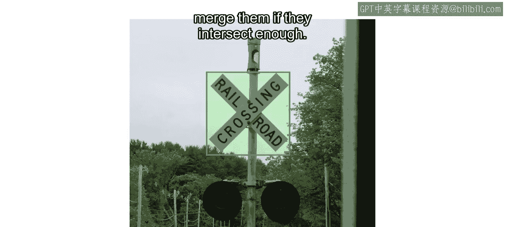

现在你了解了ACF物体检测的原理。那么，如何在MATLAB中实现呢？

## 第四步：在MATLAB中实践

准备数据的第一步是确保拥有独立的训练集和测试集。本例中，我们已经将训练图像和测试图像分别放入各自的子文件夹中。我们还提供了一个`.mat`文件，其中包含每张图像的真实边界框坐标。

首先，将真实标注变量加载到工作区。

接下来的特征提取和模型训练步骤，被合并到函数 `trainACFObjectDetector` 中。该函数以真实标注的表变量作为输入，你可以使用函数 `objectDetectorTrainingData` 从真实标注变量生成此表。

训练检测器函数的输出将是一个包含已训练检测器的新变量。

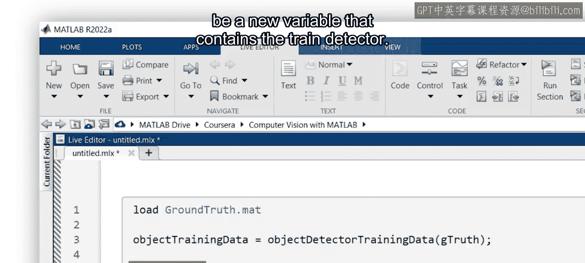

现在一切就绪，开始运行。

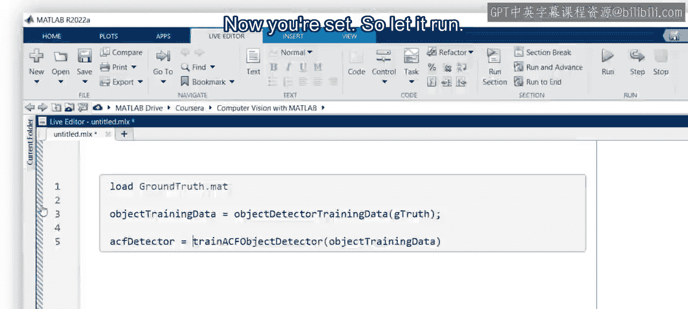

训练过程中，你可以在输出中查看进度。一旦完成，训练好的模型类型为 `acfObjectDetector`，并存储在工作区中。

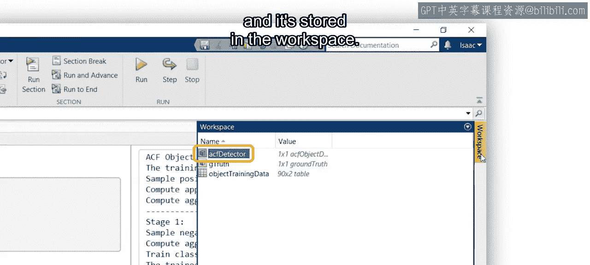

要将其应用到新的测试图像上，请使用 `detect` 函数。该函数接受训练好的检测器和你想要进行检测的图像。你也可以通过使用图像数据存储，一次性对多张图像进行检测。

例如，这里我们将测试图像的数据存储传递给 `detect` 函数的第二个输入。

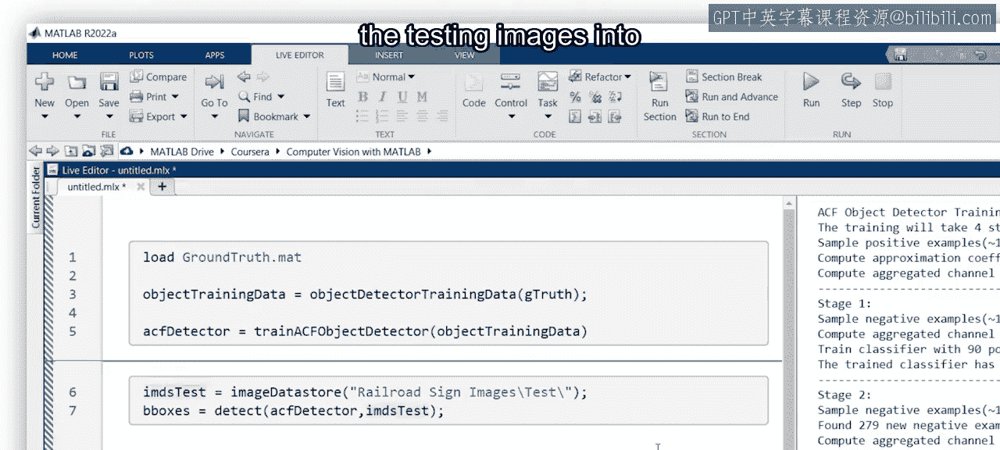

输出是一个表格，包含检测到的任何铁路标志的边界框坐标和分数。本例中只有10张图像，因此你可以直接在实时脚本中直观地检查结果的准确性。

为此，首先为你的数据存储创建一个循环，将检测到的物体的边界框覆盖在图像上，并依次显示结果。

这个检测器在将标志从背景中分离出来方面做得很好，因为没有出现误报。然而，有几张图像中的标志没有被正确检测到。但总体而言，对于一个仅用90张图像训练的检测器来说，效果不错。

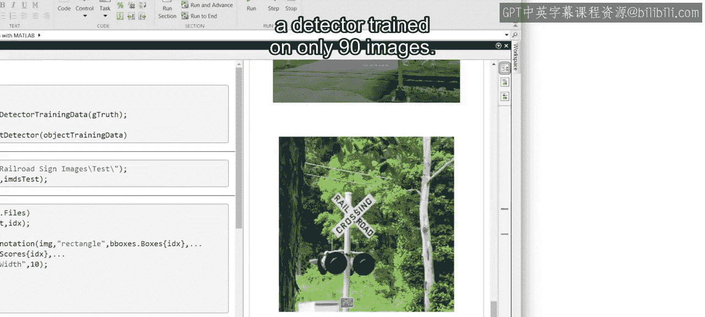

请注意，我们保留了许多用户定义参数为默认值，例如增加模型的复杂性，或限制检测期间使用的窗口大小。

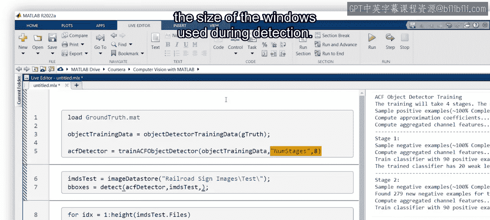

这些参数可用于尝试提高检测器的准确性，但通常会在速度上有所权衡。

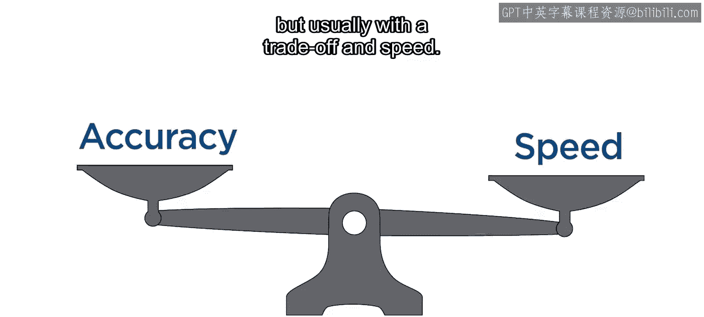

要了解更多关于这些选项的信息，请务必查阅文档。

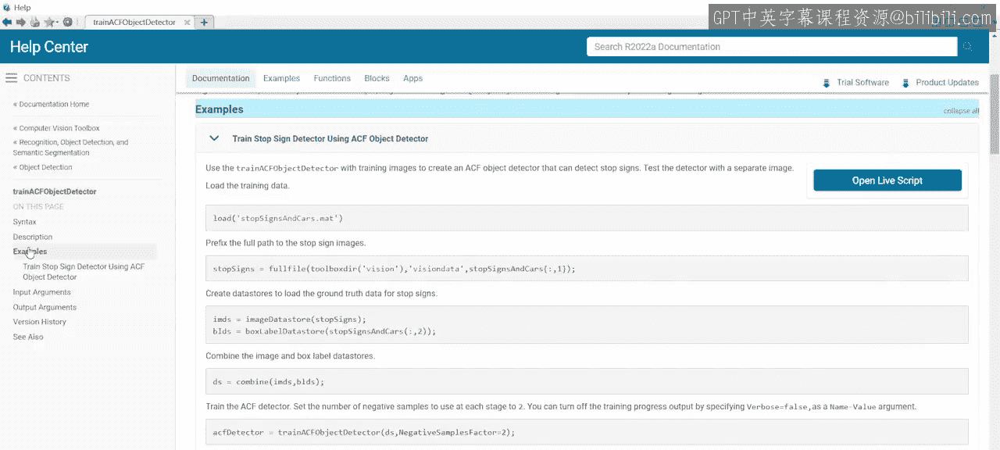

## 总结

本节课中，我们一起学习了**ACF物体检测**的基本原理与MATLAB实现流程。我们了解到，检测是重复分类的过程，核心步骤包括：准备带有边界框标注的数据、利用**聚合通道特征**进行快速特征提取、训练分类器模型，最后通过滑动窗口和边界框合并完成检测。我们还实践了使用 `trainACFObjectDetector` 和 `detect` 函数来训练并应用一个铁路道口标志检测器。记住，可以通过调整模型参数在检测精度和速度之间进行权衡。