# 工程与科学计算机视觉：23：为机器学习标记图像 🏷️

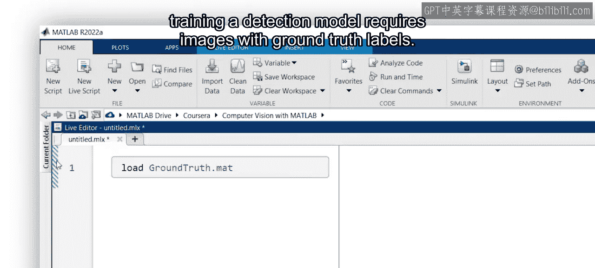

在本节课中，我们将学习如何为机器学习任务准备图像数据，核心是使用工具为图像中的目标物体创建“真实标签”。我们将重点介绍如何使用 MATLAB 的 Image Labeler 应用程序来标注图像，生成包含边界框坐标的数据集。

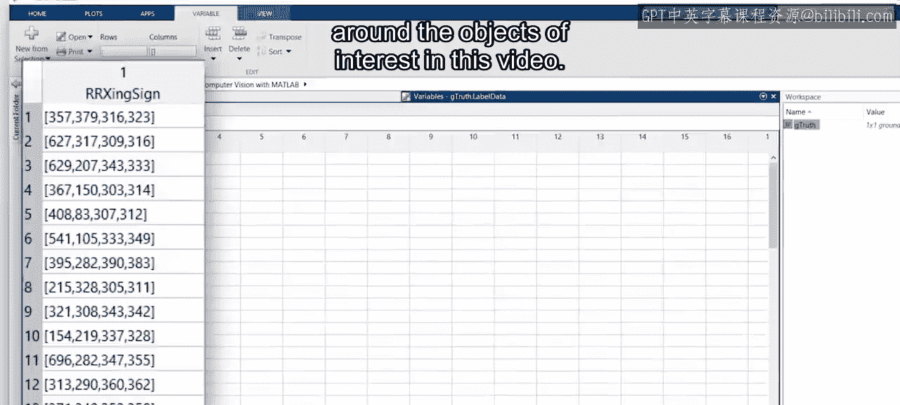

## 概述

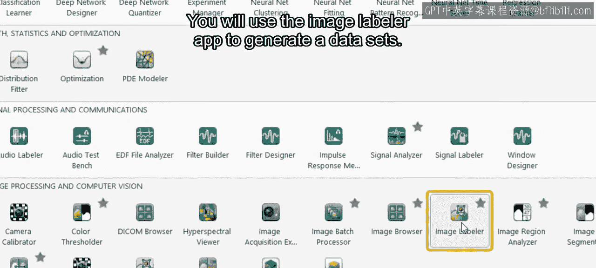

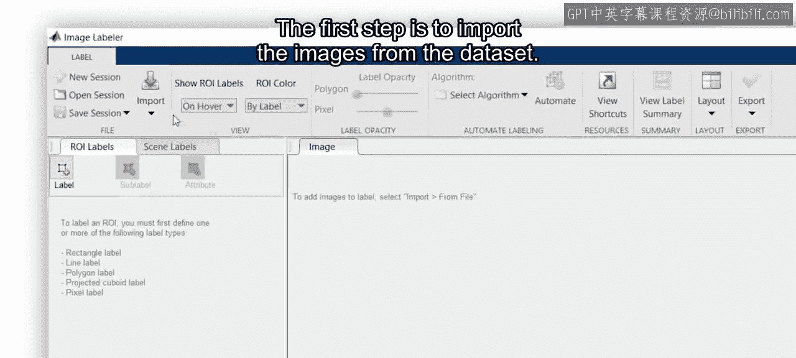

训练一个检测模型需要带有真实标签的图像。这些标签通常包括目标物体周围边界框的坐标。本节将指导你使用 Image Labeler 应用程序来生成数据集的真实标签。

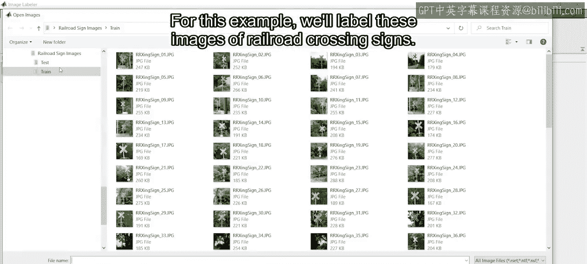

## 导入图像数据集

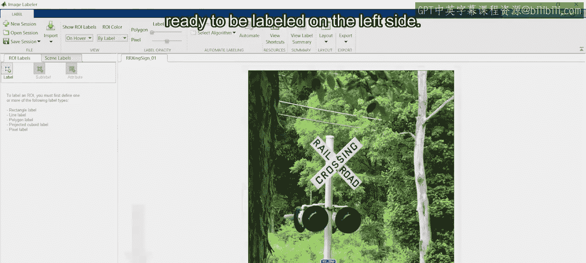

第一步是从数据集中导入图像。以下是操作步骤：

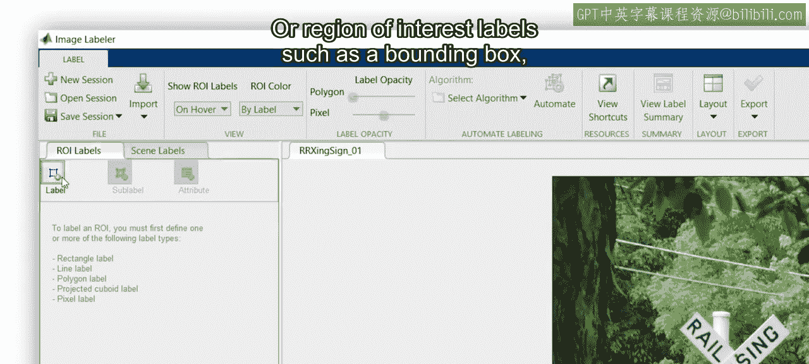

*   **操作**：在 Image Labeler 应用程序中，使用“导入”功能加载你的图像文件夹。
*   **示例**：在本例中，我们将标注一系列铁路道口标志的图像。

导入后，图像会显示在应用程序底部的缩略图栏中，便于快速导航。从缩略图中选中的图像会显示在中央区域，等待被标注。

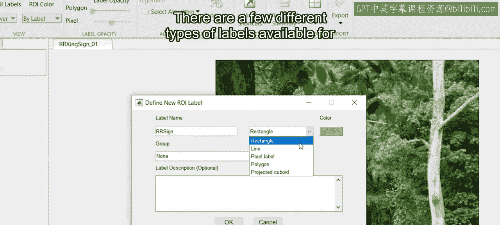

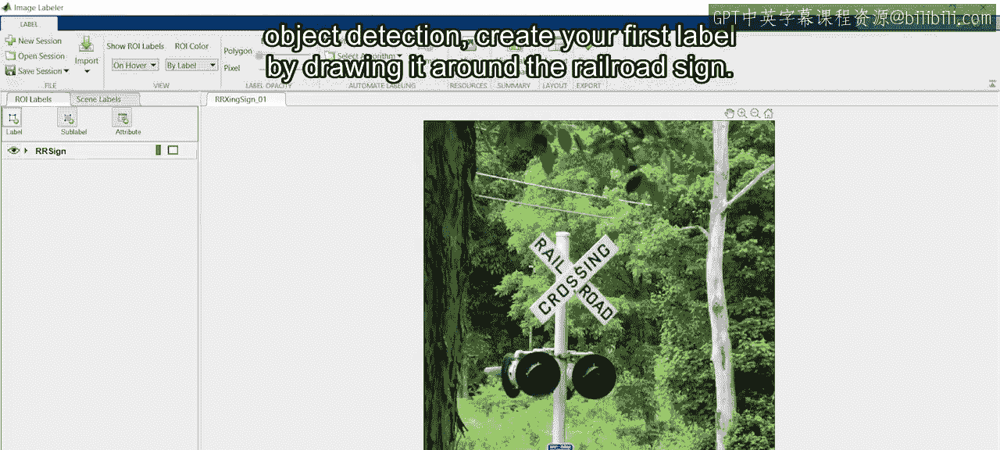

## 创建与绘制标签

在应用程序左侧，你可以创建 ROI（感兴趣区域）标签，例如边界框。我们将为铁路标志创建一个标签。可用的标签类型有多种，本例中我们将使用最常见的矩形框进行目标检测。

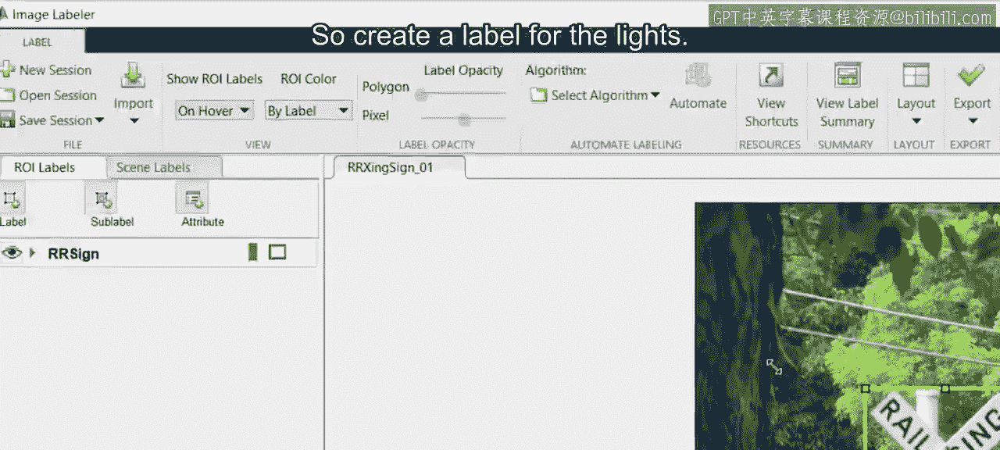

现在，创建你的第一个标签。具体方法是围绕铁路标志绘制一个矩形框。如果操作有误，可以使用 `Ctrl+Z` 撤销，或根据需要微调框的位置。

## 处理多个标签

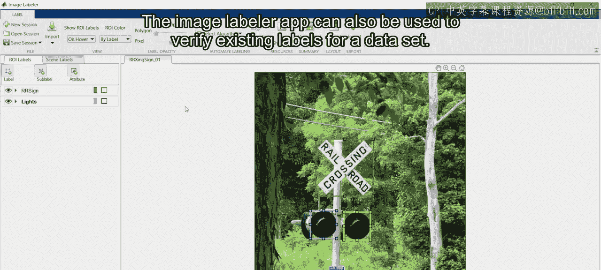

有时一张图像中需要标注多个目标。例如，在自动驾驶场景中，车辆可能还需要定位红色信号灯以检查其是否闪烁。因此，我们也需要为信号灯创建标签。在本例中，有两个信号灯需要标注，我们可以复制并粘贴第二个边界框来完成。

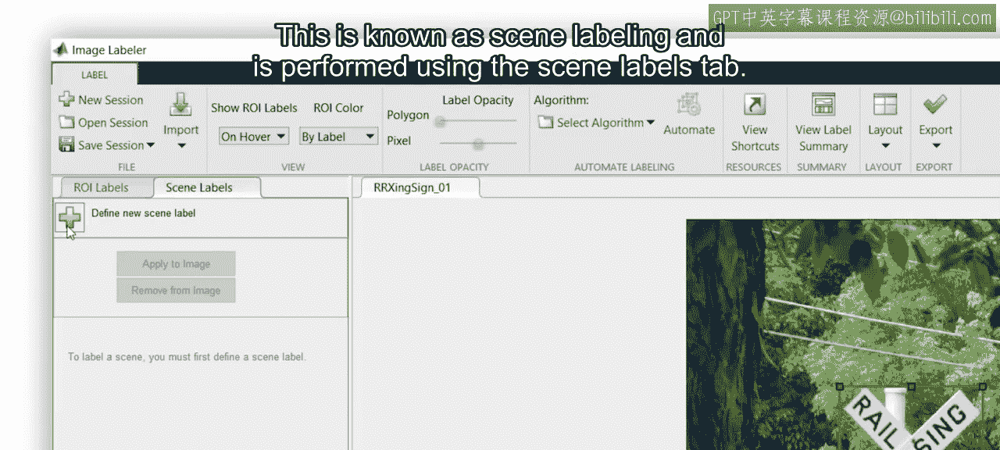

## 验证与场景标注

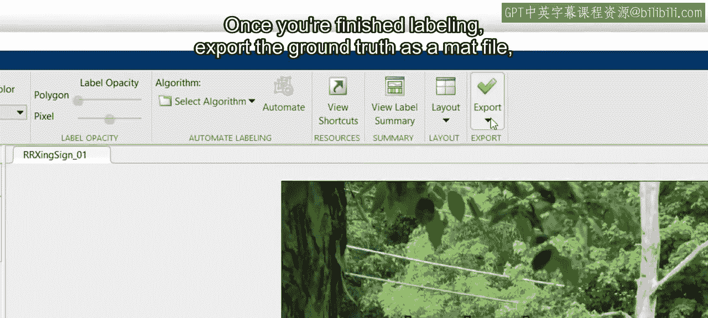

Image Labeler 应用程序也可用于验证数据集的现有标签。你可以使用“导入”按钮导入已有的真实标签数据。此外，该应用还能进行图像分类标注，这被称为场景标注，可通过“场景标签”选项卡来完成。

## 导出与使用标签数据

完成所有标注后，可以将真实标签导出为 `.mat` 文件。随后，在 MATLAB 中使用 `load` 函数导入你的真实标签数据。这个变量包含几个属性：在应用中定义的标签说明、存储图像文件位置的数据源，以及存储边界框坐标的标签数据。

## 扩展到视频标注

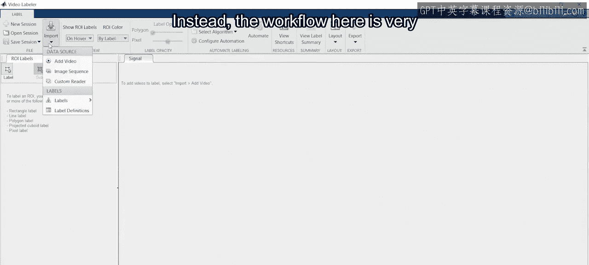

以上我们学习了静态图像的标注，但如果需要标注视频帧而非单张图像呢？在这种情况下，应使用 Video Labeler 应用程序。其工作流程与 Image Labeler 非常相似。

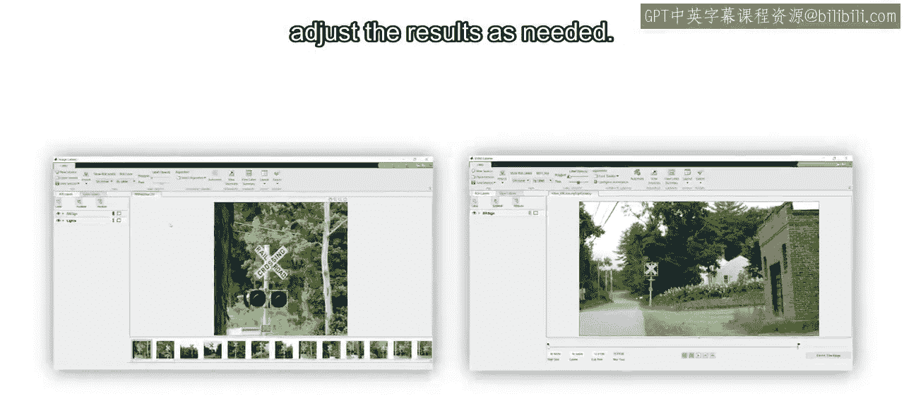

然而，它的一个优势是能够跨帧追踪物体。操作方法是：使用自动化标注算法来追踪已标注的物体。在放置好第一帧的标签后，启动自动化功能来标注后续帧，并根据需要检查或调整结果。

## 总结

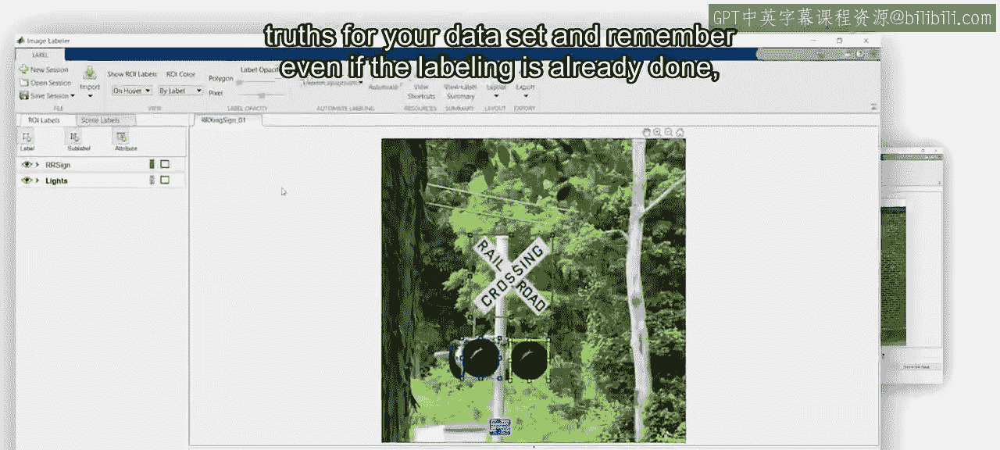

本节课中，我们一起学习了为机器学习准备图像数据的关键步骤。无论是 Image Labeler 还是 Video Labeler 应用程序，都能帮助你快速为数据集生成真实标签。请记住，即使在标注工作已经完成的情况下，在训练模型之前使用这些应用程序来确认标签也通常是值得的。