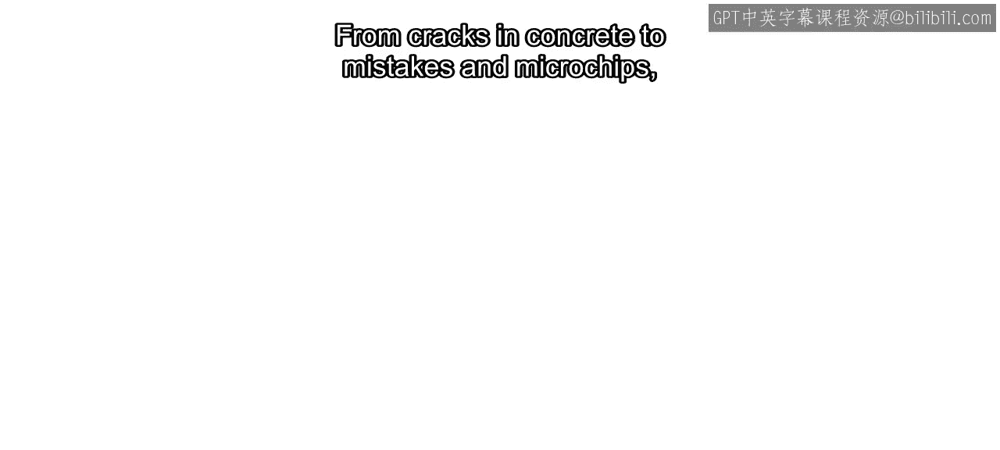
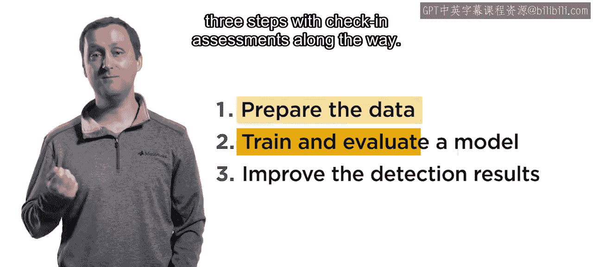
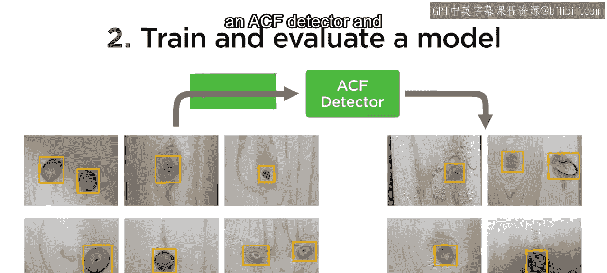
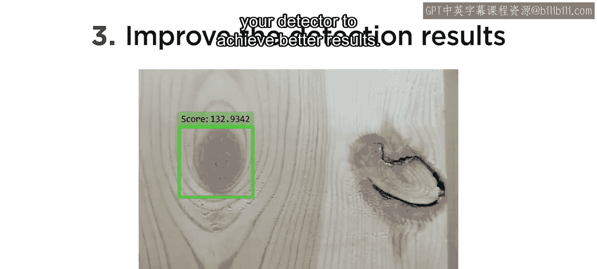
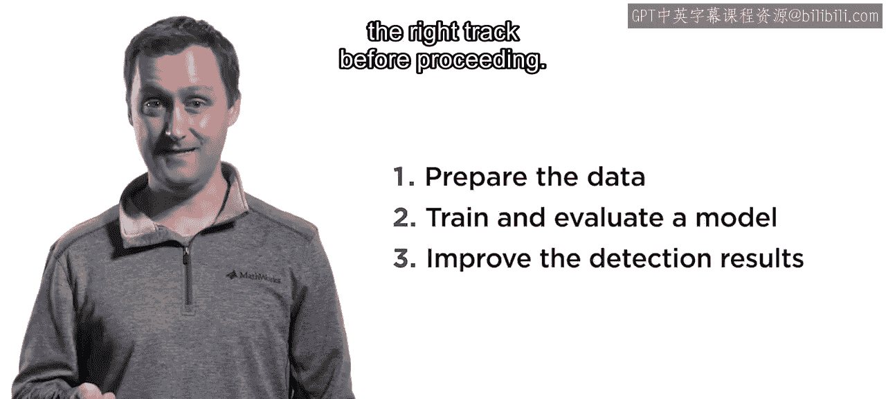

# 工程与科学计算机视觉：24：物体检测项目简介

在本节课中，我们将学习一个具体的物体检测项目。该项目旨在训练一个检测器，用于识别木板中的缺陷（木节）。我们将了解项目的目标、数据准备、模型训练与评估的完整流程。

## 项目概述 🎯

从混凝土裂缝到微芯片瑕疵，定位缺陷是物体检测的常见应用。本项目将训练一个ACF（聚合通道特征）检测器，用于检测木板中被称为“木节”的缺陷。木节是树木分枝所在的位置，会降低木板的强度。项目目标是训练一个检测器，使其能够在一组测试图像中识别出所有木节。

## 项目步骤 📋

项目分为三个主要步骤，过程中包含检查与评估环节。

### 步骤一：熟悉数据集

首先，我们需要熟悉项目所使用的数据集。数据已被预先划分为训练集和测试集，并且训练集已经完成了标注。

以下是本步骤的具体任务：
*   使用图像标注器应用程序，为测试集标注真实值。

### 步骤二：训练与评估检测器

上一节我们介绍了数据准备，本节中我们来看看如何训练和初步评估模型。

在第二步，您将训练一个ACF检测器，并使用新标注的测试数据来评估模型的初步结果。

### 步骤三：迭代与改进模型

请记住，开发机器学习模型是一个迭代过程。本项目也是如此。

因此，在第三步，您将改进您的检测器，以获得更好的检测性能。

## 评估指标 📊

在整个项目过程中，您将评估一些检测指标，包括：
*   **漏检率**：模型未能检测出的真实目标的比例。
*   **精确率**：模型所有检测结果中，正确检测的比例。

## 项目完成建议 ✅

请务必按顺序完成每个步骤的评估。建议您多次尝试，以确保在继续下一步之前走在正确的轨道上。

## 交流与分享 💬

如果您有任何问题或取得了有趣的成果，请记得在论坛中分享。

## 总结

本节课中我们一起学习了木板缺陷检测项目的整体框架。我们明确了项目目标，了解了从数据准备、模型训练、评估到迭代改进的三个核心步骤，并认识了关键的评估指标。现在，您可以开始动手实践了。

祝您好运！😊