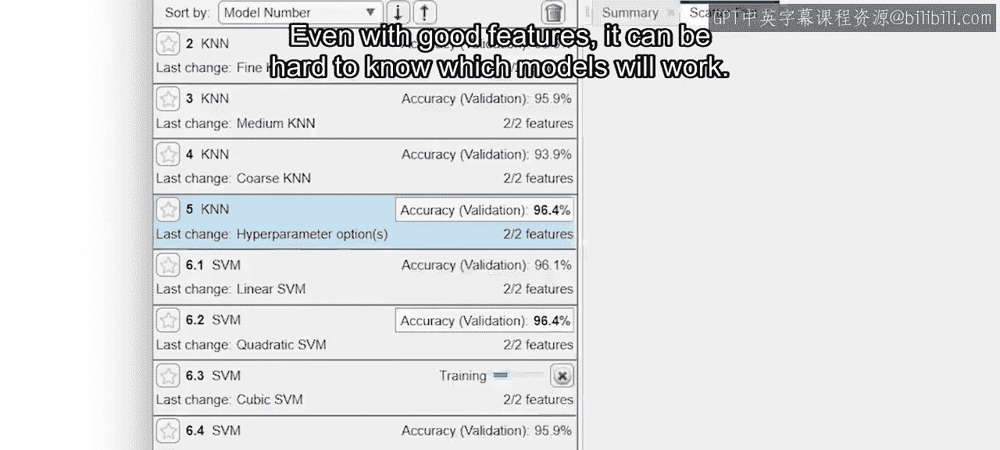
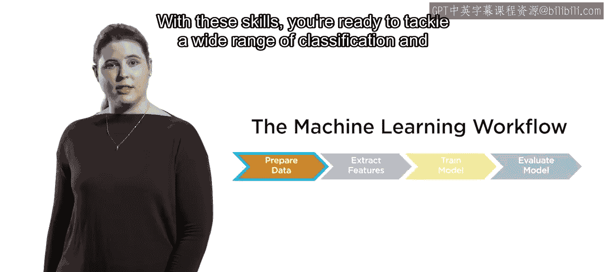
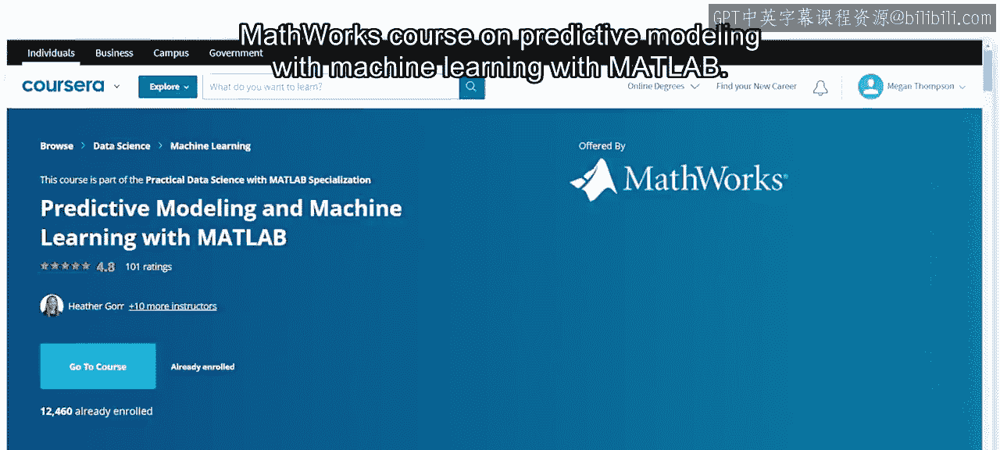
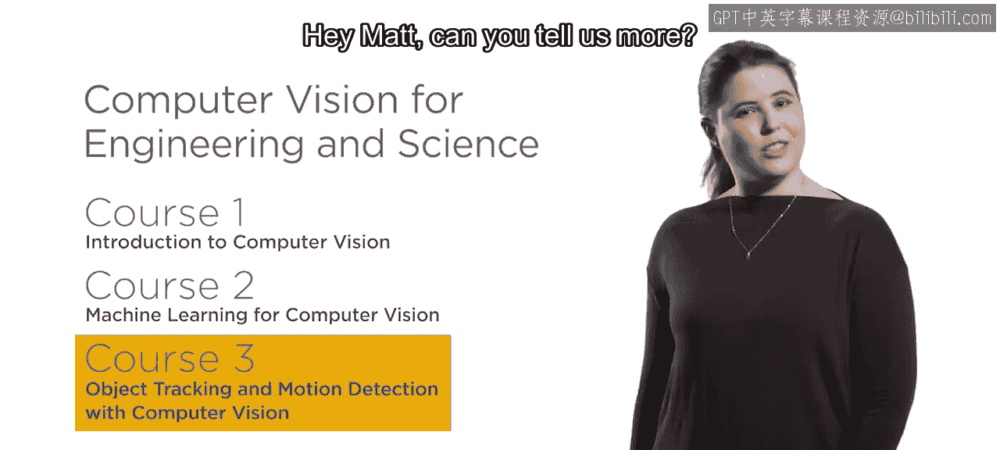
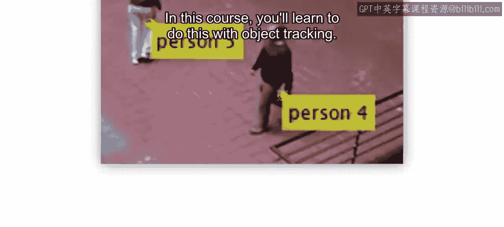

**工程与科学计算机视觉：2：计算机视觉机器学习总结**

在本节课中，我们将总结机器学习在计算机视觉中的应用，涵盖图像分类与目标检测的核心流程、关键考量以及后续学习方向。

图像分类和目标检测是计算机视觉中两项最重要的任务。现在，你可以使用机器学习来完成这两项任务。

每个应用都需要经过适当准备的数据。你已经准备好为分类或检测任务标注图像，并将数据分割为训练集和测试集。

每个问题都是独特的。适用于一个数据集的特征提取方法，可能对另一个数据集无效。幸运的是，你已经学会了如何尝试多种方法，为你的图像找到最佳方案。

即使拥有良好的特征，有时也难以确定哪种模型会有效。

你现在能够快速训练不同的模型，并评估结果。你不仅完成了这些步骤，还学会了使用机器学习工作流程迭代改进结果并识别潜在问题。

掌握了这些技能，你已准备好应对广泛的分类和检测问题，从识别缺陷到提升道路安全。

如果你有兴趣探索机器学习在其他领域的应用，可以查看MathWorks关于使用MATLAB进行机器学习预测建模的课程。

但在此之前，为了继续学习高级计算机视觉技术，请进入本专项课程的第三门课程。

在专项课程的第三门课中，你将利用对机器学习的熟悉度，使用预训练的深度神经网络进行目标检测。你已经知道几种在图像和视频帧中检测目标的方法。

但是，如何跨多个视频帧区分目标呢？在本课程中，你将学习使用目标跟踪来实现这一点。

在最终项目中，你将应用新学到的技能，在繁忙的高速公路上跟踪车辆。我们课堂上见。

---

**本节课总结**

本节课我们一起回顾了机器学习在计算机视觉中的核心应用。我们总结了从数据准备、特征提取、模型训练与评估到结果迭代的完整工作流程。同时，我们也展望了后续课程中将深入学习的深度神经网络目标检测与目标跟踪技术。