工程与科学计算机视觉：0：课程概述

在本节课中，我们将要学习MathWorks在Coursera平台上开设的“工程与科学计算机视觉”专项课程的整体介绍。该课程旨在帮助学习者掌握计算机视觉的核心技能，以应对日益增长的市场需求。

计算机视觉算法正运行在我们的手机、汽车甚至冰箱中。随着越来越多的设备配备摄像头，对具备计算机视觉经验人才的需求正在快速增长。为此，MathWorks在Coursera上创建了“工程与科学计算机视觉”专项课程。

这个包含三门课程的专项课程将引导你完成一系列实际项目。

以下是课程中你将参与的项目示例：
*   对齐卫星图像。
*   训练能够识别道路标志的模型。
*   跟踪物体，即使它们移出视野。

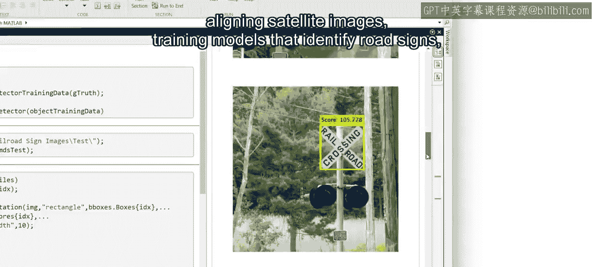

听起来很令人兴奋。接下来，让我们看看你将如何获得这些技能。

---

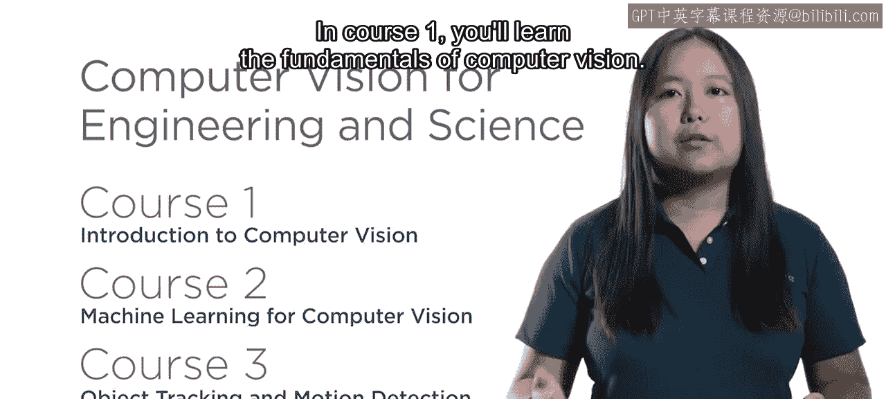

工程与科学计算机视觉：1：课程一：计算机视觉基础

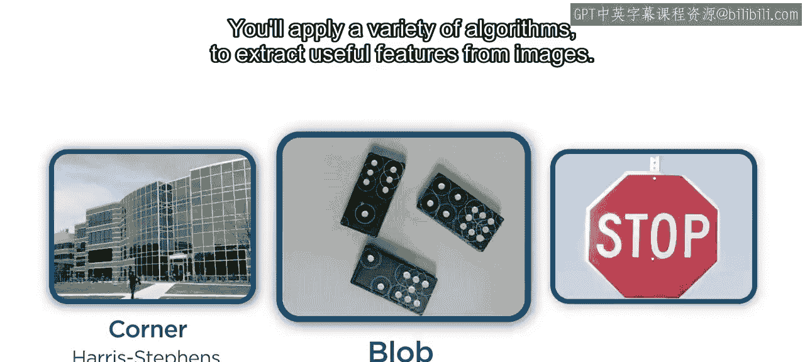

上一节我们了解了课程的整体目标，本节中我们来看看专项课程的第一部分：计算机视觉基础。

在课程一中，你将学习计算机视觉的基础知识。你将应用多种算法从图像中提取有用的特征。

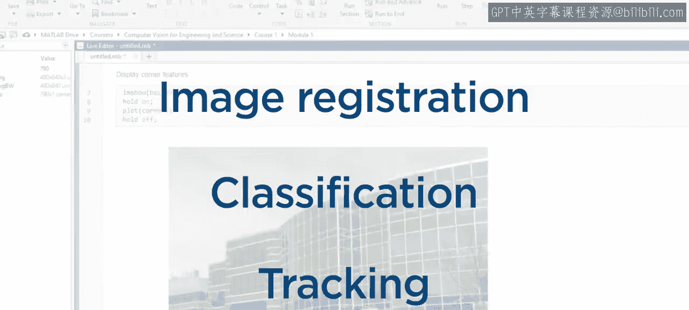

这些特征被用于许多应用中，例如图像配准、分类和跟踪。

到课程一结束时，你将能够检测、提取和匹配特征，从而对齐并拼接如下所示的图像。

---

工程与科学计算机视觉：2：课程二：机器学习与模型

在掌握了图像特征提取的基础后，课程二中，你将把这些图像特征与流行的机器学习算法结合使用，以训练图像分类和目标检测模型。

然而，训练模型只是工作流程的一部分。为了获得良好结果，你需要学习如何为机器学习妥善准备图像，并在测试图像上评估训练好的模型。

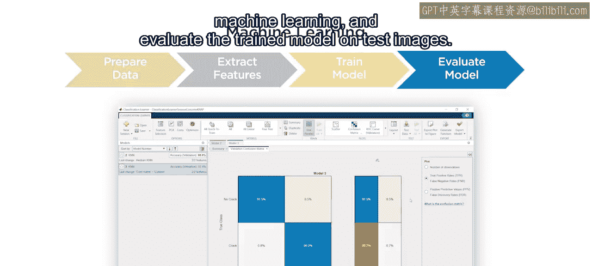

重要的是，你所获得的这些技能同样适用于深度学习。在深度学习中，特征提取是在网络训练过程中自动完成的。

---

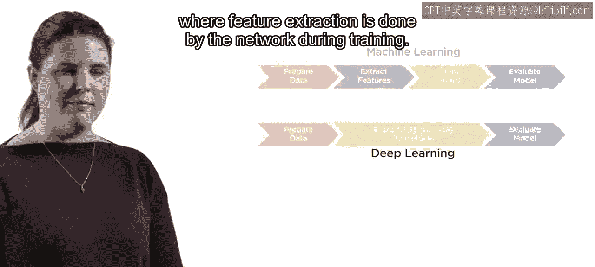

工程与科学计算机视觉：3：课程三：深度学习与应用

上一节我们介绍了传统机器学习方法，本节中我们来看看更前沿的深度学习技术。

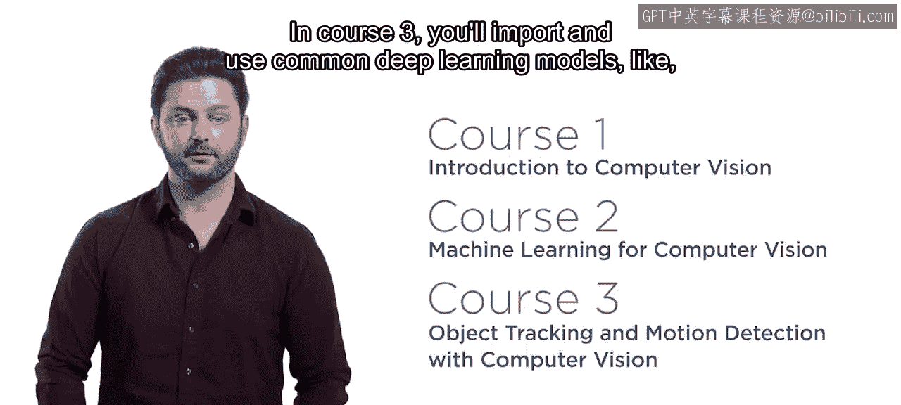

说到深度学习，目前已有大量现成的模型可用。在课程三中，你将导入并使用常见的深度学习模型（如YOLO）来执行目标检测。

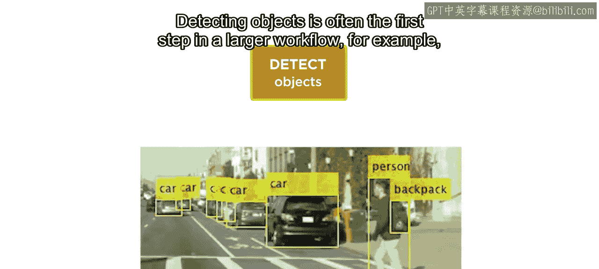

检测物体通常是更大工作流程的第一步。

例如，检测与运动预测结合使用，可以在一段时间内区分和跟踪多个物体。

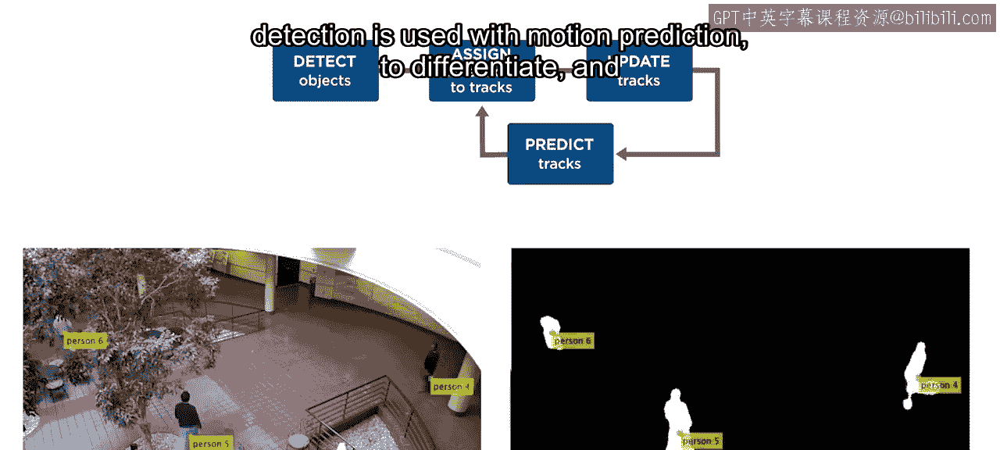

在专项课程结束时，你将应用跟踪技术来统计繁忙道路上每个方向的车辆数量。

---

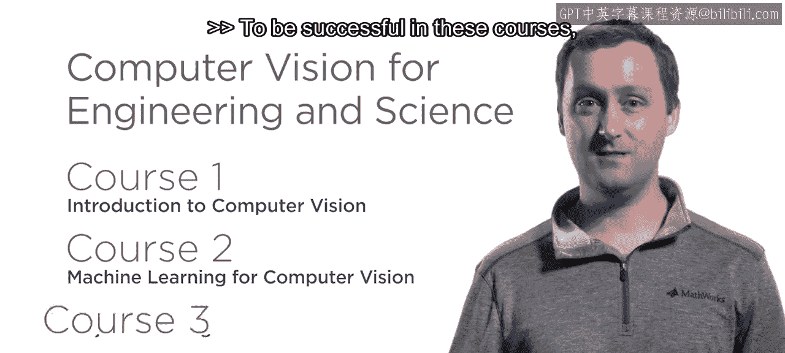

工程与科学计算机视觉：4：预备知识与总结

为了在这些课程中取得成功，具备一定的图像处理先验经验会很有帮助。

如果你完全是图像数据处理的新手，我们建议你同时报名参加我们在Coursera上的“工程与科学图像处理”专项课程。

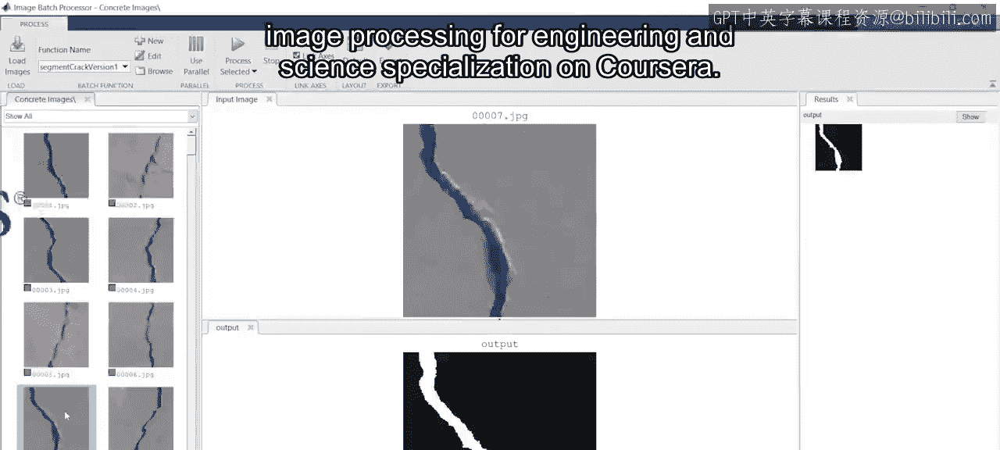

计算机视觉是一个令人兴奋且不断发展的领域。本专项课程将为你提供在这个图像和摄像头比以往任何时候都更重要的世界中取得成功所需的技能。

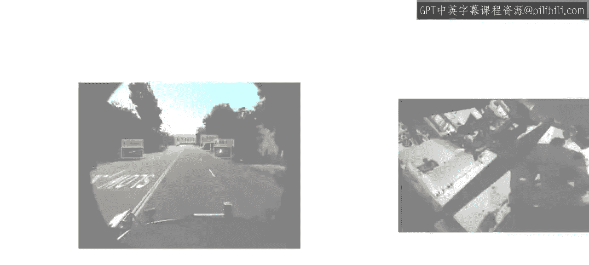

让我们开始学习吧。

本节课中我们一起学习了“工程与科学计算机视觉”专项课程的整体结构、三门课程的核心内容（基础特征提取、机器学习模型、深度学习应用）以及学习该课程所需的预备知识。该课程旨在通过实践项目，系统性地培养学习者在计算机视觉领域的核心技能。