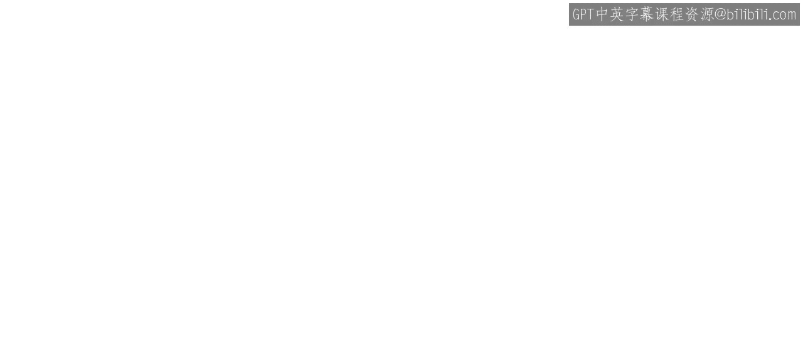
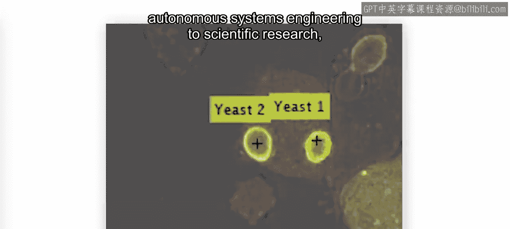
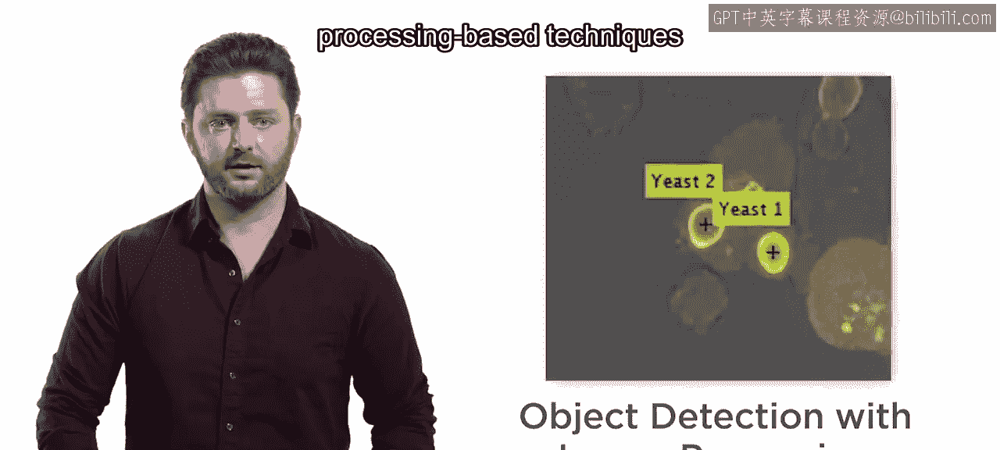

# 工程与科学计算机视觉：27：物体跟踪和运动检测简介

## 概述

在本节课中，我们将要学习计算机视觉中两个核心任务：物体检测与物体跟踪。我们将了解它们的基本概念、应用场景以及实现它们的不同技术路径。

## 物体检测与跟踪的应用

在许多应用中，从自动驾驶系统工程到科学研究，你都需要区分不同的物体并在时间上对它们进行跟踪。

## 物体检测：识别的基础

在能够跟踪物体之前，你必须先检测到它们。在本课程中，你将首先学习使用预训练模型（包括深度神经网络）在视频中检测物体。许多通用和专用的物体检测模型都可以在MATLAB中直接使用。

## 基于图像处理的检测技术

然而，有时使用机器学习或深度学习模型是不必要且低效的。因此，你也将回顾基于图像处理的技术来分割感兴趣的物体。

## 运动检测与光流

并且你将学习新的工具，例如**光流**，用于检测运动和移动的物体。光流是一种通过分析连续帧之间像素点的运动模式来估计物体运动方向和速度的技术。

## 从检测到跟踪

然而，仅就检测而言，视频中的每一帧都是一个全新的世界。一帧中的物体与前一帧没有关联。这就是物体跟踪发挥作用的地方。

## 物体跟踪的作用

物体跟踪使你能够随时间区分物体，减少错误检测的影响，并跟踪那些暂时被遮挡的物体。

## 课程实践目标

在本课程结束时，你将运用所学的检测和跟踪技术来分析高速公路的交通流量。

## 总结

本节课中，我们一起学习了物体检测与跟踪的基本概念。我们了解到检测是跟踪的前提，并介绍了实现检测的两种主要方法：使用预训练的深度学习模型和基于图像处理的技术。我们还引入了光流作为运动检测的工具，并阐述了物体跟踪在关联跨帧信息、提高系统鲁棒性方面的重要性。在后续课程中，我们将应用这些技术进行实际案例分析。

让我们开始吧。