# 工程与科学计算机视觉：28：使用预训练模型检测物体 🚗

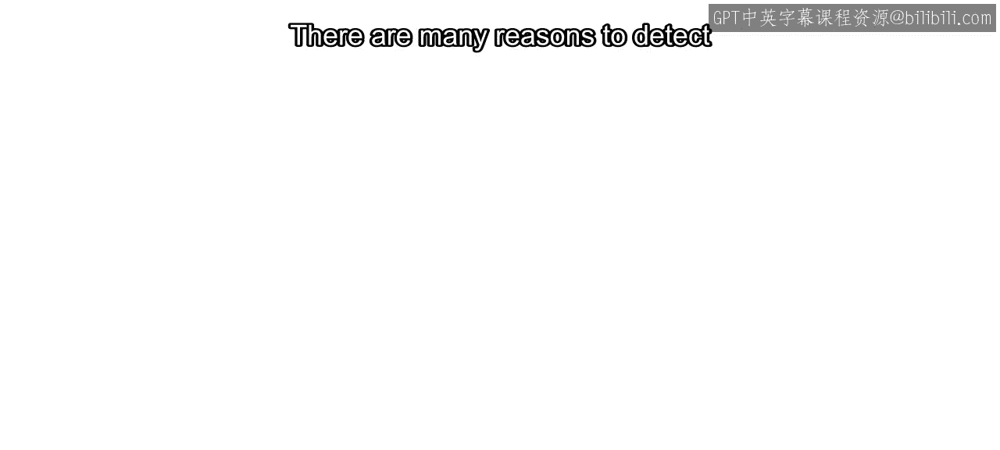

在本节课中，我们将学习如何利用预训练的目标检测模型来处理视频，并为检测到的物体添加标注框，最终生成一个带标注的新视频文件。

目标检测在图像和视频中有许多应用场景。自动驾驶或驾驶辅助系统需要识别行人、车道线、交通标志和其他车辆。医疗专业人员需要定位可能指示损伤或疾病的异常或模式。生物学研究人员需要检测运动细胞以研究其行为。工业质量控制系统在检查缺陷前，也必须首先定位物体。

幸运的是，现在有越来越多的预训练检测器可以解决这类问题。

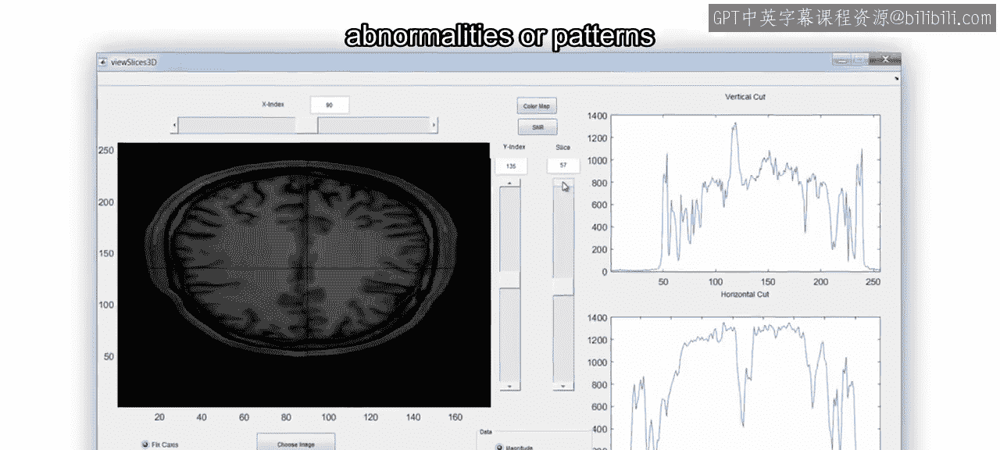

## 视频标注概述

上一节我们介绍了目标检测的应用场景，本节中我们来看看如何对视频进行标注。

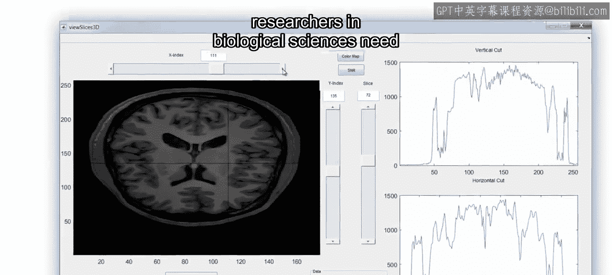

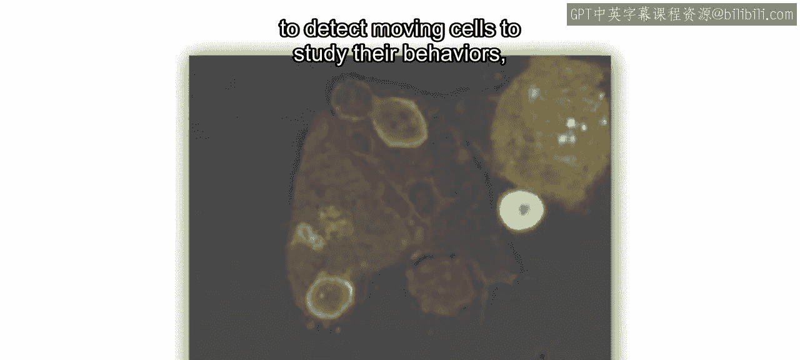

为视频添加标注，意味着在视频文件的每一帧中，为感兴趣的物体周围添加一个边界框。

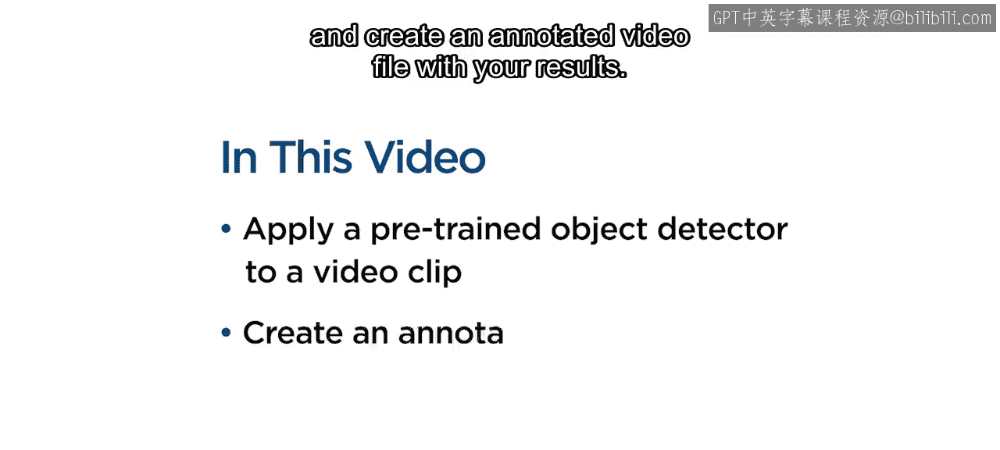

为此，我们需要对每一帧应用目标检测器。检测器会返回待检测类型物体的边界框位置和大小。然后，我们可以将边界框叠加到帧上以高亮显示物体。最后，我们将从标注好的帧中创建一个新的视频文件。

## 预训练模型简介


虽然创建和训练自己的检测器是可行的，但这通常没有必要。

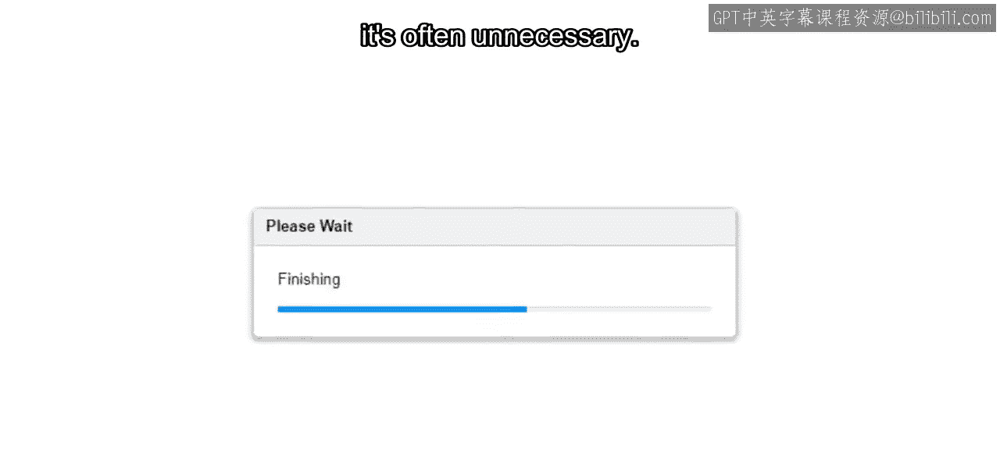

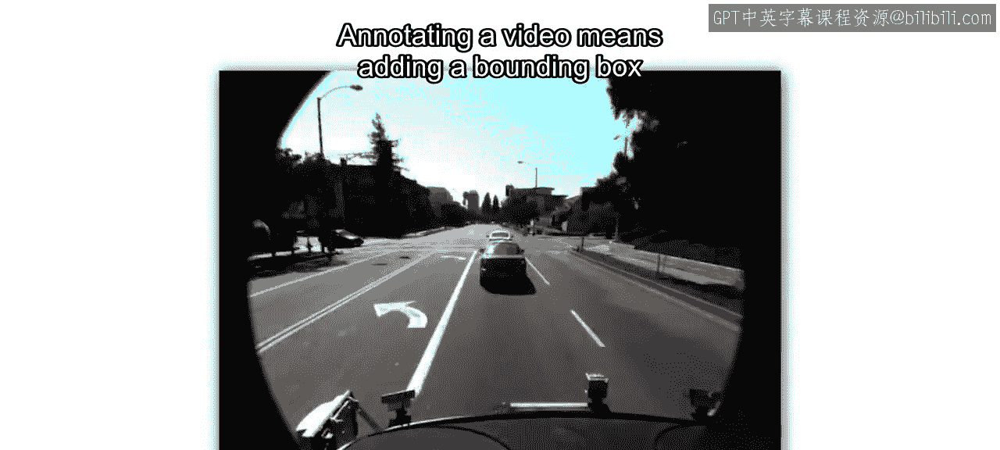

许多通用和专用的检测器已经可以方便地使用。

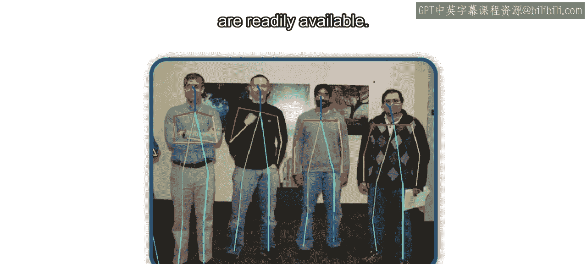

使用计算机视觉专家创建的模型，可以让你专注于自己的应用。

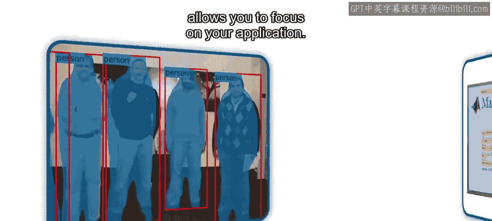


大多数检测器是使用经典机器学习或深度学习神经网络创建的。


**聚合通道特征** 是一种现代机器学习算法。Matlab 提供了该模型的预训练版本，用于检测行人和车辆。这些模型任务非常具体，但这有助于保持模型体积小、预测速度快。

基于深度学习的检测器则通用得多，但需要更多的计算资源来使用。


Matlab 提供了两个流行的检测器系列：
*   **R-CNN**：基于区域的卷积神经网络。
*   **YOLO**：你只看一次。

这些模型可以检测来自 **COCO** 数据集的 80 类物体中的任何一类。每个模型系列也有为特定任务（如车辆检测）训练的版本。其他通用和专用模型可以从 **GitHub** 上的 **Matlab 深度学习模型中心**获取，并可导入到 Matlab 中。

YOLO 检测器是首批实现实时目标检测的深度学习模型。

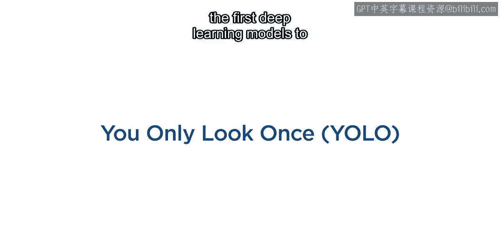
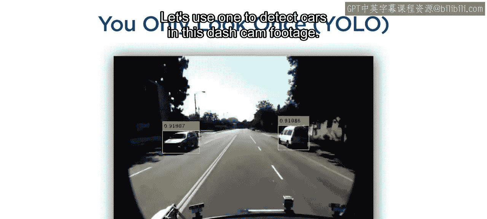

接下来，让我们使用其中一个模型来检测这段行车记录仪画面中的汽车。

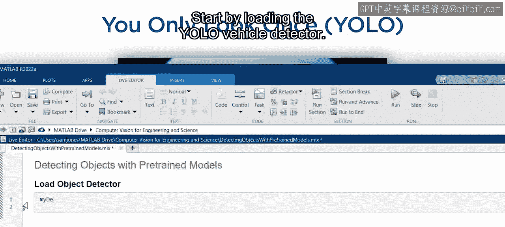

## 实践：检测视频中的汽车

以下是使用 YOLO 检测器处理视频的核心步骤。

首先，加载 YOLO 车辆检测器。这个命令可能需要一些时间运行，因此可以将其放在一个代码节之前，以便单独运行其余代码。

```matlab
detector = yolov3ObjectDetector('vehicle');
```

使用 `VideoReader` 函数导入视频文件，并使用 `VideoWriter` 函数保存输出视频。


```matlab
inputVideo = VideoReader('dashcam_video.mp4');
outputVideo = VideoWriter('annotated_video.avi');
open(outputVideo);
```


可以使用 `readFrame` 函数顺序读取帧，或使用 `read` 函数读取特定帧。为了测试检测器，读取并查看视频的一个示例帧。


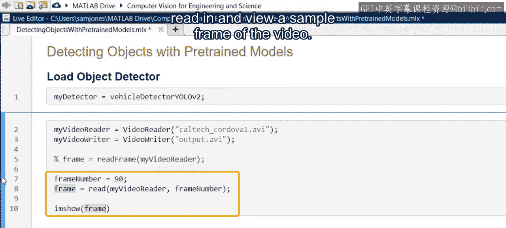

帧中有一辆汽车。让我们看看检测器是否能找到它。

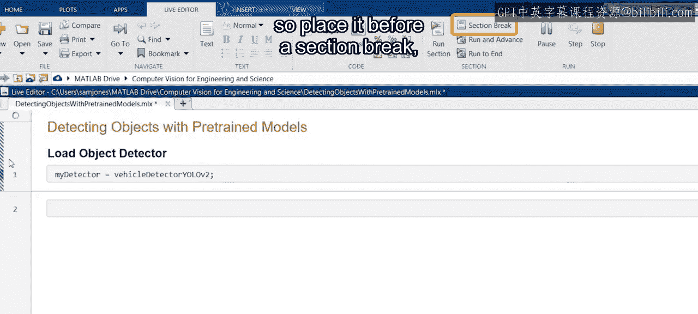

使用 `detect` 函数，输入为检测器和图像。

```matlab
[bboxes, scores] = detect(detector, sampleFrame);
```

结果是所有边界框的大小和位置，以及每个检测的置信度分数。

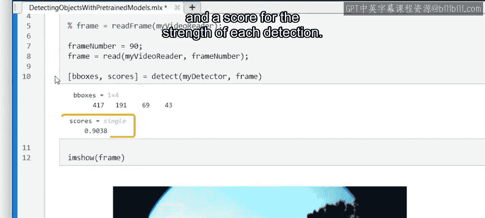


虽然不同的检测器有独特的评分标准，但分数越高总是代表匹配的可能性越大。

`insertObjectAnnotation` 函数会将边界框添加到帧中。这里我们将使用检测分数作为标签。

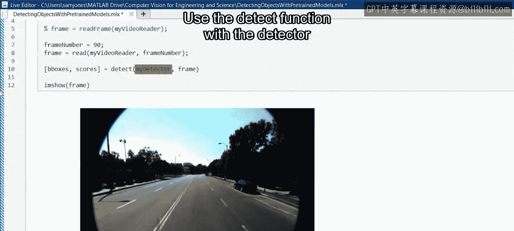

```matlab
annotatedFrame = insertObjectAnnotation(sampleFrame, 'rectangle', bboxes, scores);
```


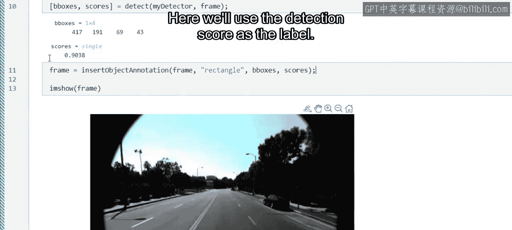
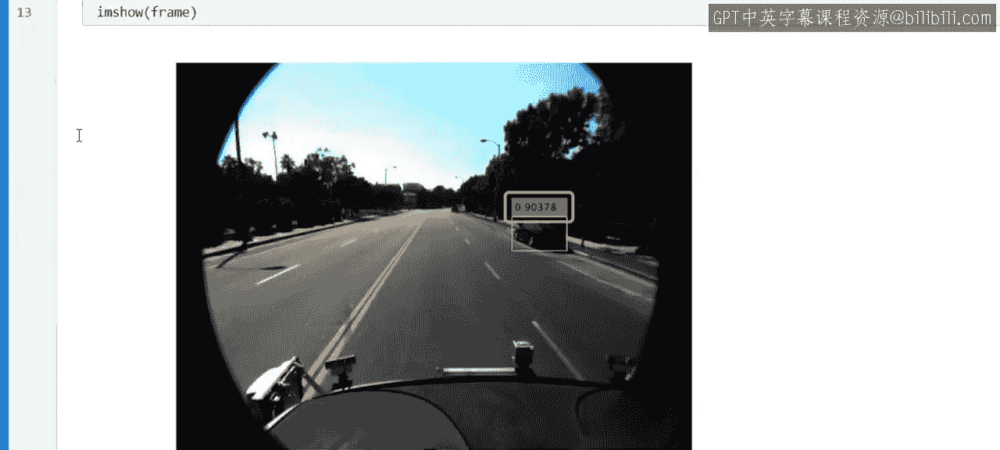

当一个或多个物体被检测到时，这工作得很好。

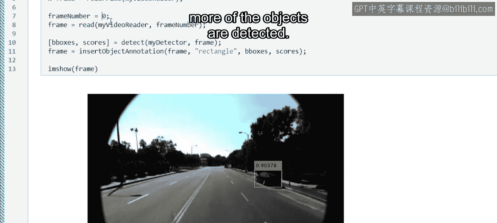


但如果一个都没有，该函数将返回错误。将标注函数包装在一个 `if` 语句中，以确保有标注可添加。


```matlab
if ~isempty(bboxes)
    annotatedFrame = insertObjectAnnotation(sampleFrame, 'rectangle', bboxes, scores);
else
    annotatedFrame = sampleFrame;
end
```


将检测和标注命令放在一个 `while` 循环中，我们将把检测器应用到整个视频。

```matlab
while hasFrame(inputVideo)
    frame = readFrame(inputVideo);
    [bboxes, scores] = detect(detector, frame);
    if ~isempty(bboxes)
        annotatedFrame = insertObjectAnnotation(frame, 'rectangle', bboxes, scores);
    else
        annotatedFrame = frame;
    end
    writeVideo(outputVideo, annotatedFrame);
end
```

与其在创建时查看每一帧，我们可以使用 `VideoWriter` 将其写入新的视频文件。

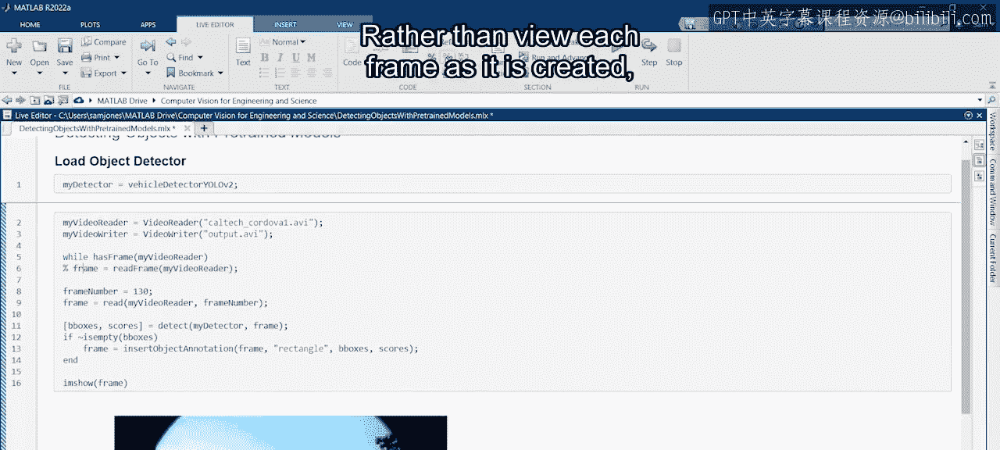

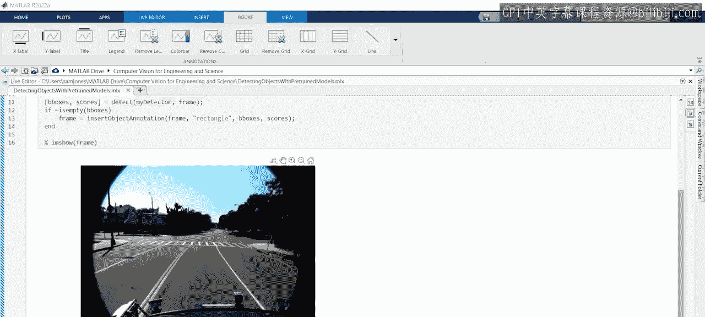

请务必在使用 `VideoWriter` 前后打开和关闭它。


```matlab
open(outputVideo);
% ... 处理并写入帧的循环 ...
close(outputVideo);
```

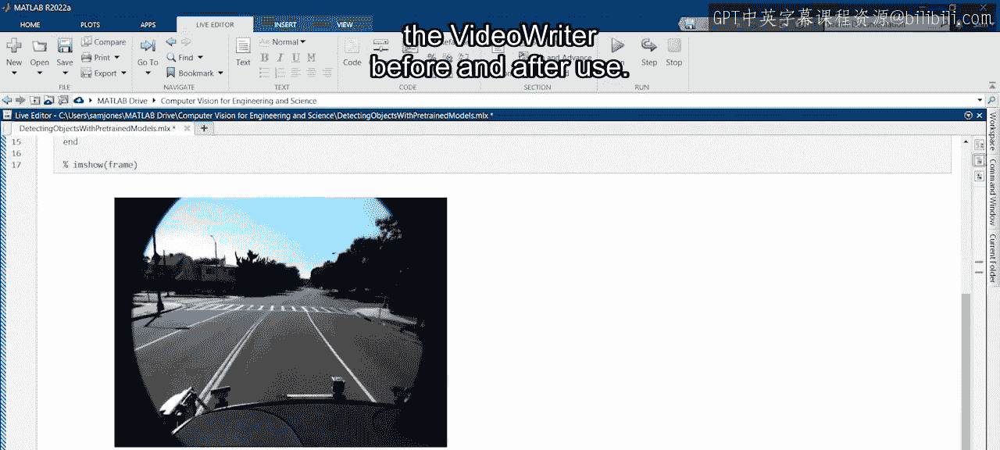


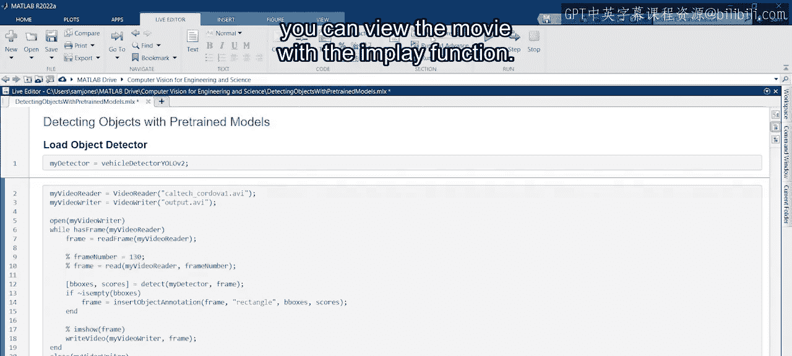

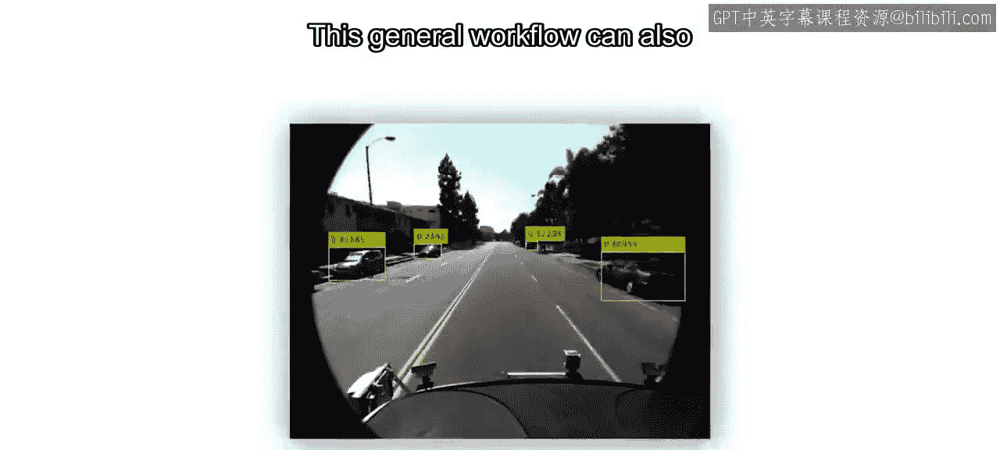

代码运行后，你可以使用 `implay` 函数查看生成的视频。


## 扩展到图像处理

这个通用工作流程也可以应用于不构成视频的图像。如果用图像数据存储代替视频文件，可以使用相同的步骤。结果将是一系列新的图像文件，其中边界框叠加在感兴趣的物体上。

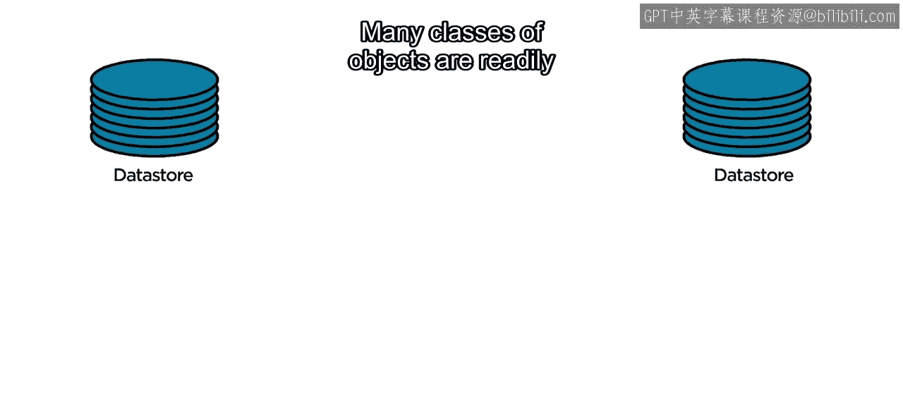
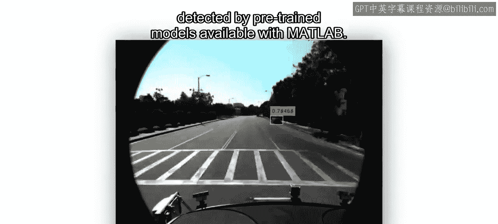


## 总结

本节课中我们一起学习了如何使用 Matlab 中提供的预训练模型进行目标检测。我们了解了视频标注的概念，探索了不同类型的预训练检测器（如 ACF、R-CNN 和 YOLO），并通过一个具体示例，实践了加载检测器、处理视频帧、添加边界框标注以及生成新视频文件的完整流程。预训练模型是快速开始目标检测工作的绝佳方式。