# 工程与科学计算机视觉：29：使用分割检测物体 🎯

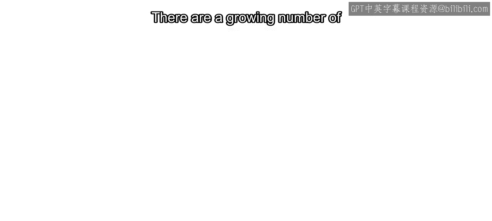

在本节课中，我们将学习如何利用图像分割技术来检测物体。我们将探讨何时选择图像处理算法而非预训练模型，并通过一个具体的荧光显微镜视频案例，演示在MATLAB中从读取视频到最终输出带标注视频的完整工作流程。

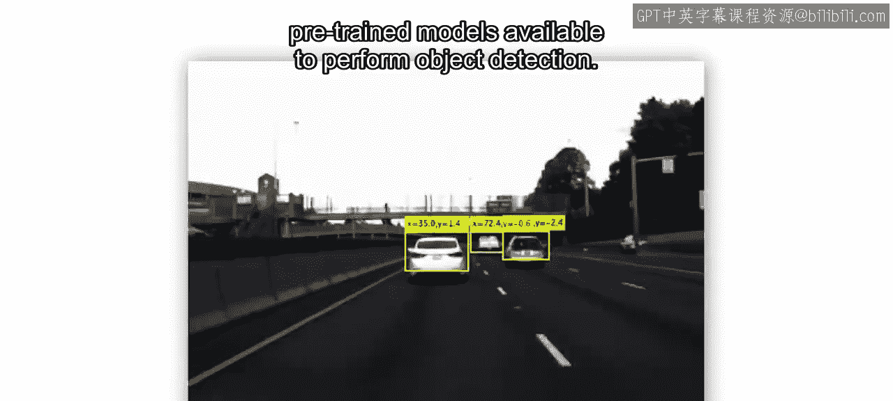

---

目前有越来越多的预训练模型可用于执行目标检测任务。

如果你找到一个模型，其检测质量足以满足你的使用需求，那么直接使用它即可。

但如果没有找到合适的模型呢？你可以选择训练一个新模型。不过请注意，训练模型，尤其是深度神经网络，可能需要大量的精力和计算资源，而这些资源并非总是随时可用。

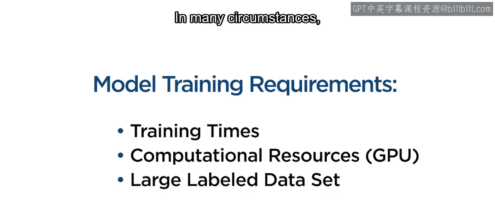

在许多情况下，图像处理方法就完全足够了。

---

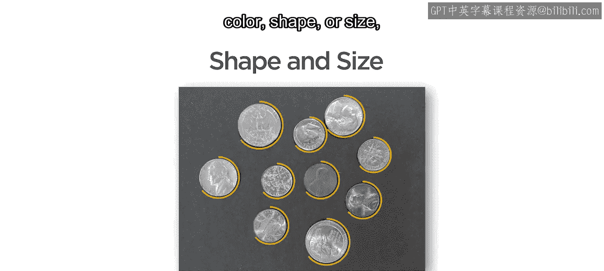

如果你能利用直观的视觉特征（如亮度、颜色、形状或大小）来稳定地区分出你感兴趣的物体，那么设计一个图像处理算法来分割它们通常会更加高效。

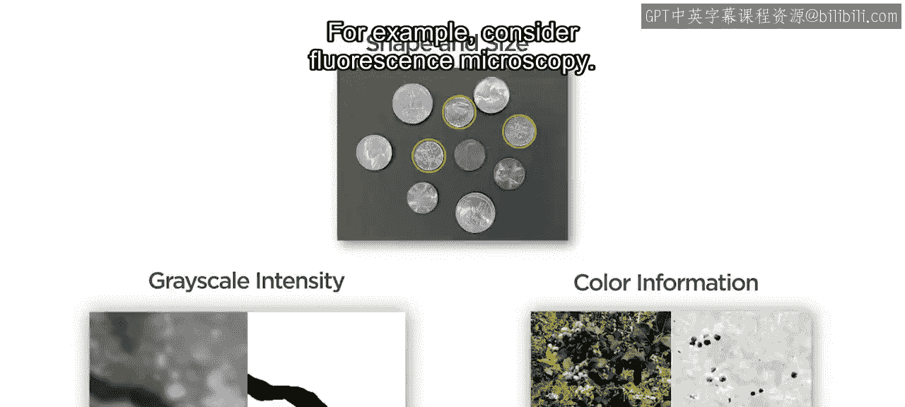

例如，考虑荧光显微镜下的场景。

在这个视频中，变形虫正在试图消化酵母细胞。酵母细胞被荧光标记，因此你应该能够利用其相对大小以及颜色信息或灰度强度来分割它们。

---

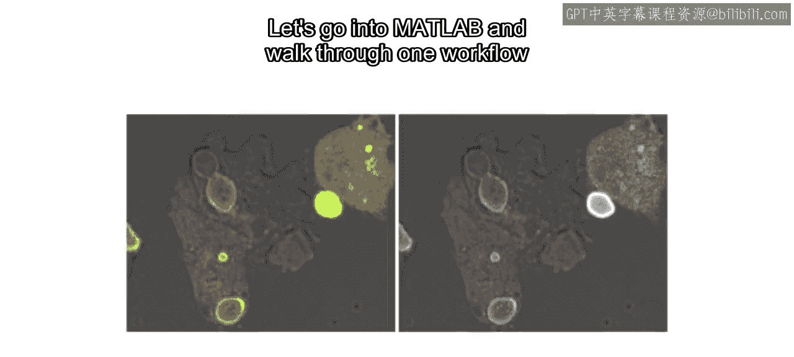

让我们进入MATLAB，并逐步演示一个工作流程，利用灰度强度来分割视频中的酵母细胞。

首先，将视频读入MATLAB。提取一个样本帧，并将其转换为灰度图像。

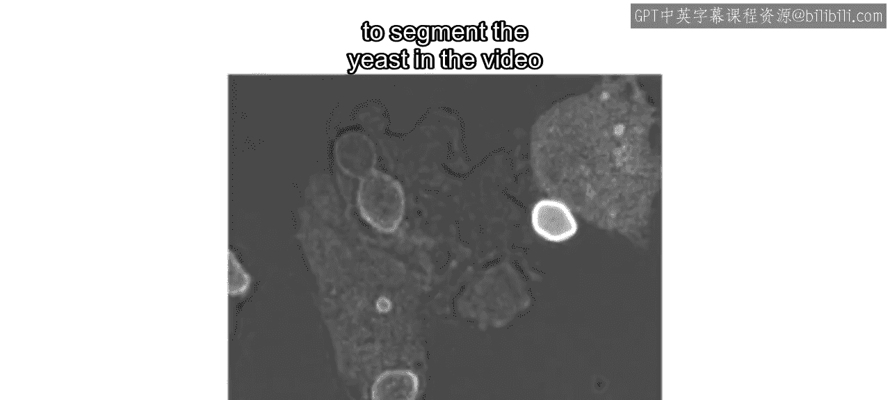

接下来，打开图像分割器应用程序，并将灰度图像加载到该应用程序中。

---

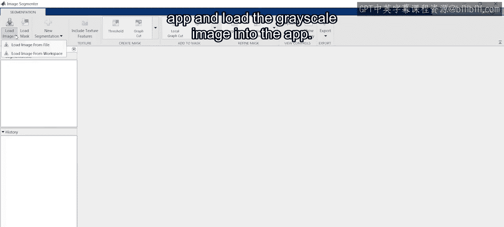

在这种情况下，明亮的荧光与图像其余部分之间存在显著差异。

因此，对灰度强度使用手动阈值，以粗略地分割出酵母细胞。

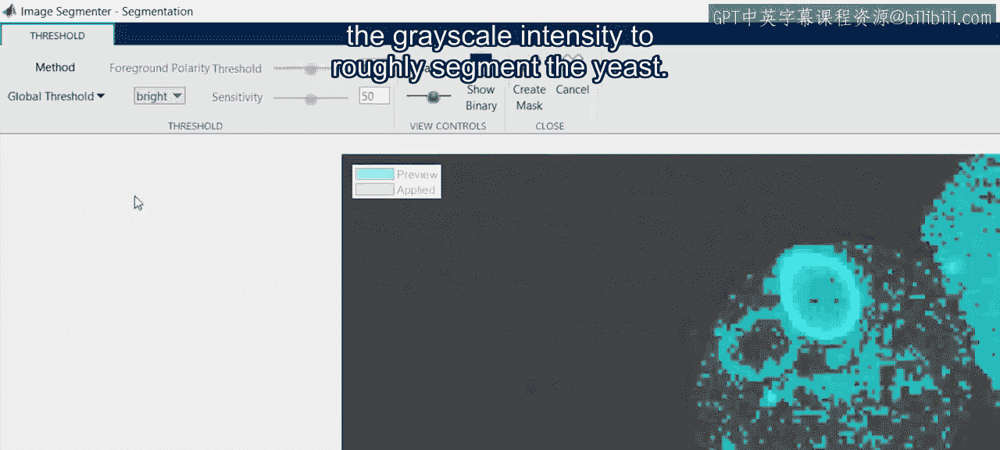

这里，我们缺失了酵母的中心区域。所以使用“填充孔洞”功能来填充这个区域。

现在，剩余的伪影在尺寸上小于酵母细胞。这意味着你可以通过形态学开运算来消除它们。

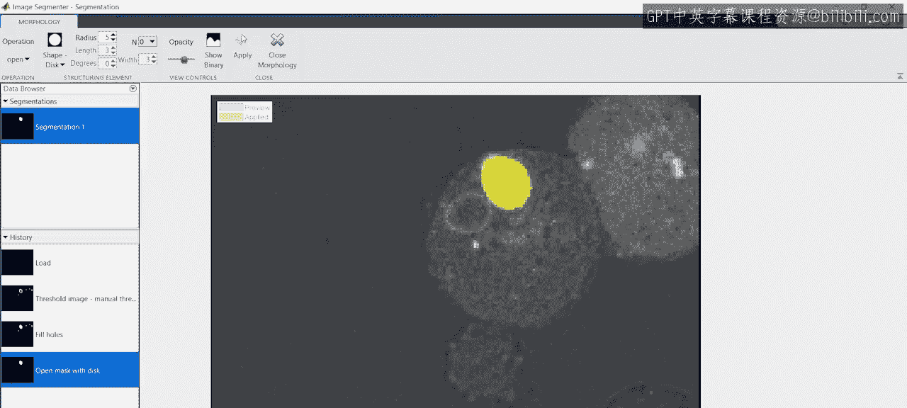

---

这看起来效果不错。为了将这些步骤应用到视频的其他帧，可以导出一个函数。

你可以将其保存为一个独立的函数文件。但在本例中，我们将其复制到脚本的底部，以便在脚本的任何位置调用它。

为了将这些步骤应用于视频的彩色帧，需要创建一个输入副本并赋予新名称。将灰度转换结果重新赋值给原始变量。最后，更新掩码图像以使用彩色版本。别忘了在所有三个颜色通道上复制二值掩码。

现在，让我们在样本帧上测试这个函数，并查看结果以确保其正常工作。

---

在少数其他帧上测试你的分割函数是一个好主意。

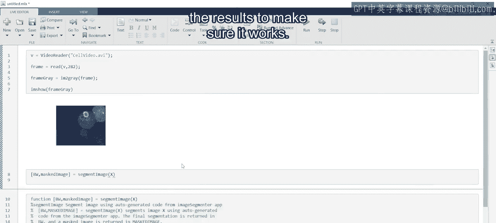

所以，让我们再尝试一帧。

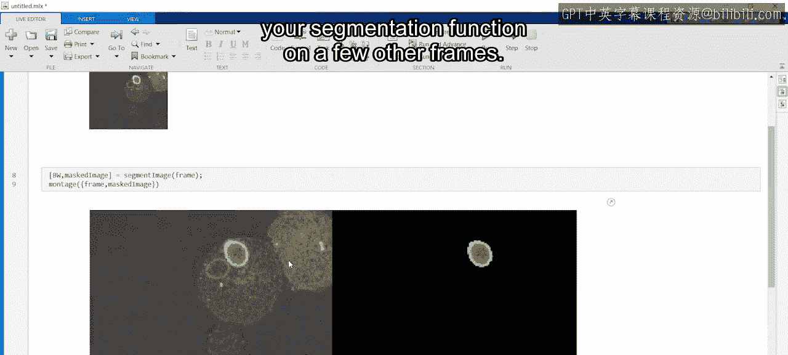

为了更可靠，再测试一帧。看起来不错。

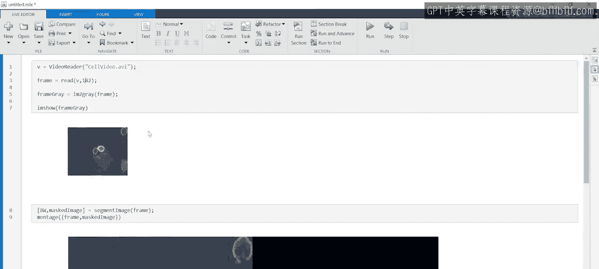

为了添加像之前看到的边界框和标签，首先使用 `regionprops` 函数来获取分割区域的边界框。

然后，将此结果与 `insertObjectAnnotation` 函数结合使用，以添加带标签的边界框。

这里，我们将使用标签“yeast”。最后，检查结果是否符合预期。

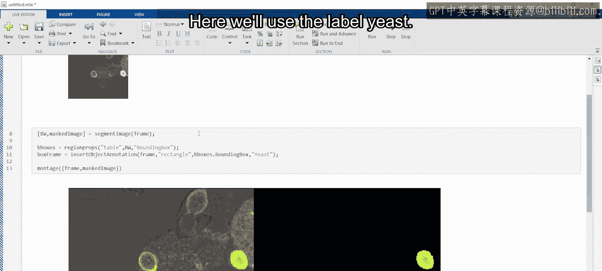

---

现在，你已准备好处理视频中的所有帧。正如之前所见，创建一个新的视频写入器对象。打开它，并在处理完成后关闭它。

在打开和关闭命令之间，使用一个 `for` 循环来遍历视频帧。最后，将每一帧写入新视频。

至此，你已使用经典的图像处理技术检测出了高荧光酵母细胞。

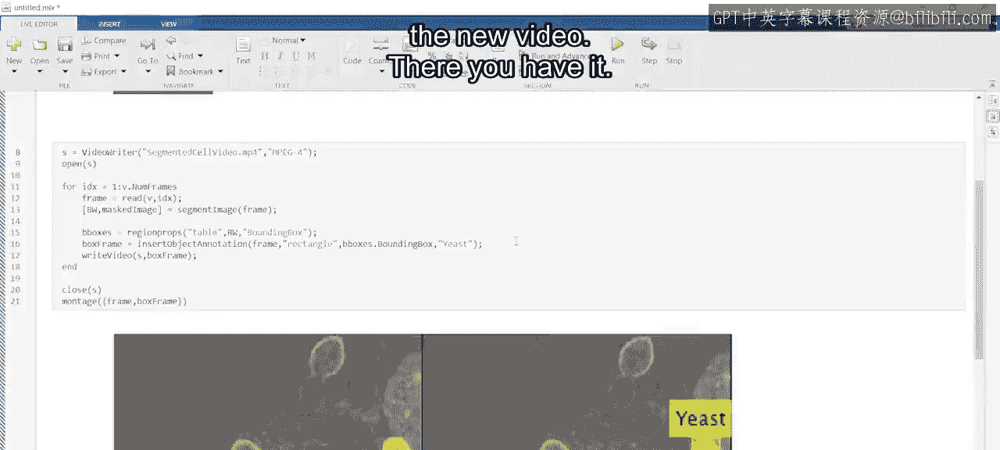

---

在本视频中，我们仅仅触及了MATLAB中可用图像处理方法的皮毛。

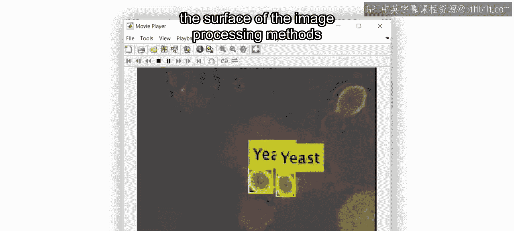

其中许多方法都有能够生成代码的有用应用程序，正如你在这里看到的。

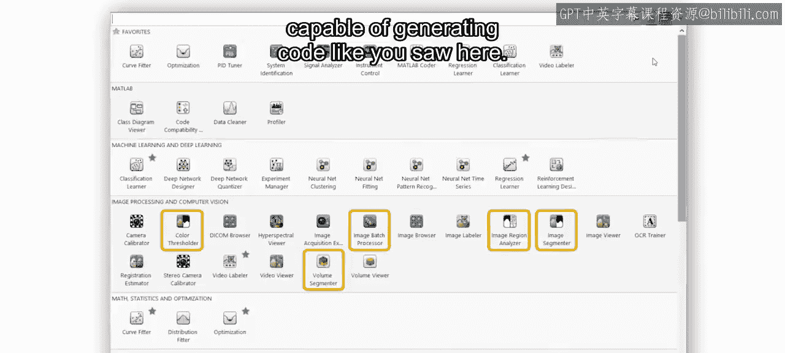

如果你不熟悉在MATLAB中分割图像，或者觉得需要复习一下可用于分割的函数和应用程序，我们在Coursera上提供了一个图像处理专项课程。

---

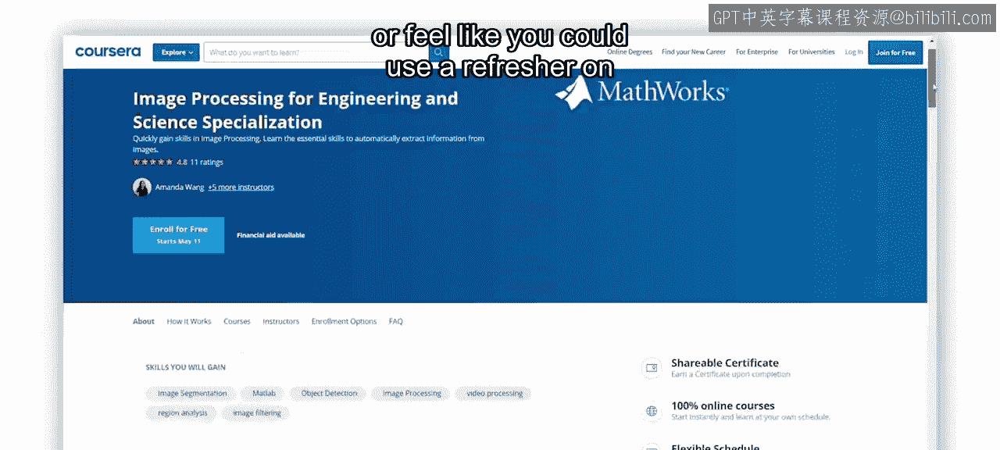

**总结**

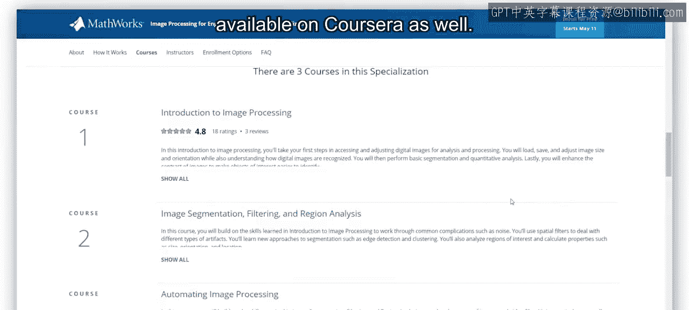

本节课中，我们一起学习了如何利用图像分割进行物体检测。我们比较了预训练模型与自定义图像处理算法的适用场景，并通过一个完整的MATLAB实例，详细演示了从视频读取、灰度转换、阈值分割、形态学处理到最终标注和输出的全流程。你掌握了在特定条件下，使用直观的图像特征和MATLAB工具高效完成物体检测任务的方法。