# 工程与科学计算机视觉：30：检测运动

在本节课中，我们将要学习视频分析中的核心任务之一：运动检测。我们将探讨几种不同的运动检测方法，了解它们的基本原理、适用场景以及各自的优缺点。

运动检测是许多应用中的常见任务。例如，通过检测运动，可以估计物体的运动轨迹，帮助判断行人是否在横穿马路，或是安全地走在人行道上。其他应用还包括相机防抖，以及帮助自主系统（如自动驾驶汽车）绘制其周围环境地图等。

有多种方法可以检测视频片段中的运动。

## 背景差分法

上一节我们介绍了运动检测的广泛应用，本节中我们来看看第一种方法：背景差分法。

一个在静止背景前移动的物体，可以通过背景差分法进行分割。

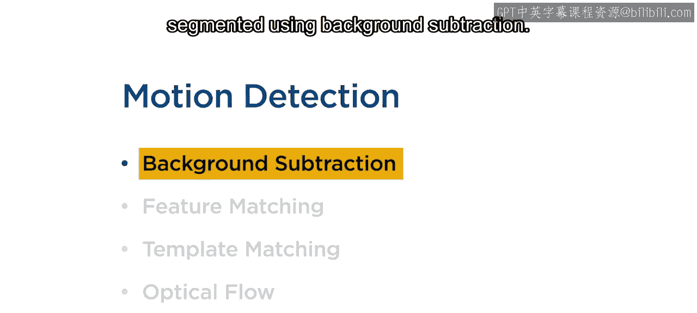

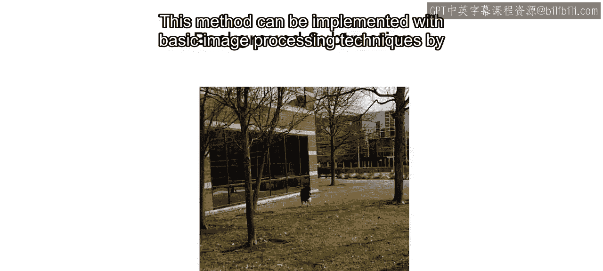

这种方法可以通过基本的图像处理技术实现。

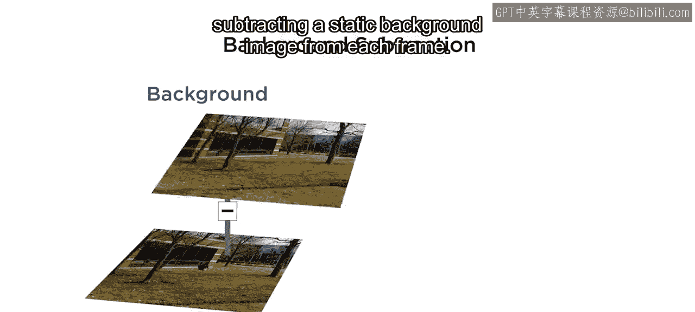

其核心思想是从每一帧图像中减去一个静态的背景图像。

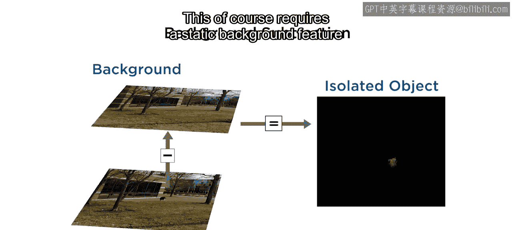

这样就能分离出运动物体。当然，这种方法需要一个静态的背景。

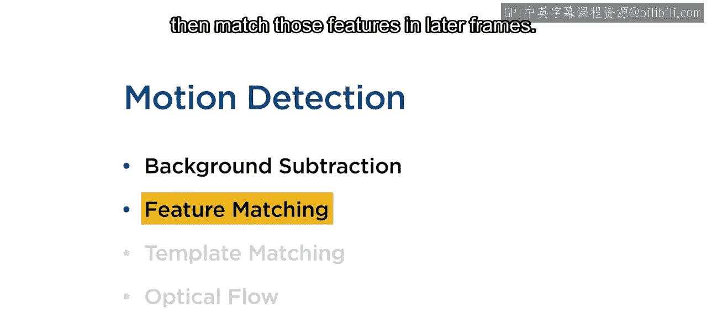

## 基于特征的运动检测

了解了基于静态背景的方法后，我们来看一种更灵活的方法：基于特征的运动检测。

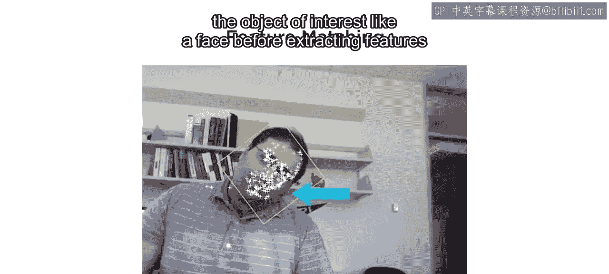

基于特征的运动检测工作原理与图像配准类似。首先，在某一帧中检测并提取物体上的特征点，然后在后续帧中匹配这些特征点。

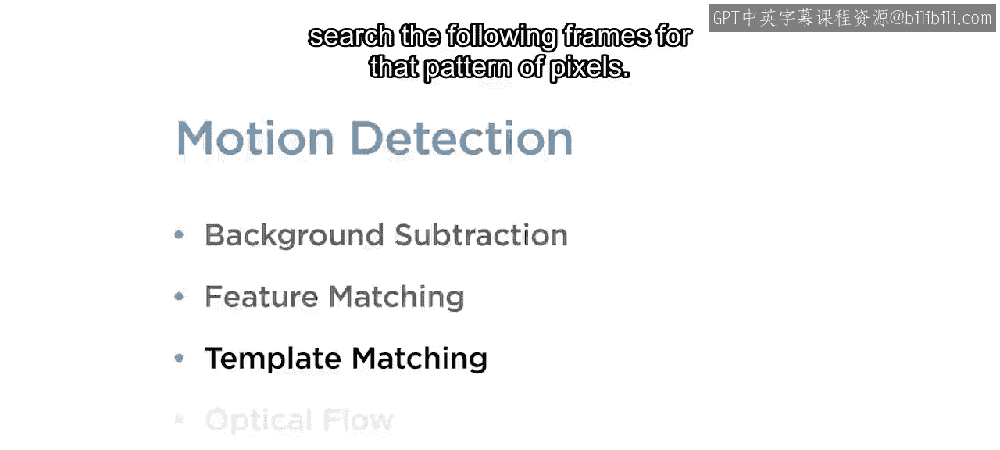

通过这种方式，可以计算出物体的平移和旋转。然而，要使这种方法有效，需要先在提取特征之前，将感兴趣的目标（如人脸）从图像中分离出来。

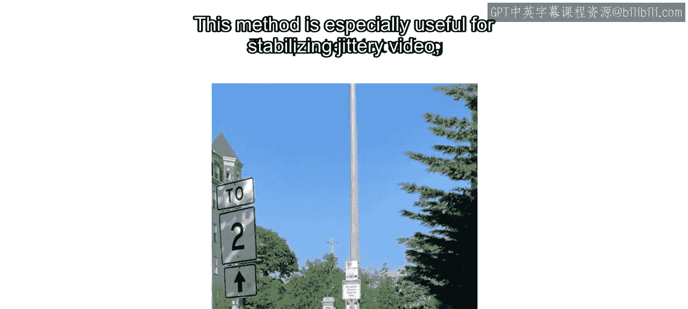

## 模板匹配

除了跟踪特征点，另一种直接的方法是跟踪一个固定的图像块，即模板匹配。

在模板匹配中，选择图像的一部分作为模板，并在后续帧中搜索具有相同像素模式的区域。

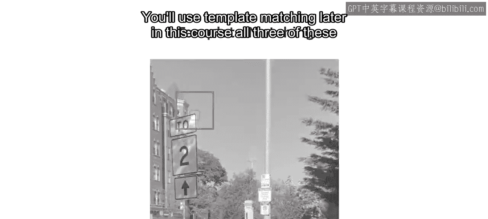

这种方法对于稳定抖动视频特别有用，因为帧之间的方向和光照条件通常保持一致。

通过跟踪模板在每一帧中的位置来确定运动。在本课程后续部分，你将使用到模板匹配。

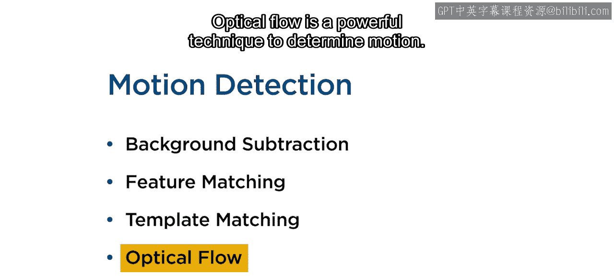

## 光流法

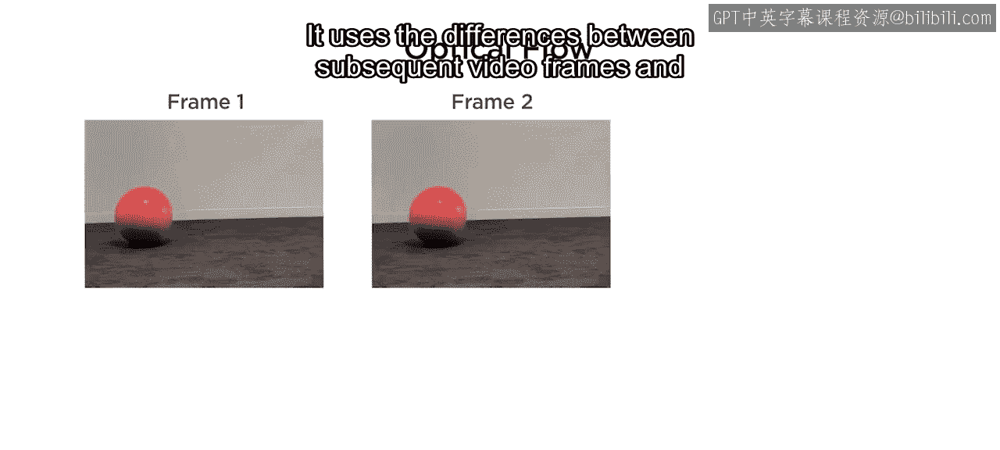

上述三种技术都需要进行一些预处理来检测运动，例如创建静态背景图像、检测感兴趣目标，或识别一个在视频中方向不变的物体作为模板。然而，在某些应用中，这些方法可能都不适用。那么该怎么办呢？

光流法是一种强大的运动确定技术。

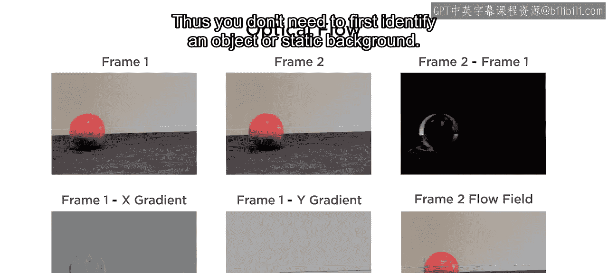

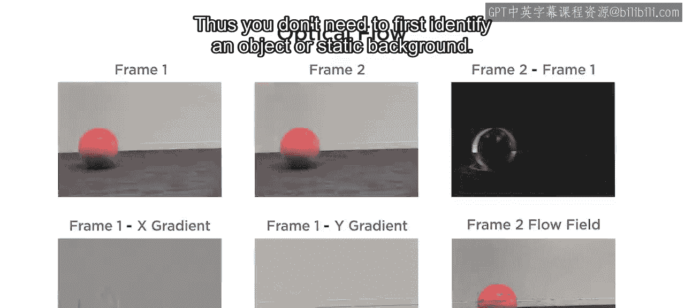

它利用连续视频帧之间的差异。

以及这些帧的梯度，来估计每个像素的速度矢量。因此，你不需要先识别物体或静态背景。

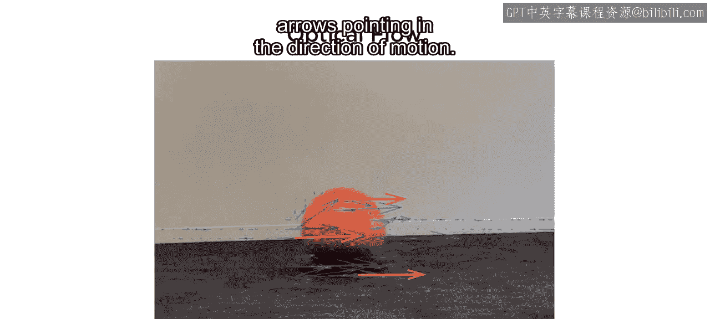

然后，你可以通过将速度矢量添加到每一帧来对视频进行标注。向右或向左移动的物体很容易通过指向运动方向的大箭头来区分。

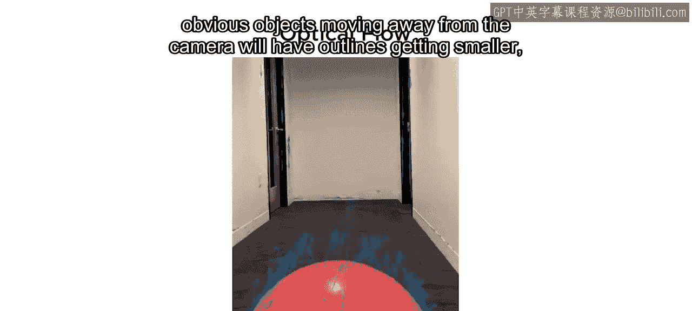

表示朝向或远离相机运动的矢量箭头则不那么明显。远离相机运动的物体，其轮廓会变小，因此边缘的速度矢量会汇聚。

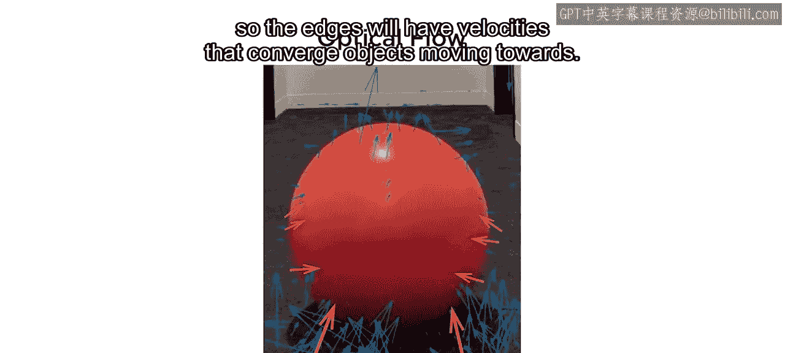

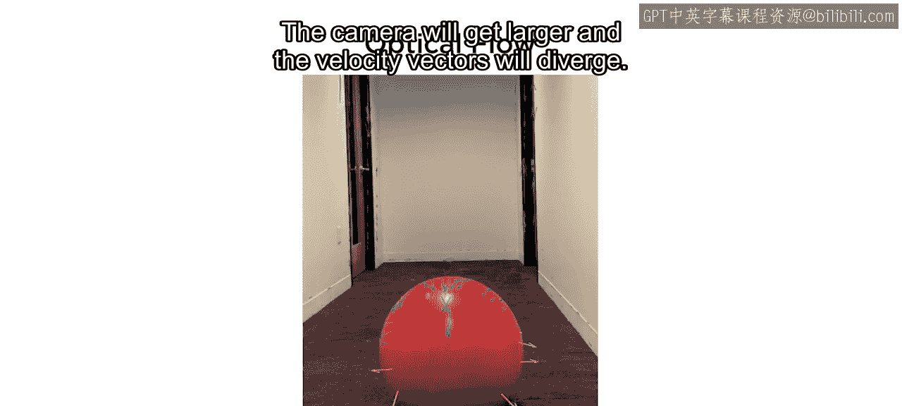

朝向相机运动的物体会变大，速度矢量则会发散。

光流法有一个关键约束：场景的照明必须大致恒定。因为光流利用的是帧间像素强度的差异，阴影或光照变化可能会被误判为运动。

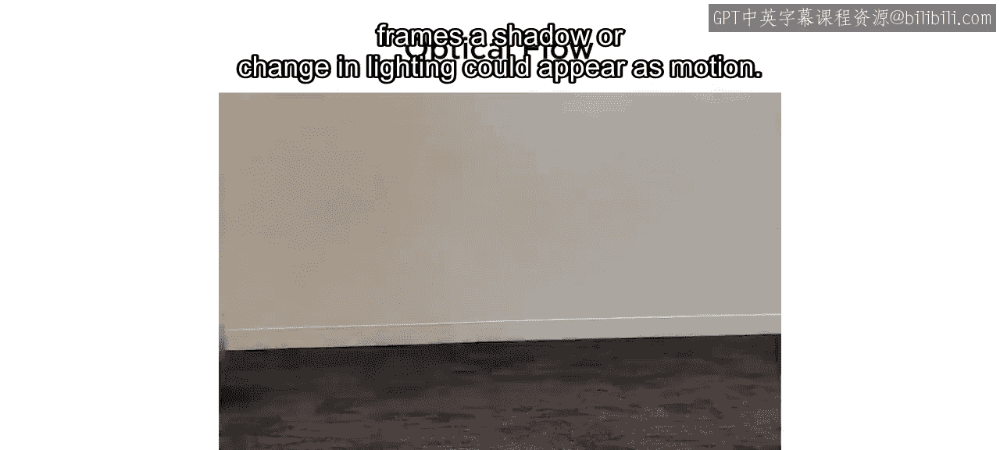

这个问题也影响其他运动检测方法，但在光照有某些变化的情况下，匹配特征或模板仍然是可能的。

## 总结

本节课中我们一起学习了四种主要的运动检测方法：
1.  **背景差分法**：适用于静态背景，通过 `运动区域 = 当前帧 - 背景帧` 来提取运动物体。
2.  **基于特征的运动检测**：通过跟踪特征点（如SIFT, SURF）的位移来计算物体的运动。
3.  **模板匹配**：通过在一个图像序列中跟踪一个固定模板的位置来检测运动。
4.  **光流法**：通过计算每个像素的速度矢量场来估计运动，无需预先分割物体，但对光照变化敏感。

你已经掌握了使用背景差分和特征匹配来确定运动的技能。接下来，你将学习如何应用光流法和模板匹配。

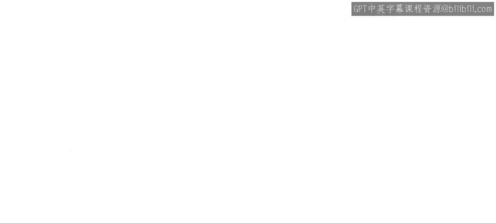

