# 工程与科学计算机视觉：31：使用模板匹配稳定视频 🎬

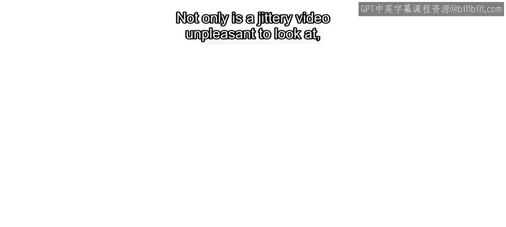

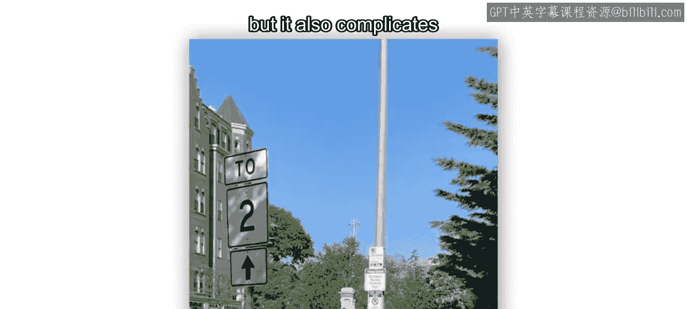

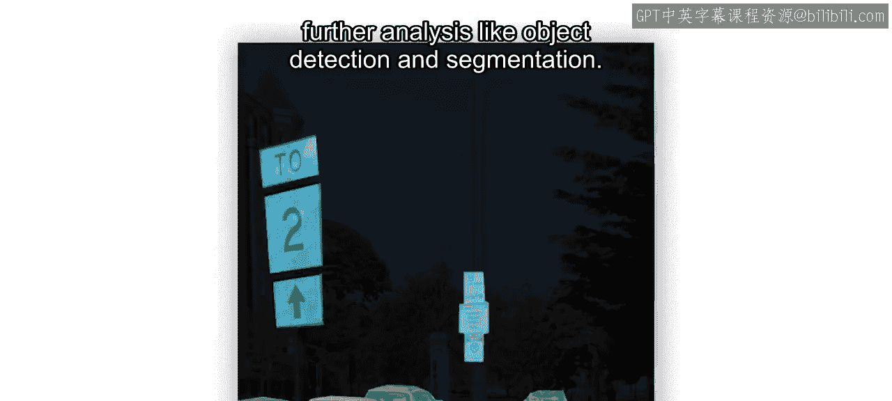

在本节课中，我们将学习如何利用模板匹配技术来稳定因相机抖动而产生晃动的视频。视频抖动不仅影响观看体验，还会给后续的物体检测和图像分割等分析任务带来困难。我们将重点解决相机在XY平面内平移抖动的问题。

## 概述

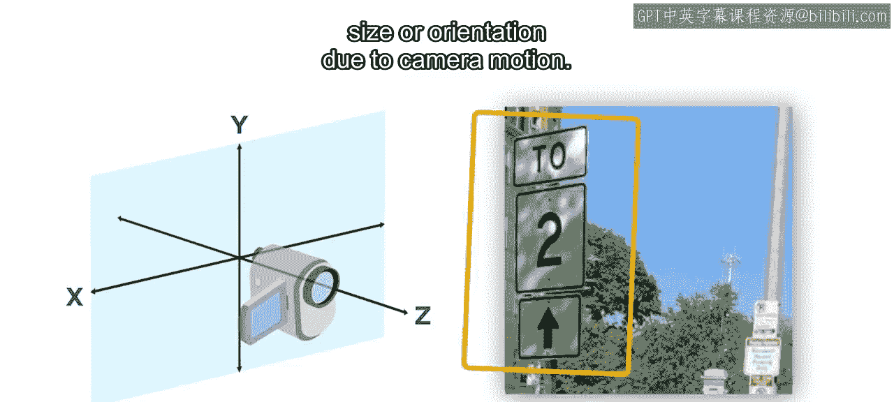

视频稳定过程主要包含三个核心步骤：运动估计、相机运动估计和视频校正。整个过程基于一个关键假设：视频中存在一个静止的参考物体，且相机运动不会导致该物体发生尺寸或方向上的变化。

上一节我们介绍了视频稳定的必要性，本节中我们来看看具体的实现步骤。

## 视频稳定原理

考虑视频中一个物体从一帧到下一帧的位置变化。物体在当前帧的位置，等于它在上一帧的位置加上帧间表观运动。我们可以使用光流或模板匹配等技术来估计这个运动。

假设相机仅在XY平面内移动，那么表观运动就是相机运动和物体自身运动的总和。这就是为什么视频中需要一个静止物体的原因。此时，物体自身运动的分量为0，表观运动完全由相机运动造成。

最后一个步骤是进行视频校正。通过减去相机运动来稳定当前帧。然而，为了将视频稳定到原始参考帧的坐标系，我们需要考虑相机从第一帧到当前帧的**累积运动**。因此，稳定后的帧等于当前帧减去所有先前帧的累积相机运动。

## 实践步骤

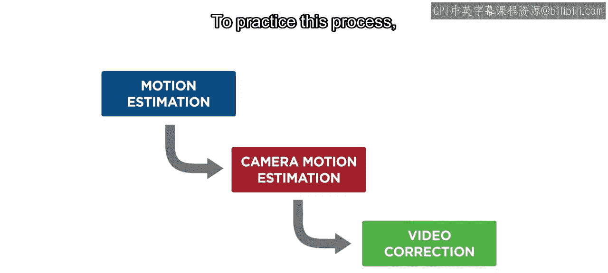

为了实践这个过程，课程材料中提供了一个示例视频和脚本。这里，我们将介绍其主要组成部分。视频中相机在XY平面移动，但存在可用于运动估计的静止物体。

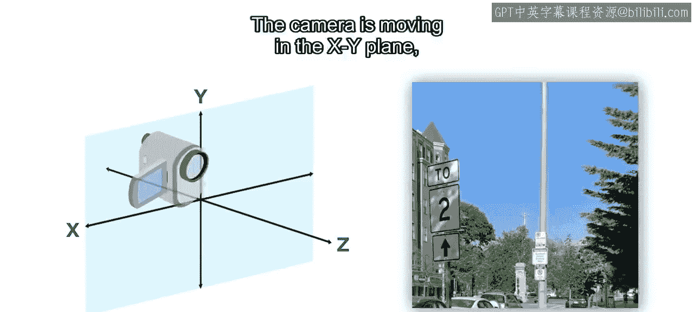

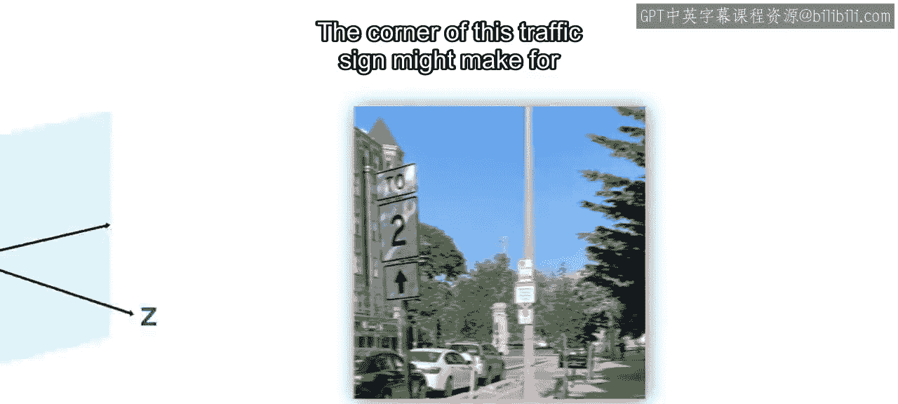

以下是选择合适模板对象的关键点：

*   **良好选择**：交通标志的角落。它在整个视频中持续出现，且不易与周围物体混淆。
*   **不佳选择**：窗户角落或电线杆。这些特征不够独特，难以在帧间进行正确匹配。

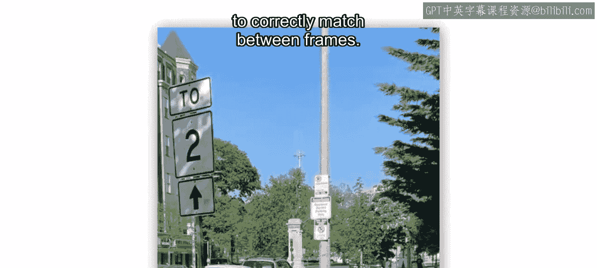

## 使用模板匹配估计运动

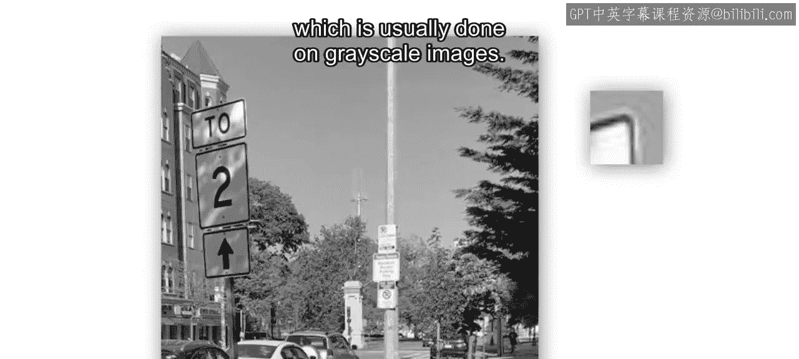

我们将使用模板匹配算法来建立表观运动，该算法通常在灰度图像上运行。

模板匹配的工作原理是：提供一个来自参考图像的模板，然后在新的目标图像中寻找最匹配的区域。类似于空间滤波，模板在图像上滑动，并为目标图像的每个像素位置计算**平方差之和**。

**SSD计算公式**：
`SSD(x, y) = Σ [Template(i, j) - Target(x+i, y+j)]²`

SSD最小的位置，就对应着模板在新图像中的位置。

在MATLAB中，可以使用 `templateMatcher` 对象来实现。虽然不是必须的，但指定一个**感兴趣区域**来进行搜索是一个好习惯。这样做更高效，因为算法只在指定区域内搜索，并且有助于避免图像中相似区域造成的错误匹配。

以下是调用模板匹配器查找最佳匹配位置的代码：

```matlab
% 调用模板匹配器
position = templateMatcher(targetImage, templateImage, roi);
% roi 是一个四元素向量：[左上角x坐标, 左上角y坐标, 矩形宽度, 矩形高度]
% 输出 position 是模板在目标图像中最佳匹配中心的像素位置
```

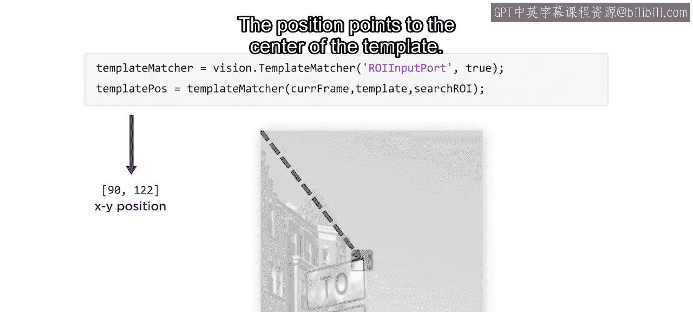

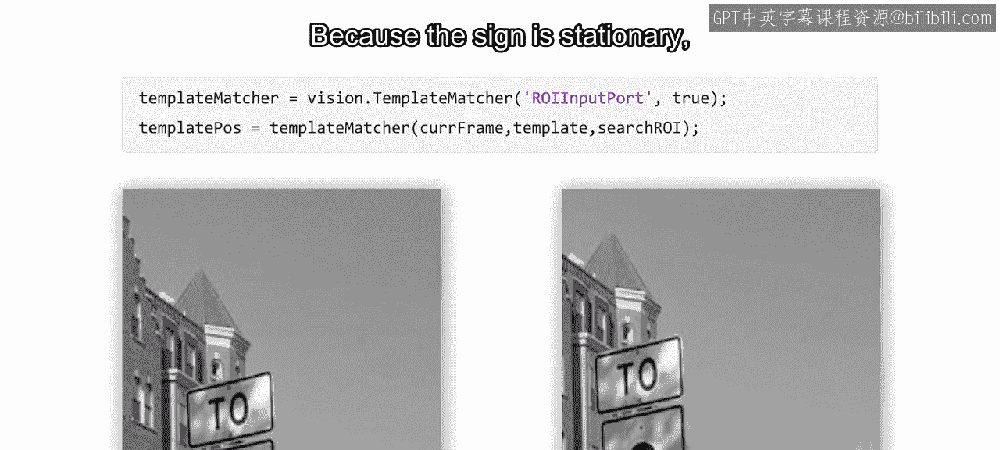

## 计算累积运动与帧校正

因为交通标志是静止的，所以其位置的任何差异都归因于相机的运动。我们可以利用当前帧和前一帧的模板位置来跟踪相机的累积运动。

然后，使用 `imtranslate` 函数将当前帧平移相应的量。例如，将当前帧在X和Y正方向各平移5个像素，这可能会在图像边缘产生一个小的黑色边框。

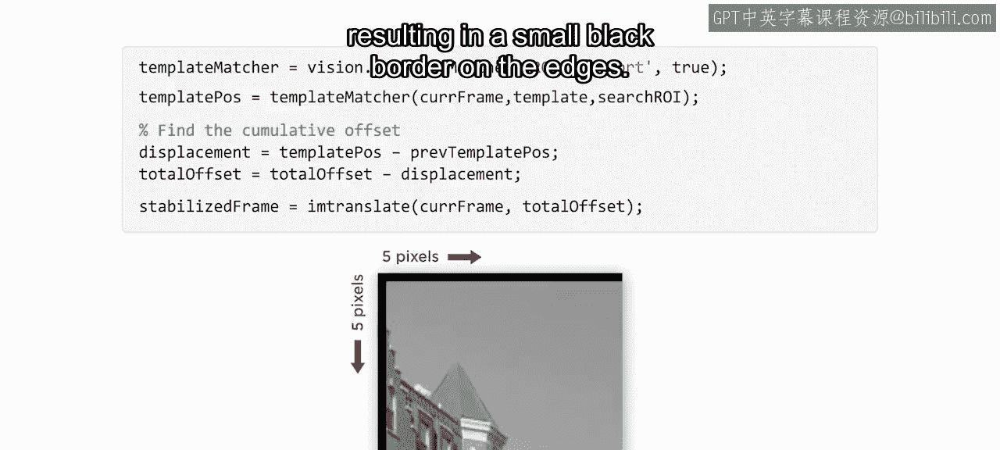

```matlab
% 平移当前帧以进行校正
stabilizedFrame = imtranslate(currentFrame, translationVector);
```

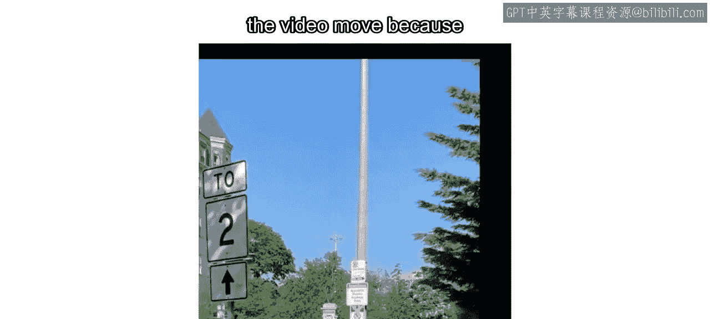

## 裁剪稳定后的视频

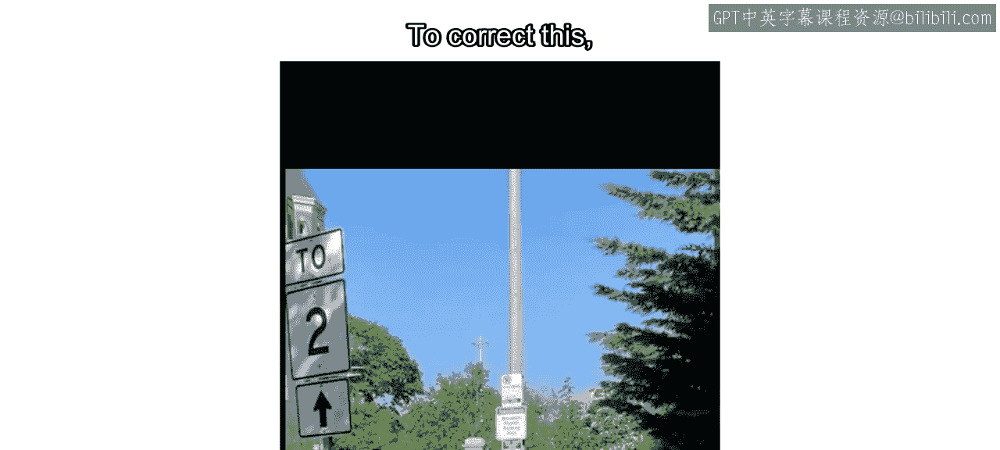

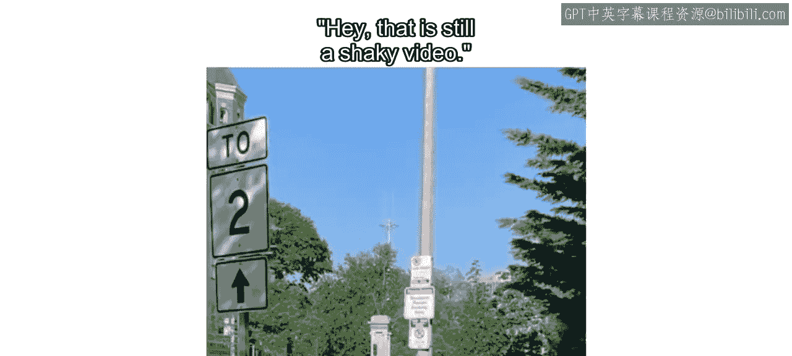

对所有帧应用校正后，你会注意到由于每帧都进行了平移，视频的边缘会移动。为了修正这个问题，需要将稳定后的视频进行裁剪，只显示在每一帧中都出现的场景部分。

现在你可能会想，视频看起来仍然有些晃动。让我们再看一次，但这次在两个标志的起始位置画上方框。你会发现，稳定后的视频比原始视频的运动要小得多。当相机移动时，背景的某些部分会移入或移出视野，这造成了仍在运动的表象。如果你的视频背景是变化的，这属于正常现象。

## 总结

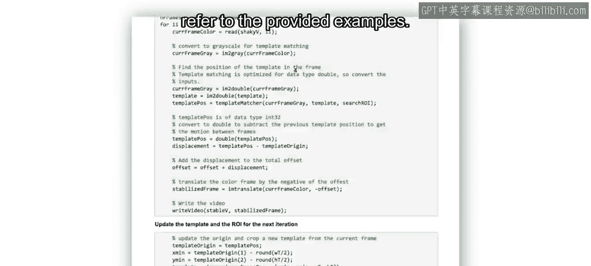

本节课中，我们一起学习了使用模板匹配稳定视频的核心概念和所需函数。你了解了如何选择模板、估计帧间运动、计算累积相机运动并对视频帧进行平移校正，最后通过裁剪获得最终稳定的视频输出。要查看包括如何跟踪累积运动在内的完整实现，请参考课程提供的示例代码。