# 工程与科学计算机视觉：32：应用光流

## 概述

在本节课中，我们将要学习光流技术。光流是一种强大的运动检测技术，它无需确定静态背景、检测并提取物体特征，也无需手动选择匹配模板。它仅需要连续的两帧图像即可检测运动。我们将通过一个行人检测的实例，学习如何使用Matlab中的光流方法，特别是Farnback方法，来检测和分割视频中的运动物体。

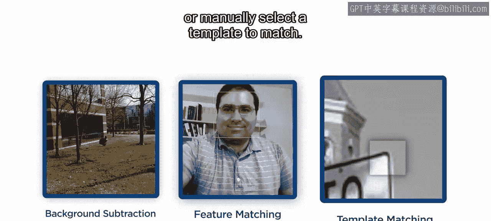

---

## 光流原理简介

上一节我们介绍了光流的基本概念，本节中我们来看看它的工作原理。

光流方程通过比较两帧图像的强度值，为每个像素确定一个速度矢量。其核心思想基于一个假设：同一物体点在连续帧之间的亮度保持不变。

以下是计算所需的关键步骤：
1.  将图像转换为灰度图以计算图像强度。
2.  计算图像在水平和垂直方向上的梯度。
3.  计算两帧之间的强度差异。

这些值被用来估计每个像素的水平和垂直速度。由于一个方程包含两个未知数（水平速度和垂直速度），这个系统是欠定的。然而，已有多种求解算法被开发出来以估计这些速度。Matlab提供了几种方法，包括Horn-Schunck、Lucas-Kanade和Farnback方法。


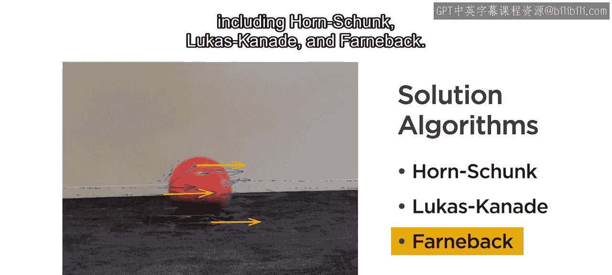

---

## 实践：使用Farnback方法检测行人运动

在本节中，我们将使用Farnback方法检测交通摄像头视频中行人的运动。这个现代算法具有良好的性能和速度，适用于多种应用场景。我们的最终目标是生成一个视频，其中每一帧的运动物体都被分割出来。

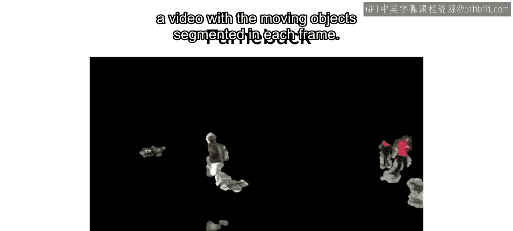


所有光流方法的语法和工作流程都是相同的。因此，如果Farnback方法不适用于你的应用，你可以轻松切换到其他方法。

### 初始化与读取视频

以下是开始工作的步骤：
1.  创建视频读取器和视频写入器对象。
2.  创建一个光流求解器。
3.  我们将重点关注视频中汽车在十字路口停下的部分，即第96帧到第565帧（这些帧号可通过视频查看器应用找到）。
4.  读入第一帧并使用`imshow`查看。画面中有几个行人，以及停着的和行驶中的汽车。

```matlab
% 示例代码：初始化视频读取器和光流对象
videoReader = VideoReader(‘traffic_video.avi’);
opticalFlowObj = opticalFlowFarneback;
frame = read(videoReader, 96);
imshow(frame);
```

光流求解器需要用第一帧进行初始化。这会将第一帧与全黑图像进行比较，为后续计算建立基础。

### 计算并可视化光流

读入下一帧，再次应用光流求解器。光流变量会存储前一帧的信息，因此只需要传入当前帧。

你可以使用`plot`命令将得到的速度矢量添加到图像上进行查看。然而，即使是低分辨率的视频也有数十万个像素，为每个像素显示一个矢量是不可能的。

为了解决这个问题，可以使用`‘DecimationFactor’`名称-值对来减少显示的矢量数量。对于这个视频，在X和Y方向上每15个像素显示一个矢量是可行的。此外，由于帧间隔是1/30秒，运动幅度会非常小。`‘ScaleFactor’`参数可以增加这些矢量的长度，使其更可见。

```matlab
% 示例代码：计算并绘制光流矢量
flow = estimateFlow(opticalFlowObj, nextFrame);
imshow(nextFrame);
hold on;
plot(flow, ‘DecimationFactor’, [15 15], ‘ScaleFactor’, 10);
hold off;
```

此时，行人的运动已经清晰可见，方向和速度可以通过图像大致判断出来。仅用几行代码就取得了相当不错的成果。


---

## 处理噪声与优化分割结果

然而，还存在一些问题。建筑物并没有移动，但却出现了运动矢量。所有光流应用都会因为像素级计算的敏感性而产生这类噪声。

如何解决这个问题呢？答案是使用速度大小作为阈值，过滤掉低水平的噪声。

### 阈值分割

光流解包含速度的水平和垂直分量，以及速度的大小和方向。速度大小的分布直方图可以用来选择截止值。由于画面大部分是静止的，所以有大量像素的速度非常小。

经过一些试验，对于这个视频，阈值0.5是有效的。

我们的目标是检测运动中的行人，因此，与其观察速度矢量，不如使用阈值创建一个掩膜。

```matlab
% 示例代码：根据速度大小创建二值掩膜
magnitude = flow.Magnitude;
mask = magnitude > 0.5;
imshow(mask);
```

这将高亮显示运动物体。

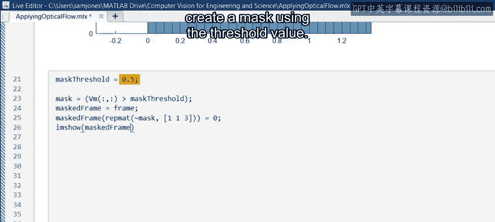
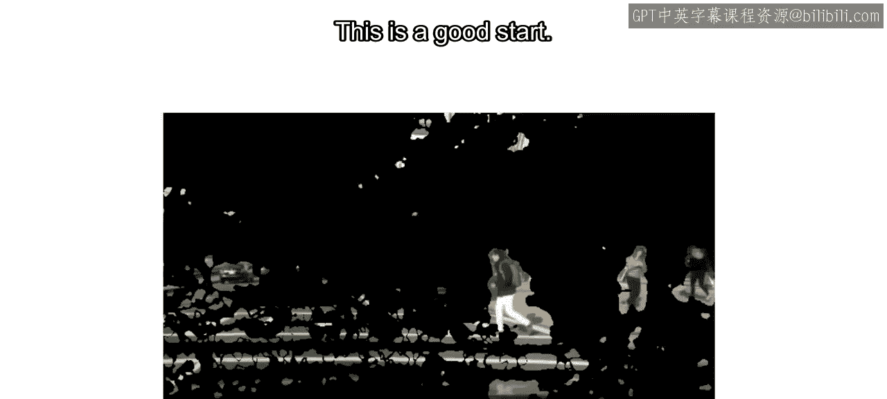

这是一个好的开始。静止的建筑物不再显示运动。提高阈值可以去除更多噪声，但也会去除行人移动较慢的部分。


### 形态学与区域分析


由于现在得到的是二值分割图，我们可以使用图像处理技术来清理它。

形态学开运算可以在保留大区域轮廓的同时去除大部分噪声。然后使用区域分析来过滤掩膜，使其只包含面积大于500像素的区域。

```matlab
% 示例代码：使用形态学开运算和区域分析清理掩膜
se = strel(‘disk’, 3);
maskClean = imopen(mask, se);
maskClean = bwareaopen(maskClean, 500);
imshow(maskClean);
```

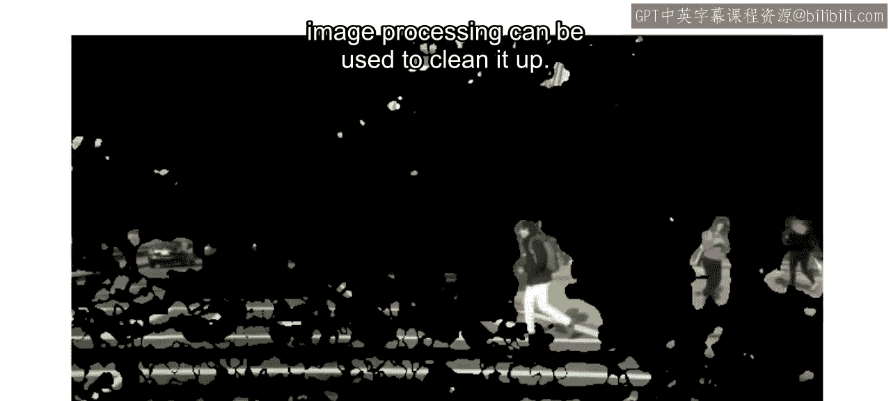

现在，运动的汽车和行人被很好地分割出来。车辆引擎盖上还有一个行人的倒影。你可以通过使用感兴趣区域（ROI）从帧中移除汽车引擎盖部分来消除它。


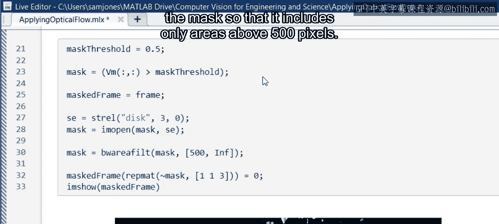
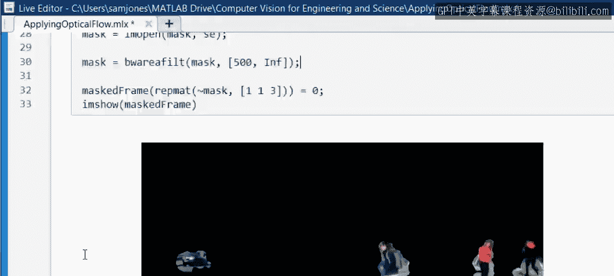
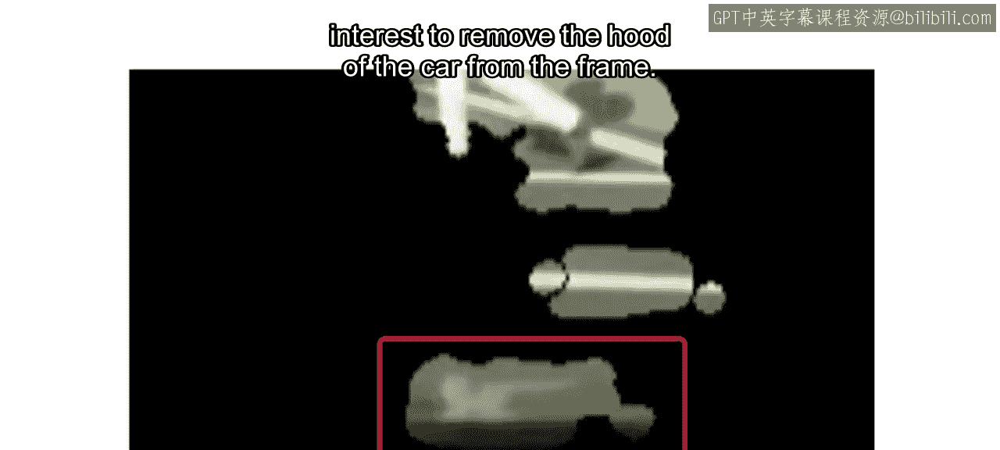


---


## 应用于整个视频

现在，就像对象检测一样，将整个工作流程应用到整个视频中。

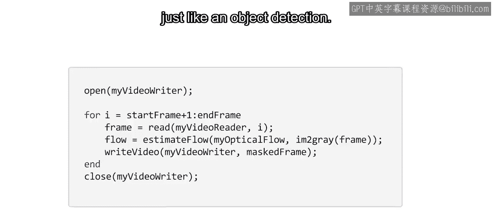


---


## 光流的其他应用与总结

检测运动物体只是光流的应用之一。它是一种强大的技术，在本课程范围之外还有许多复杂的应用。

它也被用于物理应用，包括流体可视化、粒子图像测速和3D测绘。光流经常用于深度学习工作流，如活动分类和图像生成。它还用于在视频帧之间创建中间值，以提高视频质量。

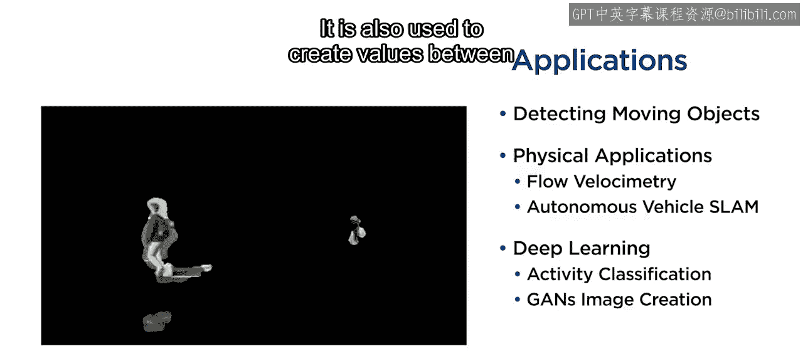


## 总结


本节课中，我们一起学习了光流技术的基本原理及其在运动检测中的应用。我们通过一个具体的Matlab实例，演示了如何使用Farnback方法计算光流，如何通过阈值处理和形态学操作来优化运动分割结果，并最终将运动物体从视频背景中分离出来。光流是计算机视觉中一个基础且强大的工具，为后续更高级的运动分析和理解奠定了基础。