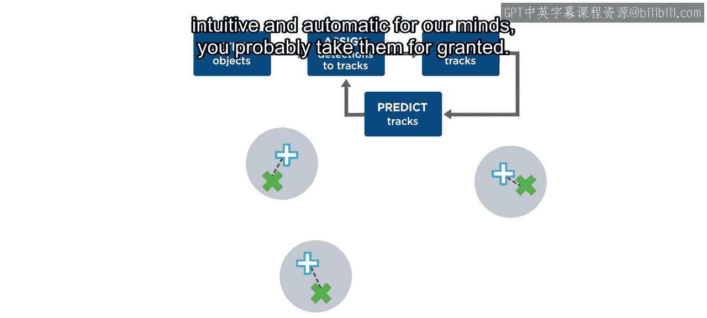
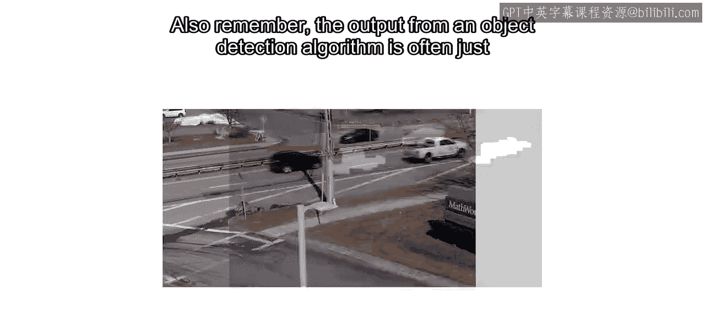
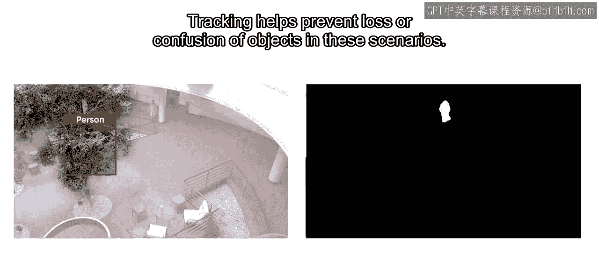
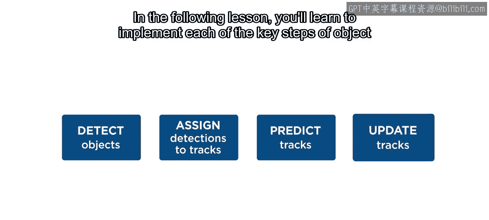
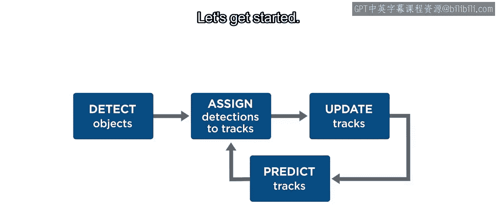

# 工程与科学计算机视觉：33：物体跟踪简介 🎯

在本节课中，我们将要学习物体跟踪的基本概念。物体跟踪是自动驾驶系统工程、科学研究以及无数其他应用中的一个核心部分。我们将了解其核心步骤、重要性以及为何它超越了简单的物体检测。

## 概述

上一节我们介绍了物体检测，它能够识别单帧图像中的物体。然而，要理解物体在连续时间中的运动，我们需要物体跟踪技术。本节中，我们来看看物体跟踪的基本流程和核心价值。

物体跟踪涉及在一个循环中重复三个主要步骤。考虑一个包含多个移动物体的卡通示例。对于视频的每一帧，除了进行物体检测，跟踪循环还包括预测、匹配（或分配）和更新。

## 核心跟踪循环

以下是构成物体跟踪的三个核心步骤。

### 1. 预测

第一步是使用现有的检测结果、估计值和运动模型，为所有当前正在跟踪的物体（通常称为“轨迹”）预测一个新的位置估计。

在这个例子中，我们假设两个物体继续以大致恒定的速度移动。预测步骤可以用一个简单的运动模型公式表示，例如恒定速度模型：

**位置预测公式：**
`x_predicted = x_current + velocity * delta_t`

### 2. 匹配/分配

下一步是利用轨迹的位置预测和所有新的物体检测结果，将检测结果匹配或分配给现有的轨迹，并确定哪些检测未被分配。

这里，根据每个检测结果与各轨迹预测位置的相对距离，有两个检测被分别分配给了轨迹1和轨迹2。另一个检测则未被分配，因为它离任何预测的轨迹位置都很远。这个过程通常涉及计算代价矩阵并使用算法（如匈牙利算法）进行最优分配。

### 3. 更新

第三步是利用匹配结果来更新现有轨迹的估计，并为新出现的物体初始化新轨迹，或为丢失的物体移除旧轨迹。

更新步骤会修正预测的位置，使其更接近实际匹配到的检测位置。之后，整个过程就准备好再次重复。

## 为什么需要跟踪？

所有这些步骤可能看起来复杂，但物体跟踪的核心过程对我们的大脑来说是如此直观和自动，以至于你可能认为它是理所当然的。

考虑在繁忙的城市街道上导航。你会周期性地观察或检测到移动的汽车和行人。但基于你对这些事物的理解，你也会对即将发生的事情进行预测。如果你短暂移开视线，当你再看回来时，你期望看到同样的汽车平稳地向前行驶，只是比之前更远了一点。

同样，当一个移动的行人被遮挡时，你会根据他之前的速度预测他将在一个新位置再次出现。

你可能会想，是的，我会这么做。但这对于计算机视觉为什么如此重要？我们真的只需要检测就够了吗？

实际上，即使是最完美的检测，也只代表了物体在某一时刻的状态。计算机需要跟踪来连接不同帧的检测结果，从而识别出同一个物体。此外，请记住，物体检测算法的输出通常只是边界框或标记像素区域的质心。在实践中，这个输出常常是有噪声的。

跟踪有助于平滑检测噪声的影响。并且如你所知，物体在某些帧中可能被遮挡，导致检测丢失。跟踪有助于在这些场景中防止物体的丢失或混淆。

## 总结与展望

本节课中，我们一起学习了物体跟踪的基本原理。我们了解到，跟踪是一个包含**预测**、**匹配**和**更新**三个步骤的循环过程。它对于连接跨帧的检测、平滑数据噪声以及处理物体遮挡至关重要，是构建鲁棒视觉系统的关键。

在接下来的课程中，你将学习如何实现物体跟踪的每一个关键步骤，并将它们组合成一个完整的处理循环。让我们开始吧。