# 工程与科学计算机视觉：34：实现物体跟踪 - 1. 概念 🎯

在本节课中，我们将要学习物体跟踪的核心概念。物体跟踪是一个在视频序列中持续定位和识别特定对象的过程。我们将详细介绍其工作原理，包括预测、匹配、更新等关键步骤，并解释其中涉及的核心组件，如卡尔曼滤波器。

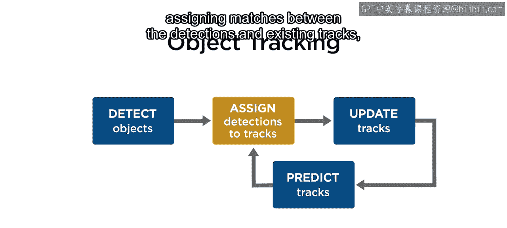

物体跟踪通过一个递归循环实现。假设你已经在给定的视频帧中检测到了物体。

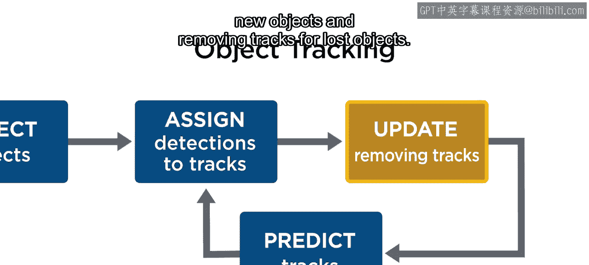

跟踪过程涉及预测已知物体（称为轨迹）的位置，将检测结果与现有轨迹进行匹配，更新现有轨迹的估计，为新物体初始化轨迹，以及移除丢失物体的轨迹。

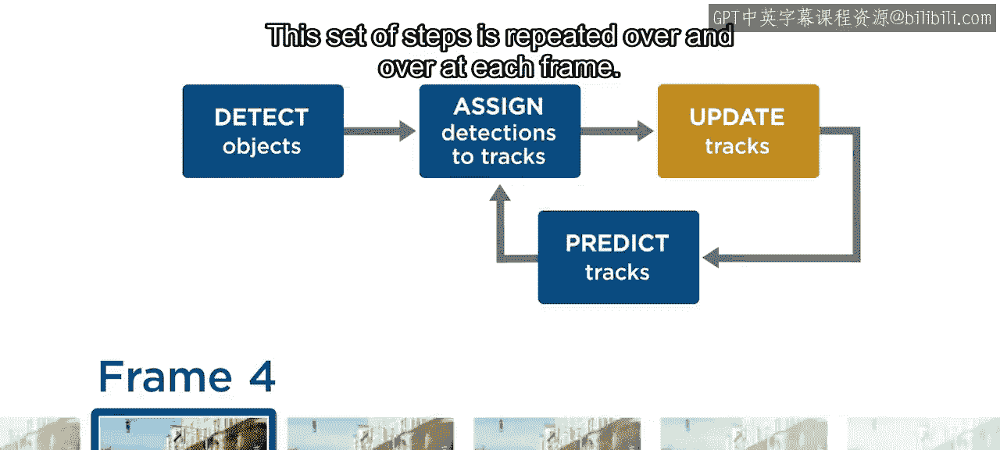

这一系列步骤在每一帧中不断重复。

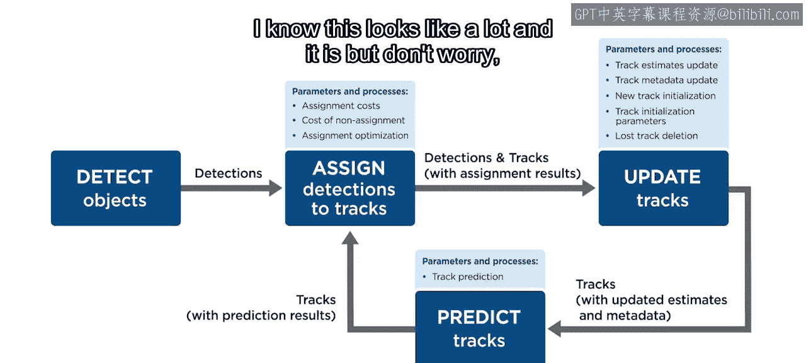

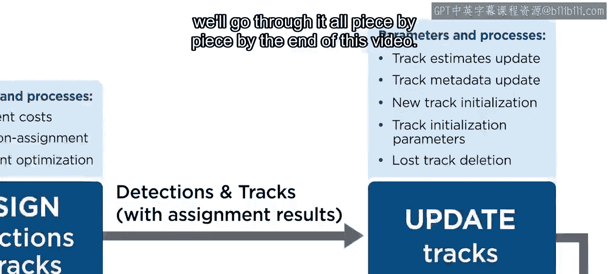

在本视频中，我们将更详细地介绍每个主要模块，你将学习构建一个正常运行的物体跟踪循环所需的各个组件和处理步骤。

我知道这看起来内容很多，事实也确实如此，但别担心，我们会逐一分解讲解。

在本视频结束时，你会发现虽然有很多部分，但每个部分的工作都相对直观。在每一帧中，你需要两个主要的东西：检测结果集合和轨迹集合。它们是跟踪过程的核心变量。

每个检测结果将包含诸如边界框、质心等关于物体出现位置的信息。它还可以包含其他数据，如物体大小或与每个检测相关的元数据。

每个轨迹包含了你想要了解的关于特定物体随时间变化的所有信息。每个轨迹需要相当多的额外信息，例如标识符、物体被检测到的帧数累计，以及其他信息。当我们讲到更新过程的细节时，会再回到这一点。

每个轨迹真正的核心是**估计器**。你使用估计器来预测轨迹的位置，并将其与新检测结果进行比较。如果一个轨迹被分配了一个检测结果，则在做出新预测之前，会使用检测信息来更新估计器。

请记住，在每一新帧中，你需要预测物体的运动，以知道它们预期会在哪里。你使用这些预测来确定哪些检测结果（如果有的话）应该分配给每个轨迹。

但预测几乎从不完美，检测结果也常常带有噪声，甚至在某些帧中缺失。你使用分配结果来更新估计的轨迹位置（如果分配了检测结果），或者如果该帧没有检测到该轨迹，则直接使用预测值。

在本课程中，你将使用一个常见的滤波器作为每个轨迹的估计器。

**卡尔曼滤波器**是一个强大且广泛使用的工具，用于估计动态系统中未知和/或带有噪声的变量的真实值。虽然其细节超出了本课程的范围，但每个轨迹中的卡尔曼滤波器会使用假定的运动方程在每一帧生成位置预测。

然后，每个被检测到的轨迹中的卡尔曼滤波器会利用关于测量噪声、运动模型不确定性以及递归更新的内部估计误差的假设，将预测和检测结果结合成一个更新后的轨迹位置。

新的轨迹位置会根据卡尔曼滤波器对预测和检测各自不确定性的假设程度，向预测或检测结果偏移。你将在初始化新轨迹时，为这些不确定性或噪声水平以及要使用的运动预测模型类型设置参数。

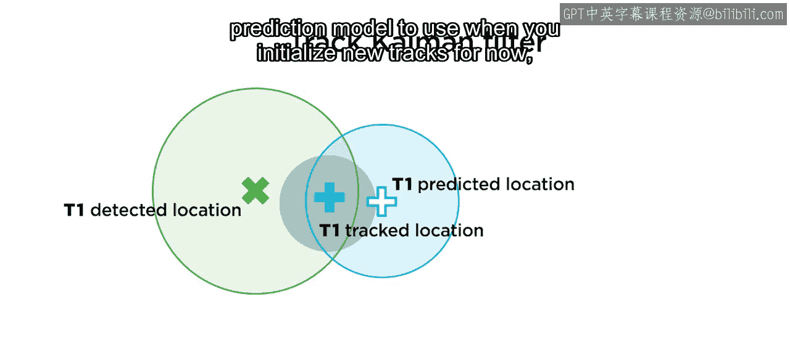

现在，让我们回到整体流程。我们已经介绍了检测结果集合、轨迹集合、预测模块以及更新模块中最关键的部分。接下来，我们看看如何使用预测来将传入的检测结果分配给轨迹。

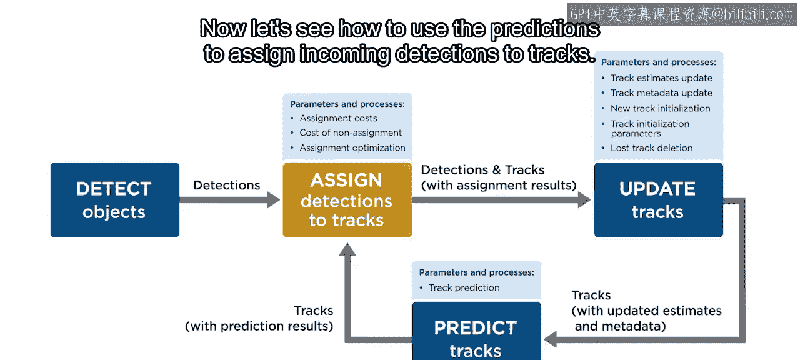

分配过程接收每一帧中的所有检测结果集合和所有现有轨迹集合，并确定哪些配对进行分配。

请注意，可能存在未分配的检测结果（例如当新物体出现时，或存在错误检测时），也可能存在未分配的轨迹（例如被遮挡的轨迹，或检测器未能找到的轨迹）。

在每一帧，你需要评估现有轨迹与可变的新检测结果集合之间多种可能的分配组合，并确定最佳的一个。

这是通过计算每个可能分配的**成本值**，以及**不分配的成本**（即让一个轨迹或检测结果保持未分配状态）来实现的。分配成本应基于接近程度，但也可以纳入其他信息，如大小、形状甚至颜色。

在本课程中，我们将使用从轨迹卡尔曼滤波器获得的每个预测到每个检测的距离度量来分配成本，因此你无需自己计算分配成本值。

一旦你有了所有成本，你需要在所有可能的分配和不分配组合中**最小化总成本**。别担心，这个优化问题由 MATLAB 中的一个函数为你解决。

在这里，通过将检测2分配给轨迹1，检测3分配给轨迹2，并让检测1和轨迹3都保持未分配，达到了最小总成本。这反映了一种情况：由于距离较远，第三个轨迹更可能被遮挡或丢失，而第一个检测结果更可能代表一个新物体或可能是噪声，而不是检测第三个轨迹的巨大误差。

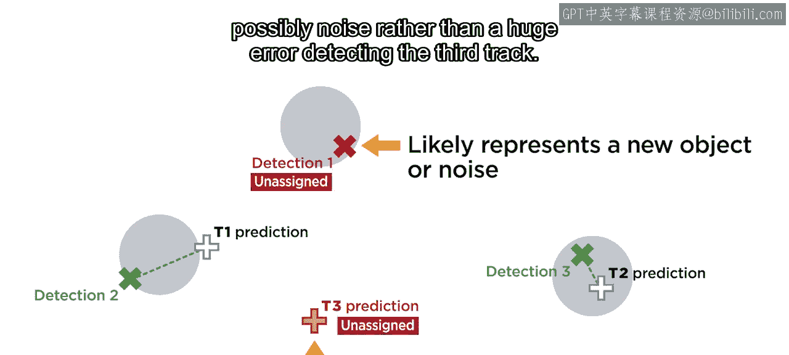

好的，我们快完成了。

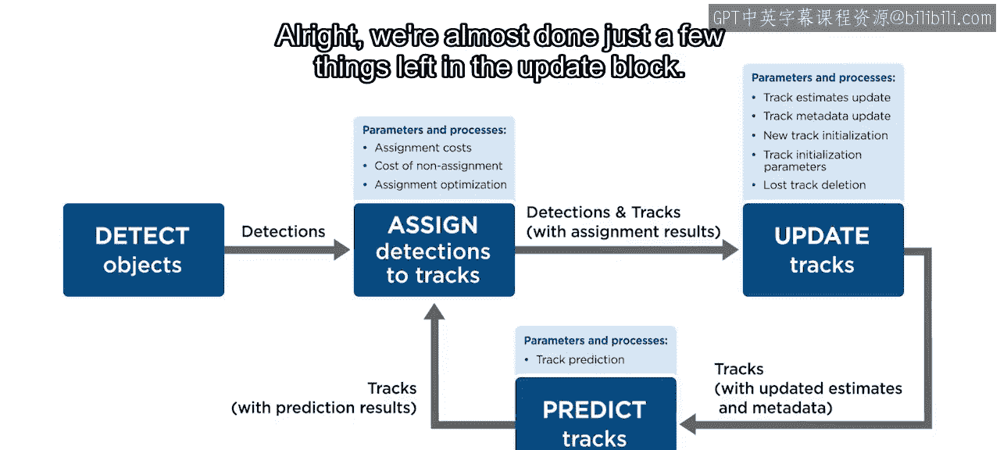

更新模块中只剩下几件事。

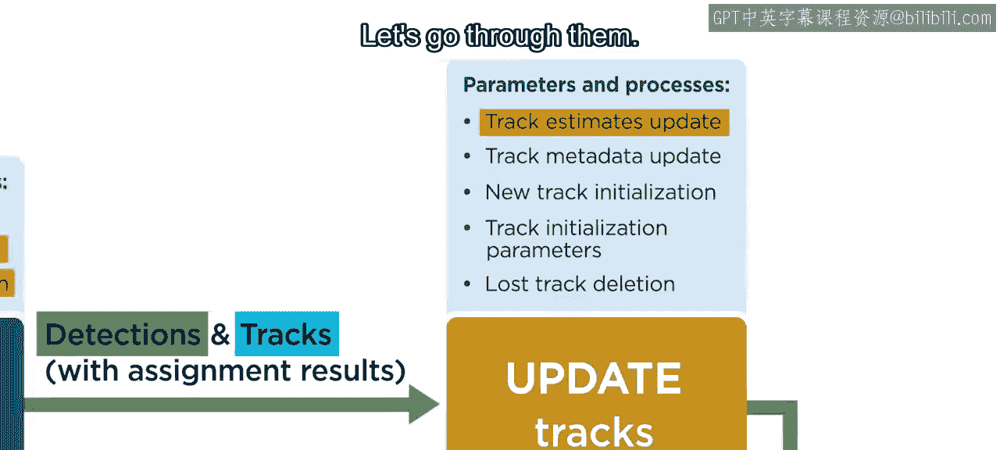

让我们逐一讲解。首先要做的是更新轨迹位置。这在前面已经提到过一些。

*   对于分配了检测结果的轨迹，使用卡尔曼滤波器的更新过程。
*   对于未分配检测结果的轨迹，使用卡尔曼滤波器的预测值。

接下来，还记得我承诺在讲到更新模块时会回头讨论的轨迹元数据吗？现在就是时候了。轨迹元数据几乎可以包含任何你想要的信息。然而，这通常包括诸如唯一标识符、总检测次数、总存在时长、连续丢失次数、确认状态以及当前是否被检测到等信息。

以下是轨迹元数据的关键组成部分：

*   **唯一标识符**：用于跨帧维护和区分不同轨迹。
*   **总检测帧数**：用作阈值，以确定轨迹是否足够可靠，可被视为已确认的轨迹。这有助于处理噪声和零星检测，通过让新轨迹在足够多的帧中被检测到之前保持未确认状态。
*   **连续未检测帧数**：轨迹连续未被检测到的帧数。
*   **总存在帧数**：轨迹已存在的总帧数。
*   **检测帧数**：轨迹被检测到的帧数。

这些信息用于确定何时认为一个轨迹已丢失并将其删除。

接下来，任何未分配的检测结果都被视为潜在的新物体。因此，你为每一个创建一条新轨迹，初始化一个卡尔曼滤波器并设置初始元数据。

由于检测结果可能是错误的，这就是我们刚才提到的确认状态发挥作用的地方。只有在达到一定的检测次数后，你才会确认轨迹。

最后，你将使用关于存在时长、检测帧数和连续丢失帧数的数据，来删除那些似乎不会再出现的轨迹。

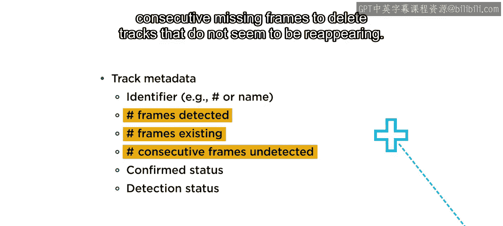

好了，你完成了。这些内容需要消化很多，所以如果现在还不是完全清楚，请不要担心。在本课的其余部分，你将获得大量的逐步练习和参考资料。

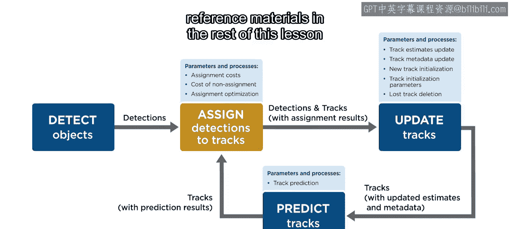

本节课中我们一起学习了物体跟踪的基本概念和循环流程。我们了解到跟踪的核心在于利用检测结果和轨迹集合，通过预测、分配和更新步骤来持续追踪物体。卡尔曼滤波器作为关键的估计器，用于预测和修正轨迹位置。分配过程通过成本最小化来匹配检测与轨迹。此外，轨迹元数据的管理对于确认新轨迹、维护现有轨迹以及删除丢失轨迹至关重要。虽然概念较多，但每个部分都服务于一个直观的目标，共同构成了一个完整的跟踪系统。