# 工程与科学计算机视觉：35：实现物体跟踪（执行篇）🚀

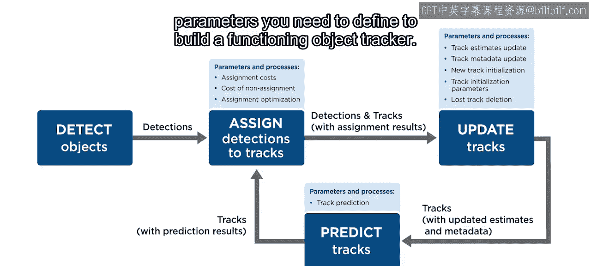

在本节课中，我们将学习如何在MATLAB中实现一个完整的物体跟踪算法。我们将通过一个跟踪细胞的实例，详细讲解预测、分配和更新这三个核心步骤的具体代码实现。课程提供了完整的代码和视频供你实验，并可作为模板应用于其他跟踪场景。

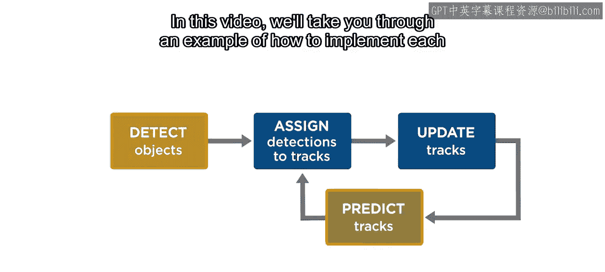

构建一个可运行的物体跟踪器需要定义许多流程和参数。

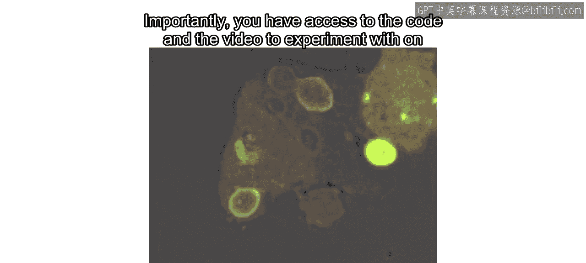

在本视频中，我们将通过一个示例，引导你在MATLAB中逐步实现这些步骤。

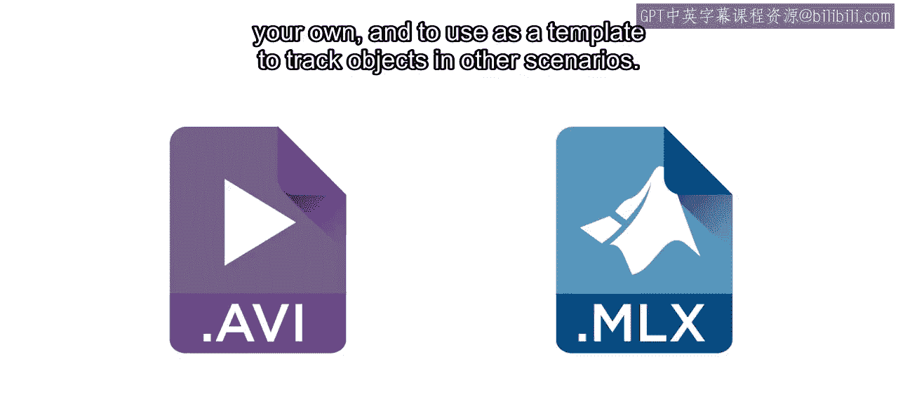

我们将通过跟踪这些细胞来测试整个算法。

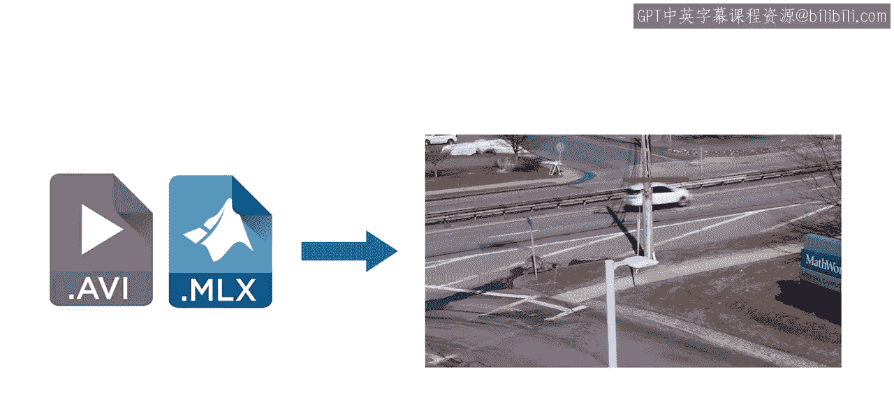

重要的是，你可以访问相关的代码和视频进行自主实验。

并以此作为模板，在其他场景中跟踪物体。

## 整体流程概述

你在一个循环中实现整个跟踪过程，该循环遍历视频的每一帧。

你使用独立的函数来执行物体检测、轨迹预测、检测到轨迹的分配以及轨迹更新。当然，你还需要某种方式来保存和显示结果。

我们可以将此作为一个额外的模块添加到流程图中。这种循环结构是模块化的，这使你能够为特定步骤（例如检测）替换新的函数，而保持其余代码不变。或者，你也可以添加额外的函数，例如在每一帧分析结果。

目前，我们将专注于之前介绍过的核心跟踪算法。虽然检测是跟踪的关键部分，但它通常是独立开发的，并且在之前的材料中已有涉及。这里我们将重点介绍预测、分配和更新过程的具体实现细节。

## 初始化与第一帧处理

请注意，轨迹集合在循环开始前被初始化为一个空表。这是为了让循环在尚无任何轨迹时也能运行。

让我们看看在第一帧检测到物体时会发生什么。

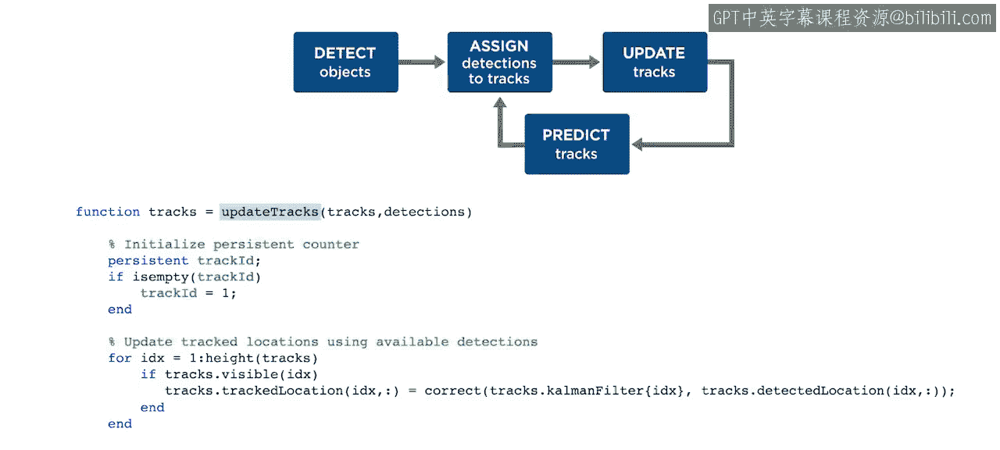

此时还没有轨迹可供预测，因此在预测函数中不会发生任何操作。

同样，由于没有轨迹可供分配检测，所有检测都会作为“未分配”通过分配函数。

为未分配的检测初始化新轨迹发生在更新函数中。因此，让我们首先检查这个函数。

在这个函数中，我们首先定义一个计数器变量作为轨迹标识符。我们使用一个持久变量，以便在多次更新中累积已创建轨迹的数量。

由于这是第一次运行且轨迹表为空，更新轨迹位置、更新轨迹元数据和删除丢失轨迹的代码在此次迭代中都会被跳过。别担心，我们将在后续的帧迭代中回到这些部分。

现在，在这里，你为未分配的检测分配新的轨迹。对于每个未分配的检测，使用 `configureKalmanFilter` 函数初始化一个卡尔曼滤波器。此函数需要为给定的跟踪场景设置一组参数。

这里，我们使用检测到的质心定义初始位置，将滤波器类型设置为假设恒定速度，并选择初始误差、运动噪声和测量噪声的估计值。虽然这些参数值很大程度上需要通过试错来确定，但请记住，运动噪声和测量噪声的相对大小会影响你的滤波器是更信任其内部模型还是更信任检测结果。

之后，你初始化轨迹数据：为检测到的、跟踪的和预测的位置创建变量，并将它们全部初始化为第一个检测到的位置。然后创建一个轨迹年龄变量并设为1，一个检测帧数计数器设为1，一个连续未检测帧数计数器设为0，一个检测标志设为 `true`，以及一个确认状态设为 `false`。使用所有这些变量创建一个单行表格作为新的轨迹条目，并将其添加到轨迹表中，最后递增轨迹ID。

## 后续帧的处理

好的，让我们回到整体流程，假设我们处于下一个视频帧，并且有了一组新的检测结果。

现在，在此次迭代中，预测函数将对先前初始化的轨迹进行预测。让我们看看如何实现。

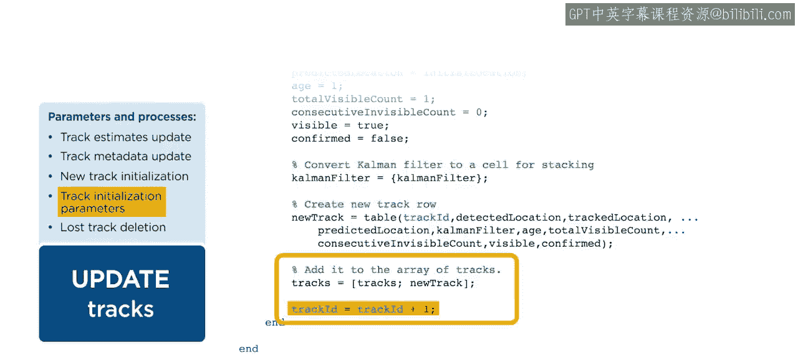

此函数接收轨迹集，并为每个轨迹预测一个位置，然后输出更新后的轨迹。在MATLAB中，这只需要几行代码：只需循环遍历轨迹表，并对每个轨迹中的卡尔曼滤波器使用 `predict` 函数以获得新的预测位置。

循环中的下一个函数是检测到轨迹的分配。

此函数接收检测集和轨迹集，并用分配信息更新两者。你在这里做的第一件事是通过循环遍历轨迹表，并使用卡尔曼滤波器的 `distance` 函数（以每个检测位置作为输入）来计算每个可能分配的成本。

接下来，你设置一个“未分配成本”。与卡尔曼滤波器参数类似，在处理新视频时，这可能需要进行一些试错。只需记住，这个成本越小，你就越有可能让轨迹和检测保持未分配状态。

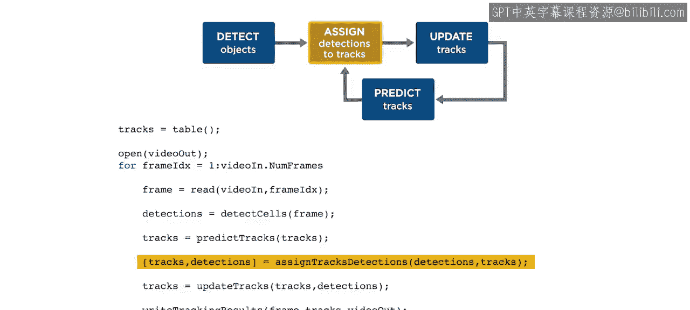

然后，你使用MATLAB自带的 `assignDetectionsToTracks` 函数来解决分配优化问题。分配的输出指定了每一行中相互分配的轨迹和检测的索引对。

在此函数的其余部分，使用分配索引对的第一列，将未检测到轨迹的检测状态设为 `false`，将检测到轨迹的检测状态设为 `true`。然后使用分配索引对的列，将检测到的质心位置添加到每个已分配的轨迹。最后，使用分配索引对的第二列，将未分配检测的分配状态设为 `false`，将已分配检测的分配状态设为 `true`。

现在，这次当我们到达更新模块时，我们同时拥有检测和轨迹。

因此，让我们再看一下那个函数。你已经看到了轨迹ID计数器的创建。不过这次，轨迹表不是空的。所以，对于当前检测到的每个轨迹，你使用 `correct` 函数（以卡尔曼滤波器和检测位置作为输入）来更新轨迹位置。

请注意，这并非简单地用检测位置替换轨迹位置。它使用预测、检测和不确定性估计来创建一个新的轨迹位置。

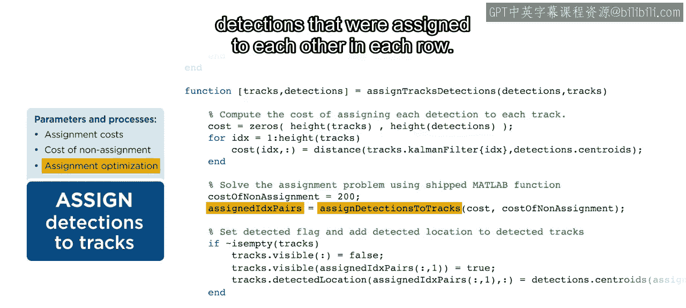

对于此帧中未检测到的任何轨迹，你将轨迹位置更新为等于预测位置。

接下来，你更新轨迹元数据。首先为所有轨迹增加年龄。

然后为所有当前检测到的轨迹增加总检测帧数。

接着使用总检测计数来确认已达到阈值的轨迹。这有助于过滤掉由错误检测产生的零星轨迹。

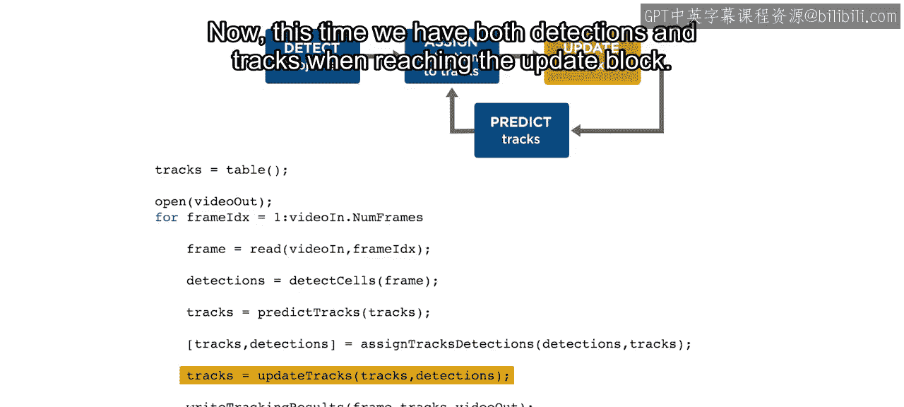

对于所有检测到的轨迹，将连续未检测计数重置为0。对于未检测到的轨迹，将此计数加1。

接下来，你删除不可靠或丢失的轨迹。

首先，计算可见性，即每个轨迹在其生命周期内被检测到的比例。

然后，为年龄、低可见性以及一个轨迹在被视为丢失前可以连续未检测到的帧数设置阈值。

使用这些阈值，在轨迹表中找到那些轨迹年龄、可见性和连续未检测帧数不符合你设定的阈值的索引，并组合这些索引以删除那些既太新又可见性低、或者被视为丢失的轨迹。

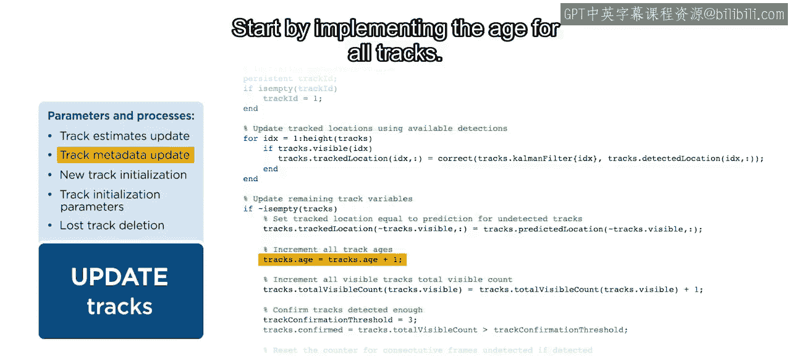

之后，像之前看到的那样，为每个未分配的检测初始化一个新轨迹。

就是这样。

## 结果显示

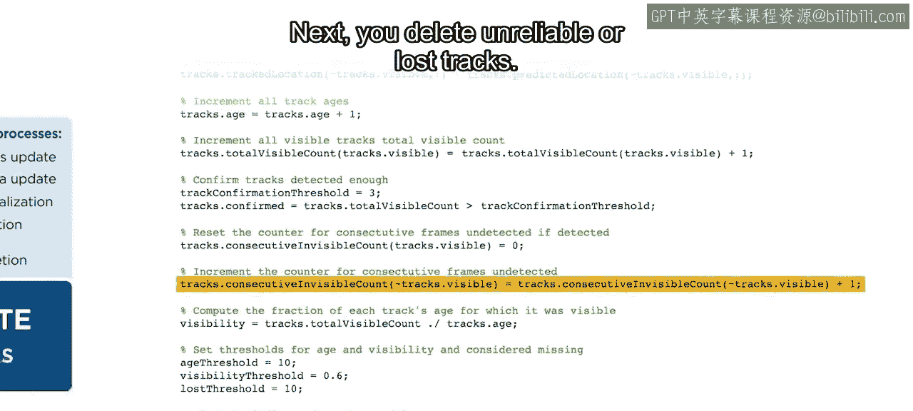

你已经了解了物体跟踪循环两次迭代中预测、分配和更新过程的细节。现在，你当然想看到结果。所以让我们快速看一下在这个例子中我们将如何显示结果。

我们首先使用确认状态变量从整个表中提取已确认的轨迹。

然后我们使用轨迹ID创建标签。我们将标签放置在稍微偏离位置的地方，以便两者都可见。

最后，我们在每个轨迹的位置添加一个加号符号。让我们看看结果。

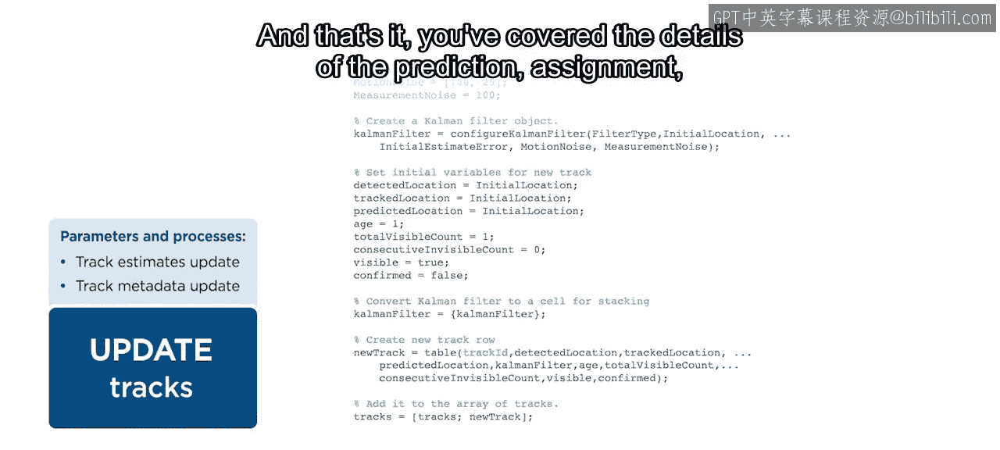

看起来很不错。当第二个酵母细胞变得足够亮时，我们也开始跟踪它。然后当第一个酵母细胞亮度减弱时，我们停止跟踪它，并继续跟踪第二个酵母细胞。

## 动手实践

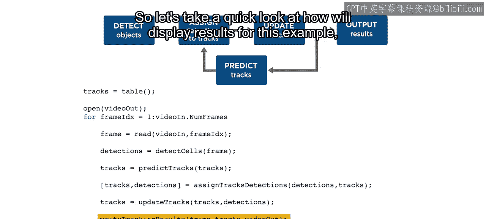

现在轮到你了。

我们为你提供了这里看到的代码，供你入门。

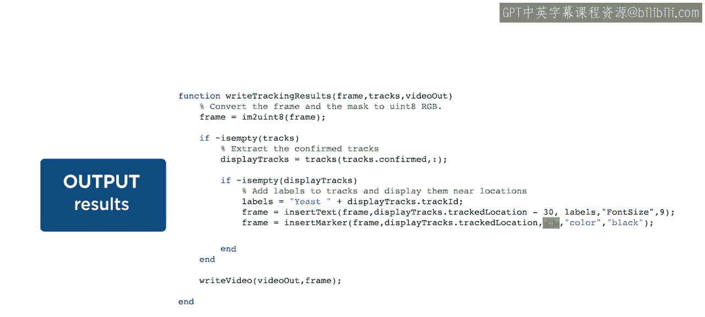

保存一个备份副本，然后自己调整参数，看看它们会产生什么效果。

尝试显示更多信息，例如检测或确认状态。

如果你遇到困难，可以在论坛上寻求帮助。

当你准备好时，前往课程项目——在繁忙的高速公路上跟踪汽车，以应用你的新技能。

## 总结

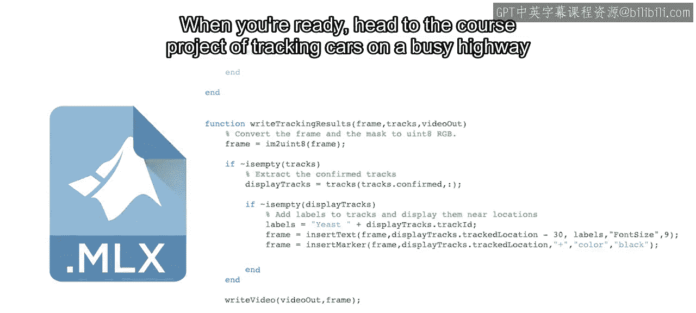

本节课中，我们一起学习了在MATLAB中实现物体跟踪算法的完整流程。我们从初始化轨迹开始，详细讲解了在循环的每一帧中如何执行预测、检测分配和轨迹更新。我们看到了卡尔曼滤波器如何结合预测和测量来估计位置，以及如何通过设置阈值来管理轨迹的生命周期（如确认和删除）。最后，我们了解了如何可视化跟踪结果。通过提供的代码模板，你现在可以调整参数并尝试将其应用于新的跟踪场景。