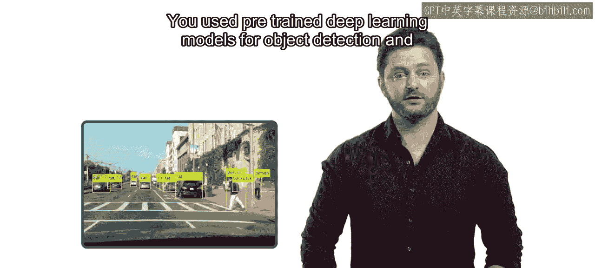
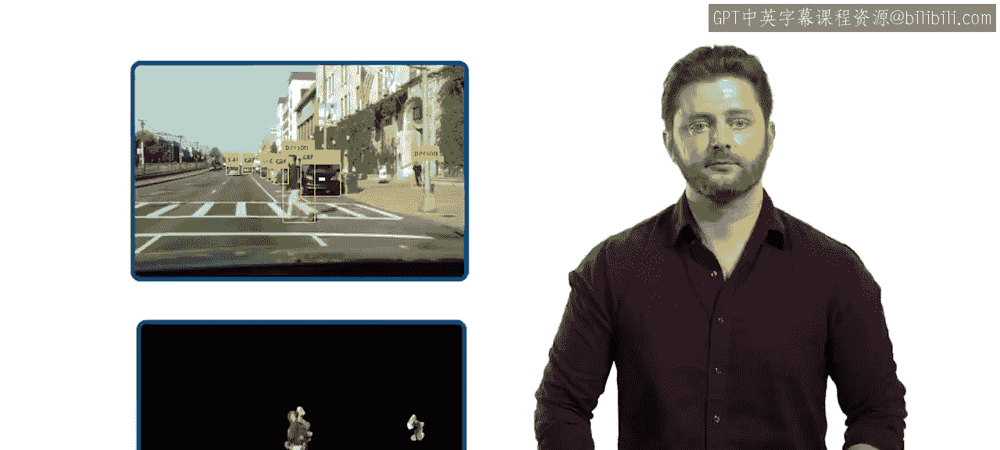
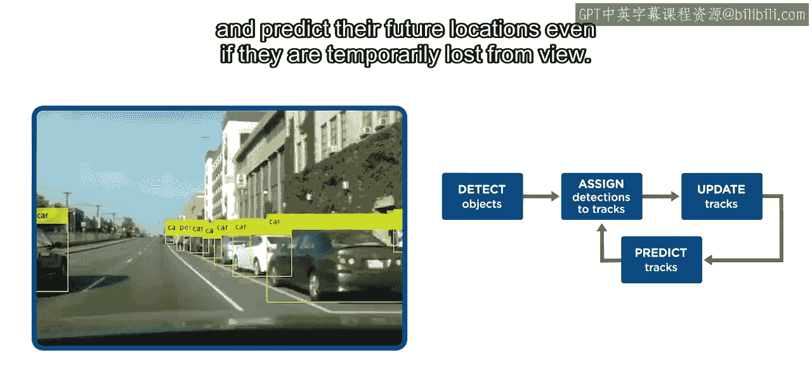
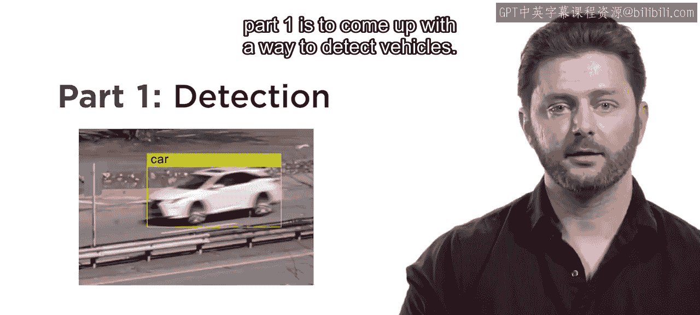
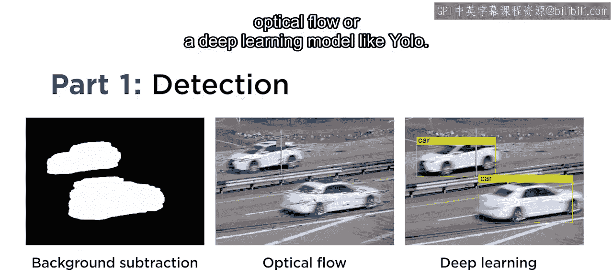
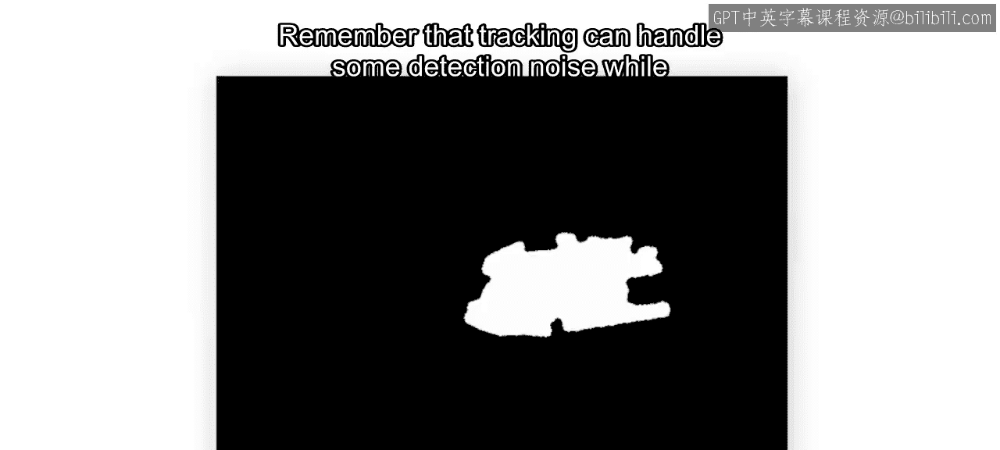
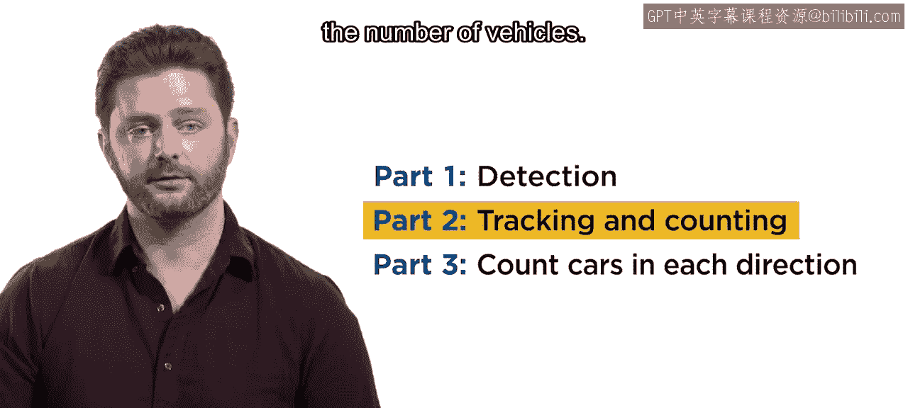
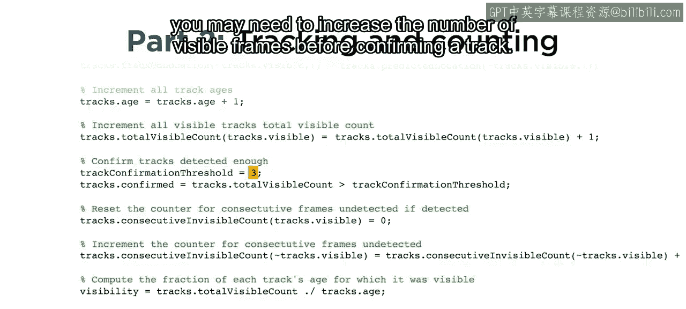
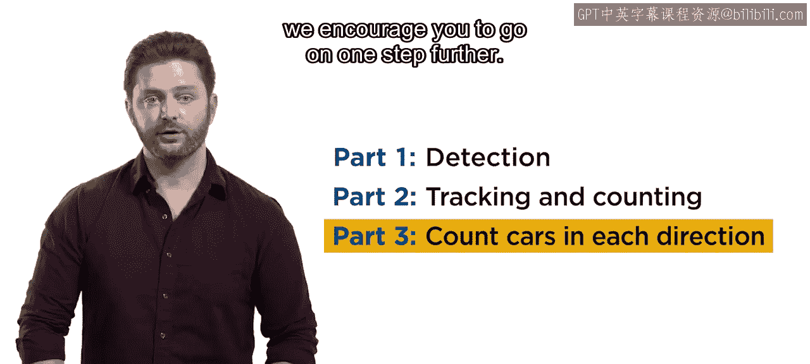

# 工程与科学计算机视觉：36：交通流量项目简介 🚗

在本节课中，我们将应用课程所学的计算机视觉技术，完成一个综合性的交通流量分析项目。该项目将整合目标检测与跟踪技术，旨在统计视频中车辆的数量及其行驶方向。

恭喜您完成本课程的学习。您已经在计算机视觉技能库中增加了多项新技术。

您学会了使用预训练的深度学习模型进行目标检测。

并且应用光流法来检测运动物体。

在自动驾驶系统等许多应用中，检测仅仅是跟踪工作流的一部分。但现在，您已经能够应用跟踪技术来跨帧识别单个物体，并预测它们未来的位置，即使它们暂时从视野中消失。

现在，是时候将您的新技能应用到一个最终项目中了。

如果您完成了我们的图像处理专项课程，您曾在类似的视频中检测过车辆。这一次，您需要加入跟踪功能，以统计每辆车及其行驶方向。

这个项目有多种可能的解决方案。我们鼓励您尝试多种不同的方法。

为了提供帮助，我们将项目分解为三个部分。

## 第一部分：车辆检测

第一部分是设计一种检测车辆的方法。

以下是一些思路：
*   使用背景减除法。
*   使用光流法。
*   使用如 **YOLO** 这样的深度学习模型。

您不需要检测结果完美无缺。请记住，跟踪算法可以处理一定的检测噪声。

在完成检测任务时，请考虑您的方法是否能在不同的天气条件或一天中的不同时间下工作。同时也要考虑所需的处理能力。YOLO 是一个强大的模型，但处理整个视频需要大量时间。这些都是在您自己的项目中需要考虑的重要因素。

## 第二部分：车辆跟踪与计数

上一节我们探讨了车辆检测，本节中我们来看看如何实现跟踪与计数。下一个任务是实现一个跟踪算法，以成功统计车辆的数量。

为了成功跟踪每辆车，您需要探索和调整几个关键参数。例如，如果您的检测算法不够精确，您可能需要增加确认一条轨迹所需的最小连续可见帧数。

在完成第一部分和第二部分后，您已经达到了通过本项目的要求。但我们鼓励您更进一步。

## 第三部分：方向计数

第三部分是统计每个方向行驶的车辆数量。

为此，您需要添加额外的代码来确定每条已确认轨迹的方向。您可以使用卡尔曼滤波器的状态属性来实现，或者，如果您使用光流法，可以利用检测到物体的光流向量。无论采用哪种方法，您都需要在代码中添加一些额外的记录逻辑。

## 总结

本节课中我们一起学习了如何规划并实施一个完整的交通流量分析项目。通过完成这个最终项目，您将拥有一个展示您新技能的真实案例。祝您好运！

