# 工程与科学计算机视觉：37：集成代码 🚀


在本节课中，我们将学习在算法开发完成后，如何将其部署到实际应用中的三种主要方法。我们将了解MATLAB如何提供工具，帮助您将代码集成到云端、特定设备或其他编程环境中。

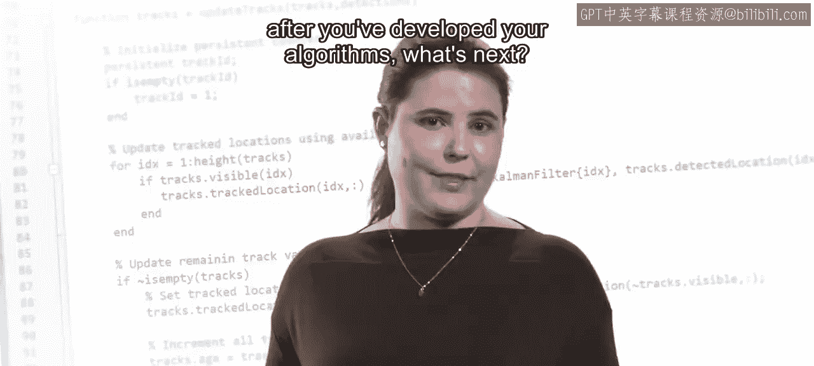

---

在上一节中，我们探讨了计算机视觉算法的开发。本节中，我们来看看如何将开发完成的代码投入实际使用。这个过程通常被称为**部署**或**集成**。


您可能想知道，在算法开发完成后，下一步该做什么。

也许您希望将代码运行在云端，或是在智能手机等特定设备上。

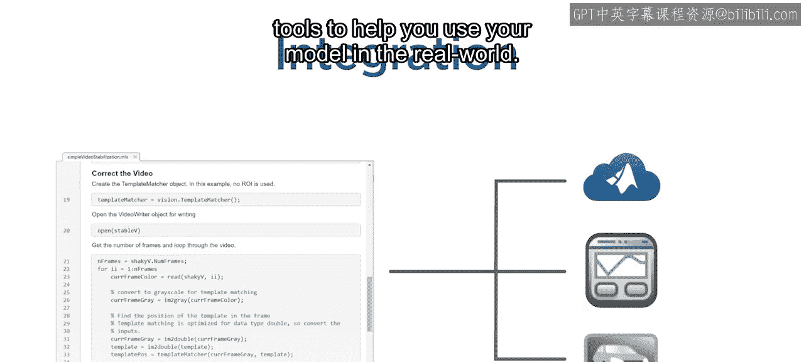

将代码投入生产环境的过程就叫做部署或集成。

在本视频中，您将学习三种部署代码的选项。针对每种工作流程，您将看到MATLAB如何提供工具来帮助您在现实世界中使用您的模型。

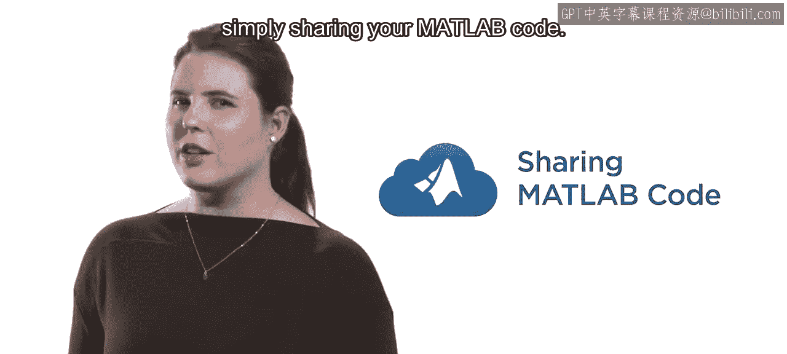

---

## 选项一：共享MATLAB代码 🤝

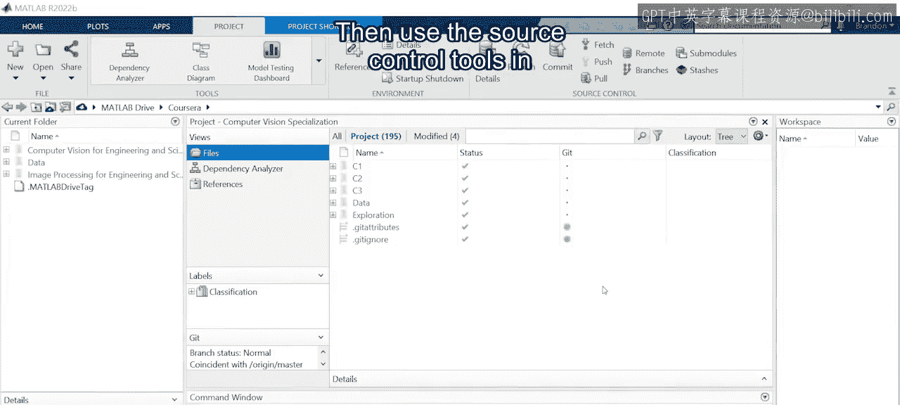

如果您是一名希望分享成果并与同事协作的研究人员，一个很好的选择是直接共享您的MATLAB代码。

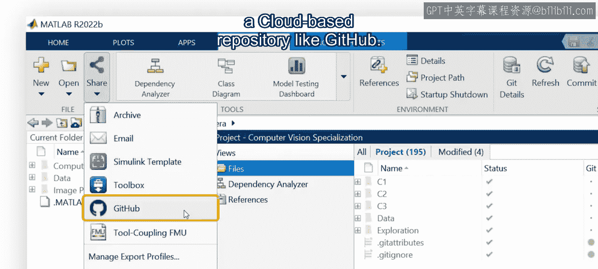

以下是实现此目标的步骤：

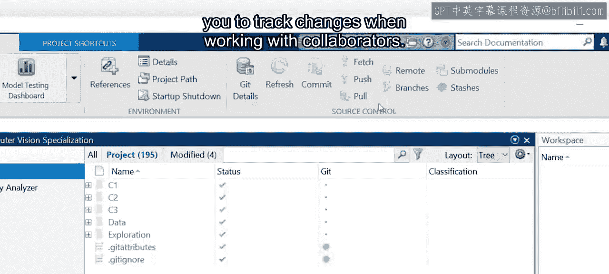

1.  **收集代码文件**：首先，在MATLAB项目中收集您的所有代码文件。
2.  **使用源代码控制**：利用MATLAB内置的源代码控制工具，将您的代码上传到基于云的代码仓库，例如GitHub。
3.  **协作与追踪**：这为他人提供了访问权限，并使您在与协作者合作时能够追踪代码的变更。

如果您需要与使用其他编程语言（如Python）的同事合作，也无需担心。MATLAB提供了与多种语言的灵活双向集成。


例如，您可以在MATLAB内部直接调用Python代码：

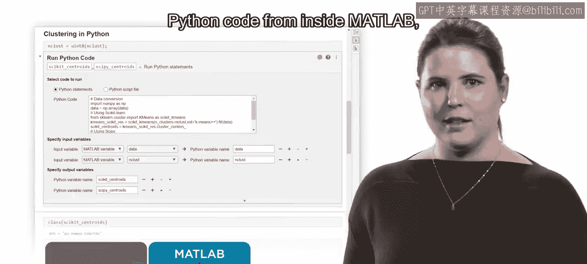

```matlab
% 在MATLAB中调用Python函数
result = py.my_python_module.my_function(arg1, arg2);
```

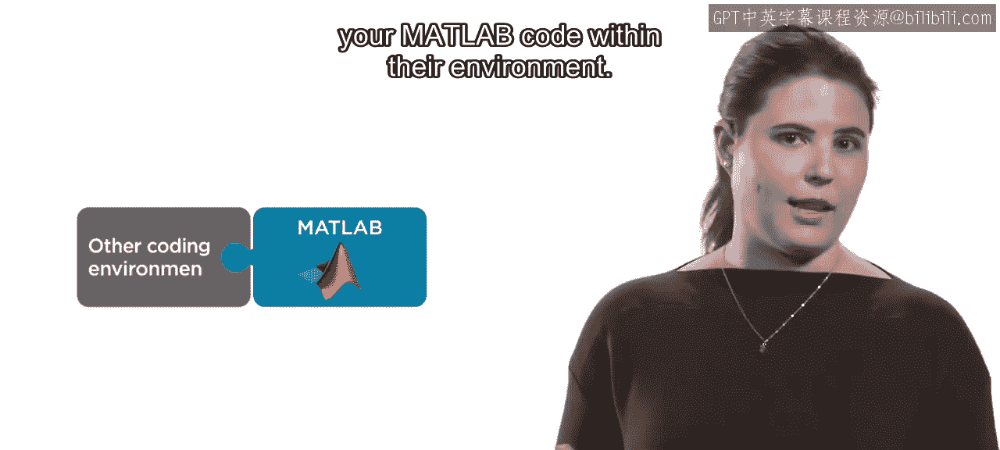

同时，您的同事也可以在其环境中使用**MATLAB Engine API**来调用您的MATLAB代码：

```python
# 在Python中使用MATLAB Engine
import matlab.engine
eng = matlab.engine.start_matlab()
result = eng.my_matlab_function(arg1, arg2)
```

---

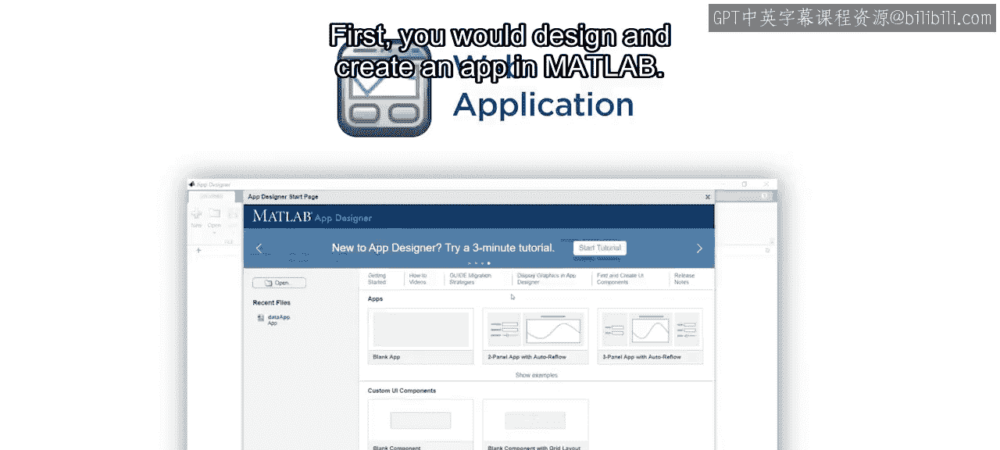

## 选项二：创建Web应用程序 🌐

现在，假设您是一名工程师，需要为组织内的其他成员提供一个易于使用的界面来访问您的算法。一个很好的选择是创建Web应用程序。

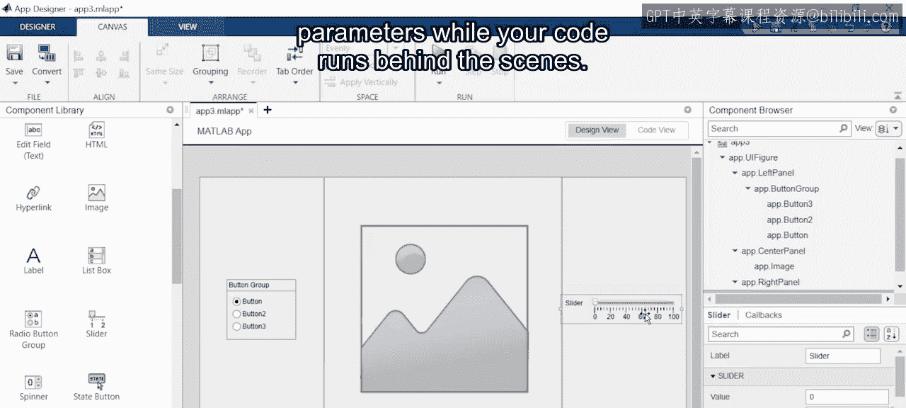

以下是创建Web应用的流程：

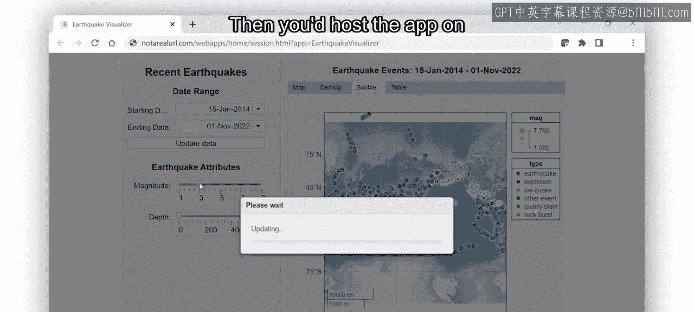

1.  **设计与创建应用**：首先，在MATLAB中设计和创建一个应用程序。您的应用可以包含交互式组件，让他人在您的代码于后台运行时，能够轻松调整参数。
2.  **部署到Web服务器**：然后，将应用部署到Web服务器上。这样，其他人就可以通过他们的浏览器来使用这个应用。

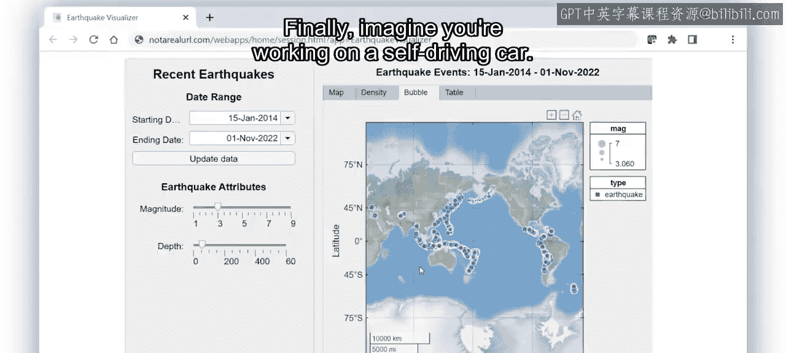

---

## 选项三：部署到嵌入式硬件 🚗

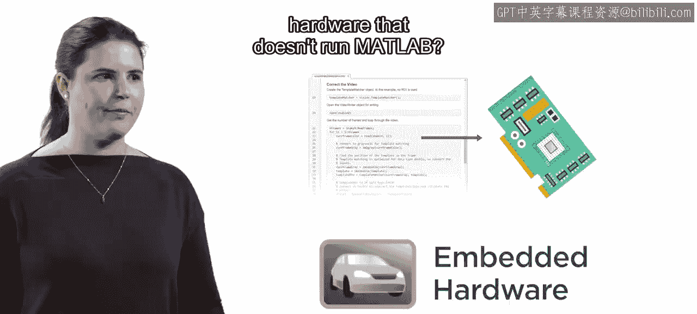

最后，想象一下您正在开发自动驾驶汽车。您需要将MATLAB代码部署到汽车中嵌入的硬件设备上。如何将代码部署到不运行MATLAB的硬件上呢？

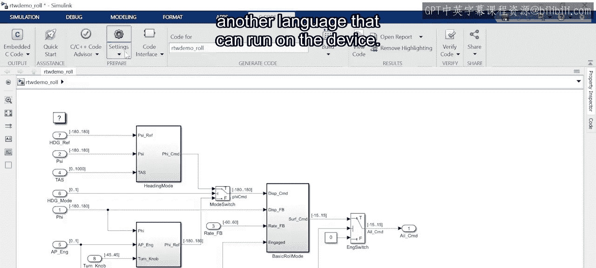

答案是：将您的代码转换为可以在目标设备上运行的另一种语言。

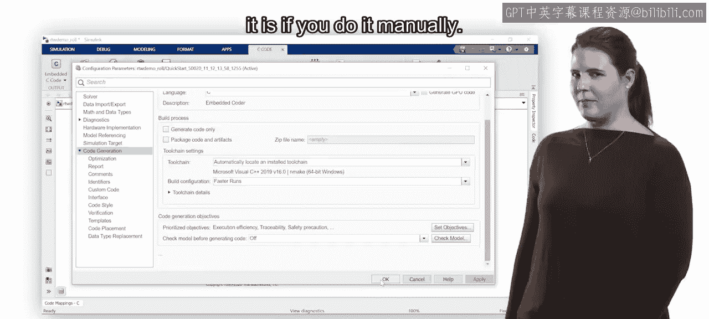

如果这听起来令人生畏且耗时，那么手动操作确实如此。但借助MATLAB，这项任务会变得简单得多。MATLAB可以自动生成如C、C++、HDL（硬件描述语言）等代码，甚至是运行在GPU上的代码。

**代码生成**为工程师节省了大量时间，因为它允许工程师在新的硬件系统上快速进行算法原型设计和测试。

---

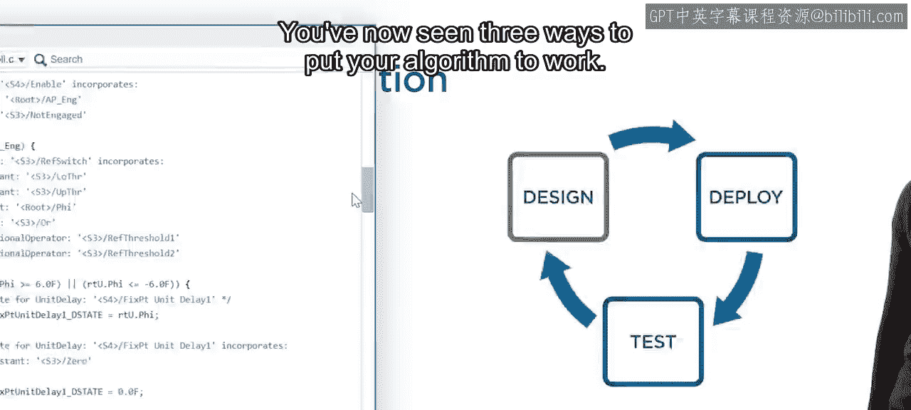

## 总结 📝

本节课中，我们一起学习了将算法投入实际应用的三种主要方式：

1.  **共享MATLAB代码**：通过版本控制工具（如GitHub）进行协作。
2.  **创建Web应用程序**：为组织内部提供易于使用的交互界面。
3.  **部署到嵌入式硬件**：通过自动代码生成技术，将算法转换为C/C++等语言，以在特定硬件上运行。

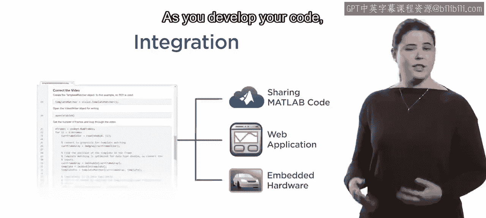


因此，在您开发代码时，请记住MATLAB包含了多种工具，可以帮助您以不同的方式部署您的算法，使其在现实世界中发挥作用。