**工程与科学计算机视觉：总结：课程回顾与技能总结** 🎓

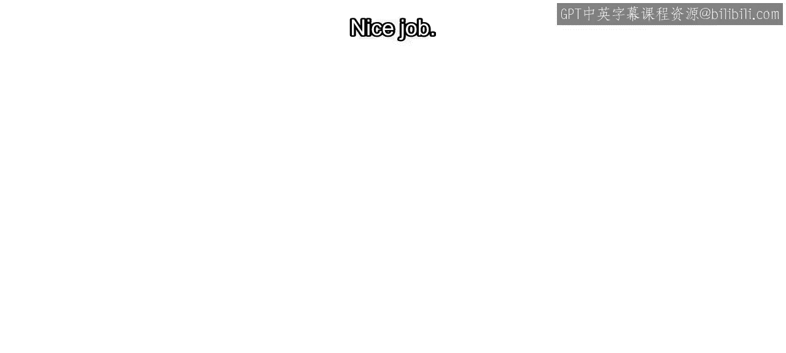

在本课程中，我们系统性地学习了计算机视觉的核心概念与应用技能。从基础的图像特征处理到高级的机器学习模型，我们构建了一套完整的知识体系。现在，让我们回顾一下所学到的关键内容。

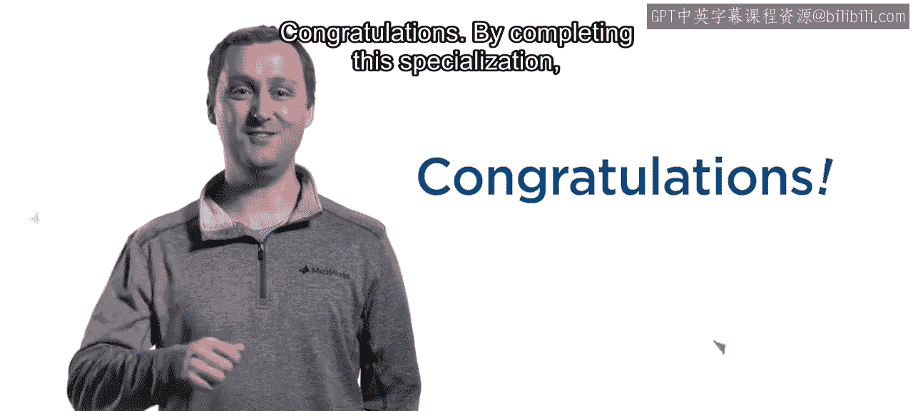

**计算机视觉的重要性与应用领域**

随着图像和视频数据日益重要，掌握计算机视觉技能对许多职业发展至关重要。众多公司正在开发广泛的计算机视觉应用，从驾驶辅助系统到智能手机应用和智能家电。

**核心技能回顾：图像特征与几何变换**

我们首先学习了如何使用一些最广泛应用的算法来检测和提取图像特征。

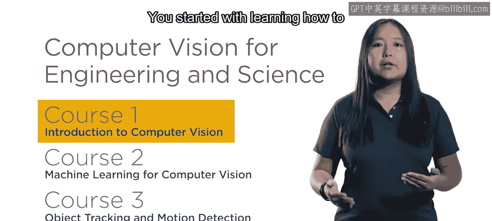

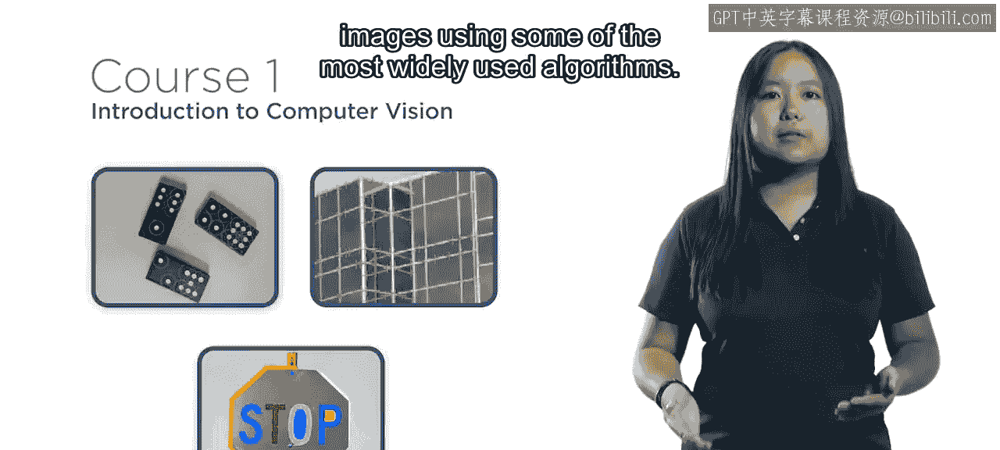

以下是我们在特征处理阶段掌握的关键能力：
*   使用特征来估计几何变换。
*   执行图像配准和拼接。

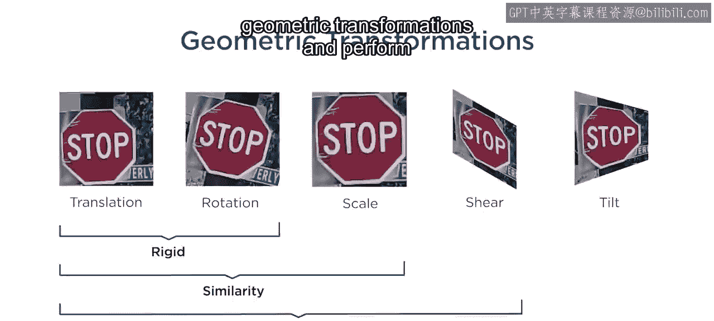

凭借这些技能，我们可以准确地比较和分析在不同时间或从不同视角拍摄的图像。

**核心技能回顾：机器学习模型**

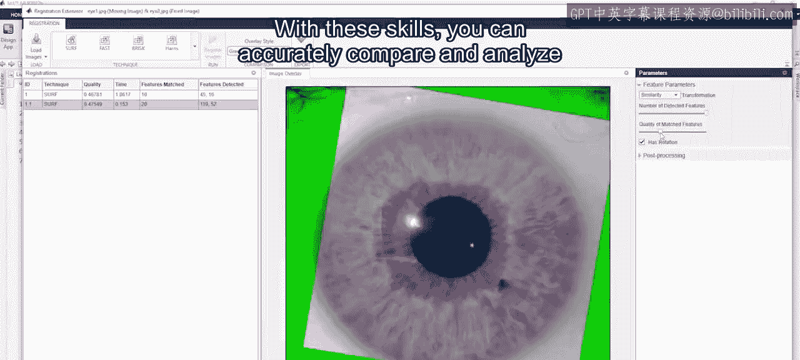

在各行各业，公司都在寻找具有机器学习经验的人才。在课程中，我们训练了图像分类和目标检测模型。

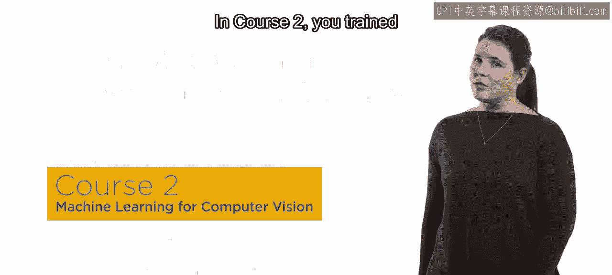

随后，我们使用多种指标评估了这些模型。并且，由于并非所有错误都同等重要，我们调整了**成本矩阵**以反映特定类别的重要性。

更重要的是，我们现在拥有一个可以应用于任何机器学习问题的工作流程。

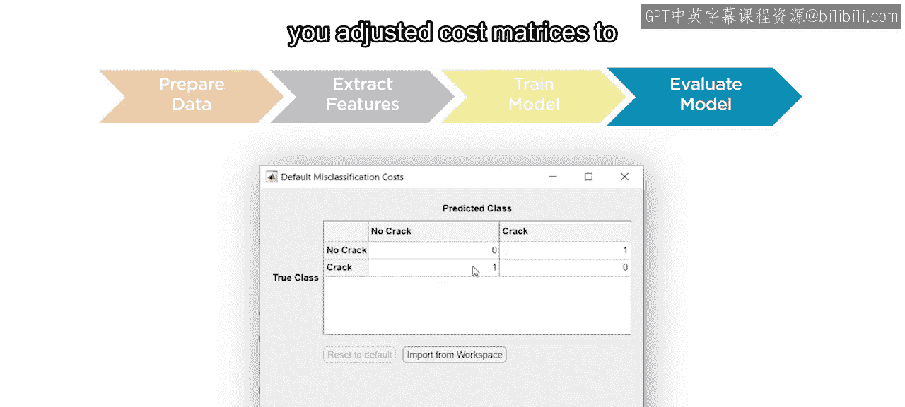

**核心技能回顾：目标检测与追踪**

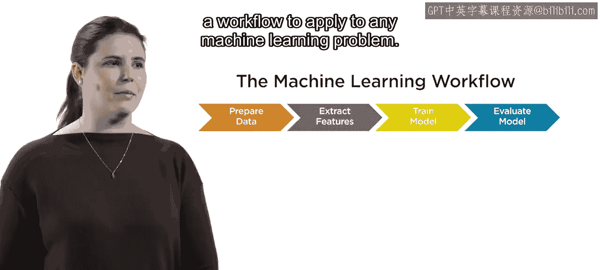

追踪物体和检测运动是困难的任务，但却是从微生物学到自主系统等多种应用所必需的。

为了追踪一个物体，首先必须检测到它。

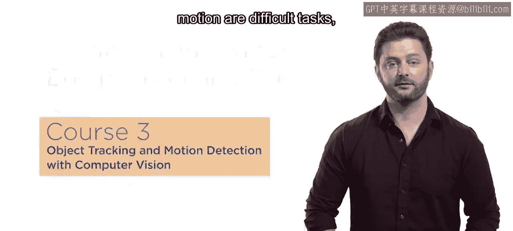

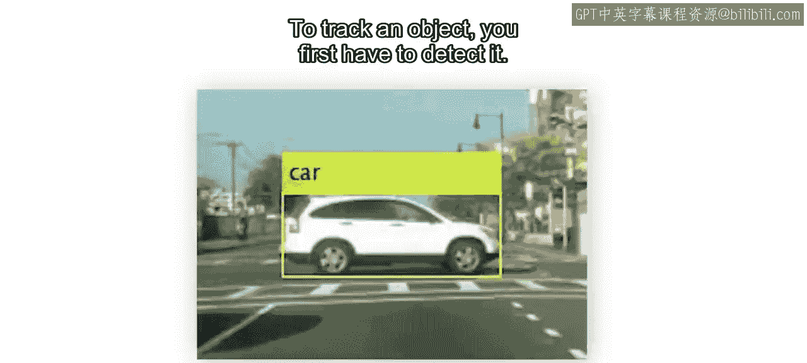

我们现在掌握了多种方法，例如：
*   **图像分割**
*   **光流法**
*   训练自己的目标检测器或使用预训练模型（如 **YOLO**）。

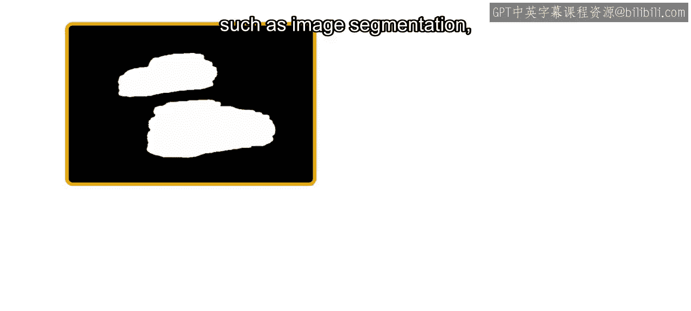

通过结合追踪技术，即使存在检测噪声或物体移出视野，我们也能识别并跟踪单个物体。

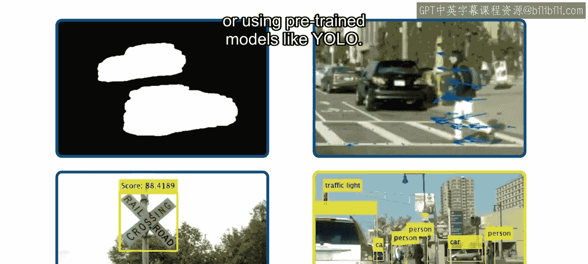

**总结**

通过完成本专项课程，你已经获得了在图像和视频日益重要的世界中取得成功所必需的技能。你现在已经为解决计算机视觉中的挑战性问题做好了更充分的准备。

祝你好运！