# 深度学习在计算机视觉中的应用：1：课程概述

在本节课中，我们将要学习MathWorks在Coursera平台上推出的《深度学习在计算机视觉中的应用》系列课程的核心内容。该系列课程共分为三门，旨在帮助工程师和科学家掌握如何利用深度学习技术处理图像与视频数据，以解决实际问题。

---

工程师和科学家们正运用深度学习技术处理图像与视频数据，以解决多种实际问题。

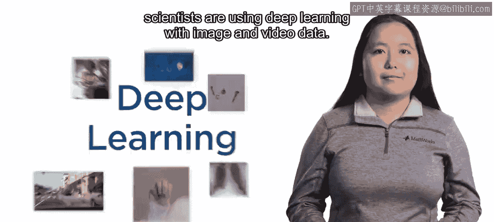

以下是几个典型应用示例：
*   定位车辆与行人
*   发现缺陷产品
*   诊断疾病

---

### 课程一：深度学习基础与图像分类 🏁

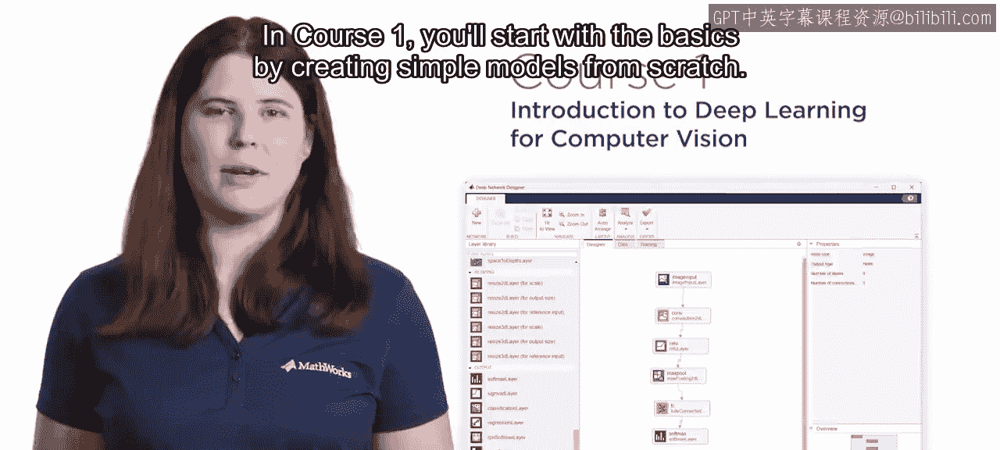

上一段我们看到了深度学习的广泛应用，本节中我们来看看系列课程的第一部分内容。

在课程一中，你将从基础开始，学习如何从零开始创建简单的模型。

随后，你将学习迁移学习技术。该技术允许你利用专家创建的预训练模型，通过重新训练使其适应新的应用场景。

你还将学习评估模型性能，并通过调整关键参数来优化模型。

最后，你将综合运用以上所有概念，创建一个能够分类美国手语字母图像的模型。

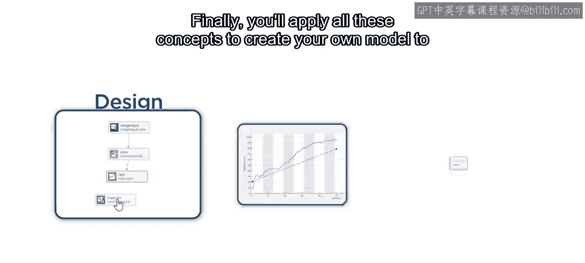

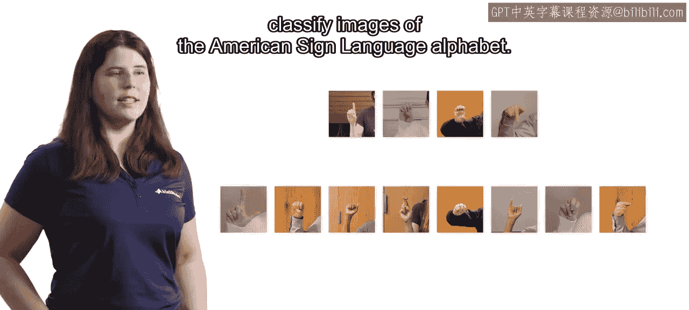

---

### 课程二：目标检测 🔍

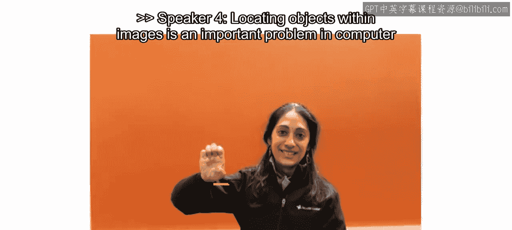

在掌握了图像分类的基础后，本节我们将进入一个更复杂的任务：目标检测。

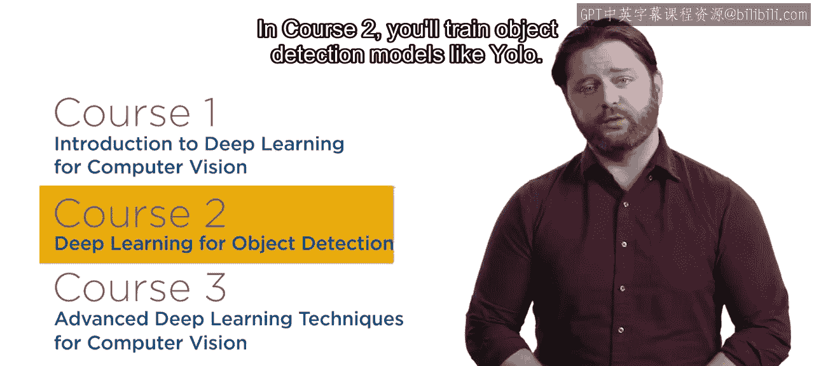

在图像中定位物体是计算机视觉中的一个重要问题。

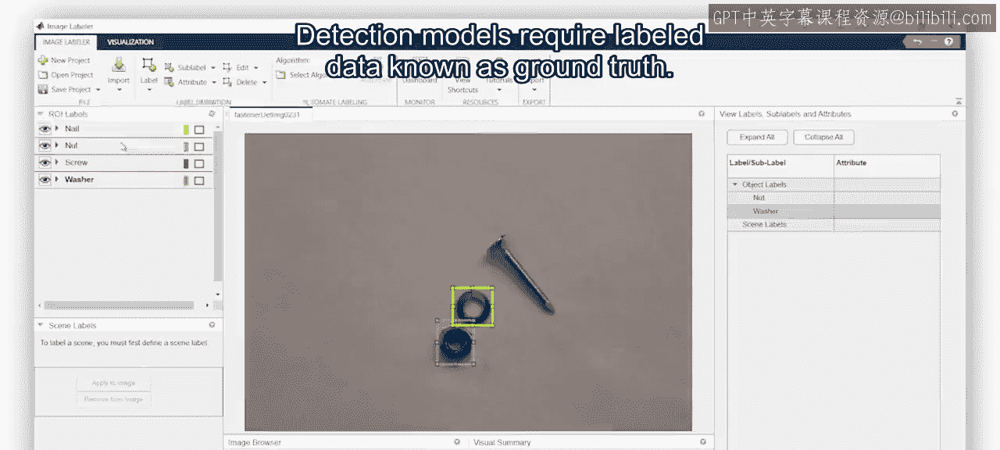

在课程二中，你将训练如YOLO（You Only Look Once）这样的目标检测模型。

训练检测模型需要一种称为“真实标注”的标签数据。

以下是真实标注数据通常包含的内容：
*   **边界框**：标出物体位置的矩形框
*   **标签**：定义边界框内物体的类别

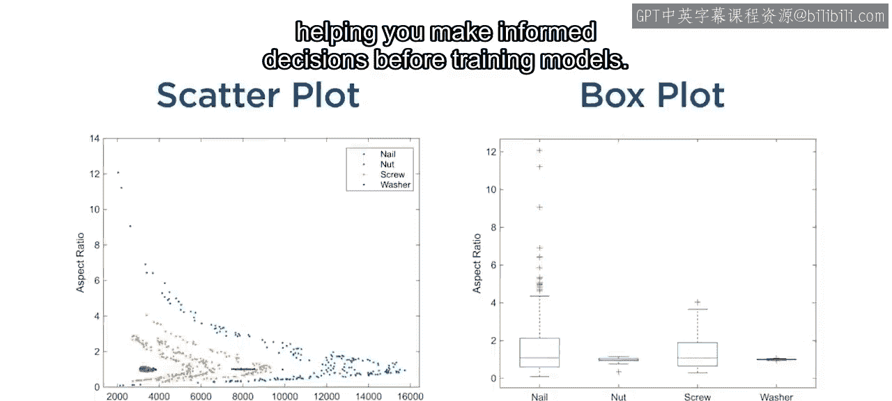

你将实践标注图像并分析真实标注数据，这有助于你在训练模型前做出明智的决策。

评估检测模型比评估分类模型更具挑战性，因为模型必须同时为每个物体正确分配标签和位置。

你将练习评估多个模型，从而能为你的应用选择最佳方案。

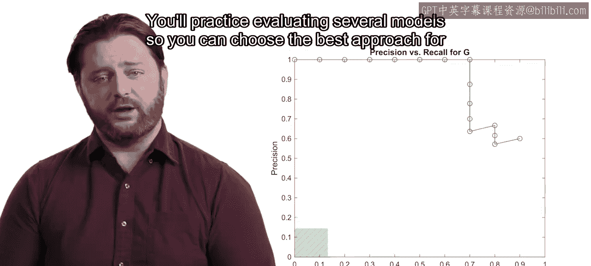

---

### 课程三：高级深度学习技术 🚀

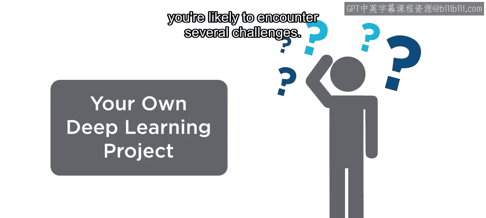

在学习了基础分类和检测后，本节我们来看看在实际项目中可能遇到的挑战及其解决方案。

当你开始自己的深度学习项目时，很可能会遇到若干挑战。

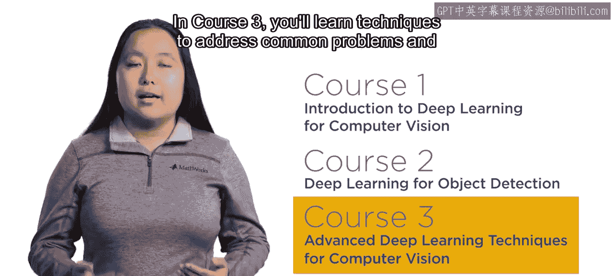

在课程三中，你将学习应对常见问题并训练专用模型的技术。

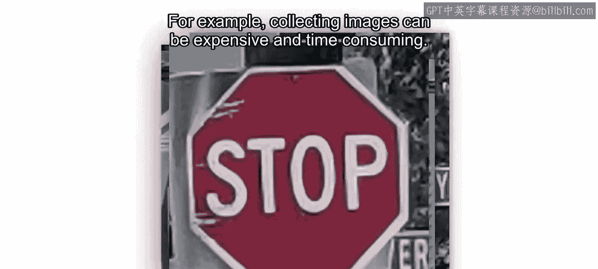

例如，收集图像数据可能既昂贵又耗时。

数据增强是一种强大的工具，可以在数据有限的情况下改善模型效果。

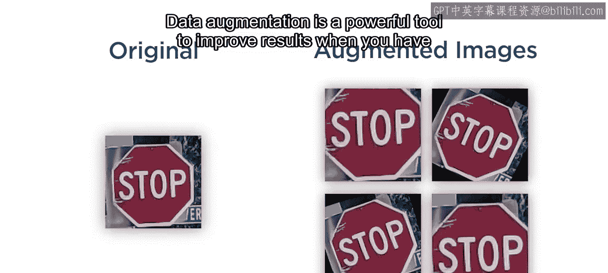

或者，你可能需要标注成千上万张图像。

你将使用AI辅助标注工具来帮助标注图像，从而节省大量人工劳动时间。

你还将创建异常检测模型，这类模型常用于制造业和医疗应用领域。

---

### 总结与展望 🌟

本节课中我们一起学习了《深度学习在计算机视觉中的应用》系列三门课程的核心内容。随着越来越多的设备配备摄像头，对计算机视觉和深度学习技能的需求将持续增长。通过加入这个由三门课程组成的专项学习，为你自己在这个快速发展的领域做好准备。

祝你学习顺利。